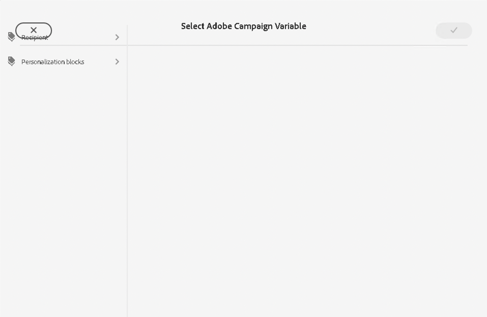

# Kampagnenvariablen {#campaign-variables}

Verwenden Sie Kampagnenvariablen, um personalisierte E-Mail-Inhalte zu erstellen. Kampagnenvariablen dienen als Platzhalter für Adobe Campaign-Werte, die Sie in Ihren E-Mail-Inhalt einfügen können. Wenn der Inhalt über Adobe Campaign gesendet wird, ersetzt Campaign diese Variablen durch den personalisierten Inhalt des Empfängers.

## Nutzung {#usage}

Die E-Mail-Kernkomponenten machen Kampagnenvariablen über Personalisierungsschaltflächen neben allgemeinen Textfeldern leicht zugänglich. Bei gedrückter Taste wird ein Dialogfeld angezeigt, in dem Sie ein Personalisierungsfeld auswählen können.

Die Liste der verfügbaren Personalisierungsfelder wird mit Ihrer Adobe Campaign-Instanz synchronisiert. Die Felder werden in Adobe Campaign im Schema verwaltet `nms:seedMember`. Alle Felder in `nms:seedMember` muss auch in Ihrer Empfängertabelle vorhanden sein.

## Dialogfeld &quot;Adobe Campaign-Variable auswählen&quot; {#dialog}

Das Dialogfeld Adobe Campaign-Variable auswählen ist in vielen Bearbeitungsdialogfeldern der E-Mail-Kernkomponenten verfügbar. Um sie zu verwenden, klicken Sie einfach auf **Adobe Campaign-Variable auswählen** neben dem entsprechenden Feld. Dieses Symbol kann zwei Formen annehmen.

Durch Klicken auf beide Symbole wird der **Adobe Campaign-Variable auswählen** angezeigt.

Verwenden Sie die Spaltenansicht, um die Variable zu suchen, die Sie einfügen möchten. Wenn Sie auf einen Knoten in einer Spalte klicken, werden dessen untergeordnete Elemente in einer neuen Spalte rechts angezeigt. Auf diese Weise können Sie in der Inhaltsstruktur der Variablen navigieren.

Wählen Sie die Variable aus, die Sie einfügen möchten, und klicken Sie dann oben rechts im Dialogfeld auf das Häkchen.

Die Variable wird dann in das Feld des Bearbeitungsdialogfelds der E-Mail-Kernkomponente eingefügt.

Klicken Sie jederzeit auf das X oben links im Dialogfeld, um das Dialogfeld abzubrechen und zu schließen.
