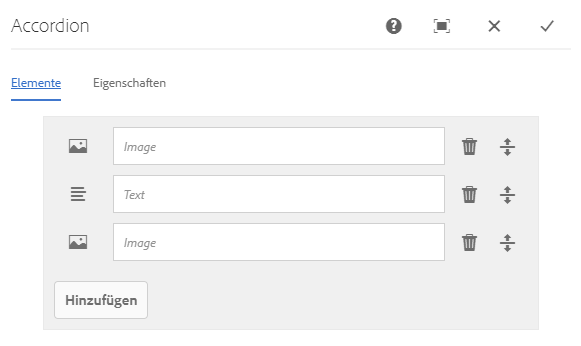
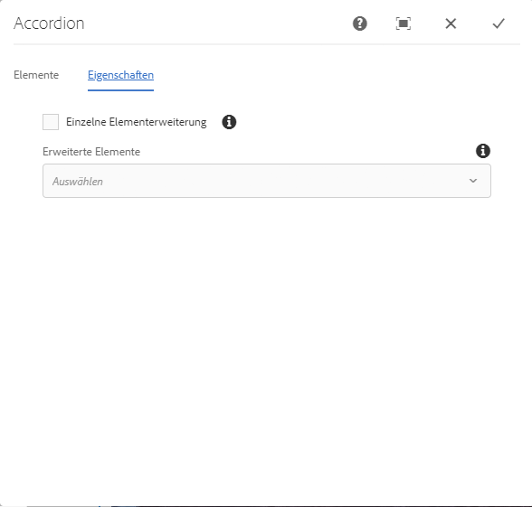
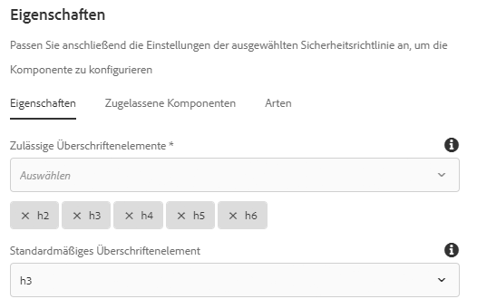

# Akkordeon-Komponente{#accordion-component}

Dier Kernkomponente „Akkordeon“ ermöglicht die Erstellung einer Sammlung von Bedienfeldern, die auf der Seite in einem Akkordeon angeordnet sind.

## Nutzung {#usage}

Die Kernkomponente „Akkordeon“ ermöglicht die Erstellung einer Sammlung von Komponenten in Form von Bedienfeldern, die auf einer Seite in einem Akkordeon angeordnet sind, ähnlich der [Registerkarten-Komponente](tabs.md), jedoch mit der Möglichkeit, die Bedienfelder ein- und auszublenden.

* Die Eigenschaften des Akkordeons können im [Dialogfeld „Konfigurieren“](#configure-dialog) definiert werden.
* Die Reihenfolge der Bedienfelder im Akkordeon kann im Dialogfeld „Konfigurieren“ und im [Popover zur Bedienfeldauswahl](#select-planel.md) definiert werden.
* Standardwerte für die Akkordeon-Komponente können beim Hinzufügen zu einer Seite im [Dialogfeld „Design“](#design-dialog) konfiguriert werden.

## Version und Kompatibilität {#version-and-compatibility}

Die aktuelle Version der Akkordeon-Komponente ist v1, die mit Version 2.5.0 der Kernkomponenten im Juni 2019 eingeführt wurde und in diesem Dokument beschrieben wird.

Die folgende Tabelle enthält alle unterstützten Versionen der Komponente, die AEM-Versionen, mit denen die Versionen der Komponente kompatibel sind, sowie Links zur Dokumentation für frühere Versionen.

| Komponentenversion | AEM 6.3 | AEM 6.4 | AEM 6.5 |
|--- |--- |--- |---|
| v1 | Kompatibel | Kompatibel | Kompatibel |

Weitere Informationen zu Kernkomponentenversionen und -freigaben finden Sie in den [Kernkomponentenversionen](versions.md).

## Musterkomponentenausgabe {#sample-component-output}

Um die Akkordeon-Komponente sowie Beispiele für die Konfigurationsoptionen sowie HTML- und JSON-Ausgaben zu erhalten, besuchen Sie die [Komponentenbibliothek](http://opensource.adobe.com/aem-core-wcm-components/library/accordion.html).

## Technische Details {#technical-details}

Die aktuelle technische Dokumentation zur Akkordeon-Komponente [finden Sie auf GitHub](https://github.com/adobe/aem-core-wcm-components/tree/master/content/src/content/jcr_root/apps/core/wcm/components/accordion/v1/accordion).

Weitere Informationen zur Entwicklung von Kernkomponenten finden Sie in der [Dokumentation zu Kernkomponenten für Entwickler](developing.md).

## Dialogfeld „Konfigurieren“ {#configure-dialog}

Mit dem Dialogfeld „Konfigurieren“ kann die Akkordeon-Elemente, die Bedienfelder und sein Verhalten und Aussehen für einen Besucher der Seite definieren.

### Registerkarte „Elemente“ {#items-tab}

Verwenden Sie die Schaltfläche **Hinzufügen**, um die Komponentenauswahl zu öffnen und dort auszuwählen, welche Komponente als Bedienfeld hinzugefügt werden soll. Nach dem Hinzufügen wird der Liste ein Eintrag hinzugefügt, der die folgenden Spalten enthält:

* **Symbol** - Das Symbol des Komponententyps des Bedienfelds zur einfachen Identifizierung in der Liste. Bewegen Sie den Mauszeiger darüber, um den vollständigen Komponentennamen als QuickInfo zu sehen.
* **Beschreibung** - Die Beschreibung, die als Text des Bedienfelds verwendet wird und standardmäßig den Namen der für das Bedienfeld ausgewählten Komponente enthält.
* **Entfernen** - Tippen oder klicken Sie, um das Bedienfeld aus der Akkordeon-Komponente zu löschen.
* **Neu anordnen** - Tippen oder klicken und ziehen Sie, um die Reihenfolge der Bedienfelder neu anzuordnen.

>[!TIP]
>
>Wenn der Viewport der Seite so reduziert wird, dass das Bearbeitungsdialogfeld im Vollbildmodus angezeigt wird, ist die Schaltfläche **Hinzufügen** ausgeblendet. Sie können der Akkordeon-Komponente weiterhin Komponenten hinzufügen, indem Sie sie [per Drag-and-Drop aus dem Komponenten-Browser ziehen und im Seiteneditor auf der Akkordeon-Komponente ablegen](https://helpx.adobe.com/de/experience-manager/6-5/sites/authoring/using/editing-content.html#InsertingaComponent).

### Registerkarte „Eigenschaften“{#properties-tab}

* **Einzelelement-Erweiterung** - Wenn diese Option ausgewählt ist, wird jeweils ein einzelnes Akkordeon-Element eingeblendet. Wenn Sie ein Element einblenden, werden alle anderen ausgeblendet.
* **Erweiterte Elemente** - Diese Option definiert die Elemente, die standardmäßig beim Laden der Seite eingeblendet werden.
   * Wenn **Einzelelement-Erweiterung** ausgewählt ist, muss ein Bedienfeld ausgewählt werden. Standardmäßig wird das erste Bedienfeld ausgewählt.
   * Wenn **Einzelelement-Erweiterung** nicht ausgewählt ist, ist diese Option eine Mehrfachauswahl und optional.

## Popover zur Bedienfeldauswahl{#seelct-panel-popover}

Der Inhaltsautor kann in der Komponenten-Symbolleiste die Option **Bedienfeld auswählen** verwenden, um zu einem anderes Bedienfeld zu wechseln, um es zu bearbeiten, und auch um die Reihenfolge der Registerkarten innerhalb des Akkordeons einfach zu ändern.

Nach Auswahl der Option **Bedienfeld auswählen** in der Komponentensymbolleiste werden die konfigurierten Akkordeon-Bedienfelder als Dropdown-Liste angezeigt.

* Die Liste wird im Sinne der zugewiesenen Anordnung der Bedienfelder geordnet, was sich auch in der Nummerierung zeigt.
* Der Komponententyp des Bedienfelds wird zuerst angezeigt, gefolgt von der Beschreibung des Bedienfelds in hellerer Schriftart.
* Durch Tippen oder Klicken auf einen Eintrag in der Dropdown-Liste wird die Ansicht im Editor auf dieses Bedienfeld umgestellt.
* Die Bedienfelder können direkt mithilfe der Ziehgriffe neu angeordnet werden.

## Dialogfeld „Design“ {#design-dialog}

Das Dialogfeld „Design“ ermöglicht es dem Vorlagenautor, die Optionen zu definieren, die für den Inhaltsautor bei Verwendung der Akkordeon-Komponente verfügbar sind, sowie die Standardeinstellungen bei Platzierung der Akkordeon-Komponente.

### Registerkarte „Eigenschaften“{#properties-tab-design}

* **Zulässige Überschriftenelemente** - Diese Mehrfachauswahl-Dropdown-Liste definiert die HTML-Elemente für die Überschrift des Akkordeon-Elements, die von einem Autor ausgewählt werden können.
* **Standard-Überschriftenelement** - Diese Dropdown-Liste definiert das Standard-HTML-Überschriftenelement für das Akkordeon-Element.

### Registerkarte „Zugelassene Komponenten“{#allowed-components-tab}

Über die Registerkarte **Zugelassene Komponenten** können Sie definieren, welche Komponenten der Akkordeon-Komponente vom Inhaltsautor als Elemente in Bedienfeldern hinzugefügt werden können.

Die Registerkarte „Zugelassene Komponenten“ funktioniert auf die gleiche Weise wie die Registerkarte desselben Namens beim [Definieren der Richtlinie und Eigenschaften eines Layoutcontainers im Vorlageneditor.](https://helpx.adobe.com/de/experience-manager/6-5/sites/authoring/using/templates.html)

### Registerkarte „Stile“ {#styles-tab}

Die Akkordeon-Komponente unterstützt das AEM-[Stilsystem](authoring.md#component-styling).
