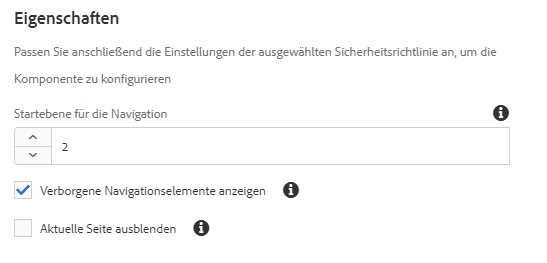

# Breadcrumb-Komponente (v 1){#breadcrumb-component-v}

Die Core Component Breadcrumb-Komponente ist eine Navigationskomponente, die eine Breadcrumb von Links basierend auf der Position der Seite in der Inhaltshierarchie erstellt.

## Nutzung {#usage}

Die Breadcrumb-Komponente zeigt die Position der aktuellen Seite innerhalb der Site-Hierarchie an, wodurch Seitenbesucher von ihrer aktuellen Position aus über die Seitenhierarchie navigieren können. Dies ist oft in Seitenkopf- oder -fußzeilen integriert.

Verfügbare Optionen wie die standardnavigationsstufe und die Möglichkeit, die aktuelle Seite oder ausgeblendete Seiten anzuzeigen, können vom Vorlagenautor im [Designdialogfeld definiert](breadcrumb-v1.md#main-pars_title_1995166862)werden. Der Content-Editor kann dann festlegen, ob ausgeblendete Seiten angezeigt werden sollen oder nicht, und die tatsächliche Navigationsstufe für die Komponente im [Dialogfeld &quot;Bearbeiten](breadcrumb-v1.md#main-pars_title)«wird angezeigt.

## Version und Kompatibilität {#version-and-compatibility}

In diesem Dokument wird die Version 1 der Breadcrumb-Komponente beschrieben, die ursprünglich mit Version 1.0.0 der Kernkomponenten mit AEM 6.3 eingeführt wurde.

In der folgenden Tabelle ist die Kompatibilität von v 1 der Breadcrumb-Komponente aufgeführt.

| AEM-Version | Breadcrumb-Komponente v 1 |
|--- |--- |
| 6.3 | Kompatibel |
| 6.4 | Kompatibel |

>[!CAUTION]
>
>In diesem Dokument wird v 1 der Breadcrumb-Komponente beschrieben.
>Weitere Informationen zur aktuellen Version der Breadcrumb-Komponente finden Sie im [Breadcrumb](breadcrumb.md) -Komponentendokument.

## Musterkomponentenausgabe {#sample-component-output}

Nachfolgend finden Sie ein Beispiel aus [We. Retail](https://helpx.adobe.com/experience-manager/6-4/sites/developing/using/we-retail.html).

### Screenshot {#screenshot}


### HTML {#html}

```
<div class="cmp cmp-breadcrumb aem-GridColumn aem-GridColumn--default--12">

<ol class="breadcrumb">
    <li class="breadcrumb-item ">
        <a href="/content/we-retail/us.html">
            United States
        </a>
    </li>

    <li class="breadcrumb-item ">
        <a href="/content/we-retail/us/en.html">
            English
        </a>
    </li>

    <li class="breadcrumb-item active">
        
            Experience
        
    </li>
</ol>
 
</div>
```

### JSON {#json}

```
"breadcrumb": {
              "columnClassNames": "aem-GridColumn aem-GridColumn--default--12",
              ":type": "weretail/components/content/breadcrumb"
            }
```

>[!NOTE]
>
>Für JSON-Exporte aus den Core-Komponenten ist Version 1.1.0 der Kernkomponenten erforderlich. Weitere Informationen finden Sie in den [Kompatibilitätsinformationen für Kernkomponenten v 1](versions.md#main-pars_title_236368006) .

## Dialogfeld bearbeiten {#edit-dialog}

Das Dialogfeld &quot;Bearbeiten&quot; ermöglicht dem Inhaltsautor, ausgeblendete und aktive Seiten in den Breadcrumbs sowie die Tiefe der anzuzeigenden Hierarchie zu unterdrücken.


* **Navigation auf Navigationsebene** - Wo in der Hierarchie die Breadcrumb-Komponente beginnen soll, um zur aktuellen Seite zu gelangen. Beispiel: In We. Retail:

   * 1 beginnt bei `/content/we-retail`
   * 2 beginnt bei `/content/we-retail/<country>`

* **Ausgeblendet** anzeigen - Zeigt Seiten, die in der Breadcrumb als ausgeblendet markiert markiert sind (standardmäßig werden sie nicht angezeigt)
* **Aktuelle** Unterdrücken der aktuellen Seite im Breadcrumb ausblenden (standardmäßig wird sie angezeigt)

## Design-Dialogfeld {#design-dialog}

Das Entwurfsdialogfeld ermöglicht es dem Vorlagenautor, die Standardwerte für die Optionen festzulegen, um ausgeblendete und aktive Seiten in den Breadcrumbs sowie die Tiefe der anzuzeigenden Hierarchie zu unterdrücken.



* **Navigationsstufe bis zum Start** : Definiert den Standardwert, für den in der Hierarchie die Breadcrumb-Komponente aufgerufen werden soll, wenn die Breadcrumb-Komponente zu einer Seite hinzugefügt wird.
* **Ausgeblendet** anzeigen: Definiert den Standardwert der Option **Ausgeblendete** anzeigen, wenn die Breadcrumb-Komponente einer Seite hinzugefügt wird.

   * Die Option für den Autor wird nicht aktiviert oder deaktiviert. Es wird nur der Standardwert festgelegt.

* **Aktuell** ausblenden: Definiert den Standardwert der Option &quot;Aktuelle **ausblenden&quot;** , wenn die Breadcrumb-Komponente einer Seite hinzugefügt wird.

   * Die Option für den Autor wird nicht aktiviert oder deaktiviert. Es wird nur der Standardwert festgelegt.

## Technische Details {#technical-details}

Die aktuelle technische Dokumentation zur Breadcrumb-Komponente [finden Sie unter github](https://github.com/adobe/aem-core-wcm-components/tree/master/content/src/content/jcr_root/apps/core/wcm/components/breadcrumb/v1/breadcrumb).

Das gesamte Kernkomponentenprojekt kann von github heruntergeladen werden.

Weitere Informationen zur Entwicklung Kernkomponenten finden Sie in der [Dokumentation zu Kernkomponenten für Komponenten](developing.md).
