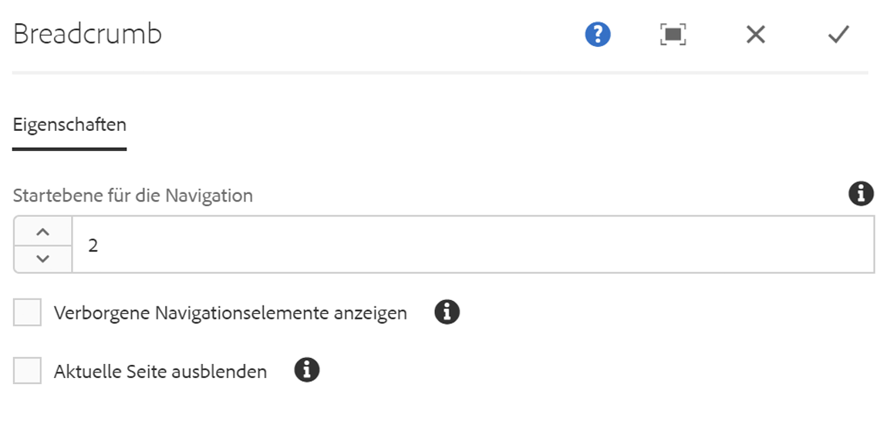
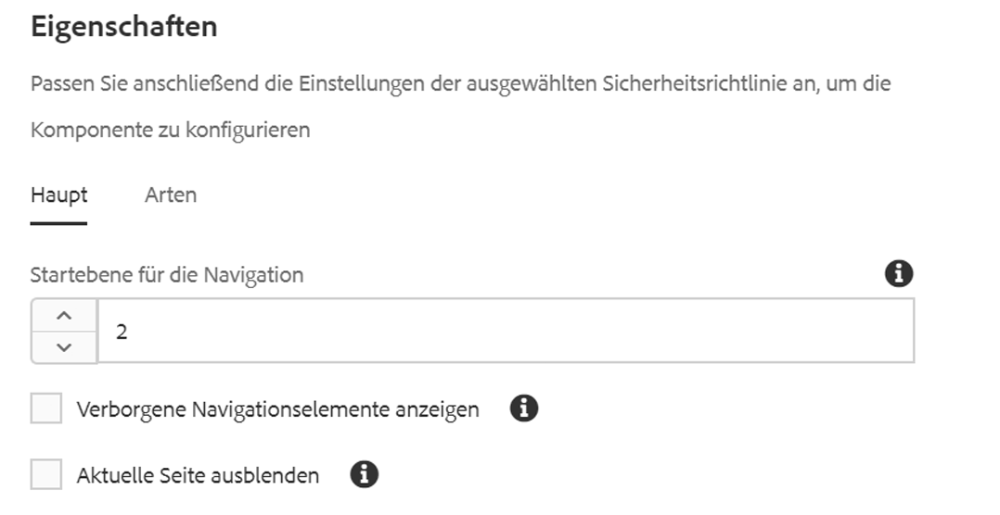

# Breadcrumb-Komponente{#breadcrumb-component}

Die Kernkomponente „Breadcrumb-Komponente“ ist eine Navigationskomponente, die einen Breadcrumb von Links basierend auf der Position der Seite in der Inhaltshierarchie erstellt.

## Nutzung {#usage}

Die Breadcrumb-Komponente zeigt die Position der aktuellen Seite innerhalb der Site-Hierarchie an, wodurch Seitenbesucher von ihrer aktuellen Position aus durch die Seitenhierarchie navigieren können. Dies ist oft in Kopf- oder Fußzeilen von Seiten integriert.

Verfügbare Optionen wie die Standardnavigationsstufe und die Möglichkeit, die aktuelle Seite oder ausgeblendete Seiten anzuzeigen, können vom Vorlagenautor im [Dialogfeld „Design“](#design-dialog) definiert werden. Der Inhaltseditor kann dann festlegen, ob ausgeblendete Seiten angezeigt werden sollen oder nicht, und er kann die tatsächliche Navigationsstufe für die Komponente im [Dialogfeld „Bearbeiten“](#edit-dialog) wählen.

## Version und Kompatibilität {#version-and-compatibility}

Die aktuelle Version der Breadcrumb-Komponente ist v2, die mit Version 2.0.0 der Kernkomponenten im Januar 2018 eingeführt wurde und in diesem Dokument beschrieben wird.

Die folgende Tabelle enthält alle unterstützten Versionen der Komponente, die AEM-Versionen, mit denen die Versionen der Komponente kompatibel sind, sowie Links zur Dokumentation für frühere Versionen.

| Komponentenversion | AEM 6.3 | AEM 6.4 | AEM 6.5 |
|--- |--- |--- |--- |
| v2 | Kompatibel | Kompatibel | Kompatibel |
| [v1](breadcrumb-v1.md) | Kompatibel | Kompatibel | Kompatibel |

Weitere Informationen zu Kernkomponentenversionen und -freigaben finden Sie in den [Kernkomponentenversionen](versions.md).

## Musterkomponentenausgabe {#sample-component-output}

To experience the Breadcrumb Component as well as see examples of its configuration options as well as HTML and JSON output, visit the [Component Library](http://opensource.adobe.com/aem-core-wcm-components/library/breadcrumb/hidden/level-1/level-2/breadcrumb.html).

>[!NOTE]
>
>As of Core Components release 2.1.0, the Breadcrumb Component supports [schema.org microdata](https://schema.org/BreadcrumbList).

## Technische Details {#technical-details}

The latest technical documentation about the Breadcrumb Component [can be found on GitHub](https://github.com/adobe/aem-core-wcm-components/blob/master/content/src/content/jcr_root/apps/core/wcm/components/breadcrumb/v2/breadcrumb).

Weitere Informationen zur Entwicklung von Kernkomponenten finden Sie in der [Dokumentation zu Kernkomponenten für Entwickler](developing.md).

## Dialogfeld „Bearbeiten“ {#edit-dialog}

Das Dialogfeld „Bearbeiten“ ermöglicht es dem Inhaltsautor, ausgeblendete und aktive Seiten in den Breadcrumbs zu unterdrücken sowie die Tiefe der anzuzeigenden Hierarchie zu wählen.

* **Navigations-Level für Anfang** - Wo in der Hierarchie die Breadcrumb-Komponente beginnen soll, um zur aktuellen Seite zu gelangen. Beispiel in We.Retail:

   * 0 beginnt bei `/content`

   * 1 beginnt bei `/content/we-retail`
   * 2 beginnt bei `/content/we-retail/<country>`

* **Verborgene Navigationselemente anzeigen** – Zeigt Seiten an, die im Breadcrumb als ausgeblendet markiert sind (standardmäßig werden sie nicht angezeigt)
* **Aktuelle Seite ausblenden** - Unterdrücken der aktuellen Seite im Breadcrumb (standardmäßig wird sie angezeigt)

## Dialogfeld „Design“ {#design-dialog}

Das Dialogfeld „Design“ ermöglicht es dem Vorlagenautor, die Standardwerte für die Optionen festzulegen, um ausgeblendete und aktive Seiten in den Breadcrumbs zu unterdrücken, sowie die Tiefe der anzuzeigenden Hierarchie zu definieren.

### Hauptregisterkarte {#main-tab}

* **Startebene für die Navigation** – Definiert den Standardwert, für den in der Hierarchie die Breadcrumb-Komponente aufgerufen werden soll, wenn die Breadcrumb-Komponente zu einer Seite hinzugefügt wird.
* **Verborgene Navigationselemente anzeigen** – Definiert den Standardwert der Option **Verborgene Navigationselemente anzeigen**, wenn der Seite die Breadcrumb-Komponente hinzugefügt wird.

   * Die Option für den Autor wird dadurch nicht aktiviert oder deaktiviert. Es wird nur der Standardwert festgelegt.

* **Aktuelle Seite ausblenden** – Definiert den Standardwert der Option **Aktuelle Seite ausblenden**, wenn die Breadcrumb-Komponente einer Seite hinzugefügt wird.

   * Die Option für den Autor wird dadurch nicht aktiviert oder deaktiviert. Es wird nur der Standardwert festgelegt.

### Registerkarte „Stile“ {#styles-tab}

Die Breadcrumb-Komponente unterstützt das AEM-[Stilsystem](authoring.md#component-styling).