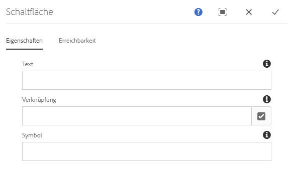
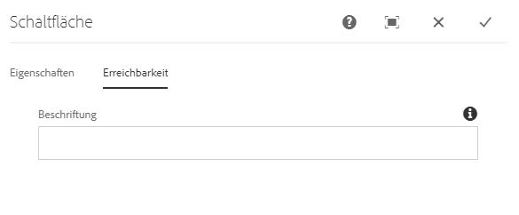

# Schaltflächenkomponente{#button-component}

Die Kernkomponente „Schaltflächenkomponente“ ermöglicht die Erstellung und Anzeige eines Schaltflächen-Elements auf einer Seite.

## Nutzung {#usage}

Die Kernkomponente „Schaltflächenkomponente“ ermöglicht die Integration einer Schaltfläche in eine Seite.

* Die Eigenschaften der Schaltfläche können im [Dialogfeld „Konfigurieren“](#configure-dialog) ausgewählt werden.
* Stile für die Schaltflächenkomponente können im [Dialogfeld „Design“](#design-dialog) definiert werden.

## Version und Kompatibilität {#version-and-compatibility}

Die aktuelle Version der Schaltflächenkomponente ist v1, die mit Version 2.5.0 der Kernkomponenten im Juni 2019 eingeführt wurde und in diesem Dokument beschrieben wird.

Die folgende Tabelle enthält alle unterstützten Versionen der Komponente, die AEM-Versionen, mit denen die Versionen der Komponente kompatibel sind, sowie Links zur Dokumentation für frühere Versionen.

| Komponentenversion | AEM 6.3 | AEM 6.4 | AEM 6.5 |
|--- |--- |--- |---|
| v1 | Kompatibel | Kompatibel | Kompatibel |

Weitere Informationen zu Kernkomponentenversionen und -freigaben finden Sie in den [Kernkomponentenversionen](versions.md).

## Musterkomponentenausgabe {#sample-component-output}

Um die Schaltflächen-Komponente sowie Beispiele für die Konfigurationsoptionen sowie HTML- und JSON-Ausgaben zu erhalten, besuchen Sie die [Komponentenbibliothek](http://opensource.adobe.com/aem-core-wcm-components/library/button.html).

## Technische Details {#technical-details}

Die aktuelle technische Dokumentation zur Schaltflächenkomponente [finden Sie unter github](https://github.com/adobe/aem-core-wcm-components/tree/master/content/src/content/jcr_root/apps/core/wcm/components/button/v1/button).

Weitere Informationen zur Entwicklung von Kernkomponenten finden Sie in der [Dokumentation zu Kernkomponenten für Entwickler](developing.md).

## Dialogfeld „Konfigurieren“ {#configure-dialog}

Mit dem Dialogfeld „Konfigurieren“ kann der Inhaltsautor die Schaltfläche und ihr Verhalten und Aussehen für einen Besucher der Seite definieren.

### Registerkarte „Eigenschaften“{#properties-tab}

* **Text** - Der Text, der auf der Schaltfläche angezeigt werden soll
* **Link** - Link zu einer Inhaltsseite in AEM, einer externen Ressource oder einem Anker
   * Wählen Sie im Dialogfeld **Auswahl** einen Pfad in AEM aus.
* **Symbol** - Bezeichner für die Anzeige eines Symbols auf der Schaltfläche

### Registerkarte "Ein-/Ausgabehilfe « {#accessibility-tab}

Auf der **Registerkarte Ein-/Ausgabehilfe** können Werte für [ARIA-Barrierefreiheitsbeschriftungen](https://www.w3.org/WAI/standards-guidelines/aria/) für die Komponente festgelegt werden.

* **Beschriftung** - Wert eines ARIA-Label-Attributs für die Komponente

## Dialogfeld „Design“ {#design-dialog}

### Registerkarte „Stile“ {#styles-tab}

Die Bildkomponente unterstützt das AEM-[Stilsystem](authoring.md#component-styling).
