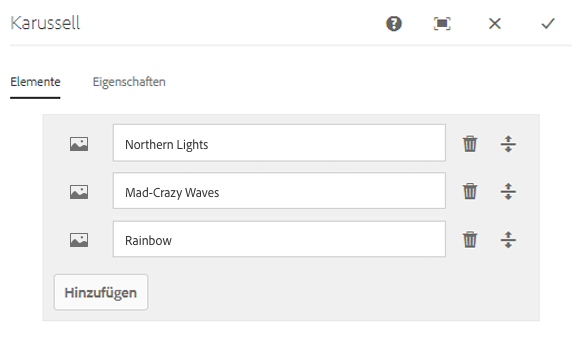
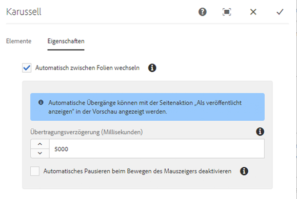

# Karussellkomponente{#carousel-component}

Mit der Karussell-Komponente Core-Komponente kann der Inhaltsautor Inhalte in einem Navigationskarussell präsentieren.

## Nutzung {#usage}

Mit der Karussell-Komponente organisiert der Inhaltsautor Inhalte in einem drehenden Karussellkarussell.

Das [Dialogfeld &quot;Bearbeiten](#edit-dialog) &quot; ermöglicht dem Inhaltsautor das Erstellen, Benennen und Bestellen mehrerer Folien sowie die Aktivierung des automatischen Übergangs mit Verzögerung. Im [Design-Dialogfeld](#design-dialog)kann der Vorlagenautor definieren, welche Komponenten dem Karussell hinzugefügt werden können, automatische Übergänge aktivieren oder deaktivieren und die Stile anpassen.

## Version und Kompatibilität {#version-and-compatibility}

Die aktuelle Version der Karussellkomponente ist v 1, die mit Version 2.2.0 der Kernkomponenten im Oktober 2018 eingeführt wurde und in diesem Dokument beschrieben wird.

Die folgende Tabelle enthält alle unterstützten Versionen der Komponente, die AEM-Versionen, mit denen die Versionen der Komponente kompatibel sind, sowie Links zur Dokumentation für frühere Versionen.

| Komponentenversion | AEM 6.3 | AEM 6.4 | AEM 6.5 |
|--- |--- |--- |--- |
| v1 | Kompatibel | Kompatibel | Kompatibel |

Weitere Informationen zu Core-Komponentenversionen und -versionen finden Sie in den Core [-Komponentenversionen](versions.md).

## Musterkomponentenausgabe {#sample-component-output}

Im Folgenden finden Sie ein Beispiel aus [We. Retail](https://helpx.adobe.com/experience-manager/6-5/sites/developing/using/we-retail.html).

### Screenshot {#screenshot}

### Komponentenbibliothek {#component-library}

Rufen Sie die [Komponentenbibliothek auf, um die Karussellkomponente sowie Beispiele für die Konfigurationsoptionen sowie die HTML- und JSON-Ausgabe zu erhalten](http://opensource.adobe.com/aem-core-wcm-components/library/carousel.html).

### Technische Details {#technical-details}

Die aktuellste technische Dokumentation zur Karussellkomponente [finden Sie unter github](https://github.com/adobe/aem-core-wcm-components/blob/master/content/src/content/jcr_root/apps/core/wcm/components/carousel/v1/carousel).

Weitere Informationen zur Entwicklung Kernkomponenten finden Sie in der [Dokumentation zu Kernkomponenten für Komponenten](developing.md).

## Dialogfeld bearbeiten {#edit-dialog}

Im Dialogfeld &quot;Bearbeiten&quot; kann der Inhaltsautor Folien hinzufügen, umbenennen und neu anordnen sowie die Einstellungen für den automatischen Übergang definieren.

### Registerkarte &quot;Elemente « {#items-tab}

Verwenden Sie **die Schaltfläche Hinzufügen** , um die Komponentenauswahl zu öffnen, um auszuwählen, welche Komponente als Registerkarte hinzugefügt werden soll. Nach dem Hinzufügen wird der Liste ein Eintrag hinzugefügt, der die folgenden Spalten enthält:

* **Symbol** - Das Symbol des Komponententyps zur einfachen Identifizierung in der Liste. Bewegen Sie den Mauszeiger über den vollständigen Komponentennamen als quickinfo.
* **Beschreibung** : Die Beschreibung, die als Text der Registerkarte verwendet wird und standardmäßig den Namen der für die Registerkarte ausgewählten Komponente enthält.
* **Löschen** - Tippen oder klicken Sie auf, um die Registerkarte aus der Registerkartenkomponente zu löschen.
* **Neu sortieren** - Tippen oder Klicken Sie, um die Registerkarten anzuordnen.

### Registerkarte &quot;Eigenschaften « {#properties-tab}

Auf der **Registerkarte &quot;Eigenschaften** &quot; kann der Inhaltsautor die Folien auf die automatische Umstellung einstellen.

* **Folien** automatisch überspringen: Wenn die Komponente aktiv ist, wechselt die Komponente nach einer bestimmten Verzögerung automatisch zur nächsten Folie.
* **Übergangsverzögerung** : Wenn automatisch Übergangsfolien ausgewählt werden, wird dieser Wert verwendet, um die Verzögerung zwischen Übergängen (in Millisekunden) zu definieren.
* **Automatische Pause beim Hover** deaktivieren: Wenn **automatisch Übergangsfolien** ausgewählt sind, wird der Karussell-Übergang automatisch angehalten, sobald die Maus über das Karussell bewegt wird. Wählen Sie diese Option, damit der Übergang nicht angehalten wird.

>[!NOTE]
>
>Die Steuerelemente für die Folienvorschau werden im **Bearbeitungsmodus** nicht aktiviert. Verwenden [**Sie** den Vorschaumodus](https://helpx.adobe.com/experience-manager/6-5/sites/authoring/using/editing-content.html) **[oder die](https://helpx.adobe.com/experience-manager/6-5/sites/authoring/using/editing-content.html)** Option &quot;Als veröffentlicht anzeigen&quot; , um mit dem Karussell als Leser des veröffentlichten Inhalts zu interagieren.
>
>Die Funktion zum automatischen Voraufzeichnen wird im **Bearbeitungsmodus** nicht aktiviert. Verwenden Sie **[die](https://helpx.adobe.com/experience-manager/6-5/sites/authoring/using/editing-content.html)** Option &quot;Als veröffentlicht anzeigen&quot; , um die automatische Vorwärtsfunktion als Leser des veröffentlichten Inhalts anzuzeigen.

## Bereich auswählen {#select-panel}

Der Inhaltsautor kann die Option **Bedienfeld** auswählen in der Komponentensymbolleiste verwenden, um zu einer anderen Folie zu wechseln und die Reihenfolge der Folien einfach neu zu ordnen.

Nach Auswahl der **Option Bedienfeld** auswählen in der Komponenten-Symbolleiste werden die konfigurierten Folien als Dropdown-Liste angezeigt.

* Die Liste wird durch die zugewiesene Anordnung der Folien angeordnet und wird in der Nummerierung angezeigt.
* Der Komponententyp der Folie wird zuerst angezeigt, gefolgt von der Beschreibung der Folie in heller Schrift.

* Durch Tippen oder Klicken auf einen Eintrag in der Dropdown-Liste wird die Ansicht im Editor auf diese Folie umgestellt.
* Die Folie kann mithilfe der Ziehpunkte neu angeordnet werden.

## Design-Dialogfeld {#design-dialog}

Im Design-Dialogfeld kann der Vorlagenautor definieren, welche Komponenten der Karussellkomponente als Folien hinzugefügt werden können, sowie Standardübergänge definieren und welche benutzerdefinierten Stile dem Inhaltsautor zur Verfügung stehen.

### Registerkarte &quot;Eigenschaften « {#properties-tab-1}

Über die Registerkarte **Eigenschaften** werden die Standardeinstellungen für die Folienübergänge definiert, wenn ein Inhaltsautor die Karussellkomponente einer Seite hinzufügt.

* **Automatisch überspringen:** Definiert, ob die Option, automatisch das Karussell auf die nächste Folie zu verschieben, aktiviert ist, wenn der Inhaltsautor die Karussellkomponente einer Seite hinzufügt.
* **Übergangsverzögerung** : Definiert den Standardwert der Übergangsverzögerung zwischen Folien (in Millisekunden), wenn ein Inhaltsautor die Karussellkomponente einer Seite hinzufügt.
* **Automatische Pause beim Hover** deaktivieren: Definiert, ob standardmäßig die Option zum Deaktivieren des automatischen Pausens der Folie aktiviert ist, wenn **automatisch Übergangsfolien** vom Inhaltsautor ausgewählt werden.

### Registerkarte &quot;Zulässige Komponenten « {#allowed-components-tab}

Über die Registerkarte **&quot;Zulässige Komponenten** &quot; können Sie definieren, welche Komponenten der Karussellkomponente vom Inhaltsautor als Folien hinzugefügt werden können.

Die Registerkarte &quot;Zulässige Komponenten&quot; funktioniert auf die gleiche Weise wie die Registerkarte desselben Namens beim [Definieren der Richtlinie und Eigenschaften eines Layoutcontainers im Vorlageneditor.](https://helpx.adobe.com/experience-manager/6-5/sites/authoring/using/templates.html)

### Stile Registerkarte {#styles-tab}

Die Karussell-Komponente unterstützt das AEM [-Stilsystem](authoring.md#component-styling).