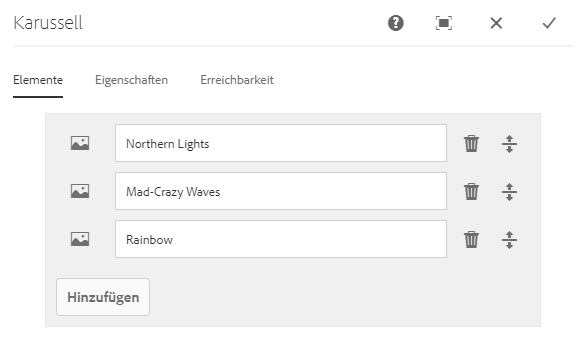
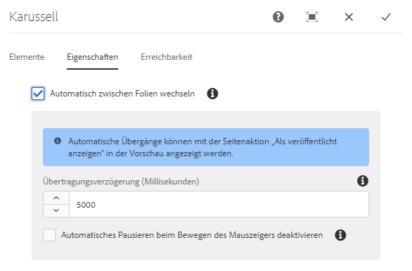
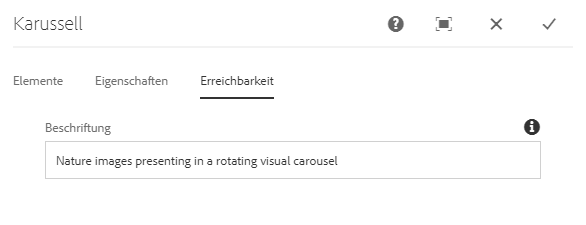
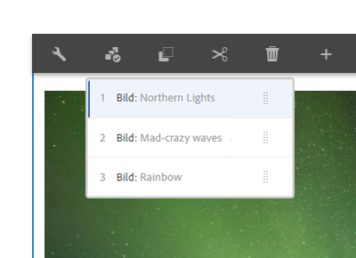

# Karussellkomponente{#carousel-component}

Mit der Kernkomponente „Karussellkomponente“ kann der Inhaltsautor Inhalte in einem navigierbaren Karussell präsentieren.

## Nutzung {#usage}

Mit der Karussellkomponente organisiert der Inhaltsautor Inhalte in einem drehbaren Karussell aus Folien.

Das [Dialogfeld „Bearbeiten“](#edit-dialog) ermöglicht dem Inhaltsautor das Erstellen, Benennen und Anordnen mehrerer Folien sowie die Aktivierung des automatischen Übergangs mit Verzögerung. Über das [Dialogfeld „Design“](#design-dialog) kann der Vorlagenautor definieren, welche Komponenten dem Karussell hinzugefügt werden können, automatische Übergänge aktivieren oder deaktivieren und die Stile anpassen.

## Version und Kompatibilität {#version-and-compatibility}

Die aktuelle Version der Karussellkomponente ist v1, die mit Version 2.2.0 der Kernkomponenten im Oktober 2018 eingeführt wurde und in diesem Dokument beschrieben wird.

Die folgende Tabelle enthält alle unterstützten Versionen der Komponente, die AEM-Versionen, mit denen die Versionen der Komponente kompatibel sind, sowie Links zur Dokumentation für frühere Versionen.

| Komponentenversion | AEM 6.3 | AEM 6.4 | AEM 6.5 |
|--- |--- |--- |--- |
| v1 | Kompatibel | Kompatibel | Kompatibel |

Weitere Informationen zu Kernkomponentenversionen und -freigaben finden Sie in den [Kernkomponentenversionen](versions.md).

## Musterkomponentenausgabe {#sample-component-output}

Um die Karussellkomponente zu erleben und Beispiele für ihre Konfigurationsoptionen sowie die HTML- und JSON-Ausgabe zu sehen, besuchen Sie die [Komponentenbibliothek](http://opensource.adobe.com/aem-core-wcm-components/library/carousel.html).

### Technische Details {#technical-details}

The latest technical documentation about the Carousel Component [can be found on GitHub](https://github.com/adobe/aem-core-wcm-components/blob/master/content/src/content/jcr_root/apps/core/wcm/components/carousel/v1/carousel).

Weitere Informationen zur Entwicklung von Kernkomponenten finden Sie in der [Dokumentation zu Kernkomponenten für Entwickler](developing.md).

## Dialogfeld „Bearbeiten“ {#edit-dialog}

Im Dialogfeld „Bearbeiten“ kann der Inhaltsautor Folien hinzufügen, umbenennen und neu anordnen sowie die Einstellungen für den automatischen Übergang definieren.

### Registerkarte „Elemente“ {#items-tab}

Verwenden Sie die Schaltfläche **Hinzufügen**, um die Komponentenauswahl zu öffnen und dort auszuwählen, welche Komponente als Registerkarte hinzugefügt werden soll. Nach dem Hinzufügen wird der Liste ein Eintrag hinzugefügt, der die folgenden Spalten enthält:

* **Symbol** - Das Symbol des Komponententyps der Registerkarte zur einfachen Identifizierung in der Liste. Bewegen Sie den Mauszeiger darüber, um den vollständigen Komponentennamen als QuickInfo zu sehen.
* **Beschreibung** - Die Beschreibung, die als Text der Registerkarte verwendet wird und standardmäßig den Namen der für die Registerkarte ausgewählten Komponente enthält.
* **Entfernen** - Tippen oder klicken Sie, um die Registerkarte aus der Registerkartenkomponente zu löschen.
* **Neu sortieren** - Tippen oder klicken und ziehen Sie, um die Registerkarten anzuordnen.

>[!TIP]
>
>Wenn der Viewport der Seite so verringert wird, dass das Bearbeitungsdialogfeld im Vollbildmodus angezeigt wird, wird die Schaltfläche " **Hinzufügen** "ausgeblendet. Komponenten können der Karussell-Komponente weiterhin hinzugefügt werden, indem Sie aus dem Komponenten-Browser [ziehen und die Karussell-Komponente im Seiteneditor](https://helpx.adobe.com/experience-manager/6-5/sites/authoring/using/editing-content.html#InsertingaComponent)ablegen.

### Registerkarte „Eigenschaften“{#properties-tab}

Auf der Registerkarte **Eigenschaften** kann der Inhaltsautor die Folien auf automatische Übergänge einstellen.

* **Automatische Folienübergänge** – Wenn diese Option aktiviert ist, wechselt die Komponente nach einer festgelegten Verzögerungszeit automatisch zur nächsten Folie.
* **Übergangsverzögerung** – Wenn die Option „Automatische Folienübergänge“ ausgewählt wird, wird dieser Wert verwendet, um die Verzögerung zwischen Übergängen (in Millisekunden) zu definieren.
* **Automatische Pause beim Bewegen der Maus deaktivieren** - Wenn die Option **Automatische Folienübergänge** ausgewählt ist, wird der Karussell-Übergang automatisch angehalten, sobald die Maus über das Karussell bewegt wird; Wählen Sie diese Option, damit der Übergang nicht angehalten wird.

>[!NOTE]
>
>Die Steuerelemente für die Abfolge der Folien werden im Modus **Bearbeiten** nicht aktiviert. Verwenden Sie den [**Vorschaumodus** oder die Option "Als veröffentlicht ](https://helpx.adobe.com/experience-manager/6-5/sites/authoring/using/editing-content.html)**anzeigen** ", um mit dem Karussell zu interagieren, wie es ein Leser des veröffentlichten Inhalts tun würde.
>
>Die Funktion des automatischen Übergangs ist im Modus **Bearbeiten** nicht aktiviert. Use **[View as Published](https://helpx.adobe.com/experience-manager/6-5/sites/authoring/using/editing-content.html)** option to see the auto-advance feature as a reader of the published content would.

### Registerkarte „Barrierefreiheit“ {#accessibility-tab}

On the **Accessibility** tab, values can be set for [ARIA accessibility](https://www.w3.org/WAI/standards-guidelines/aria/) labels for the component.

* **Bezeichnung** - Wert eines ARIA-Bezeichnungs-Attributs für die Komponente

## Bedienfeld auswählen {#select-panel}

Der Inhaltsautor kann die Option **Bedienfeld auswählen** in der Komponentensymbolleiste verwenden, um zu einer anderen Folie zu wechseln und die Reihenfolge der Folien einfach neu zu ordnen.

Nach Auswahl der Option **Bedienfeld auswählen** in der Komponentensymbolleiste werden die konfigurierten Folien als Dropdown-Liste angezeigt.

* Die Liste wird durch die zugewiesene Anordnung der Folien angeordnet und entsprechend nummeriert.
* Der Komponententyp der Folie wird zuerst angezeigt, gefolgt von der Beschreibung der Folie in heller Schrift.

* Durch Tippen oder Klicken auf einen Eintrag in der Dropdown-Liste wird die Ansicht im Editor auf diese Folie umgestellt.
* Die Folie kann mithilfe der Ziehpunkte neu angeordnet werden.

## Dialogfeld „Design“ {#design-dialog}

Im Dialogfeld „Design“ kann der Vorlagenautor definieren, welche Komponenten der Karussellkomponente als Folien hinzugefügt werden können, sowie Standardübergänge benutzerdefinierte Stile definieren, die dem Inhaltsautor zur Verfügung stehen.

### Registerkarte „Eigenschaften“ {#properties-tab-1}

Über die Registerkarte **Eigenschaften** werden die Standardeinstellungen für die Folienübergänge definiert, wenn ein Inhaltsautor die Karussellkomponente einer Seite hinzufügt.

* **Automatische Folienübergänge** – Definiert, ob die Option, automatisch das Karussell auf die nächste Folie zu verschieben, aktiviert ist, wenn der Inhaltsautor die Karussellkomponente einer Seite hinzufügt.
* **Übergangsverzögerung** – Definiert den Standardwert der Übergangsverzögerung zwischen Folien (in Millisekunden), wenn ein Inhaltsautor die Karussellkomponente einer Seite hinzufügt.
* **Automatische Pause beim Bewegen der Maus deaktivieren** – Definiert, ob standardmäßig die Option zum Deaktivieren der automatischen Pause der Folie aktiviert ist, wenn **Automatische Folienübergänge** vom Inhaltsautor ausgewählt wird.

### Registerkarte „Zugelassene Komponenten“{#allowed-components-tab}

Über die Registerkarte **Zugelassene Komponenten** können Sie definieren, welche Komponenten der Karussellkomponente vom Inhaltsautor als Folien hinzugefügt werden können.

Die Registerkarte „Zugelassene Komponenten“ funktioniert auf die gleiche Weise wie die Registerkarte desselben Namens beim [Definieren der Richtlinie und Eigenschaften eines Layoutcontainers im Vorlageneditor.](https://helpx.adobe.com/experience-manager/6-5/sites/authoring/using/templates.html)

### Registerkarte „Stile“{#styles-tab}

Die Breadcrumb-Komponente unterstützt das AEM-[Stilsystem](authoring.md#component-styling).
