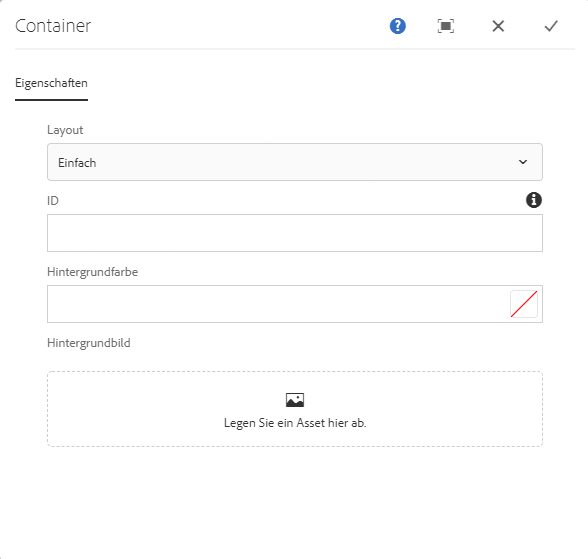
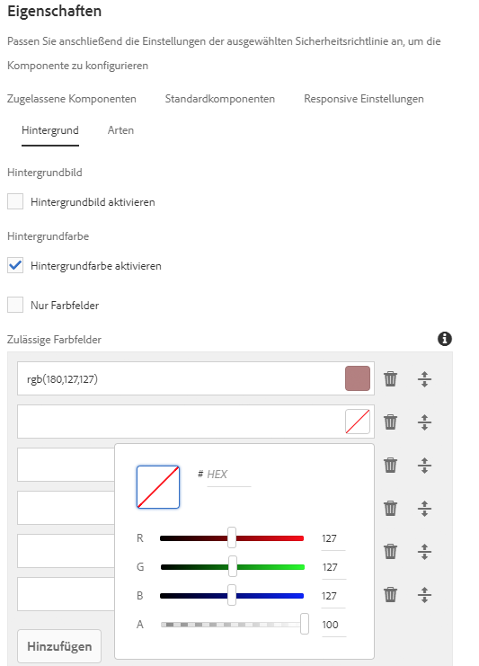

# Container-Komponente{#container-component}

Die Kernkomponente „Container-Komponente“ ermöglicht die Erstellung eines Containers für diverse zusätzliche Komponenten auf einer Seite.

## Nutzung {#usage}

Die Kernkomponente „Container-Komponente“ ermöglicht die Erstellung eines Containers für diverse zusätzliche Komponenten auf einer Seite und kann dazu verwendet werden, andere Komponenten zu gruppieren und einen gemeinsamen Stil bzw. ein gemeinsames Layout anzuwenden.

* Die Eigenschaften des Containers können im [Dialogfeld „Konfigurieren“](#configure-dialog) ausgewählt werden.
* Standardwerte für die Container-Komponente können beim Hinzufügen zu einer Seite im [Dialogfeld „Design“](#design-dialog) konfiguriert werden.

## Version und Kompatibilität {#version-and-compatibility}

Die aktuelle Version der Container-Komponente ist v1, die mit Version 2.5.0 der Kernkomponenten im Juni 2019 eingeführt wurde und in diesem Dokument beschrieben wird.

Die folgende Tabelle enthält alle unterstützten Versionen der Komponente, die AEM-Versionen, mit denen die Versionen der Komponente kompatibel sind, sowie Links zur Dokumentation für frühere Versionen.

| Komponentenversion | AEM 6.3 | AEM 6.4 | AEM 6.5 |
|--- |--- |--- |---|
| v1 | Kompatibel | Kompatibel | Kompatibel |

Weitere Informationen zu Kernkomponentenversionen und -freigaben finden Sie in den [Kernkomponentenversionen](versions.md).

## Musterkomponentenausgabe {#sample-component-output}

Um die Container-Komponente sowie Beispiele für die Konfigurationsoptionen sowie HTML- und JSON-Ausgaben zu erhalten, besuchen Sie die [Komponentenbibliothek](http://opensource.adobe.com/aem-core-wcm-components/library/container.html).

## Technische Details {#technical-details}

Die aktuelle technische Dokumentation zur Container-Komponente [finden Sie auf GitHub](https://github.com/adobe/aem-core-wcm-components/tree/master/content/src/content/jcr_root/apps/core/wcm/components/container/v1/container).

Weitere Informationen zur Entwicklung von Kernkomponenten finden Sie in der [Dokumentation zu Kernkomponenten für Entwickler](developing.md).

## Dialogfeld „Konfigurieren“ {#configure-dialog}

Mit dem Dialogfeld „Konfigurieren“ kann der Inhaltsautor das Container-Element und sein Verhalten und Aussehen für einen Besucher der Seite definieren.

* **Layout** - Diese Option definiert das Verhalten oder das Layout-Verhalten der Container-Komponente.
   * **Einfach** - Definiert einen Container als einfache Sammlung von Komponenten
   * **Responsives Raster** - Definiert einen Container als [responsives AEM-Raster](https://helpx.adobe.com/de/experience-manager/6-5/sites/authoring/using/responsive-layout.html)
* **ID** - Verwenden Sie diese Option, um das HTML-ID-Attribut zu definieren, das auf die Komponente angewendet werden soll.
* **Hintergrundfarbe** - Definierbar entweder als freie RGB-Werte oder mithilfe der Farbauswahl, [je nach Konfiguration](#background-tab).
* **Hintergrundbild** - Definiert eine Hintergrundfarbe für den Container, [je nach Konfiguration](#background-tab).

## Dialogfeld „Design“ {#design-dialog}

Das Dialogfeld „Design“ ermöglicht es dem Vorlagenautor, die Optionen für den Inhaltsautor zu definieren, der die Container-Komponente verwendet.

### Registerkarte „Zugelassene Komponenten“{#allowed-components-tab}

Über die Registerkarte **Zugelassene Komponenten** können Sie definieren, welche Komponenten der Container-Komponente vom Inhaltsautor als Elemente hinzugefügt werden können.

Die Registerkarte „Zugelassene Komponenten“ funktioniert auf die gleiche Weise wie die Registerkarte desselben Namens beim [Definieren der Richtlinie und Eigenschaften eines Layoutcontainers im Vorlageneditor.](https://helpx.adobe.com/de/experience-manager/6-5/sites/authoring/using/templates.html)

### Registerkarte „Standardkomponenten“ {#default-components-tab}

Mit der Registerkarte „Standardkomponenten“ wird definiert, welche Komponente der Komponente hinzugefügt wird, wenn ein bestimmter Assettyp im Container abgelegt wird, ähnlich wie unter [So werden Standardkomponenten in der Seitenvorlage definiert](https://helpx.adobe.com/de/experience-manager/6-5/sites/authoring/using/templates.html#EditingTemplatesTemplateAuthors) erläutert.

### Registerkarte „Responsive Einstellungen“ {#responsive-settings-tab}

* **Spalten** - Definiert die Anzahl der Spalten im Raster des resultierenden Containers.

### Registerkarte „Hintergrund“ {#background-tab}

* **Hintergrundbild**
   * **Hintergrundbild aktivieren** - Wählen Sie diese Option, um dem Inhaltsautor die Möglichkeit zu bieten, ein Hintergrundbild für den Container zu definieren.
* **Hintergrundfarbe**
   * **Hintergrundfarbe aktivieren** - Wählen Sie diese Option, um dem Inhaltsautor die Möglichkeit zu bieten, eine Hintergrundfarbe für den Container zu definieren.
   * **Nur Farbmuster** - Wählen Sie diese Option, um dem Inhaltsautor nur die Auswahl aus vordefinierten Farbmustern für die Container-Hintergrundfarbe zu ermöglichen.
      * Nur verfügbar, wenn die Option **Hintergrundfarbe aktivieren** ausgewählt ist
* **Zulässige Farbmuster** - Definieren Sie vordefinierte Farben, aus denen der Inhaltsautor die Hintergrundfarbe des Containers auswählen kann
   * Verwenden Sie die Schaltfläche **Hinzufügen**, um ein vordefiniertes Farbmuster hinzuzufügen. Nach dem Hinzufügen wird der Liste ein Eintrag hinzugefügt, der die folgenden Spalten enthält:
   * **Wert** - Definieren Sie die Farbe manuell über RGB-Werte.
      * Tippen oder klicken Sie auf die Farbauswahl, um eine Farbe leichter auszuwählen, indem Sie einzelne RGB-Werte anpassen oder einen hexadezimalen Wert definieren.
   * **Löschen** - Tippen oder klicken Sie, um ein Muster zu löschen.
   * **Neu anordnen** - Tippen oder klicken und ziehen Sie, um die Reihenfolge der Muster neu anzuordnen.

### Registerkarte „Stile“ {#styles-tab}

Die Container-Komponente unterstützt das AEM-[Stilsystem](authoring.md#component-styling).
