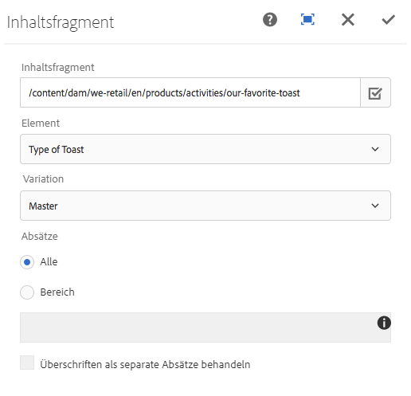
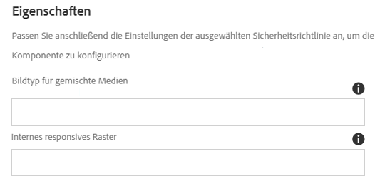

# Inhaltsfragment-Komponente{#content-fragment-component}

Die Komponente Core Component Content Fragment ermöglicht die Anzeige eines [Inhaltsfragments](https://helpx.adobe.com/experience-manager/6-5/assets/using/content-fragments.html).

>[!NOTE]
>
>Vor Version 2.4.0 der Core-Komponenten war die Komponente &quot;Inhaltsfragment&quot; als Erweiterung für die Kernkomponenten verfügbar und musste separat heruntergeladen und explizit aktiviert werden.

## Nutzung {#usage}

Die Komponente Komponente Core Component Content Fragment ermöglicht die Einbeziehung eines [Inhaltsfragments](https://helpx.adobe.com/experience-manager/6-5/assets/using/content-fragments.html) auf einer Seite.

* Das Fragment und seine Eigenschaften können im Dialogfeld [&quot;Konfigurieren&quot; ausgewählt](#configure-dialog)werden.
* Ressourcentypen zum Verarbeiten bestimmter Bilder und Raster können im [Design-Dialogfeld definiert](#design-dialog)werden.
* Mit der Option &quot;Bearbeiten&quot; wird das ausgewählte Fragment im [Inhaltsfragment-Editor geöffnet](https://helpx.adobe.com/content/help/en/experience-manager/6-5/assets/using/content-fragments.html).

## Version und Kompatibilität {#version-and-compatibility}

Die aktuelle Version der Content Fragment-Komponente ist v 1, die mit Version 1.1.0 der Kernkomponenten im Oktober 2017 eingeführt wurde und in diesem Dokument beschrieben wird.

Die folgende Tabelle enthält alle unterstützten Versionen der Komponente, die AEM-Versionen, mit denen die Versionen der Komponente kompatibel sind, sowie Links zur Dokumentation für frühere Versionen.

| Komponentenversion | AEM 6.3 | AEM 6.4 | AEM 6.5 |
|--- |--- |--- |---|
| v1 | Kompatibel | Kompatibel | Kompatibel |

Weitere Informationen zu Core-Komponentenversionen und -versionen finden Sie in den Core [-Komponentenversionen](versions.md).

## Musterkomponentenausgabe {#sample-component-output}

Rufen Sie die [Komponentenbibliothek auf, um die Content Fragment-Komponente sowie Beispiele für die Konfigurationsoptionen sowie die HTML- und JSON-Ausgabe zu erhalten](http://opensource.adobe.com/aem-core-wcm-components/library/content-fragment.html).

## Technische Details {#technical-details}

Die aktuelle technische Dokumentation zur Inhaltsfragment-Komponente [finden Sie unter github](https://github.com/adobe/aem-core-wcm-components/tree/master/content/src/content/jcr_root/apps/core/wcm/components/contentfragment/v1/contentfragment).

Weitere Informationen zur Entwicklung Kernkomponenten finden Sie in der [Dokumentation zu Kernkomponenten für Komponenten](developing.md).

## Dialogfeld konfigurieren {#configure-dialog}

Über das Dialogfeld &quot;Konfigurieren&quot; kann der Inhaltsautor das gewünschte Inhaltsfragment und die Elemente dieses Fragments definieren.

* **Inhaltsfragment**

   * Pfad zum gewünschten Inhaltsfragment
   * Das **Auswahldialogfeld** kann zum Suchen des Fragments verwendet werden.

* **Element** - Das Element des Inhaltsfragments, das eingefügt werden soll
* **Variation** - Welche Variante des zu verwendenden Inhaltsfragments (standardmäßig **Master**)

* **Absätze**

   * **Alle** - Alle Absätze anzeigen
   * **Bereich**

      * Festlegen von Absätzen, die durch ein Semikolon getrennt werden sollen
      * So können Sie z. `1;3-5;7;9-*` B. den 1., den 3. bis 5., den 7. und den 9. bis den abschließenden Absätzen einschließen

* **Überschrift als eigene Absätze behandeln**

## Design-Dialogfeld {#design-dialog}

Das Design-Dialogfeld ermöglicht es dem Vorlagenautor, die Ressourcentypen zu definieren, mit denen gemischte Medienbilder und responsive Raster verarbeitet werden.

* **Bildtyp für gemischte Medien**

   * Ein Sling-Ressourcentyp, der für das Rendern von Bildern mit gemischten Medien verwendet wird.

* **Internes responsives Raster**

   * Der Sling-Ressourcentyp, der für das interne responsive Raster verwendet wird