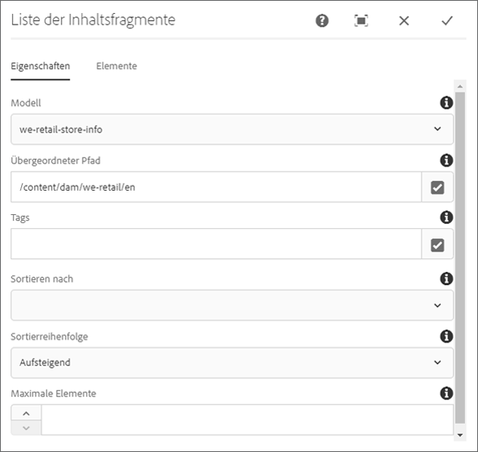
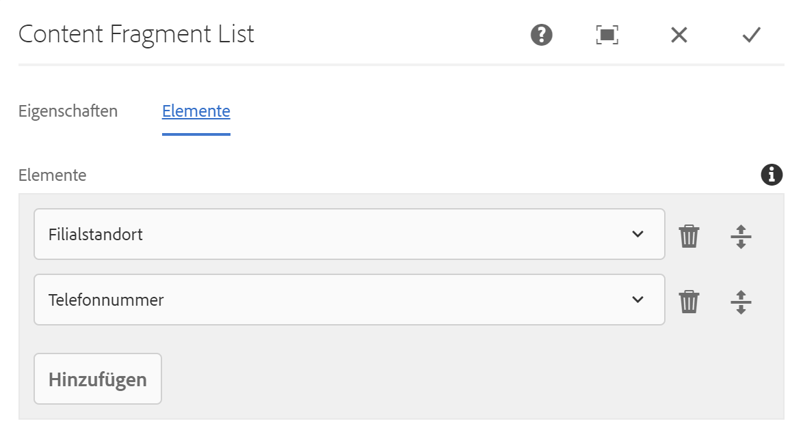

# Inhaltsfragmentlisten-Komponente{#content-fragment-list-component}

The Core Component Content Fragment List component allows for the display of a list of [content fragments](https://helpx.adobe.com/experience-manager/6-5/assets/using/content-fragments.html).

## Nutzung {#usage}

The Core Component Content Fragment List Component allows for the inclusion of a list of [content fragments](https://helpx.adobe.com/experience-manager/6-5/assets/using/content-fragments.html) on a page based on a Content Fragment model. This can be especially useful for creating [headless content](https://helpx.adobe.com/experience-manager/6-5/sites/developing/user-guide.html?topic=/experience-manager/6-5/sites/developing/morehelp/headless.ug.js) that can be easily consumed by other applications.

* Die Liste und ihre Eigenschaften können im [Dialogfeld „Konfigurieren“](#configure-dialog) ausgewählt werden.
* Stile können auf die Komponente im [Dialogfeld „Design“](#design-dialog) angewendet werden.

## Version und Kompatibilität {#version-and-compatibility}

Die aktuelle Version der Inhaltsfragment-Komponente ist v1, die mit Version 2.4.0 der Kernkomponente im Mai 2019 eingeführt wurde und in diesem Dokument beschrieben wird.

Die folgende Tabelle enthält alle unterstützten Versionen der Komponente, die AEM-Versionen, mit denen die Versionen der Komponente kompatibel sind, sowie Links zur Dokumentation für frühere Versionen.

| Komponentenversion | AEM 6.3 | AEM 6.4 | AEM 6.5 |
|--- |--- |--- |---|
| v1 | Kompatibel | Kompatibel | Kompatibel |

Weitere Informationen zu Kernkomponentenversionen und -freigaben finden Sie in den [Kernkomponentenversionen](versions.md).

## Musterkomponentenausgabe {#sample-component-output}

Rufen Sie die [Komponentenbibliothek](http://opensource.adobe.com/aem-core-wcm-components/library/content-fragment-list.html) auf, um die Inhaltsfragmentlisten-Komponente sowie die Beispiele für die Konfigurationsoptionen und die HTML- und JSON-Ausgabe zu testen.

## Technische Details {#technical-details}

Die neueste technische Dokumentation zur Inhaltsfragmentlistenkomponente [finden Sie auf GitHub](https://github.com/adobe/aem-core-wcm-components/blob/master/content/src/content/jcr_root/apps/core/wcm/components/contentfragmentlist/v1/contentfragmentlist).

Weitere Informationen zur Entwicklung von Kernkomponenten finden Sie in der [Dokumentation zu Kernkomponenten für Entwickler](developing.md).

## Dialogfeld „Konfigurieren“ {#configure-dialog}

Über das Dialogfeld „Konfigurieren“ kann der Inhaltsautor festlegen, welche Inhaltsfragmente die Liste und die Elemente dieser Fragmente enthalten sollen.

### Registerkarte „Eigenschaften“

Auf der Registerkarte **Eigenschaften** wird festgelegt, welche Inhaltsfragmente in der Liste enthalten sind. Dies basiert hauptsächlich auf einem ausgewählten Inhaltsfragment-Modell, es stehen aber auch andere Filteroptionen zur Verfügung.

* **Modell** - Pfad zum Inhaltsfragment-Modell, auf dem die Liste basiert.
   * Standardmäßig sind alle Inhaltsfragmente des Modells, das als **Modellpfad** definiert ist, in der Liste enthalten.
* **Übergeordneter Pfad** - Übergeordneter Pfad, aus dem die Liste erstellt werden soll.
   * Die auf dem ausgewählten **Modellpfad** basierenden Inhaltsfragmente werden nach den im **Übergeordneten Pfad** enthaltenen gefiltert.
      * Klicken oder tippen Sie auf die Schaltfläche **Auswahl-Dialogfeld öffnen** auf der rechten Seite des Feldes, um den Pfad anzugeben.
* **Tags** - Nur die Inhaltsfragmente mit den angegebenen Tags werden in die Liste aufgenommen.
   * Klicken oder tippen Sie auf die Schaltfläche **Auswahl-Dialogfeld öffnen** auf der rechten Seite des Feldes, um die Tags anzugeben.
   * Klicken oder tippen Sie auf das X neben den ausgewählten Tags, um sie zu entfernen.
* **Reihenfolge nach** - Feld des Inhaltsfragmentmodells, nach dem die Liste angeordnet werden soll
   * Es können nur Textfelder (einschließlich numerisch, Datum und Uhrzeit) ausgewählt werden.
* **Sortierreihenfolge** - Sortieren der Liste nach dem Feld **Reihenfolge**
   * Aufsteigend oder absteigend
* **Max. Elemente** - Maximale Anzahl der in der Liste anzuzeigenden Elemente
   * Kein Wert gibt alle Elemente zurück.

>[!NOTE]
>Die **Optionen "Reihenfolge nach**", " **Sortierreihenfolge**"und " **Max. Elemente** "wurden mit Version 2.7.0 der Kernkomponenten eingeführt.

### Registerkarte „Elemente“

Standardmäßig werden alle Elemente des Inhaltsfragmentmodells in die Liste aufgenommen (sofern sie nicht durch das Feld " **Max. Elemente** "eingeschränkt sind). The **Elements** tab allows you to specify only specific elements to include.

* **Elemente** - Es werden nur die Elemente der Inhaltsfragmente in der angegebenen Liste angezeigt.
   * Klicken oder tippen Sie auf die Schaltfläche **Hinzufügen**, um ein neues Element hinzuzufügen..
   * Click or tap the **Delete** button to remove a selected element.
   * Ziehen Sie den Ziehgriff **Reihenfolge**, um die Reihenfolge der Elemente zu ändern.

## Dialogfeld „Design“ {#design-dialog}

Im Dialogfeld „Design“ kann der Vorlagenautor die Stile definieren, die auf die Inhaltsfragmentlisten-Komponente angewendet werden.
