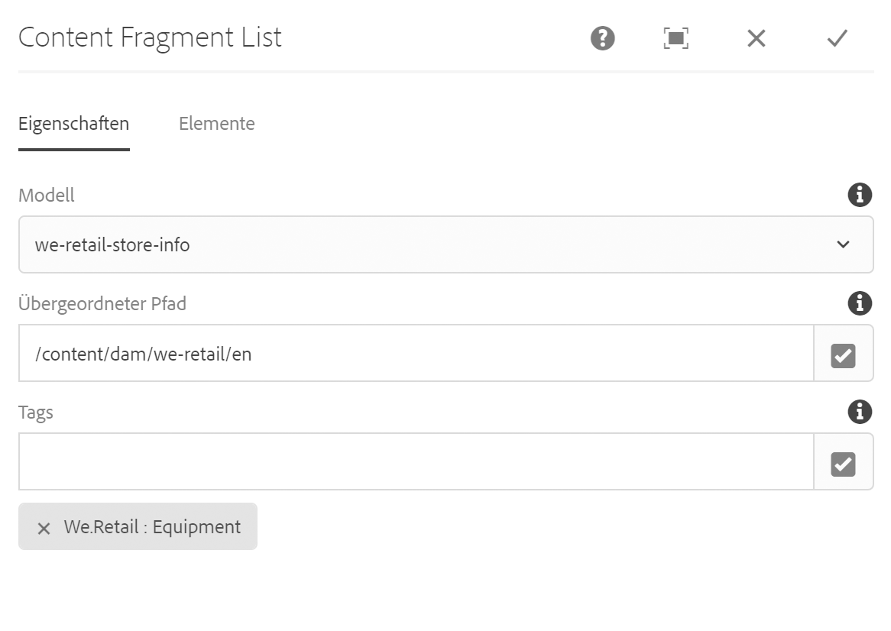

# Inhaltsfragmentlisten-Komponente{#content-fragment-list-component}

Die Kernkomponente „Inhaltsfragmentliste“ ermöglicht die Anzeige einer Liste von [Inhaltsfragmenten](https://helpx.adobe.com/experience-manager/6-5/assets/using/content-fragments.html).

## Nutzung {#usage}

Die Kernkomponente „Inhaltsfragmentliste“ ermöglicht die Einbeziehung einer Liste von [Inhaltsfragmenten](https://helpx.adobe.com/experience-manager/6-5/assets/using/content-fragments.html) auf einer Seite basierend auf einem Inhaltsfragmentmodell. Dies kann besonders für die Erstellung von [Headless Content](https://helpx.adobe.com/experience-manager/6-5/sites/developing/user-guide.html?topic=/experience-manager/6-5/sites/developing/morehelp/headless.ug.js) nützlich sein, der leicht von anderen Anwendungen genutzt werden kann.

* Die Liste und ihre Eigenschaften können im [Dialogfeld „Konfigurieren“](#configure-dialog) ausgewählt werden.
* Stile können auf die Komponente im [Dialogfeld „Design“](#design-dialog) angewendet werden.

## Version und Kompatibilität {#version-and-compatibility}

Die aktuelle Version der Inhaltsfragment-Komponente ist v1, die mit Version 2.4.0 der Kernkomponente im Mai 2019 eingeführt wurde und in diesem Dokument beschrieben wird.

Die folgende Tabelle enthält alle unterstützten Versionen der Komponente, die AEM-Versionen, mit denen die Versionen der Komponente kompatibel sind, sowie Links zur Dokumentation für frühere Versionen.

| Komponentenversion | AEM 6.3 | AEM 6.4 | AEM 6.5 |
|--- |--- |--- |---|
| v1 | Kompatibel | Kompatibel | Kompatibel |

Weitere Informationen zu Kernkomponentenversionen und -freigaben finden Sie in den [Kernkomponentenversionen](versions.md).

## Musterkomponentenausgabe {#sample-component-output}

Rufen Sie die [Komponentenbibliothek](http://opensource.adobe.com/aem-core-wcm-components/library/content-fragment-list.html) auf, um die Inhaltsfragmentlisten-Komponente sowie die Beispiele für die Konfigurationsoptionen und die HTML- und JSON-Ausgabe zu testen.

## Technische Details {#technical-details}

Die aktuelle technische Dokumentation zur Inhaltsfragmentlisten-Komponente [finden Sie auf GitHub](https://github.com/adobe/aem-core-wcm-components/blob/master/content/src/content/jcr_root/apps/core/wcm/components/contentfragmentlist/v1/contentfragmentlist).

Weitere Informationen zur Entwicklung von Kernkomponenten finden Sie in der [Dokumentation zu Kernkomponenten für Entwickler](developing.md).

## Dialogfeld „Konfigurieren“ {#configure-dialog}

Über das Dialogfeld „Konfigurieren“ kann der Inhaltsautor festlegen, welche Inhaltsfragmente die Liste und die Elemente dieser Fragmente enthalten sollen.

### Registerkarte „Eigenschaften“

Auf der Registerkarte **Eigenschaften** wird festgelegt, welche Inhaltsfragmente in der Liste enthalten sind. Dies basiert hauptsächlich auf einem ausgewählten Inhaltsfragment-Modell, es stehen aber auch andere Filteroptionen zur Verfügung.

* **Modell** - Pfad zum Inhaltsfragment-Modell, auf dem die Liste basiert.
   * Standardmäßig sind alle Inhaltsfragmente des Modells, das als **Modellpfad** definiert ist, in der Liste enthalten.
* **Übergeordneter Pfad** - Übergeordneter Pfad, aus dem die Liste erstellt werden soll.
   * Die auf dem ausgewählten **Modellpfad** basierenden Inhaltsfragmente werden nach den im **Übergeordneten Pfad** enthaltenen gefiltert.
   * Klicken oder tippen Sie auf die Schaltfläche **Auswahl-Dialogfeld öffnen** auf der rechten Seite des Feldes, um den Pfad anzugeben.
* **Tags** - Nur die Inhaltsfragmente mit den angegebenen Tags werden in die Liste aufgenommen.
   * Klicken oder tippen Sie auf die Schaltfläche **Auswahl-Dialogfeld öffnen** auf der rechten Seite des Feldes, um die Tags anzugeben.
   * Klicken oder tippen Sie auf das X neben den ausgewählten Tags, um sie zu entfernen.

### Registerkarte „Elemente“

Standardmäßig werden alle Elemente des Inhaltsfragmentmodells in die Liste aufgenommen. Unter **Elemente** können Sie nur bestimmte Elemente angeben, die einbezogen werden sollen.

* **Elemente** - Es werden nur die Elemente der Inhaltsfragmente in der angegebenen Liste angezeigt.
   * Klicken oder tippen Sie auf die Schaltfläche **Hinzufügen**, um ein neues Element hinzuzufügen.
   * Klicken oder tippen Sie auf die Schaltfläche **Entfernen**, um ein ausgewähltes Element zu entfernen.
   * Ziehen Sie den Ziehgriff **Reihenfolge**, um die Reihenfolge der Elemente zu ändern.

## Dialogfeld „Design“ {#design-dialog}

Im Dialogfeld „Design“ kann der Vorlagenautor die Stile definieren, die auf die Inhaltsfragmentlisten-Komponente angewendet werden.