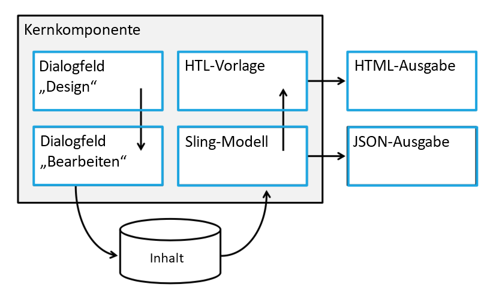

# Anpassen der Kernkomponenten{#customizing-core-components}

Die [Kernkomponenten](developing.md) implementieren verschiedene Strukturen, die eine einfache Anpassung ermöglichen, von einfachen Stilen bis hin zur Wiederverwendung erweiterter Funktionen.

## Flexible Architektur {#flexible-architecture}

Die Kernkomponenten wurden von Anfang an so entworfen, dass sie flexibel und erweiterbar sind. Ein Überblick über ihre Architektur zeigt an, wo Anpassungen vorgenommen werden können.



* Im [Dialogfeld „Design“](authoring.md#edit-and-design-dialogs) wird definiert, was Autoren im Dialogfeld „Bearbeiten“ tun können und was nicht.
* Das [Dialogfeld „Bearbeiten“](authoring.md#edit-and-design-dialogs) zeigt Autoren nur die Optionen an, die sie verwenden dürfen.
* [Das Sling-Modell](#customizing-the-logic-of-a-core-component) überprüft und bereitet den Inhalt für die Ansicht (Vorlage) vor.
* [Das Ergebnis des Sling-Modells](#customizing-the-logic-of-a-core-component) kann für die SPA-Anwendungsfälle in JSON serialisiert werden.
* [Das HTL rendert die HTML](#customizing-the-markup) Server-seitig für die herkömmliche Server-seitige Wiedergabe.
* [Die HTML-Ausgabe](#customizing-the-markup) ist semantisch, barrierefrei, suchmaschinenoptimiert und leicht zu gestalten.

Und alle Kernkomponenten implementieren das [Stilsystem](customizing.md).

## Anpassungsmuster {#customization-patterns}

### Anpassen von Dialogen {#customizing-dialogs}

Es ist möglicherweise sinnvoll, die in einem Kernkomponentendialogfeld verfügbaren Konfigurationsoptionen anzupassen, entweder [im Dialogfeld „Design“ oder im Dialogfeld „Bearbeiten“](authoring.md).

Jedes Dialogfeld hat eine einheitliche Knotenstruktur. Es wird empfohlen, diese Struktur in einer erbenden Komponente zu replizieren, sodass der [Sling Resource Merger](https://helpx.adobe.com/de/experience-manager/6-4/sites/developing/using/sling-resource-merger.html) und [Ausblendebedingungen](https://helpx.adobe.com/de/experience-manager/6-5/sites/developing/using/hide-conditions.html) zum Ausblenden, Ersetzen oder Neuordnen von Abschnitten des ursprünglichen Dialogfelds verwendet werden können. Die zu replizierende Struktur ist als beliebiger Wert bis zur Registerkartenelement-Knotenebene definiert.

Damit alle Änderungen an einem Dialogfeld in seiner aktuellen Version vollständig kompatibel sind, ist es äußerst wichtig, dass Strukturen unterhalb der Registerkartenelementebene nicht angerührt werden (ausgeblendet, hinzugefügt, ersetzt, neu angeordnet usw.). Stattdessen sollte ein Tabulatorelement aus der übergeordneten Eigenschaft über die `sling:hideResource`-Eigenschaft ausgeblendet werden (siehe [Sling Resource Merger-Eigenschaften](https://helpx.adobe.com/de/experience-manager/6-5/sites/developing/using/sling-resource-merger.html)) und neue Registerkartenelemente hinzugefügt werden, die die spezifischen Konfigurationsfelder enthalten. `sling:orderBefore` kann verwendet werden, um die Registerkartenelemente bei Bedarf neu anzuordnen.

Das folgende Dialogfeld zeigt die empfohlene Dialogfeldstruktur sowie das Ausblenden und Ersetzen einer vererbten Registerkarte wie oben beschrieben:

<!-- 

Comment Type: annotation
Last Modified By: ims-author-CE1E2CE451D1F0680A490D45@AdobeID
Last Modified Date: 2017-04-17T17:43:20.265-0400

Should we provide guidance on how to name their CSS classes, etc. to align to component re-usability best-practices? We tout that we follow bootstrap css naming, should we be counseling customers to align similarly? .cmp- 
<component name="">
  -- 
 <element>
   - 
  <element descriptor="">
    ? 
  </element> 
 </element> 
</component>

 -->

```xml
<?xml version="1.0" encoding="UTF-8"?>
<jcr:root xmlns:sling="https://sling.apache.org/jcr/sling/1.0"
          xmlns:jcr="https://www.jcp.org/jcr/1.0"
          xmlns:nt="https://www.jcp.org/jcr/nt/1.0"
          xmlns:granite="https://www.adobe.com/jcr/granite/1.0"
          jcr:primaryType="nt:unstructured">
    <content jcr:primaryType="nt:unstructured">
        <items jcr:primaryType="nt:unstructured">
            <tabs jcr:primaryType="nt:unstructured">
                <items jcr:primaryType="nt:unstructured">
                        <originalTab
                                jcr:primaryType="nt:unstructured"
                                sling:hideResource="true"/>
                        </originalTab>
                        <myTab
                               jcr:primaryType="nt:unstructured"
                               jcr:title="My Tab"
                               sling:resourceType="granite/ui/components/coral/foundation/container"/>
                               <!-- myTab content -->
                        </myTab>
                </items>
            </basic>
        </items>
    </content>
</jcr:root>
```

### Anpassen der Logik einer Kernkomponente {#customizing-the-logic-of-a-core-component}

Die Geschäftslogik für die Kernkomponenten ist in Sling-Modellen implementiert. Diese Logik kann mithilfe eines Sling-Delegationsmusters erweitert werden.

Beispielsweise verwendet die Titel-Kernkomponente die `jcr:title`-Eigenschaft der angeforderten Ressource, um den Titeltext zu liefern. Wenn keine `jcr:title`-Eigenschaft definiert ist, ist eine Ausweichmöglichkeit zum aktuellen Seitentitel implementiert. Wir möchten das Verhalten so ändern, dass der Titel der aktuellen Seite immer angezeigt wird.

Da die Implementierung der Modelle der Kernkomponenten privat ist, müssen sie mit einem Delegationsmuster erweitert werden.

```java
@Model(adaptables = SlingHttpServletRequest.class,
       adapters = Title.class,
       resourceType = "myproject/components/pageHeadline")
public class PageHeadline implements Title {
    @ScriptVariable private Page currentPage;
    @Self @Via(type = ResourceSuperType.class)
    private Title title;
    @Override public String getText() {
        return currentPage.getTitle();
    }
    @Override public String getType() {
        return title.getType();
    }
}
```

Weitere Informationen zum Delegationsmuster finden Sie im GitHub-Wiki-Artikel zu Kernkomponenten [Delegationsmuster für Sling-Modelle](https://github.com/adobe/aem-core-wcm-components/wiki/Delegation-Pattern-for-Sling-Models).

### Anpassen des Markup {#customizing-the-markup}

Manchmal erfordert erweitertes Formatieren eine andere Markup-Struktur der Komponente.

Hierfür können Sie ganz einfach die zu ändernden HTL-Dateien aus der Kernkomponente in die Proxy-Komponente kopieren.

Wenn Sie das Beispiel der Breadcrumb-Kernkomponente erneut aufrufen, um die Markup-Ausgabe anzupassen, muss die `breadcrumb.html`-Datei in die Site-spezifische Komponente kopiert werden, die über ein `sling:resourceSuperTypes` verfügt, das auf die Breadcrumb-Kernkomponente zeigt.

<!-- 

Comment Type: annotation
Last Modified By: ims-author-CE1E2CE451D1F0680A490D45@AdobeID
Last Modified Date: 2017-04-17T17:43:20.265-0400

Should we provide guidance on how to name their CSS classes, etc. to align to component re-usability best-practices? We tout that we follow bootstrap css naming, should we be counseling customers to align similarly? .cmp- 
<component name="">
  -- 
 <element>
   - 
  <element descriptor="">
    ? 
  </element> 
 </element> 
</component>

 -->

### Formatieren der Komponenten {#styling-the-components}

Die erste Art der Anpassung besteht darin, CSS-Stile anzuwenden.

Um dies zu vereinfachen, rendern die Kernkomponenten das Semantik-Markup und folgen einer standardisierten Benennungskonvention, die von [Bootstrap](https://getbootstrap.com/) inspiriert wurde. Um die Stile für die einzelnen Komponenten einfach zu erreichen und zu benennen, wird jede Kernkomponente in ein DIV-Element mit den Klassen `cmp` und `cmp-<name>` eingeschlossen.

Beispielsweise die HTL-Datei der Breadcrumb-Kernkomponente von v1: [breadcrumb.html](https://github.com/adobe/aem-core-wcm-components/blob/master/content/src/content/jcr_root/apps/core/wcm/components/breadcrumb/v2/breadcrumb/breadcrumb.html). Wir sehen, dass die Hierarchie der Elementausgabe `ol.breadcrumb > li.breadcrumb-item > a` ist. Um sicherzustellen, dass eine CSS-Regel nur die Breadcrumb-Klasse dieser Komponente betrifft, sollten alle Regeln in einem Namensbereich angeordnet werden, wie unten dargestellt:

```shell
.cmp-breadcrumb .breadcrumb {}  
.cmp-breadcrumb .breadcrumb-item {}  
.cmp-breadcrumb a {}
```

Darüber hinaus nutzen alle Kernkomponenten das [Stilsystem](https://helpx.adobe.com/de/experience-manager/6-5/sites/authoring/using/style-system.htm) von AEM, das es Vorlagenautoren ermöglicht, zusätzliche CSS-Klassennamen zu definieren, die von den Seitenautoren auf die Komponente angewendet werden können. Auf diese Weise können Sie für jede Vorlage eine Liste der zulässigen Komponentenstile definieren und festlegen, ob eine dieser Komponenten standardmäßig auf alle Komponenten dieser Art angewendet werden soll.

## Upgrade-Kompatibilität von Anpassungen {#upgrade-compatibility-of-customizations}

Es gibt drei verschiedene Arten von Upgrades:

* Upgrade der AEM-Version
* Upgrade der Kernkomponenten auf eine neue Unterversion
* Upgrade der Kernkomponenten auf eine Hauptversion

Im Allgemeinen wirkt sich das Aktualisieren von AEM auf eine neue Version nicht auf die Kernkomponenten oder die vorgenommenen Anpassungen aus, sofern die Versionen der Komponenten auch die neue AEM-Version unterstützen, die migriert wird, und diese Anpassungen keine APIs verwenden, die [nicht mehr unterstützt werden oder entfernt wurden](https://helpx.adobe.com/de/experience-manager/6-5/release-notes/deprecated-removed-features.html).

Das Aktualisieren der Kernkomponenten ohne Wechseln zu einer neueren Hauptversion sollte sich nicht auf Anpassungen auswirken, solange die auf dieser Seite beschriebenen Anpassungsmuster verwendet werden.

Wechseln zu einer neueren Hauptversion der Kernkomponenten ist nur für die Inhaltsstruktur kompatibel, Anpassungen müssen jedoch möglicherweise überarbeitet werden. Klare Änderungsprotokolle werden für jede Komponentenversion veröffentlicht, um die Änderungen hervorzuheben, die Auswirkungen auf die auf dieser Seite beschriebenen Anpassungen haben.

## Unterstützung von Anpassungen {#support-of-customizations}

Wie bei jeder AEM-Komponente gibt es einige Aspekte hinsichtlich der Anpassungen zu beachten:

1. **Ändern Sie den Code der Kernkomponenten nie direkt.**

   Dies würde dazu führen, dass sie nicht vollständig unterstützt werden und künftige Updates der Komponenten zu einem schmerzhaften Prozess machen. Verwenden Sie stattdessen die auf dieser Seite beschriebenen Anpassungsmethoden.

1. **Für benutzerdefinierten Code sind Sie selbst verantwortlich.**

   Unser Support-Programm deckt keinen benutzerdefinierten Code ab und gemeldete Probleme, die nicht mit Vanilla-Kernkomponenten reproduziert werden können, die [wie dokumentiert](using.md) verwendet werden, werden nicht anerkannt.

1. **Achten Sie auf veraltete und entfernte Funktionen.**

   Stellen Sie bei jeder neuen AEM-Version, auf die ein Upgrade erfolgt, sicher, dass alle verwendeten APIs noch aktuell sind, indem Sie die Seite [Veraltete und entfernte Funktionen](https://helpx.adobe.com/de/experience-manager/6-5/release-notes/deprecated-removed-features.html) prüfen.

Siehe auch Abschnitt zur [Kernkomponentenunterstützung](developing.md#core-component-support).

**Lesen Sie als Nächstes:**

* [Verwenden von Kernkomponenten](using.md) - Starten Sie mit Kernkomponenten in Ihrem eigenen Projekt.
* [Komponentenrichtlinien](guidelines.md) - Lernen Sie die Implementierungsmuster der Kernkomponenten kennen.
