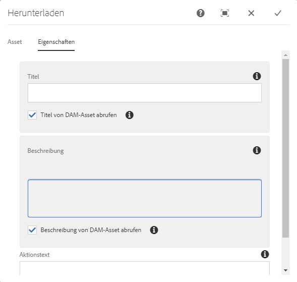
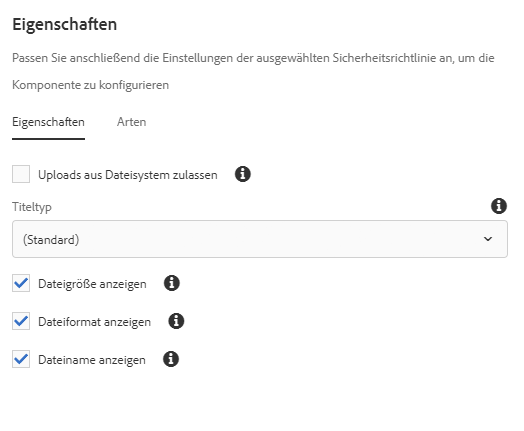

# Download-Komponente{#download-component}

Die Kernkomponente „Download-Komponente“ ermöglicht die Erstellung einer Download-Option auf einer Seite.

## Nutzung {#usage}

Die Kernkomponente „Download-Komponente“ ermöglicht die Erstellung einer Download-Option und zugehöriger Elemente auf einer Seite.

* Die Eigenschaften der Download-Komponente können im [Dialogfeld „Konfigurieren“](#configure-dialog) ausgewählt werden.
* Standardwerte für die Download-Komponente können im [Dialogfeld „Design“](#design-dialog) definiert werden.

## Version und Kompatibilität {#version-and-compatibility}

Die aktuelle Version der Download-Komponente ist v1, die mit Version 2.5.0 der Kernkomponenten im Juni 2019 eingeführt wurde und in diesem Dokument beschrieben wird.

Die folgende Tabelle enthält alle unterstützten Versionen der Komponente, die AEM-Versionen, mit denen die Versionen der Komponente kompatibel sind, sowie Links zur Dokumentation für frühere Versionen.

| Komponentenversion | AEM 6.3 | AEM 6.4 | AEM 6.5 |
|--- |--- |--- |---|
| v1 | Kompatibel | Kompatibel | Kompatibel |

Weitere Informationen zu Kernkomponentenversionen und -freigaben finden Sie in den [Kernkomponentenversionen](versions.md).

## Musterkomponentenausgabe {#sample-component-output}

Um die Download-Komponente sowie Beispiele für die Konfigurationsoptionen sowie HTML- und JSON-Ausgaben zu erhalten, besuchen Sie die [Komponentenbibliothek](http://opensource.adobe.com/aem-core-wcm-components/library/download.html).

## Technische Details {#technical-details}

Die aktuelle technische Dokumentation zur Download-Komponente [finden Sie auf GitHub](https://github.com/adobe/aem-core-wcm-components/tree/master/content/src/content/jcr_root/apps/core/wcm/components/download/v1/download).

Weitere Informationen zur Entwicklung von Kernkomponenten finden Sie in der [Dokumentation zu Kernkomponenten für Entwickler](developing.md).

## Dialogfeld „Konfigurieren“ {#configure-dialog}

Mit dem Dialogfeld „Konfigurieren“ kann der Inhaltsautor das Download-Element und sein Verhalten und Aussehen für einen Besucher der Seite definieren.

### Asset-Registerkarte {#asset-tab}

Die Auswahl eines Download-Assets ähnelt der Funktionalität der [Bildkomponente](image.md) und nutzt gleichermaßen das AEM-DAM.

* **Asset herunterladen**
   * Ziehen Sie ein Asset aus dem [Asset-Browser](https://helpx.adobe.com/de/experience-manager/6-5/sites/authoring/using/author-environment-tools.html) oder tippen Sie auf die Option **Durchsuchen**, um es von einem lokalen Dateisystem hochzuladen.
   * Tippen oder klicken Sie auf **Löschen**, um das aktuell ausgewählte Bild zu deaktivieren.
   * Tippen oder klicken Sie auf **Bearbeiten**, um die [Darstellungen der Assets](https://helpx.adobe.com/de/experience-manager/6-5/assets/using/managing-assets-touch-ui.html) im Asset-Editor zu verwalten.

### Registerkarte „Eigenschaften“{#properties-tab}

* **Titel** - Wird als Überschrift für das Download-Element angezeigt
   * **Titel von DAM-Asset abrufen** - Wenn ausgewählt, wird der Titel automatisch mit dem Titel des DAM-Assets ausgefüllt.
* **Beschreibung** - Zeigt eine beschreibende Unterüberschrift des Download-Elements an
   * **Beschreibung von DAM-Asset abrufen** - Wenn ausgewählt, wird die Beschreibung automatisch mit der Beschreibung des DAM-Assets ausgefüllt.
* **Aktionstext** - Zeigt Aktionstext für das Download-Element an
   * Dieses Feld ist beim Hochladen eines Assets aus dem Dateisystem erforderlich. 
   * **Inline-Anzeige** - Wenn ausgewählt, wird der angegebene **Aktionstext** inline angezeigt.

## Dialogfeld „Design“ {#design-dialog}

Das Dialogfeld „Design“ ermöglicht es dem Vorlagenautor, die Optionen für den Inhaltsautor zu definieren, der die Download-Komponente verwendet.

### Registerkarte „Eigenschaften“{#properties-tab-design}

* **Standardaktionstext** - Definiert den standardmäßigen **Aktionstext**, der angegeben wird, wenn ein Autor die Download-Komponente einer Seite hinzufügt.
* **Upload aus Dateisystem zulassen** - Ermöglicht dem Inhaltsautor das Hochladen eines Assets aus seinem lokalen Dateisystem als Download-Asset.
   * Der Standardwert ist nicht ausgewählt.
* **Titeltyp** - Das HTML-Element, das für den Titel der Download-Komponente verwendet wird.
   * Wenn kein Wert ausgewählt ist, lautet der Standardwert H 3.
* **Dateigröße anzeigen** - Wenn ausgewählt, wird die Dateigröße des Assets in der Download-Komponente angezeigt.
   * Der Standardwert ist ausgewählt.
* **Dateiformat anzeigen** - Wenn ausgewählt, wird das Dateiformat des Assets in der Download-Komponente angezeigt.
   * Der Standardwert ist ausgewählt.
* **Dateinamen anzeigen** - Wenn ausgewählt, wird der Dateiname des Assets in der Download-Komponente angezeigt.
   * Der Standardwert ist ausgewählt.

### Registerkarte „Stile“ {#styles-tab}

Die Bildkomponente unterstützt das AEM-[Stilsystem](authoring.md#component-styling).
