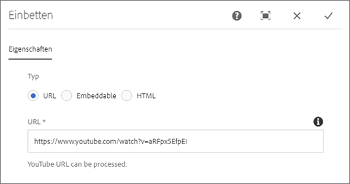
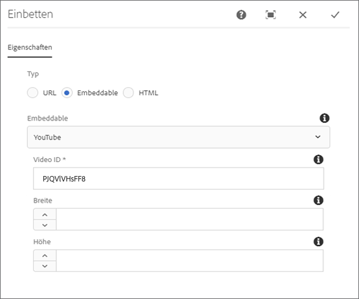
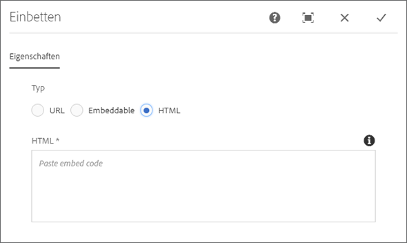
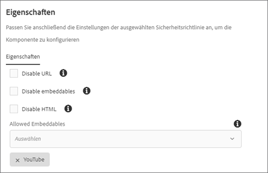

# Komponente einbetten{#embed-component}

Die Komponente "Core-Komponenten einbetten"ermöglicht das Einbetten externer Inhalte in eine AEM-Inhaltsseite.

## Nutzung {#usage}

Mit der Komponente "Einbettung der Kernkomponente"kann der Inhaltsersteller ausgewählte externe Inhalte definieren, die in eine AEM-Inhaltsseite eingebettet werden sollen. Darüber hinaus gibt es die Möglichkeit, frei formbares HTML zu definieren, das ebenfalls eingebettet werden soll.

* The component's properties can be defined in the [configure dialog](#configure-dialog).
* Die Standardeinstellungen für die Komponente beim Hinzufügen zu einer Seite können im Dialogfeld [Design](#design-dialog) definiert werden.

## Version und Kompatibilität {#version-and-compatibility}

The current version of the Embed Component is v1, which was introduced with release 2.7.0 of the Core Components in September 2019, and is described in this document.

Die folgende Tabelle enthält alle unterstützten Versionen der Komponente, die AEM-Versionen, mit denen die Versionen der Komponente kompatibel sind, sowie Links zur Dokumentation für frühere Versionen.

| Komponentenversion | AEM 6.3 | AEM 6.4 | AEM 6.5 |
|--- |--- |--- |---|
| v1 | Kompatibel | Kompatibel | Kompatibel |

Weitere Informationen zu Kernkomponentenversionen und -freigaben finden Sie in den [Kernkomponentenversionen](versions.md).

## Musterkomponentenausgabe {#sample-component-output}

To experience the Embed Component as well as see examples of its configuration options as well as HTML and JSON output, visit the [Component Library](http://opensource.adobe.com/aem-core-wcm-components/library/embed.html).

## Technische Details {#technical-details}

Die aktuelle technische Dokumentation zur Embed-Komponente [finden Sie auf GitHub](https://github.com/adobe/aem-core-wcm-components/tree/master/content/src/content/jcr_root/apps/core/wcm/components/embed/v1/embed).

Weitere Informationen zur Entwicklung von Kernkomponenten finden Sie in der [Dokumentation zu Kernkomponenten für Entwickler](developing.md).

## Dialogfeld „Konfigurieren“ {#configure-dialog}

The configure dialog allows the content author to define the external resource to be embedded on the page. First choose which type of resource should be embedded: **URL**, **Embeddable**, or **HTML**.

### URL {#url}

The simplest embed is the URL. Simply paste the URL of the resource you wish to embed in the URL field. **** The component will attempt to access the resource and if it can be rendered by one of the processors, it will display a confirmation message below the URL field. **** If not, the field will be marked in error.

The Embed Component ships with processors for the following types of resources:

* Resources that comply with the oEmbed standard including Facebook Post, Instagram, SoundCloud, Twitter, and YouTube
* Pinterest

Developers can add additional URL processors by [following the developer documentation of the Embed Component.](https://github.com/adobe/aem-core-wcm-components/tree/master/content/src/content/jcr_root/apps/core/wcm/components/embed/v1/embed#extending-the-embed-component)

### Einbettbar {#embeddable}

Embeddables allow for more customization of the embedded resource, which can be parameterized and include additional information. An author is able to select from pre-configured trusted embeddables and the component ships with a Youtube embeddable out-of-the-box.

The **Embeddable** field defines the type of processor you want to use. Im Falle der YouTube-Einbettung können Sie dann Folgendes definieren:

* **Video ID - The unique video ID from YouTube of the resource you want to embed**
* **Breite** - Die Breite des eingebetteten Videos
* **Höhe** - Die Höhe des eingebetteten Videos

Andere Einbettungsvariablen bieten ähnliche Felder an und können von einem Entwickler anhand der Entwicklerdokumentation der Einbettungskomponente definiert werden. [Dies gilt auch für Einbettungselemente.](https://github.com/adobe/aem-core-wcm-components/tree/master/content/src/content/jcr_root/apps/core/wcm/components/embed/v1/embed#extending-the-embed-component)

>[!NOTE]
>Einbettbare müssen auf Vorlagenebene über das [Designdialogfeld](#design-dialog) aktiviert werden, damit sie dem Seitenautor zur Verfügung stehen.

### HTML {#html}

Mit der Einbettungskomponente können Sie Ihrer Seite Freiform-HTML hinzufügen.

>[!NOTE]
>Unsichere Tags wie Skripten werden aus dem eingegebenen HTML gefiltert und nicht auf der resultierenden Seite wiedergegeben.

## Dialogfeld „Design“ {#design-dialog}

Im Dialogfeld "Entwurf"kann der Vorlagenautor die Optionen festlegen, die dem Inhaltsautor, der die Einbettungskomponente verwendet, zur Verfügung stehen, sowie die beim Platzieren der Einbettungskomponente festgelegten Standardwerte.

* **URL** deaktivieren - Deaktiviert die Option " **URL** "für den Inhaltsautor, wenn ausgewählt
* **Einbettbare** deaktivieren: Deaktiviert die Option " **Einbetten** "für den Inhaltsersteller, sofern ausgewählt, unabhängig davon, welche Prozessoren einbetten können.
* **HTML** deaktivieren - Deaktiviert die **HTML** -Option für den Inhaltsautor, wenn diese ausgewählt ist.
* **Zulässige Einbettungen** - Diese Option definiert, welche einbettbaren Prozessoren für den Inhaltsersteller verfügbar sind, sofern die Option **Einbetten** aktiv ist.
