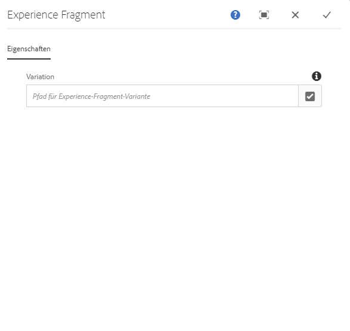
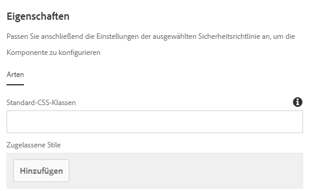

# Erlebnisfragment-Komponente{#experience-fragment-component}

Die Komponente "Core Component Experience Fragment" ermöglicht dem Inhaltsautor die Platzierung einer Erlebnisfragmentvariation auf einer Seite, während eine lokalisierte Site-Struktur unterstützt wird.

## Nutzung {#usage}

Mit der Komponente Component Component Experience Fragment kann der Inhaltsautor aus vorhandenen Erlebnisfragment-Namensationen auswählen und eine auf der Inhaltsseite platzieren. Die Komponente "Erlebnisfragment" unterstützt auch eine lokalisierte Site-Struktur.

* The components's properties can be defined in the [configure dialog](#configure-dialog).
* Defaults for the component when adding it to a page can be defined in the [design dialog](#design-dialog).

## Unterstützung lokalisierter Site-Struktur {#localized-site-structure}

Die Experience Fragment-Komponente ist adaptive Site-Struktur und gibt das richtige Erlebnisfragment basierend auf der Lokalisierung der Seite wieder. Hierfür muss das Erlebnisfragment die folgenden Bedingungen erfüllen.

* Die Experience Fragment-Komponente wird einer Vorlage hinzugefügt.
* Diese Vorlage wird verwendet, um eine neue Inhaltsseite zu erstellen, die Teil einer lokalisierten Struktur unten `/content/<site>`ist.
* Das auf einer Inhaltsseite referenzierte Erlebnisfragment ist Teil einer lokalisierten Erlebnisfragmentstruktur, die `/content/experience-fragments` denselben Mustern wie die Site unten `/content/<site>` folgt, einschließlich der gleichen Komponentennamen.

In diesem Fall wird das Fragment mit derselben Lokalisierung (Sprache, Blueprint oder Live Copy) als aktuelle Seite wiedergegeben.

Dieses Verhalten ist auf Erlebnisfragmentkomponenten beschränkt, die zu Vorlagen hinzugefügt werden. Erlebnisfragmentkomponenten, die einzelnen Inhaltsseiten hinzugefügt werden, rendern die exakten Erlebnisfragmentdarstellungen, die innerhalb der Komponente konfiguriert wurden.

* Ein Beispiel zur Funktionsweise der Lokalisierungsfunktionen der Experience Fragment-Komponente finden Sie [im folgenden Abschnitt](#example).
* Ein Beispiel dafür, wie die Lokalisierungsfunktionen der Kernkomponenten zusammen funktionieren, finden Sie in den [Lokalisierungsfunktionen der Seite Kernkomponenten](localization.md).

### Beispiel {#example}

Nehmen wir an, dass Ihr Inhalt wie folgt aussieht:

```
/content
+-- experience-fragments
   \-- we-retail
      +-- language-masters
      +-- us
         +-- en
            +-- footerTextXf
            \-- headerTextXf
         \-- es
            +-- footerTextXf
            \-- headerTextXf
      \-- ch
         +-- de
            +-- footerTextXf
            \-- headerTextXf
         +-- fr
            +-- footerTextXf
            \-- headerTextXf
         \-- it
            +-- footerTextXf
            \-- headerTextXf
+-- we-retail
   +-- language-masters
   +-- us
      +-- en
      \-- es
   +-- ch
      +-- de
      +-- fr
      \-- it
+-- wknd-events
\-- wknd-shop
```

Beachten Sie, dass sich die unten stehende Struktur `/content/experience-fragments/we-retail` auf `/content/we-retail`die Struktur auswirkt.

Wenn die Komponente Experience Fragment in einer Vorlage `/content/experience-fragments/we-retail/us/en/footerTextXf` platziert wird, werden die lokalisierten Seiten, die basierend auf dieser Vorlage erstellt wurden, automatisch das lokalisierte Erlebnisfragment wiedergeben, das der lokalisierten Inhaltsseite entspricht.

Wenn Sie also zu einer Inhaltsseite navigieren, unter `/content/we-retail/ch/de` der dieselbe Vorlage verwendet `/content/experience-fragments/we-retail/ch/de/footerTextXf``/content/experience-fragments/we-retail/us/en/footerTextXf`wird, werden Sie stattdessen gerendert.

### Notfallversorgung {#fallback}

Die Experience Fragment-Komponente versucht, eine entsprechende lokalisierte Komponente in der folgenden Reihenfolge zu finden.

1. Ffirst versucht, einen Sprachstamm zu finden.
1. Wenn sie nicht gefunden werden, versucht sie, einen Blueprint zu finden.
1. Wenn sie nicht gefunden werden, wird versucht, eine Live-Kopie zu finden.
1. Falls nicht gefunden, wird standardmäßig das in der Komponente konfigurierte Erlebnisfragment verwendet.

## Version und Kompatibilität {#version-and-compatibility}

Die aktuelle Version der Experience Fragment-Komponente ist v 1, die mit Version 2.6.0 der Kernkomponenten im September 2019 eingeführt wurde und in diesem Dokument beschrieben wird.

Die folgende Tabelle enthält alle unterstützten Versionen der Komponente, die AEM-Versionen, mit denen die Versionen der Komponente kompatibel sind, sowie Links zur Dokumentation für frühere Versionen.

| Komponentenversion | AEM 6.3 | AEM 6.4 | AEM 6.5 |
|--- |--- |--- |---|
| v1 | Kompatibel | Kompatibel | Kompatibel |

Weitere Informationen zu Kernkomponentenversionen und -freigaben finden Sie in den [Kernkomponentenversionen](versions.md).

## Musterkomponentenausgabe {#sample-component-output}

To experience the Experience Fragment Component as well as see examples of its configuration options as well as HTML and JSON output, visit the [Component Library](http://opensource.adobe.com/aem-core-wcm-components/library/experience-fragment.html).

## Technische Details {#technical-details}

Die aktuelle technische Dokumentation zur Experience Fragment-Komponente [finden Sie unter github](https://github.com/adobe/aem-core-wcm-components/tree/master/content/src/content/jcr_root/apps/core/wcm/components/experience-fragment/v1/experience-fragment).

Weitere Informationen zur Entwicklung von Kernkomponenten finden Sie in der [Dokumentation zu Kernkomponenten für Entwickler](developing.md).

## Dialogfeld „Konfigurieren“ {#configure-dialog}

Das Dialogfeld "Konfigurieren" ermöglicht dem Inhaltsautor die Auswahl der Erlebnisfragmentvariation, die auf der Seite wiedergegeben werden soll.



Verwenden Sie die Schaltfläche "Auswahl **öffnen"** , um die Komponentenauswahl zu öffnen und auszuwählen, welche Variation der Erlebnisfragmentkomponente zur Inhaltsseite hinzugefügt werden soll.

Wenn Sie die Experience Fragment-Komponente einer Vorlage hinzufügen, wird sie automatisch lokalisiert, sofern die Erlebnisfragmente lokalisiert sind. Was auf der Seite wiedergegeben wird, kann sich von der Komponente unterscheiden, die Sie explizit auswählen. [Weitere Informationen finden Sie im oben](#example) stehenden Beispiel.

## Dialogfeld „Design“ {#design-dialog}

Das Design-Dialogfeld ermöglicht es dem Vorlagenautor, die verfügbaren Optionen für den Inhaltsautor zu definieren, der die Experience Fragment-Komponente verwendet, und die Standardeinstellungen, wenn die Experience Fragment-Komponente platziert wird.



The Experience Fragment Component supports the AEM [Style System](authoring.md#component-styling).
