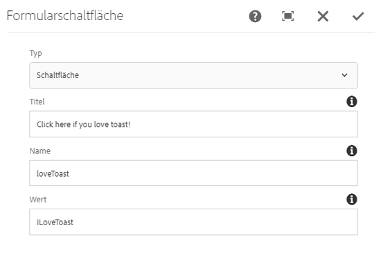

# Formularschaltflächen-Komponente (v1){#form-button-component-v}

Die Kernkomponente „Formularschaltflächen-Komponente“ ermöglicht die Einbeziehung eines Schaltflächenfelds in ein Formular, um eine Aktion auszulösen.

## Nutzung {#usage}

Die Kernkomponente „Formularschaltflächen-Komponente“ ermöglicht die Erstellung von Schaltflächenfeldern, die häufig dazu dienen, die Übermittlung des Formulars auszulösen, und zusammen mit der [Formularcontainer-Komponente](form-container.md). verwendet werden sollen

Die Schaltflächeneigenschaften können vom Inhaltseditor im [Dialogfeld „Konfigurieren“](form-button-v1.md#main-pars_title) definiert werden.

## Version und Kompatibilität {#version-and-compatibility}

In diesem Dokument wird die v1 der Formularschaltflächen-Komponente beschrieben, die ursprünglich mit Version 1.0.0 der Kernkomponenten mit AEM 6.3 eingeführt wurde.

In der folgenden Tabelle ist die Kompatibilität von v1 der Formularschaltflächen-Komponente aufgeführt.

| AEM-Version | Formularschaltflächen-Komponente v1 |
|--- |--- |
| 6.3 | Kompatibel |
| 6.4 | Kompatibel |

>[!CAUTION]
>
>In diesem Dokument wird v1 der Formularschaltflächen-Komponente beschrieben.
>
>Weitere Informationen zur aktuellen Version der Formularschaltflächen-Komponente finden Sie im Dokument [Formularschaltflächen-Komponente](form-button.md).

## Musterkomponentenausgabe {#sample-component-output}

Im Folgenden finden Sie ein Beispiel von [We.Retail](https://helpx.adobe.com/experience-manager/6-4/sites/developing/using/we-retail.html).

### Screenshot {#screenshot}


### HTML {#html}

```
<div class="cmp cmp-button aem-GridColumn aem-GridColumn--default--12">
    <div class="cmp cmp-button">
        <button type="BUTTON" class="btn btn-action btn-primary" name="loveToast" value="ILoveToast">
            Click here if you love toast!
        </button>
    </div>
</div>
```

### JSON {#json}

```
"container": {
              "columnClassNames": "aem-GridColumn aem-GridColumn--default--12",
              "columnCount": 12,
              "gridClassNames": "aem-Grid aem-Grid--12 aem-Grid--default--12",
              ":items": {
                "button": {
                  "columnClassNames": "aem-GridColumn aem-GridColumn--default--12",
                  ":type": "weretail/components/form/button",
                  "name": "loveToast",
                  "jcr:title": "Click here if you love toast!",
                  "type": "submit",
                  "value": "ILoveToast"
                }
              },
              ":itemsOrder": [
                "button"
              ],
              ":type": "weretail/components/form/container"
            }
```

>[!NOTE]
>
>Für JSON-Exporte aus den Kernkomponenten ist Version 1.1.0 der Kernkomponenten erforderlich. Weitere Informationen finden Sie in den [Kompatibilitätsinformationen für Kernkomponenten v1](versions.md#main-pars_title_236368006).

## Dialogfeld „Konfigurieren“ {#configure-dialog}

Über das Dialogfeld „Konfigurieren“ kann der Inhaltsautor die Parameter der Schaltfläche definieren.



* **Typ**
   * **Schaltfläche**
   * **Absenden**

* **Titel** - Der auf der Schaltfläche angezeigte Text
   * Wenn kein Wert angegeben ist, erscheint standardmäßig der Schaltflächentyp

* **Name** - Der Name der Schaltfläche, der mit den Formulardaten übermittelt wird.
* **Wert** - Der Wert der Schaltfläche, der mit den Formulardaten übermittelt wird.

## Dialogfeld „Design“ {#design-dialog}

Es gibt kein Dialogfeld „Design“ für die Formularschaltflächen-Komponente.

## Technische Details {#technical-details}

Die aktuelle technische Dokumentation zur Form Button-Komponente [finden Sie auf GitHub](https://github.com/adobe/aem-core-wcm-components/tree/master/content/src/content/jcr_root/apps/core/wcm/components/form/button/v1/button).

Das gesamte Kernkomponentenprojekt kann von GitHub heruntergeladen werden.

Weitere Informationen zur Entwicklung von Kernkomponenten finden Sie in der [Dokumentation von Kernkomponenten für Entwickler](developing.md).
