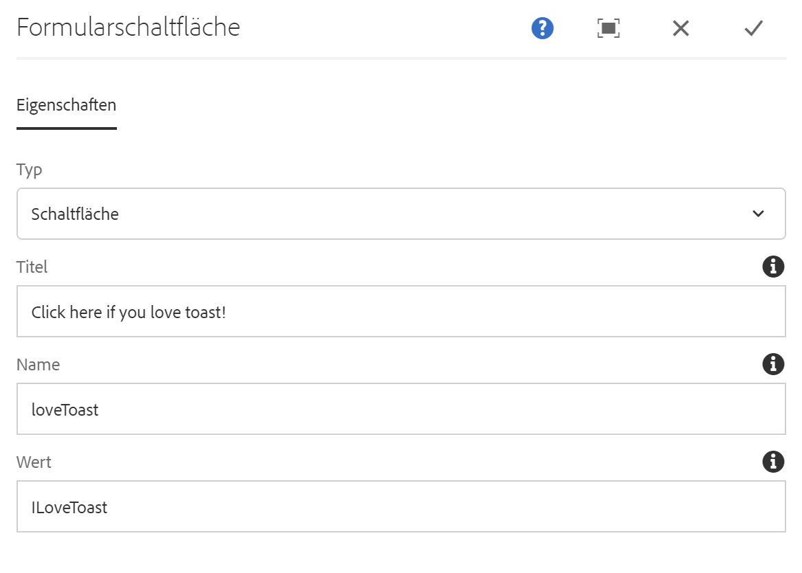

# Formularschaltflächenkomponente{#form-button-component}

Die Schaltfläche &quot;Core-Komponenten-Formular&quot; ermöglicht die Einbeziehung einer Schaltfläche zum Auslösen einer Aktion auf einer Seite.

## Nutzung {#usage}

Die Komponente &quot;Core-Komponenten-Formular&quot; ermöglicht die Erstellung von Schaltflächenfeldern, die häufig die Übermittlung des Formulars auslösen und zusammen mit der [Formularcontainer-Komponente verwendet werden sollen](form-container.md).

Die Schaltflächeneigenschaften können vom Content-Editor im Dialogfeld [&quot;Konfigurieren&quot; definiert](form-button.md)werden.

## Version und Kompatibilität {#version-and-compatibility}

Die aktuelle Version der Formularschaltflächenkomponente ist v 2, die mit Version 2.0.0 der Kernkomponenten im Januar 2018 eingeführt wurde und in diesem Dokument beschrieben wird.

Die folgende Tabelle enthält alle unterstützten Versionen der Komponente, die AEM-Versionen, mit denen die Versionen der Komponente kompatibel sind, sowie Links zur Dokumentation für frühere Versionen.

| Komponentenversion | AEM 6.3 | AEM 6.4 | AEM 6.5 |
|--- |--- |--- |--- |
| v2 | Kompatibel | Kompatibel | Kompatibel |
| [v1](form-button-v1.md) | Kompatibel | Kompatibel | Kompatibel |

Weitere Informationen zu Core-Komponentenversionen und -versionen finden Sie in den Core [-Komponentenversionen](versions.md).

## Musterkomponentenausgabe {#sample-component-output}

Nachfolgend finden Sie ein Beispiel aus [We. Retail](https://helpx.adobe.com/experience-manager/6-5/sites/developing/using/we-retail.html).

### Screenshot {#screenshot}


### HTML {#html}

```
<div class="container responsivegrid aem-GridColumn aem-GridColumn--default--12">
<form method="POST" action="/content/we-retail/us/en/experience.html" id="new_form" name="new_form" enctype="multipart/form-data" class="cmp-form aem-Grid aem-Grid--12 aem-Grid--default--12">
    <input type="hidden" name=":formstart" value="/content/we-retail/us/en/experience/jcr:content/root/responsivegrid/container">
    
    <div class="button aem-GridColumn aem-GridColumn--default--12">
<button type="BUTTON" class="cmp-form-button" name="loveToast" value="ILoveToast">Click here if you love toast!</button>
</div>

</form>
</div>
```

### JSON {#json}

```
"button":{  
                           "columnClassNames":"aem-GridColumn aem-GridColumn--default--12",
                           ":type":"core/wcm/sandbox/components/form/button/v2/button",
                           "name":"loveToast",
                           "jcr:title":"Click here if you love toast!",
                           "type":"button",
                           "value":"ILoveToast"
                        }
```

### Technische Details {#technical-details}

Die aktuelle technische Dokumentation zur Formularschaltfläche-Komponente [finden Sie unter github](https://github.com/adobe/aem-core-wcm-components/blob/master/content/src/content/jcr_root/apps/core/wcm/components/form/button/v2/button).

Weitere Informationen zur Entwicklung Kernkomponenten finden Sie in der [Dokumentation zu Kernkomponenten für Komponenten](developing.md).

## Dialogfeld konfigurieren {#configure-dialog}

Über das Dialogfeld &quot;Konfigurieren&quot; kann der Inhaltsautor die Parameter der Schaltfläche definieren.

### Registerkarte &quot;Eigenschaften « {#properties-tab}



* **Typ**

   * **Schaltfläche**
   * **Absenden**

* **Titel** - Der auf der Schaltfläche angezeigte Text

   * Wenn kein Wert angegeben ist, wird standardmäßig der Schaltflächentyp

* **Name** - Der Name der Schaltfläche, die mit den Formulardaten gesendet wird
* **Wert** - Der Wert der Schaltfläche, der mit den Formulardaten gesendet wird

## Design-Dialogfeld {#design-dialog}

### Stile Registerkarte {#styles-tab}

Die Komponente &quot;Formular-Schaltfläche&quot; unterstützt das AEM [-Stilsystem](authoring.md#component-styling).