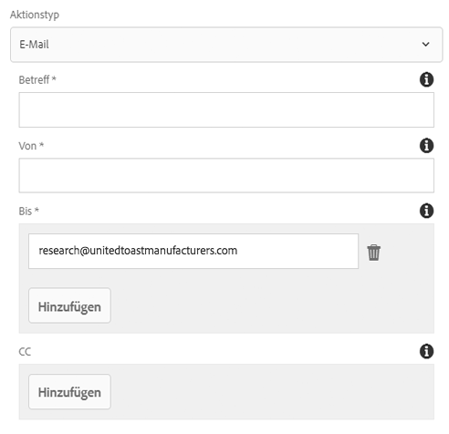
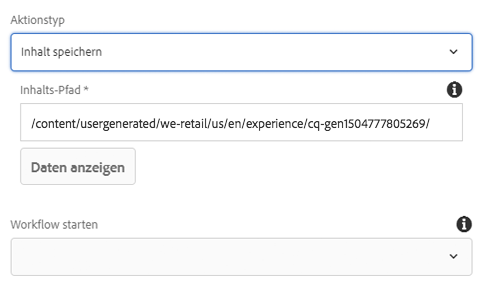
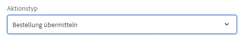
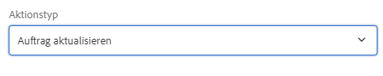
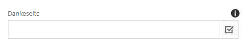

# Formularcontainer-Komponente (v 1){#form-container-component-v}

Die Container-Komponente Core Component Form (Core Component Form Container Component) ermöglicht die Erstellung einfacher Übermittlungsformulare.

## Nutzung {#usage}

Die Formularcontainer-Komponente hat die Erstellung einfacher Informationsübermittlungsformulare und -funktionen aktiviert, indem einfache WCM-Formulare unterstützt und eine verschachtelte Struktur verwendet wurde, um zusätzliche Formularkomponenten zuzulassen.

Mithilfe des [Dialogfeldes für die Einstellung](form-container-v1.md#main-pars_title) kann der Content-Editor definieren, welche Art von Aktionsformularübermittlung ausgelöst wird, wo der gesendete Inhalt gespeichert werden soll und ob ein Workflow ausgelöst werden soll. Der Vorlagenautor kann das [Design-Dialogfeld](form-container-v1.md#main-pars_title_1995166862) verwenden, um die zulässigen Komponenten und deren Zuordnungen ähnlich dem Design-Dialogfeld für den [Standard-Layout-Container im Vorlageneditor zu definieren](https://helpx.adobe.com/experience-manager/6-4/sites/authoring/using/templates.html#main-pars_title_1754153843).

## Version und Kompatibilität {#version-and-compatibility}

In diesem Dokument wird die Version 1 der Formularcontainer-Komponente beschrieben, die ursprünglich mit Version 1.0.0 der Kernkomponenten mit AEM 6.3 eingeführt wurde.

In der folgenden Tabelle ist die Kompatibilität von v 1 der Formular-Container-Komponente aufgeführt.

| AEM-Version | Form Container Component v 1 |
|--- |--- |
| 6.3 | Kompatibel |
| 6.4 | Kompatibel |

>[!CAUTION]
>
>In diesem Dokument wird v 1 der Formular-Container-Komponente beschrieben.
>
>Weitere Informationen zur aktuellen Version der Formular-Container-Komponente finden Sie im [Dokument Container Container Component](form-container.md) .

## Dialogfeld &quot;Einstellungen « {#settings-dialog}

Über das Dialogfeld &quot;Einstellungen&quot; können Sie festlegen, welche Aktionen beim Senden der Komponente durchgeführt werden.

Je nach ausgewähltem Aktionstyp **** werden die verfügbaren Optionen im Container geändert. Die verfügbaren Aktionstypen sind:

* [E-Mail](form-container-v1.md#main-pars_title_966511656)
* [Inhalt speichern](form-container-v1.md#main-pars_title_2065985840)
* [Bestellung absenden](form-container-v1.md#main-pars_title_686874527)
* [Auftrag aktualisieren](form-container-v1.md#main-pars_title_410109286)

Unabhängig vom Typ gibt es [allgemeine Einstellungen](form-container-v1.md#main-pars_title_375403046) , die für jede Aktion gelten.

### E-Mail {#mail}

Wenn das Formular gesendet wird, sendet der E-Mail-Aktionstyp eine E-Mail an bestimmte Empfänger.

* **Betreff** : Betreffbetreff der E-Email, die beim Senden des Formulars gesendet wird
* **Von** - der E-Email-Adresse der E-Email, die beim Senden des Formulars gesendet wird
* **An** - Die Adressen der Empfänger, die eine E-Email bei der Formularübermittlung erhalten
   * Tippen oder klicken Sie auf **die Schaltfläche Hinzufügen** , um weitere Adressen hinzuzufügen.
   * Tippen oder klicken Sie auf **die Schaltfläche Löschen** , um eine E-Email-Adresse zu entfernen.
* **CC** - Die Adressen der Empfänger, die eine &quot;carbon&quot; -Kopie empfangen, die beim Senden des Formulars gesendet wird
   * Tippen oder klicken Sie auf **die Schaltfläche Hinzufügen** , um weitere Adressen hinzuzufügen.
   * Tippen oder klicken Sie auf **die Schaltfläche Löschen** , um eine E-Email-Adresse zu entfernen.

### Inhalt speichern {#store-content}

Wenn das Formular gesendet wird, wird der Inhalt des Formulars in einem bestimmten Repository gespeichert.

* **Content Path** - Inhalts-Repository-Pfad, in dem gesendete Inhalte gespeichert werden
* **Daten anzeigen** - Tippen oder klicken Sie, um gespeicherte gesendete Daten als JSON anzuzeigen.
* **Workflow starten** - Konfigurieren Sie, um einen Workflow mit dem gespeicherten Inhalt als Nutzlast bei Formularübermittlung zu starten.

### Bestellung absenden {#submit-order}

Wenn das Formular gesendet wird, wird die Bestellung gesendet.

### Auftrag aktualisieren {#update-order}

Wenn das Formular gesendet wird, wird die Bestellung aktualisiert.

### Allgemeine Einstellungen {#general-settings}

Unabhängig vom ausgewählten Aktionstyp kann eine Dankeseite immer definiert werden.

Der Benutzer wird nach Abschluss der Formularübermittlung zur angegebenen Seite weitergeleitet.

* Verwenden Sie das Auswahldialogfeld, um eine Ressource in AEM auszuwählen.
* Wenn die Dankeseite nicht in AEM angegeben ist, geben Sie die absolute URL an. Nicht absolute urls werden relativ zu AEM interpretiert.
* Lassen Sie sich leer, um das Formular nach der Übermittlung erneut anzuzeigen.

## Design-Dialogfeld {#design-dialog}

Im Entwurfsdialogfeld kann der Vorlagenautor die zulässigen Komponenten und deren Zuordnungen für den Container, der dem Design-Dialogfeld des [Vorlageneditors](https://helpx.adobe.com/experience-manager/6-4/sites/authoring/using/templates.html#main-pars_title_1754153843)ähnelt, definieren.

## Technische Details {#technical-details}

Die aktuelle technische Dokumentation zur Formularcontainer-Komponente [finden Sie unter github](https://github.com/adobe/aem-core-wcm-components/tree/master/content/src/content/jcr_root/apps/core/wcm/components/form/container/v1/container).

Das gesamte Kernkomponentenprojekt kann von github heruntergeladen werden.

Weitere Informationen zur Entwicklung Kernkomponenten finden Sie in der [Dokumentation zu Kernkomponenten für Komponenten](developing.md).
