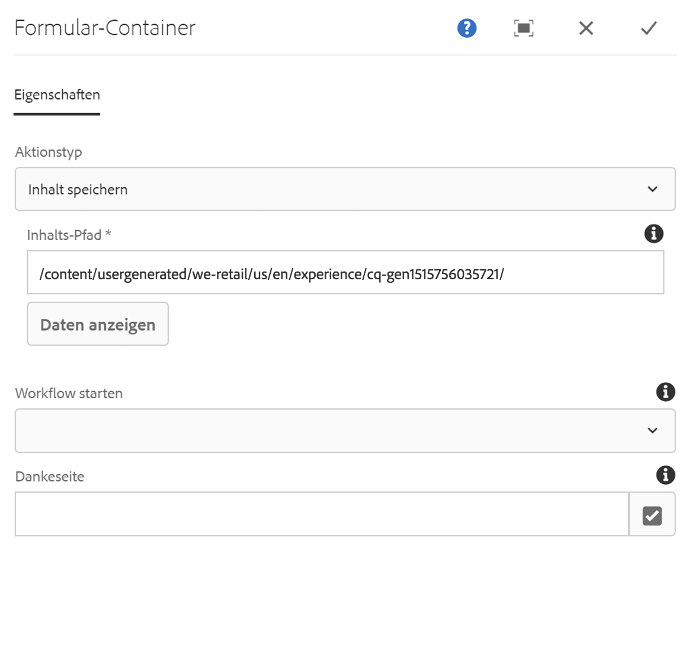
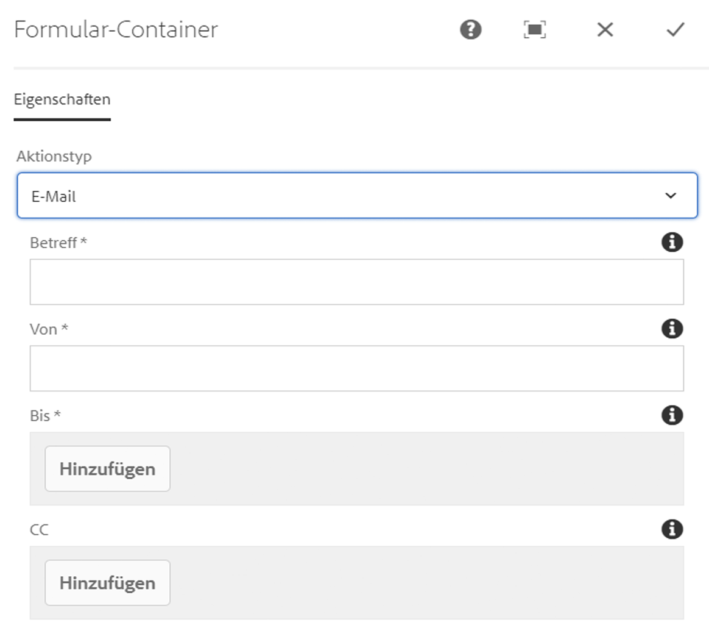

# Formularcontainer-Komponente{#form-container-component}

Die Container-Komponente Core Component Form (Core Component Form Container Component) ermöglicht die Erstellung einfacher Übermittlungsformulare.

## Nutzung {#usage}

Die Container-Container-Komponente ermöglicht das Erstellen einfacher Informationsübermittlungsformulare und -funktionen, indem einfache WCM-Formulare unterstützt und eine verschachtelte Struktur verwendet wird, um zusätzliche Formularkomponenten zuzulassen.

Mithilfe des [Konfigurationsdialogfelds](#configure-dialog) kann der Content Editor die durch die Formularübermittlung ausgelöste Aktion definieren, wo der gesendete Inhalt gespeichert werden soll und ob ein Workflow ausgelöst werden soll. Der Vorlagenautor kann das [Design-Dialogfeld](#design-dialog) verwenden, um die zulässigen Komponenten und deren Zuordnungen ähnlich dem Design-Dialogfeld für den [Standard-Layout-Container im Vorlageneditor zu definieren](https://helpx.adobe.com/experience-manager/6-5/sites/authoring/using/templates.html).

>[!NOTE]
>
>Die Core-Komponenten-Container-Komponente unterstützt nur die Verwendung von Core-Komponenten-Formularkomponenten (Schaltfläche, Text, ausgeblendet usw.). Die Verwendung [von Foundation-Komponenten](https://helpx.adobe.com/experience-manager/6-5/sites/authoring/using/default-components-foundation.html) -Formularkomponenten innerhalb des Core-Komponenten-Formularcontainers (und umgekehrt) wird nicht unterstützt.

## Version und Kompatibilität {#version-and-compatibility}

Die aktuelle Version der Formular-Container-Komponente ist v 2, die mit Version 2.0.0 der Kernkomponenten im Januar 2018 eingeführt wurde und in diesem Dokument beschrieben wird.

Die folgende Tabelle enthält alle unterstützten Versionen der Komponente, die AEM-Versionen, mit denen die Versionen der Komponente kompatibel sind, sowie Links zur Dokumentation für frühere Versionen.

| Komponentenversion | AEM 6.3 | AEM 6.4 | AEM 6.5 |
|--- |--- |--- |--- |
| v2 | Kompatibel | Kompatibel | Kompatibel |
| [v1](form-container-v1.md) | Kompatibel | Kompatibel | Kompatibel |

Weitere Informationen zu Core-Komponentenversionen und -versionen finden Sie in den Core [-Komponentenversionen](versions.md).

## Technische Details {#technical-details}

Die aktuelle technische Dokumentation zur Formularcontainer-Komponente [finden Sie unter github](https://github.com/adobe/aem-core-wcm-components/blob/master/content/src/content/jcr_root/apps/core/wcm/components/form/container/v2/container).

Weitere Informationen zur Entwicklung Kernkomponenten finden Sie in der [Dokumentation zu Kernkomponenten für Komponenten](developing.md).

## Dialogfeld konfigurieren {#configure-dialog}

Über das Dialogfeld &quot;Konfigurieren&quot; können Sie festlegen, welche Aktionen beim Senden der Komponente durchgeführt werden.

Je nach ausgewähltem Aktionstyp **** werden die verfügbaren Optionen im Container geändert. Die verfügbaren Aktionstypen sind:

* [E-Mail](#mail)
* [Inhalt speichern](#store-content)
* [Bestellung absenden](#submit-order)
* [Auftrag aktualisieren](#update-order)

Unabhängig vom Typ gibt es [allgemeine Einstellungen](#general-settings) , die für jede Aktion gelten.

### E-Mail {#mail}

Wenn das Formular gesendet wird, sendet der E-Mail-Aktionstyp eine E-Mail an bestimmte Empfänger.

* **Betreff**der E-Email,
die beim Senden des Formulars gesendet wird
* **Von**
der E-Email-Adresse der E-Email, die beim Senden des Formulars gesendet wird
* **An**
die Adressen der Empfänger, die eine E-Email bei der Formularübermittlung erhalten

   * Tippen oder klicken Sie auf **die Schaltfläche Hinzufügen** , um weitere Adressen hinzuzufügen.
   * Tippen oder klicken Sie auf **die Schaltfläche Löschen** , um eine E-Email-Adresse zu entfernen.
* **CC**
Die Adressen der Empfänger, die eine &quot;Carbon&quot; -Kopie erhalten, die beim Senden des Formulars gesendet wird
   * Tippen oder klicken Sie auf **die Schaltfläche Hinzufügen** , um weitere Adressen hinzuzufügen.
   * Tippen oder klicken Sie auf **die Schaltfläche Löschen** , um eine E-Email-Adresse zu entfernen.

### Inhalt speichern {#store-content}

Wenn das Formular gesendet wird, wird der Inhalt des Formulars in einem bestimmten Repository gespeichert.

* **Content Path**
Content Content Repository path, wo gesendete Inhalte gespeichert werden
* **Daten**
anzeigen oder Klicken, um gespeicherte gesendete Daten als JSON anzuzeigen
* **Workflow starten**,
um einen Workflow mit dem gespeicherten Inhalt als Nutzlast bei Formularübermittlung zu starten

### Bestellung absenden {#submit-order}

Wenn das Formular gesendet wird, wird die Bestellung gesendet.

### Auftrag aktualisieren {#update-order}

Wenn das Formular gesendet wird, wird die Bestellung aktualisiert.

### Allgemeine Einstellungen {#general-settings}

Unabhängig vom ausgewählten Aktionstyp kann eine Dankeseite immer definiert werden.

Der Benutzer wird nach Abschluss der Formularübermittlung zur angegebenen Seite weitergeleitet.

* Verwenden Sie das Auswahldialogfeld, um eine Ressource in AEM auszuwählen.
* Wenn die Dankeseite nicht in AEM angegeben ist, geben Sie die absolute URL an. Nicht absolute urls werden relativ zu AEM interpretiert.
* Lassen Sie sich leer, um das Formular nach der Übermittlung erneut anzuzeigen.

## Design-Dialogfeld {#design-dialog}

Im Entwurfsdialogfeld kann der Vorlagenautor die zulässigen Komponenten und deren Zuordnungen für den Container, der dem Design-Dialogfeld des [Vorlageneditors](https://helpx.adobe.com/experience-manager/6-5/sites/authoring/using/templates.html)ähnelt, definieren.