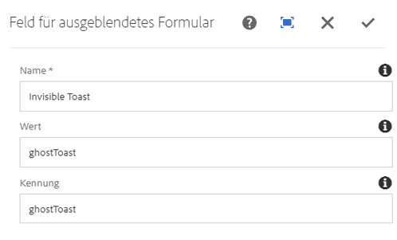

# Komponente &quot;Ausgeblendete Formulare&quot; (v 1){#form-hidden-component-v}

Die Komponente &quot;Core-Komponente-Formular ausgeblendet&quot; ermöglicht die Anzeige eines unsichtbaren Felds.

## Nutzung {#usage}

Die Komponente &quot;Core Component Form Hidden&quot; (Ausgeblendete Komponenten) ermöglicht die Erstellung ausgeblendeter Felder, um Informationen über die aktuelle Seite zurück an AEM zurückzusenden. Sie soll zusammen mit der [Formularcontainerkomponente verwendet](form-container.md)werden.

Die Feldeigenschaften können vom Content-Editor im Dialogfeld [&quot;Konfigurieren&quot; definiert](#configure-dialog)werden.

## Version und Kompatibilität {#version-and-compatibility}

In diesem Dokument wird die Version 1 der Komponente Ausgeblendete Formulare beschrieben, die ursprünglich mit Version 1.0.0 der Kernkomponenten mit AEM 6.3 eingeführt wurde.

In der folgenden Tabelle ist die Kompatibilität von v 1 der Komponente &quot;Ausgeblendete Formulare&quot; aufgeführt.

| AEM-Version | Ausgeblendete Komponente &quot;Formular ausgeblendet&quot; v 1 |
|--- |--- |
| 6.3 | Kompatibel |
| 6.4 | Kompatibel |

>[!CAUTION]
>
>In diesem Dokument wird Version 1 der Komponente &quot;Ausgeblendete Formulare&quot; beschrieben.
>
>Weitere Informationen zur aktuellen Version der Formular-ausgeblendeten Komponente finden Sie [im Dokument &quot;Formular](form-hidden.md) ausgeblendet&quot; .

## Musterkomponentenausgabe {#sample-component-output}

Nachfolgend finden Sie ein Beispiel aus [We. Retail](https://helpx.adobe.com/experience-manager/6-4/sites/developing/using/we-retail.html).

### HTML {#html}

```
<div class="cmp cmp-form aem-GridColumn aem-GridColumn--default--12">
 <form method="POST" action="/content/we-retail/us/en/experience.html" id="new_form" name="new_form" enctype="multipart/form-data" class="aem-Grid aem-Grid--12 aem-Grid--default--12 ">
  <input type="hidden" name=":formstart" value="/content/we-retail/us/en/experience/jcr:content/root/responsivegrid/container">
   <div class="visible aem-GridColumn aem-GridColumn--default--12">
    <input type="hidden" id="ghostToast" name="Invisible Toast" value="ghostToast">
   </div>
 </form>
</div>
```

### JSON {#json}

```
"container": {
              "columnClassNames": "aem-GridColumn aem-GridColumn--default--12",
              "columnCount": 12,
              "gridClassNames": "aem-Grid aem-Grid--12 aem-Grid--default--12",
              ":items": {
                "hidden": {
                  "columnClassNames": "aem-GridColumn aem-GridColumn--default--12",
                  ":type": "weretail/components/form/hidden",
                  "name": "Invisible Toast",
                  "id": "ghostToast",
                  "value": "ghostToast"
                }
              },
              ":itemsOrder": [
                "hidden"
              ],
              ":type": "weretail/components/form/container"
            }
```

>[!NOTE]
>
>Für JSON-Exporte aus den Core-Komponenten ist Version 1.1.0 der Kernkomponenten erforderlich. Weitere Informationen finden Sie in den [Kompatibilitätsinformationen für Kernkomponenten v 1](versions.md#release-history-and-compatibility) .

## Dialogfeld konfigurieren {#configure-dialog}

Das Dialogfeld &quot;Konfigurieren&quot; ermöglicht dem Inhaltsautor die Definition der Parameter des ausgeblendeten Felds.



* **Name** : Der Name des Feldes, das mit den Formulardaten gesendet wird
* **Wert** - Der Wert des Feldes, das mit den Formulardaten gesendet wird.
* **Kennung** - Die Kennung muss eindeutig auf der Seite sein und kann verwendet werden, um Skripten an dieses Formularfeld zu binden.

## Design-Dialogfeld {#design-dialog}

Es gibt kein Design-Dialogfeld für die Komponente &quot;Formular ausgeblendet&quot; .

## Technische Details {#technical-details}

Die aktuelle technische Dokumentation zur Formular-ausgeblendeten Komponente [finden Sie unter github](https://github.com/adobe/aem-core-wcm-components/tree/master/content/src/content/jcr_root/apps/core/wcm/components/form/hidden/v1/hidden).

Das gesamte Kernkomponentenprojekt kann von github heruntergeladen werden.

Weitere Informationen zur Entwicklung Kernkomponenten finden Sie in der [Dokumentation zu Kernkomponenten für Komponenten](developing.md).
