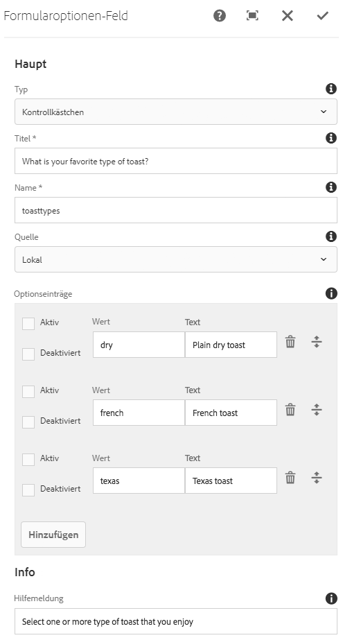

# Komponente &quot;Formularoptionen&quot; (v 1){#form-options-component-v}

Die Komponente &quot;Core-Komponenten-Formularformulare&quot; ermöglicht die Auswahl aus vordefinierten Optionen in verschiedenen Formaten.

## Nutzung {#usage}

Die Komponente &quot;Core-Komponenten-Formularoptionen&quot; ermöglicht die Übermittlung verschiedener Arten von Optionen, die auf vielerlei Arten präsentiert werden und sollen zusammen mit der [Formularcontainerkomponente verwendet](form-container.md)werden.

Die Darstellung der Optionen, Beschriftungen und einzelnen Optionen kann vom Content Editor im Dialogfeld [&quot;Konfigurieren&quot; definiert](form-options-v1.md#main-pars_title)werden.

## Version und Kompatibilität {#version-and-compatibility}

In diesem Dokument wird die Version 1 der Komponente &quot;Formularoptionen&quot; beschrieben, die ursprünglich mit Version 1.0.0 der Kernkomponenten mit AEM 6.3 eingeführt wurde.

In der folgenden Tabelle ist die Kompatibilität von v 1 der Komponente &quot;Formularoptionen&quot; aufgeführt.

| Komponentenversion | AEM 6.3 | AEM 6.4 |
|--- |--- |--- |
| v2 | Kompatibel | Kompatibel |
| v1 | Kompatibel | Kompatibel |

>[!CAUTION]
>
>In diesem Dokument wird die Version 1 der Komponente &quot;Formularoptionen&quot; beschrieben.
>
>Weitere Informationen zur aktuellen Version der Formularoptionskomponente finden Sie im [Dokument &quot;](form-options.md) Formularoptionen&quot; .

## Musterkomponentenausgabe {#sample-component-output}

Nachfolgend finden Sie ein Beispiel aus [We. Retail](https://helpx.adobe.com/experience-manager/6-4/sites/developing/using/we-retail.html).

### Screenshot {#screenshot}


### HTML {#html}

```
<div class="cmp cmp-form aem-GridColumn aem-GridColumn--default--12">
<form method="POST" action="/content/we-retail/us/en/experience.html" id="new_form" name="new_form" enctype="multipart/form-data" class="aem-Grid aem-Grid--12 aem-Grid--default--12 ">
    <input type="hidden" name=":formstart" value="/content/we-retail/us/en/experience/jcr:content/root/responsivegrid/container">
    
    <div class="cmp cmp-options aem-GridColumn aem-GridColumn--default--12">

    <fieldset class="form-group checkbox">
        <legend>What is your favorite type of toast?</legend>
        
        <div class="checkbox-item">
            <label>
              <input type="checkbox" name="toasttypes" value="dry">
              Plain dry toast
            </label>
        </div>
<div class="checkbox-item">
            <label>
              <input type="checkbox" name="toasttypes" value="french">
              French toast
            </label>
        </div>
<div class="checkbox-item">
            <label>
              <input type="checkbox" name="toasttypes" value="texas">
              Texas toast
            </label>
        </div>

    </fieldset>
    
</div>
    
</form></div>
```

### JSON {#json}

```
"container": {
              "columnClassNames": "aem-GridColumn aem-GridColumn--default--12",
              "columnCount": 12,
              "gridClassNames": "aem-Grid aem-Grid--12 aem-Grid--default--12",
              ":items": {
                "options": {
                  "columnClassNames": "aem-GridColumn aem-GridColumn--default--12",
                  ":type": "weretail/components/form/options",
                  "name": "toastTypes",
                  "jcr:title": "What is your favorite type of toast?",
                  "source": "local",
                  "type": "checkbox"
                }
              },
              ":itemsOrder": [
                "options"
              ],
              ":type": "weretail/components/form/container"
            }
```

>[!NOTE]
>
>Für JSON-Exporte aus den Core-Komponenten ist Version 1.1.0 der Kernkomponenten erforderlich. Weitere Informationen finden Sie in den [Kompatibilitätsinformationen für Kernkomponenten v 1](versions.md#main-pars_title_236368006) .

## Dialogfeld konfigurieren {#configure-dialog}

Im Dialogfeld &quot;Konfigurieren&quot; kann der Inhaltsautor den Typ der Optionen festlegen, die angezeigt werden sollen, Beschriftungen und welche Optionen verfügbar sind.



* **Typen,**
wie die Optionen angezeigt werden

   * **Kontrollkästchen**
   * **Optionsfelder**
   * **Dropdown**
   * **Dropdown für mehrere Auswahlen**

* **Titel** - Der Titel, der als Beschriftung für die Optionen angezeigt wird
* **Name** - Der Name des mit den Formulardaten gesendeten Felds
* **Quelle** - Wo die Optionen definiert sind

   * **Lokal** - Definiert in der Komponente
      * Tippen oder klicken Sie auf **die Schaltfläche Hinzufügen** , um einen Wert hinzuzufügen, **Löschen** , um einen Wert zu entfernen.
      * **Wert** : Der Wert, der gespeichert wird, wenn diese Option beim Senden des Formulars ausgewählt wird.
      * **Text** - Die Bezeichnung für die Option, die im Formular angezeigt wird
      * **Aktiv** - Die Option wird als ausgewählt markiert, wenn das Formular geladen wird.
      * **Deaktiviert** - Die Option ist nicht auswählbar, aber trotzdem angezeigt
      * **Liste** - Eine an anderer Stelle in AEM definierte statische Liste wird für die Option verwendet
         * **Liste** - Der Pfad der statischen Liste in AEM
            * Suchen Sie mithilfe der Schaltfläche &quot;Durchsuchen&quot; die Listenressource.
      * **Datenquelle** - Eine Datenquelle wird für die Optionen verwendet.
         * **Datenquelle** - Ressourcentyp der Datenquelle
* **Hilfe-Meldung** : Ein Hinweis für den Benutzer, der in das Feld eingegeben werden kann

## Design-Dialogfeld {#design-dialog}

Es gibt kein Dialogfeld für die Formularoptionen.

## Technische Details {#technical-details}

Die aktuelle technische Dokumentation zur Formularoptionskomponente [finden Sie unter github](https://github.com/adobe/aem-core-wcm-components/tree/master/content/src/content/jcr_root/apps/core/wcm/components/form/options/v1/options).

Das gesamte Kernkomponentenprojekt kann von github heruntergeladen werden.

Weitere Informationen zur Entwicklung Kernkomponenten finden Sie in der [Dokumentation zu Kernkomponenten für Komponenten](developing.md).
