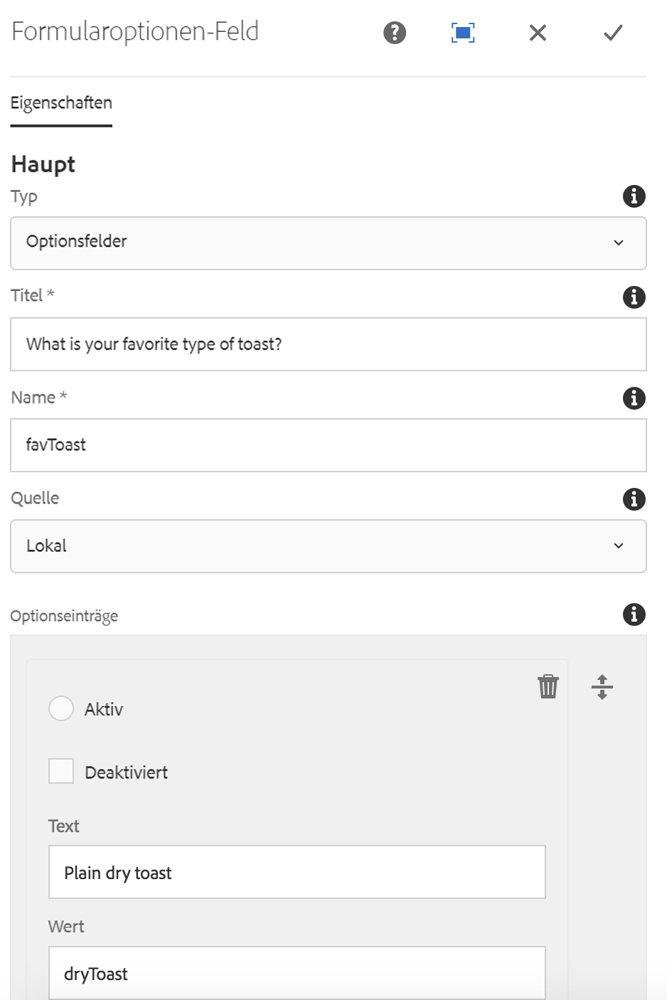

# Formularoptionen-Komponente{#form-options-component}

Die Kernkomponente „Formularoptionen“ ermöglicht die Auswahl aus vordefinierten Optionen in verschiedenen Formaten.

## Nutzung {#usage}

Die Kernkomponente „Formularoptionen-Komponente“ ermöglicht die Übermittlung verschiedener Arten von Optionen, die auf vielerlei Arten präsentiert werden und die zusammen mit der [Formularcontainer-Komponente](form-container.md) verwendet werden sollten.

Die Darstellung der Optionen, Beschriftungen und individuellen Optionen kann vom Inhaltseditor im Dialogfeld [Konfigurieren](#configure-dialog) definiert werden.

## Version und Kompatibilität {#version-and-compatibility}

Die aktuelle Version der Formularoptionen-Komponente ist v2, die mit Version 2.0.0 der Kernkomponenten im Januar 2018 eingeführt wurde und in diesem Dokument beschrieben wird.

Die folgende Tabelle enthält alle unterstützten Versionen der Komponente, die AEM-Versionen, mit denen die Versionen der Komponente kompatibel sind, sowie Links zur Dokumentation für frühere Versionen.

| Komponentenversion | AEM 6.3 | AEM 6.4 | AEM 6.5 |
|--- |--- |--- |--- |
| v2 | Kompatibel | Kompatibel | Kompatibel |
| [v1](form-options-v1.md) | Kompatibel | Kompatibel | Kompatibel |

Weitere Informationen zu Kernkomponentenversionen und -freigaben finden Sie in den [Kernkomponentenversionen](versions.md).

## Musterkomponentenausgabe {#sample-component-output}

Folgendes Beispiel wurde von [We.Retail](https://helpx.adobe.com/experience-manager/6-5/sites/developing/using/we-retail.html) übernommen.

### Screenshot {#screenshot}


### HTML {#html}

```
<form method="POST" action="/content/we-retail/us/en/experience.html" id="new_form" name="new_form" enctype="multipart/form-data" class="cmp-form aem-Grid aem-Grid--12 aem-Grid--default--12">
    <input type="hidden" name=":formstart" value="/content/we-retail/us/en/experience/jcr:content/root/responsivegrid/container">
    
    <div class="hidden aem-GridColumn aem-GridColumn--default--12">
<input type="hidden" id="form-hidden-66464844" name="hidden">

</div>
<div class="hidden aem-GridColumn aem-GridColumn--default--12">
<input type="hidden" id="form-hidden-858231075" name="hidden">

</div>
<div class="hidden aem-GridColumn aem-GridColumn--default--12">
<input type="hidden" id="form-hidden-862566768" name="hidden">

</div>
<div class="container responsivegrid aem-GridColumn aem-GridColumn--default--12">

    <input type="hidden" name=":formstart" value="/content/we-retail/us/en/experience/jcr:content/root/responsivegrid/container/container">
    
    <div class="options aem-GridColumn aem-GridColumn--default--12">

    <fieldset class="cmp-form-options">
        
            <legend class="cmp-form-options__legend">What is your favorite type of toast?</legend>
            <label class="cmp-form-options__field-label">
                <input class="cmp-form-options__field cmp-form-options__field--radio" type="radio" name="favToast" value="dryToast">
                Plain dry toast
            </label>
<label class="cmp-form-options__field-label">
                <input class="cmp-form-options__field cmp-form-options__field--radio" type="radio" name="favToast" value="frenchToast">
                French Toast
            </label>
<label class="cmp-form-options__field-label">
                <input class="cmp-form-options__field cmp-form-options__field--radio" type="radio" name="favToast" value="texasToast">
                Texas Toast
            </label>

    </fieldset>

</div>

</div></form>
```

### JSON {#json}

```
"container":{  
                           "columnClassNames":"aem-GridColumn aem-GridColumn--default--12",
                           "columnCount":12,
                           "gridClassNames":"aem-Grid aem-Grid--12 aem-Grid--default--12",
                           ":items":{  
                              "options_816658469":{  
                                 "columnClassNames":"aem-GridColumn aem-GridColumn--default--12",
                                 "id":"form-options-269951232",
                                 "title":"What is your favorite type of toast?",
                                 "name":"favToast",
                                 "type":"RADIO",
                                 "items":[  
                                    {  
                                       "value":"dryToast",
                                       "text":"Plain dry toast",
                                       "selected":false,
                                       "disabled":false
                                    },
                                    {  
                                       "value":"frenchToast",
                                       "text":"French Toast",
                                       "selected":false,
                                       "disabled":false
                                    },
                                    {  
                                       "value":"texasToast",
                                       "text":"Texas Toast",
                                       "selected":false,
                                       "disabled":false
                                    }
                                 ],
                                 ":type":"core/wcm/sandbox/components/form/options/v2/options"
                              }
                           },
                           ":itemsOrder":[  
                              "options_816658469"
                           ],
                           ":type":"core/wcm/sandbox/components/form/container/v2/container"
                        }
```

### Technische Details {#technical-details}

Die aktuelle technische Dokumentation zur Formularoptionen-Komponente [finden Sie auf GitHub](https://github.com/adobe/aem-core-wcm-components/blob/master/content/src/content/jcr_root/apps/core/wcm/components/form/options/v2/options).

Weitere Informationen zur Entwicklung von Kernkomponenten finden Sie in der [Dokumentation zu Kernkomponenten für Entwickler](developing.md).

## Dialogfeld „Konfigurieren“ {#configure-dialog}

Im Dialogfeld „Konfigurieren“ kann der Inhaltsautor den Typ der Optionen festlegen, die angezeigt werden sollen, Beschriftungen definieren und festlegen, welche Optionen verfügbar sind.



* **Typen** - Wie die Optionen angezeigt werden
   * **Kontrollkästchen**
   * **Optionsfelder**
   * **Dropdown**
   * **Dropdown für mehrere Auswahlen**
* **Titel**
Der Titel, der als Beschriftung für die Optionen angezeigt werden wird
* **Name**
Der Name des Feldes, das mit den Formulardaten übermittelt wurde.
* **Quelle**
Wo die Optionen definiert sind
   * **Lokal**
Definiert innerhalb der Komponente
      * Tippen oder klicken Sie auf die Schaltfläche **Hinzufügen**, um einen Wert hinzuzufügen, und auf **Entfernen**, um einen Wert zu entfernen.
      * **Wert**
Der Wert, der gespeichert wird, wenn diese Option beim Übermitteln des Formulars ausgewählt wird
      * **Text**
Der Beschriftung der im Formular angezeigten Option
      * **Aktiv**
Diese Option wird als ausgewählt markiert, wenn das Formular geladen wird.
      * **Deaktiviert**
Die Option ist nicht auswählbar, wird aber trotzdem angezeigt
      * **Liste**
Eine statische Liste, die anderswo in AEM definiert ist, wird für die Optionen verwendet
         * **Liste**
Der Pfad der statischen Liste in AEM
            * Verwenden Sie die Schaltfläche „Durchsuchen“, um die Listenressource zu finden.
      * **Datenquelle**
Eine Datenquelle wird für die Optionen verwendet.
         * **Datenquelle**
Ressourcentyp der Datenquelle
* **Hilfemeldung**
Ein Hinweis für den Benutzer, was in das Feld eingegeben werden kann

## Dialogfeld „Design“ {#design-dialog}

### Registerkarte „Stile“ {#styles-tab}

Die Formularoptionen-Komponente unterstützt das AEM-[Stilsystem](authoring.md#component-styling).