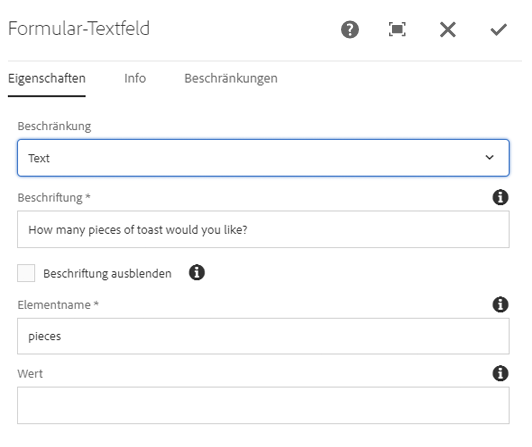
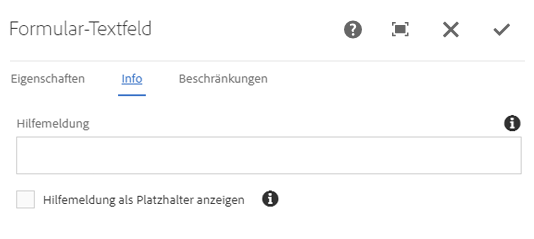
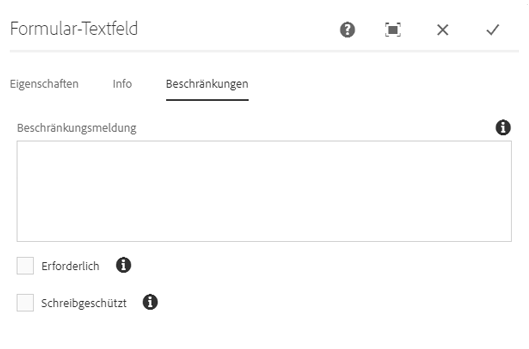

# Formulartext-Komponente (v1){#form-text-component-v}

Die Kernkomponente „Formulartext-Komponente“ ermöglicht die Eingabe von Formulartext zur Übermittlung.

## Nutzung {#usage}

Die Formulartext-Komponente ermöglicht die Übermittlung verschiedener Texttypen und sollte zusammen mit der [Formularcontainer-Komponente](form-container.md) verwendet werden.

Der Typ der Textvalidierung, Beschriftung und Hilfemeldungen kann vom Inhaltseditor im [Dialogfeld „Konfigurieren“](form-text-v1.md#main-pars_title) definiert werden.

## Version und Kompatibilität {#version-and-compatibility}

In diesem Dokument wird die Version 1 der „Formulartext-Komponente“ beschrieben, die ursprünglich mit der Version 1.0.0 der Kernkomponenten mit AEM 6.3 eingeführt wurde.

In der folgenden Tabelle ist die Kompatibilität der Version 1 der Formulartext-Komponente aufgeführt.

| AEM-Version | Formulartext-Komponente v1 |
|--- |--- |
| 6.3 | Kompatibel |
| 6.4 | Kompatibel |

>[!CAUTION]
>
>In diesem Dokument wird Version 1 der Formulartext-Komponente beschrieben.
>
>Weitere Informationen zur aktuellen Version der Formulartext-Komponente finden Sie im [Dokument Formulartext-Komponente](form-text.md).

## Musterkomponentenausgabe {#sample-component-output}

Folgendes Beispiel wurde von [We.Retail](https://helpx.adobe.com/experience-manager/6-4/sites/developing/using/we-retail.html) übernommen.

### Screenshot {#screenshot}


### HTML {#html}

```
<div class="cmp cmp-form aem-GridColumn aem-GridColumn--default--12">
 <form method="POST" action="/content/we-retail/us/en/experience.html" id="new_form" name="new_form" enctype="multipart/form-data" class="aem-Grid aem-Grid--12 aem-Grid--default--12 ">
     <input type="hidden" name=":formstart" value="/content/we-retail/us/en/experience/jcr:content/root/responsivegrid/container">
     <div class="cmp cmp-form-field aem-GridColumn aem-GridColumn--default--12">
   <div class="form-group">
       <label for="form-text-978484744">How many pieces of toast would you like?</label>
          <input type="number" id="form-text-978484744" name="pieces">
   </div>
  </div>
 </form>
</div>
```

### JSON {#json}

```
"container": {
              "columnClassNames": "aem-GridColumn aem-GridColumn--default--12",
              "columnCount": 12,
              "gridClassNames": "aem-Grid aem-Grid--12 aem-Grid--default--12",
              ":items": {
                "text": {
                  "columnClassNames": "aem-GridColumn aem-GridColumn--default--12",
                  ":type": "weretail/components/form/text",
                  "name": "piecesOfToast",
                  "jcr:title": "How many pieces of toast would you like?",
                  "type": "number",
                  "rows": "2"
                }
              },
              ":itemsOrder": [
                "text"
              ],
              ":type": "weretail/components/form/container"
            }
```

>[!NOTE]
>
>Für JSON-Exporte aus den Kernkomponenten ist Version 1.1.0 der Kernkomponenten erforderlich. Weitere Informationen finden Sie in den [Kompatibilitätsinformationen für Kernkomponenten v1](versions.md#main-pars_title_236368006).

## Dialogfeld „Konfigurieren“ {#configure-dialog}

Das Dialogfeld „Konfigurieren“ ermöglicht es dem Inhaltsautor, den Texttyp sowie Standardwerte und Beschriftungen zu definieren.

### Haupt {#main}



* **Einschränkungen** - Der Typ des einzustellenden Texts und der validiert wird mit

   * **Text**
   * **Textbereich**
   * **E-Mail**
   * **Tel**
   * **Datum**
   * **Nummer**
   * **Kennwort**

* **Textzeilen** - Anzahl der im Textbereich anzuzeigenden Zeilen (nur angezeigt, wenn **Einschränkung** auf **Textbereich** festgelegt ist).

* **Beschriftung** - Die Beschriftung, die für das Feld angezeigt wird
* **Beschriftung ausblenden** - Erforderlich, wenn die Beschriftung nur für Ein-/Ausgabehilfe erforderlich ist und keine zusätzlichen visuellen Informationen über das Feld enthält.
* **Elementname** - Der Name des mit den Formulardaten gesendeten Felds.
* **Wert** - Standardwert, der im Feld vorausgefüllt wird

### Info {#about}



* **Hilfemeldung** - Ein Hinweis für den Benutzer dahingehend, was im Feld eingegeben werden kann
* **Hilfemeldung als Platzhalter anzeigen** - Bestimmt, ob die Hilfemeldung in der Formulareingabe angezeigt wird, wenn sie leer ist und sich nicht im Fokus befindet

### Einschränkungen {#constraints}



* **Beschränkungsmeldung**

   * Meldung wird beim Senden des Formulars als QuickInfo angezeigt, wenn der Wert den ausgewählten Typ nicht validiert
   * Wird nicht für Beschränkungstypen **Text** und **Textbereich** angezeigt

* **Erforderlich** - Gibt an, ob der Benutzer einen Wert ausfüllen muss, bevor das Formular senden kann
* **Schreibgeschützt:** Wenn ausgewählt, kann der Benutzer den Wert des Felds nicht ändern

## Dialogfeld „Design“ {#design-dialog}

Es gibt kein Dialogfeld „Design“ für die Formulartext-Komponente.

## Technische Details {#technical-details}

Die aktuelle technische Dokumentation zur Formulartext-Komponente [finden Sie auf GitHub](https://github.com/adobe/aem-core-wcm-components/tree/master/content/src/content/jcr_root/apps/core/wcm/components/form/text/v1/text).

Das gesamte Kernkomponentenprojekt kann von GitHub heruntergeladen werden.

Weitere Informationen zur Entwicklung von Kernkomponenten finden Sie in der [Dokumentation zu Kernkomponenten für Entwickler](developing.md).
