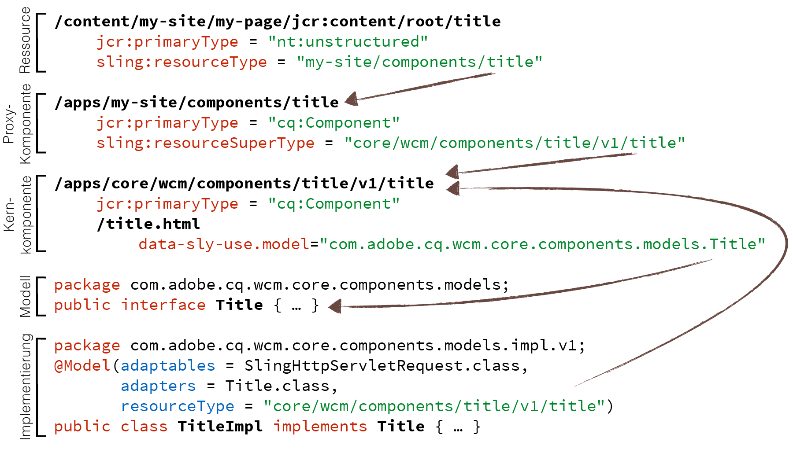
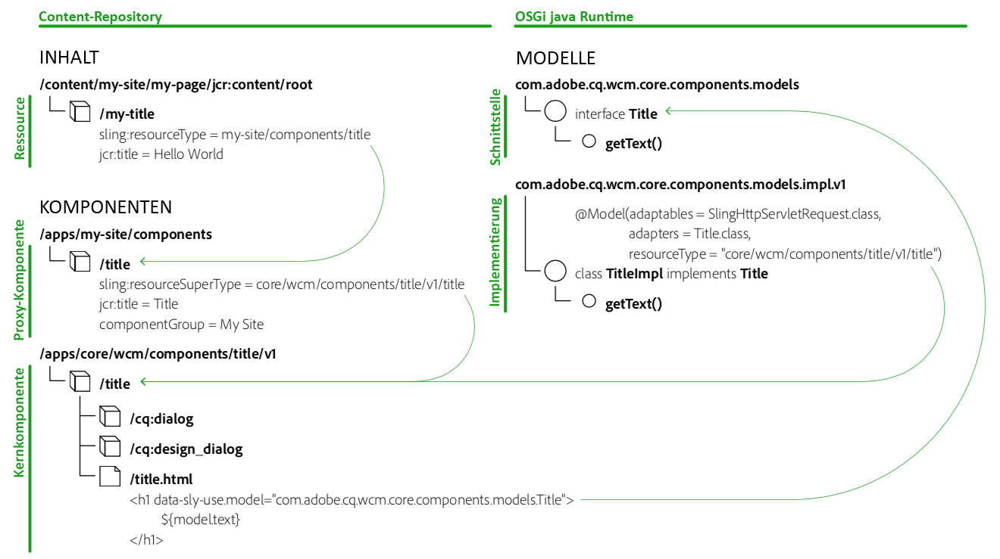

# Komponentenrichtlinien {#component-guidelines}

Die [Kernkomponenten](developing.md) folgen modernen Implementierungsmustern, die sich sehr von den Grundkomponenten unterscheiden.

Diese Seite erläutert diese Muster und wann sie Ihre eigenen bestellbaren Komponenten erstellen können. Der erste Abschnitt [&quot;Allgemeine Komponentenmuster](guidelines.md) «gilt für jede beliebige Komponente, während der zweite Abschnitt [wiederverwendbare Komponentenmuster](guidelines.md) auf Komponenten angewendet wird, die für alle Websites oder Projekte wiederverwendet werden sollen, wie z. B. Kernkomponenten.

## Allgemeine Komponentenmuster {#general-component-patterns}

Die Richtlinien in diesem Abschnitt werden für jede Art von Komponente empfohlen, unabhängig davon, ob die Komponente für ein einzelnes Projekt spezifisch ist oder ob die Komponente für die gesamte Website oder Projekte konzipiert sein soll.

### Konfigurierbare Komponenten {#configurable-components}

Komponenten können über eine Vielzahl von Optionen verfügen. Dies sollte genutzt werden, um Komponenten flexibel und konfigurierbar zu machen und die Implementierung mehrerer Komponenten, die hauptsächlich Variationen voneinander darstellen, zu vermeiden.

Wenn ein Drahtmodell oder Entwurf Variationen ähnlicher Elemente enthält, sollten diese Variationen normalerweise nicht als verschiedene Komponenten implementiert werden, sondern als eine Komponente mit Optionen zur Auswahl zwischen den Variationen.

Wenn Sie diesen Schritt weiter durchführen möchten, wenn Komponenten über mehrere Sites oder Projekte hinweg wiederverwendet werden, lesen Sie den Abschnitt [Vorkonfigurierbare Funktionen](#pre-configurable-capabilities) .

### Trennung von Bedenken {#separation-of-concerns}

Es empfiehlt sich, die Logik (oder das Modell) einer Komponente getrennt von der Markierungsvorlage (oder der Ansicht) voneinander getrennt zu halten. Es gibt mehrere Möglichkeiten, dies zu erreichen. Empfohlen wird jedoch die Verwendung [von Sling-Modellen](https://sling.apache.org/documentation/bundles/models.html) für die Logik und HTML [-Vorlagensprache](https://helpx.adobe.com/experience-manager/htl/using/overview.html) (HTL) für das Markup, wie die Kernkomponenten ebenfalls.

Sling Models sind eine Reihe von Java-Anmerkungen, um schnell auf benötigte Variablen von pojos zuzugreifen und daher eine einfache, leistungsstarke und performant-Methode zur Implementierung der Java-Logik für Komponenten bereitzustellen.

HTL wurde als sichere und einfache Vorlagensprache entwickelt, die auf AEM zugeschnitten ist. Es kann viele Formen der Logik aufrufen, was es sehr flexibel macht.

## Wiederverwendbare Komponentenmuster {#reusable-component-patterns}

Die Richtlinien in diesem Abschnitt können für jede Art von Komponente ebenfalls verwendet werden. Für Komponenten, die für die Wiederverwendung über mehrere Sites oder Projekte hinweg wiederverwendet werden sollen, wie z. B. Kernkomponenten, sind sie jedoch am sinnvollsten. Diese Richtlinien können daher für Komponenten ignoriert werden, die nur auf einer einzelnen Site oder einem einzelnen Projekt verwendet werden.

### Vorkonfigurierbare Funktionen {#pre-configurable-capabilities}

Neben dem Bearbeitungsdialogfeld, das von den Seitenverfassern verwendet wird, können Komponenten auch ein Design-Dialogfeld für Vorlagenautoren haben, um diese vorkonfigurieren zu können. Mit [dem Vorlageneditor](https://helpx.adobe.com/experience-manager/6-5/sites/authoring/using/templates.html) können Sie alle diese Vorkonfigurationen einrichten, die als &quot;Richtlinien&quot; bezeichnet werden.

Um Komponenten so wiederverwendbar wie möglich zu machen, sollten sie aussagekräftige Optionen zur Vorkonfiguration bereitstellen. Dies ermöglicht das Aktivieren oder Deaktivieren von Funktionen der Komponenten, die den spezifischen Anforderungen verschiedener Sites entsprechen.

<!-- 

Comment Type: annotation
Last Modified By: ims-author-CE1E2CE451D1F0680A490D45@AdobeID
Last Modified Date: 2017-04-17T17:49:04.584-0400

Unclear how I can add my own capability toggle (for example, if i extend a component and want to toggle that extended functionality ... )

 -->

### Proxy Component Pattern {#proxy-component-pattern}

Da jede Content-Ressource eine `sling:resourceType` Eigenschaft aufweist, die auf die Komponente verweist, um sie zu rendern, empfiehlt es sich in der Regel, diese Eigenschaften auf site-spezifische Komponenten zu verweisen, anstatt auf Komponenten zu verweisen, die von mehreren Sites gemeinsam genutzt werden. Dies bietet mehr Flexibilität und verhindert Refaktorierung von Inhalten, wenn eine Site ein anderes Verhalten für eine Komponente benötigt, da diese Anpassung dann auf der Site-spezifischen Komponente vorgenommen werden kann und sich nicht auf die anderen Sites auswirkt.

Damit die projektspezifischen Komponenten keinen Code duplizieren, sollten sie jeweils auf die freigegebene übergeordnete Komponente mit der `sling:resourceSuperType` Eigenschaft verweisen. Diese projektspezifischen Komponenten, die überwiegend auf die übergeordneten Komponenten verweisen, werden als &quot;Proxy-Komponenten&quot; bezeichnet. Proxy-Komponenten können vollständig leer sein, wenn sie die Funktionalität vollständig übernehmen oder einige Aspekte der Komponente neu definieren können.

### Komponentenversionierung {#component-versioning}

Komponenten sollten im Laufe der Zeit vollständig kompatibel sein. Manchmal sind Änderungen, die nicht kompatibel bleiben können, erforderlich. Eine Lösung für diese Gegenüberstellungsanforderungen ist die Einführung einer Komponentenversionierung durch Hinzufügen einer Nummer im Ressourcentyppfehler sowie in den voll qualifizierten Java-Klassennamen ihrer Implementierungen. Diese Versionsnummer stellt eine Hauptversion dar, die durch [semantische Versionshinweise definiert wird](https://semver.org/). Diese Versionsnummer wird nur für Änderungen erhöht, die nicht abwärtskompatibel sind.

Inkompatible Änderungen an den folgenden Komponenten von Komponenten führen zu einer neuen Version der Komponenten:

* Sling-Modelle (folgende semantische Versionierungsrichtlinien)
* HTL-Skripte und Vorlagen
* HTML Markup und CSS-Selektoren
* JSON-Darstellung
* Dialogfelder

Weitere Informationen finden Sie im [Dokument Versionierungsrichtlinien](https://github.com/adobe/aem-core-wcm-components/wiki/Versioning-Policies) in github.

Die Komponentenversionierung erstellt eine Form des Kontrakts, der für Upgrades wichtig ist, da es geklärt wird, wann etwas refaktoriert werden muss. Siehe auch die Abschnitt [Upgrade-Kompatibilität von Anpassungen](customizing.md#upgrade-compatibility-of-customizations), in der erläutert wird, welche Unterschiede verschiedene Formen von Anpassungen für eine Aktualisierung erfordern.

Um schmerzhafte Inhaltsmigration zu vermeiden, sollten Sie nicht direkt auf Komponenten mit Versionshinweisen aus Inhaltsressourcen verweisen. Als Regel des Schiebereglers darf ein `sling:resourceType` Inhalt keine Versionsnummer enthalten, oder die Aktualisierung der Komponenten erfordert, dass der Inhalt ebenfalls refaktorisiert wird. Am besten lässt sich dies vermeiden, indem Sie dem [oben beschriebenen Proxy-Komponentenmuster](#proxy-component-pattern) folgen.

### Modellschnittstellen {#model-interfaces}

Dieses Muster bezieht sich auf `data-sly-use` die Anweisung von HTL, um auf eine Java-Schnittstelle zu verweisen, während die Sling Model-Implementierung sich auch zum Ressourcentyp der Komponente registriert.

In Kombination mit dem oben beschriebenen [Proxy Component Pattern](#proxy-component-pattern) bietet diese Form der doppelten Bindung die folgenden guten Erweiterungspunkte:

1. Eine Site kann die Implementierung eines Sling Model neu definieren, indem sie sie zum Ressourcentyp der Proxy-Komponente registrieren, ohne sich über die HTL-Datei Gedanken machen zu müssen, die trotzdem auf die Schnittstelle verweisen kann.
1. Eine Site kann das HTL-Markup einer Komponente neu definieren, ohne sich überlegen zu müssen, auf welche Implementierungslogik sie verweisen sollte.

## Zusammenführen {#putting-it-all-together}

Im Folgenden finden Sie eine Übersicht über die gesamte Ressourcentyp-Bindungsstruktur, die sich auf die Titel-Core-Komponente bezieht. Es zeigt, wie eine site-spezifische Proxy-Komponente die Versionierung der Komponenten auflösen lässt, um zu vermeiden, dass die Inhaltsressource eine Versionsnummer enthält. Anschließend wird gezeigt, wie die `title.html`[HTL](https://helpx.adobe.com/experience-manager/htl/using/overview.html) -Datei der Komponente für die Modellschnittstelle verwendet wird, während die Implementierung an die spezifische Version der Komponente über [Sling Model](https://sling.apache.org/documentation/bundles/models.html) -Anmerkungen gebunden wird.

Im Folgenden finden Sie eine weitere Übersicht, die die Details der Implementierung nicht anzeigt, aber zeigt, wie die zugehörigen [Vorlagen und Richtlinien](https://helpx.adobe.com/experience-manager/6-5/sites/developing/using/page-templates-editable.html) referenziert werden.

Die `cq:allowedTemplates` Eigenschaft gibt an, welche Vorlagen für eine Site verwendet werden können, und die `cq:template` Meldung für jede Seite, die die zugehörige Vorlage ist. Jede Vorlage erfolgt aus den folgenden drei Teilen:

* **Struktur**
Enthält die Ressourcen, die auf jeder Seite erzwungen werden sollen, sodass der Seitenautor nicht gelöscht werden kann, z. B. die Kopf- und Fußzeilenkomponenten der Seite.
* **Initial**
Enthält den anfänglichen Inhalt, der beim Erstellen auf die Seite dupliziert wird.
* **Richtlinien**
Enthält für jede Komponente die Zuordnung zu einer Richtlinie, die die Vorkonfiguration der Komponente ist. Diese Zuordnung ermöglicht die Wiederverwendung von Richtlinien über Vorlagen hinweg und somit zentral verwaltet.

**Lesen Sie als Nächstes:**

* [Verwenden Kernkomponenten](using.md) - rufen Sie die Kernkomponenten in Ihrem eigenen Projekt auf.
* [Anpassen der Kernkomponenten](customizing.md) - um zu erfahren, wie Sie die Kernkomponenten gestalten und anpassen können.
