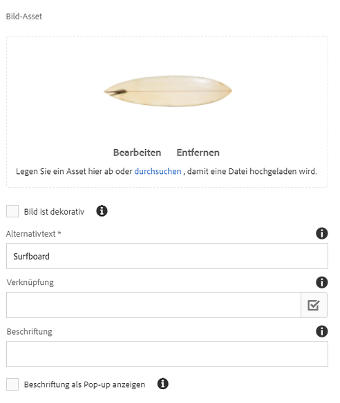
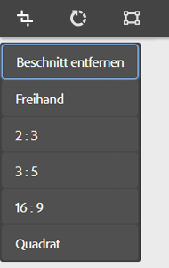
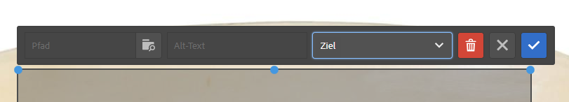
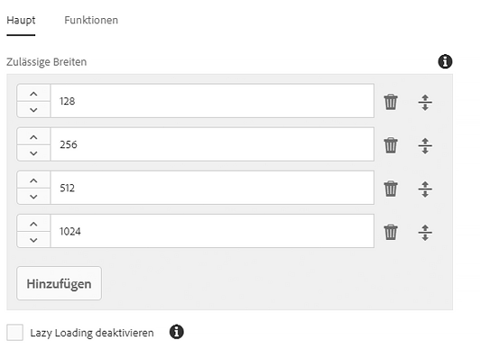
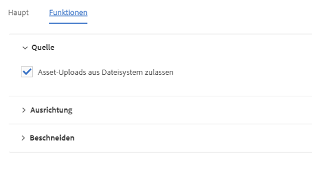
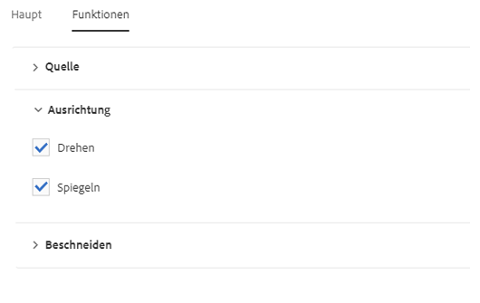
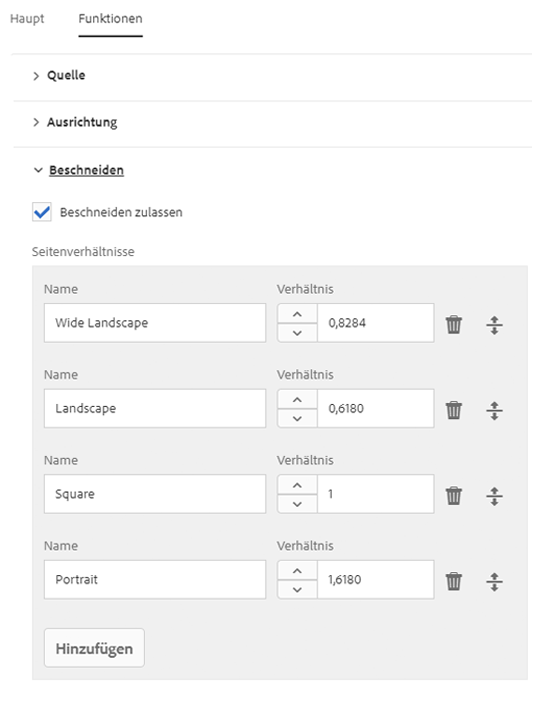

# Bildkomponente (v 1){#image-component-v}

Die Core Component Image Component ist eine Komponente für adaptive Bildkomponenten, die ersetzende Bearbeitung bietet.

## Nutzung {#usage}

Die Image-Komponente ermöglicht eine einfache Platzierung von Bild-Assets und bietet eine ersetzende Bearbeitung. Es bietet eine adaptive Bildauswahl mit verzögertem Laden sowie Beschneiden für den Inhaltsautor.

Die zulässigen Bildbreiten sowie die Beschneidung und zusätzliche Einstellungen können vom Vorlagenautor im [Designdialogfeld definiert](image-v1.md#main-pars_title_1995166862)werden. Der Content-Editor kann Assets im Dialogfeld [&quot;Konfigurieren&quot; hochladen oder auswählen](image-v1.md#main-pars_title_55926120) und das Bild im [Bearbeitungsdialogfeld](image-v1.md#main-pars_title)beschneiden. Zur einfachen Vereinfachung ist auch einfach ersetzende Änderungen des Bildes verfügbar.

## Version und Kompatibilität {#version-and-compatibility}

In diesem Dokument wird Version 1 der Image-Komponente beschrieben, die ursprünglich mit Version 1.0.0 der Kernkomponenten mit AEM 6.3 eingeführt wurde.

In der folgenden Tabelle ist die Kompatibilität von v 1 der Image-Komponente aufgeführt.

| AEM-Version | Bildkomponente v 1 |
|--- |--- |
| 6.3 | Kompatibel |
| 6.4 | Kompatibel |

>[!CAUTION]
>
>In diesem Dokument wird v 1 der Image-Komponente beschrieben.
>
>Weitere Informationen zur aktuellen Version der Image-Komponente finden Sie im [Dokument Image Component](image.md) .

## Musterkomponentenausgabe {#sample-component-output}

Nachfolgend finden Sie ein Beispiel aus [We. Retail](https://helpx.adobe.com/experience-manager/6-4/sites/developing/using/we-retail.html).

### Screenshot {#screenshot}


### HTML {#html}

```
<div class="cmp cmp-image aem-GridColumn aem-GridColumn--default--12">
 
        <noscript data-cmp-image="{&#34;smartImages&#34;:[],&#34;smartSizes&#34;:[],&#34;lazyEnabled&#34;:true}">
            
        </noscript>

</div>
```

### JSON {#json}

```
"image": {
              "columnClassNames": "aem-GridColumn aem-GridColumn--default--12",
              "smartSizes": [],
              "smartImages": [],
              "lazyEnabled": true,
              "src": "/content/we-retail/us/en/equipment/equipment/jcr%3acontent/root/responsivegrid/image.img.jpeg",
              ":type": "weretail/components/content/image"
            }
```

>[!NOTE]
>
>Für JSON-Exporte aus den Core-Komponenten ist Version 1.1.0 der Kernkomponenten erforderlich. Weitere Informationen finden Sie in den [Kompatibilitätsinformationen für Kernkomponenten v 1](versions.md#main-pars_title_236368006) .

## Dialogfeld konfigurieren {#configure-dialog}

Zusätzlich zum standardmäßigen [Dialogfeld](image-v1.md#main-pars_title) zum Bearbeiten und [Entwerfen bietet die Image](image-v1.md#main-pars_title_1995166862)-Komponente ein Dialogfeld für die Konfiguration, bei dem das Bild selbst mit der Beschreibung und den grundlegenden Eigenschaften definiert wird.



* **Bild-Asset**
   * Legen Sie ein Asset aus dem [Asset-Browser ab](https://helpx.adobe.com/experience-manager/6-3/sites/authoring/using/author-environment-tools.html#main-pars_title) oder tippen Sie auf die **Durchsuchen** -Option, um es aus einem lokalen Dateisystem hochzuladen.
   * Tippen oder klicken **Sie auf Leeren** , um das aktuell ausgewählte Bild zu deaktivieren.
   * Tippen oder klicken **Sie auf Bearbeiten** , um [die Darstellungen des Assets](https://helpx.adobe.com/experience-manager/6-3/assets/using/managing-assets-touch-ui.html#main-pars_title_19) im Asset Editor zu mange.

* **Bild ist dekorativ** : Überprüfen Sie, ob das Bild von Hilfstechnologien ignoriert werden soll, und erfordert daher keinen alternativen Text. Dies gilt nur für dekorative Bilder.
* **Alternativer Text** - Textalternative der Bedeutung oder Funktion des Bilds für Sehbehinderte.
* **Verknüpfung**
   * Verknüpfen Sie das Bild mit einer anderen Ressource.
   * Verwenden Sie das Auswahldialogfeld, um eine Verknüpfung zu einer anderen AEM-Ressource herzustellen.
   * Geben Sie die absolute URL ein, wenn Sie keine Verknüpfung zu einer AEM-Ressource erstellen. Nicht-Solute-urls werden relativ zu AEM interpretiert.

* **Beschriftung** - Zusätzliche Informationen über das Bild, die unter dem Bild angezeigt werden, sind standardmäßig verfügbar.
* **Beschriftung als Popup** anzeigen: Wenn diese Option aktiviert ist, wird die Beschriftung nicht unter dem Bild angezeigt, sondern als Popup, der von einigen Browsern angezeigt wird, wenn sie den Mauszeiger über das Bild bewegen.

## Dialogfeld bearbeiten {#edit-dialog}

Das Dialogfeld &quot;Bearbeiten&quot; ermöglicht dem Autor das Beschneiden, Ändern der Startkarte und das Zoomen des Bildes.


* Beschneiden beginnen

   

   Wenn Sie diese Option auswählen, wird eine Dropdown-Liste für vordefinierte Beschnittrahmen geöffnet.

   * Wählen Sie die Option **&quot;Frei&quot;** , um Ihren eigenen Beschneidungstext zu definieren.
   * Wählen Sie &quot;Beschneiden **entfernen** &quot; , um das ursprüngliche Asset anzuzeigen.
   Nachdem Sie eine Beschneidungsoption ausgewählt haben, verwenden Sie die blauen Griffe, um die Beschneidung auf dem Bild anzupassen.

   

* Nach rechts drehen

   

   Verwenden Sie diese Option, um das Bild um 90 ° nach rechts (im Uhrzeigersinn) zu drehen.

* Startkarte

   

   Verwenden Sie diese Option, um eine Startkarte auf das Bild anzuwenden. Wenn Sie diese Option auswählen, wird ein neues Fenster geöffnet, in dem der Benutzer die Form der Karte auswählen kann:

   * **Rechteckige Karte hinzufügen**
   * **Kreisdiagramm hinzufügen**
   * **Polygon-Map hinzufügen**

      * Standardmäßig wird eine Dreiecksmap hinzugefügt. Doppelklicken Sie auf eine Zeile der Form, um einer neuen Seite einen neuen blauen Größengriff hinzuzufügen.
   Nachdem eine Map-Form ausgewählt wurde, wird das Bild überlagert, um die Größe zu ändern. Ziehen Sie die blauen Größenänderungsgriffe per Drag &amp; Drop, um die Form anzupassen.

   

   Nachdem Sie die Startkarte gepostet haben, klicken Sie darauf, um eine schwebende Symbolleiste zu öffnen, um den Pfad des Links zu definieren.

   * **Pfad**
      * Verwenden Sie die Option Pfadauswahl, um einen Pfad in AEM auszuwählen.
      * Wenn der Pfad nicht in AEM angegeben ist, verwenden Sie die absolute URL. Nicht absolute Pfade werden relativ zu AEM interpretiert.

      * **Alternative Beschreibung**
des Pfadziels Alternative Beschreibung
      * **Target**
         * **Gleiche Registerkarte**
         * **Neue Registerkarte**
         * **Übergeordneter Frame**
         * **Top-Frame**
   Tippen oder klicken Sie auf das blaue Häkchen zum Speichern, das schwarze X zum Abbrechen und den roten Papierkorb, um die Karte zu löschen.

   

* Zoom zurücksetzen

   

   Wenn das Bild bereits gezoomt wurde, verwenden Sie diese Option, um den Zoomgrad zurückzusetzen.

* Zoom-Regler öffnen

   

   Mit dieser Option können Sie einen Schieberegler anzeigen, um den Zoomgrad des Bildes zu steuern.

   

Der ersetzende Editor kann auch zum Ändern des Bildes verwendet werden. Aufgrund von Leerzeichen sind nur einfache Optionen verfügbar. Für vollständige Bearbeitungsoptionen verwenden Sie den Vollbildmodus.


>[!NOTE]
>
>Bildbearbeitungsvorgänge (Beschneiden, Spiegeln, Drehen) werden für GIF-Bilder nicht unterstützt. Alle Änderungen, die im Bearbeitungsmodus an GIFS vorgenommen wurden, bleiben bestehen.

## Design-Dialogfeld {#design-dialog}

Das Design-Dialogfeld ermöglicht es dem Vorlagenautor, den Beschneidungs-, Upload- und Drehung-Upload des Inhalts-Autors für die Verwendung dieser Komponente vorzunehmen.

### Haupt {#main}

Auf der **Registerkarte &quot;Main&quot;** können Sie eine Liste der zulässigen Breiten in Pixel definieren, um das Bild automatisch in die gewünschte Breite aus der Liste zu laden.



Tippen oder klicken Sie auf die Schaltfläche Hinzufügen, um eine weitere Größe hinzuzufügen.

* Verwenden Sie die Griffpunkte, um die Reihenfolge der Größen neu anzuordnen.
* Verwenden Sie das Löschsymbol, um eine Breite zu entfernen.

Standardmäßig werden Bilder verzögert, bis sie sichtbar werden. Wählen Sie die Option **Verzögertes Laden** deaktivieren, um die Bilder beim Laden der Seite zu laden.

### Funktionen {#features}

Auf der **Registerkarte &quot;Funktionen** &quot; können Sie festlegen, welche Optionen den Autoren für Inhalte zur Verfügung stehen, wenn Sie die Komponente verwenden, einschließlich Optionen für Upload-Optionen, Ausrichtung und Beschneiden.

* Quelle

   

   Wählen Sie die Option **zum Hochladen von Assets aus dem Dateisystem** zulassen, damit Autoren von Inhalten Bilder von seinem lokalen Computer hochladen können. Wenn Sie erzwingen möchten, dass Autoren nur Assets aus AEM auswählen, wählen Sie diese Option aus.

* Ausrichtung

   

   * **Drehen** - Verwenden Sie diese Option, damit der Inhaltsautor die Option &quot;Rechts **drehen&quot; verwenden** kann.
   * **Verwenden Sie diese**
Option, damit der Inhaltsautor die Option &quot;Horizontal **spiegeln** «und **&quot; Vertikal** spiegeln&quot; verwenden kann.
   >[!CAUTION]
   >
   >Die **Option &quot;Spiegeln&quot;** ist standardmäßig deaktiviert. Durch Aktivieren wird im Dialogfeld &quot;Bearbeiten&quot; der Image-Komponente die **Schaltflächen&quot; Vertikal** spiegeln&quot; und **&quot;Horizontal** spiegeln&quot; angezeigt. Die Funktion wird jedoch derzeit nicht von AEM unterstützt, und die Änderungen, die mit diesen Optionen vorgenommen wurden, bleiben nicht erhalten.

<!-- 
Comment Type: remark
Last Modified By: Chris Bohnert (bohnert)
Last Modified Date: 2017-11-20T05:51:34.378-0500

<p>Added caution based on CQDOC-11457. Hid the flip options in the procedure using the <strong>Draft</strong> option so that when this feature is implemented in CQ-4221539, the <strong>Draft</strong> property can simply be removed along with the caution.</p>
-->

* Beschneiden

   

   Wählen Sie die Option **&quot;Beschneiden** zulassen&quot; aus, damit der Inhaltsautor das Bild in der Komponente im Bearbeitungsdialogfeld beschneiden kann.
   * Klicken **Sie auf Hinzufügen** , um ein vordefiniertes Beschneidungsseitenverhältnis hinzuzufügen.
   * Geben Sie einen beschreibenden Namen ein, der im **Dropdown-** Menü &quot;Beschneiden&quot; angezeigt wird.
   * Geben Sie das numerische Verhältnis des Aspekts ein.
   * Verwenden Sie die Ziehpunkte, um die Reihenfolge des Seitenverhältnisses neu anzuordnen.
   * Verwenden Sie das Papierkorbsymbol, um ein Seitenverhältnis zu löschen.
   >[!CAUTION]
   >
   >Beachten Sie, dass in AEM Seitenverhältnisse als **Höhe/Breite definiert** werden. Dies unterscheidet sich von der herkömmlichen Definition von Breite/Höhe und erfolgt aus älteren Kompatibilitätsgründen. Die Autoren des Inhalts achten auf keine Unterschiede, solange Sie einen klaren Namen des Verhältnisses angeben, da der Name in der Benutzeroberfläche angezeigt wird und nicht das Verhältnis selbst.

## Technische Details {#technical-details}

Die aktuelle technische Dokumentation zur Bildkomponente [finden Sie unter github](https://github.com/adobe/aem-core-wcm-components/tree/master/content/src/content/jcr_root/apps/core/wcm/components/image/v1/image).

Das gesamte Kernkomponentenprojekt kann von github heruntergeladen werden.

Weitere Informationen zur Entwicklung Kernkomponenten finden Sie in der [Dokumentation zu Kernkomponenten für Komponenten](developing.md).
