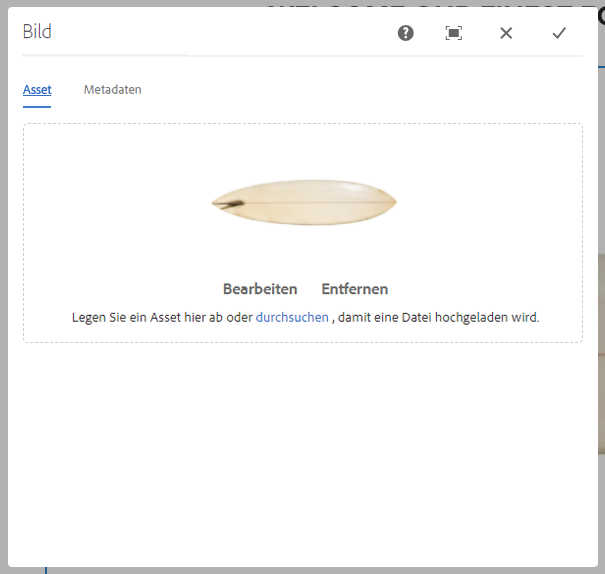
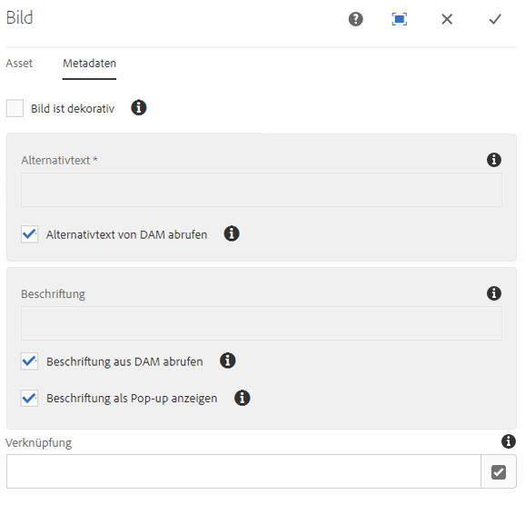
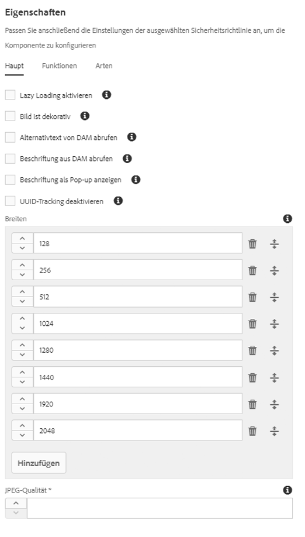

# Bildkomponente{#image-component}

Die Kernkomponente „Bildkomponente“ ist eine adaptive Bildkomponente, die eine direkte Bearbeitung ermöglicht.

## Nutzung {#usage}

Die Bildkomponente bietet adaptive Bildauswahl und reaktionsfähiges Verhalten mit verzögertem Laden für den Seitenbesucher sowie einfache Bildplatzierung und Zuschneiden für den Inhaltsautor.

Die Bildbreiten sowie die Beschneidung und zusätzliche Einstellungen können vom Vorlagenautor im [Dialogfeld „Design“](#design-dialog) definiert werden. Der Inhaltseditor kann Assets im [Dialogfeld „Konfigurieren“](#configure-dialog) hochladen oder auswählen und das Bild im [Dialogfeld „Bearbeiten“](#edit-dialog) beschneiden. Für zusätzlichen Komfort ist auch eine einfache, ersetzende Änderung des Bildes verfügbar.

## Responsive Funktionen {#responsive-features}

Die Bildkomponente verfügt über robuste responsive Funktionen, die direkt sofort bereitgestellt werden können. Auf der Seitenvorlagenebene kann das [Design-Dialogfeld](#design-dialog) verwendet werden, um die Standardbreiten des Bild-Assets zu definieren. Die Bildkomponente lädt dann automatisch die korrekte Breite, die je nach Größe des Browserfensters angezeigt wird. Wenn die Größe des Fensters geändert wird, lädt die Bildkomponente die korrekte Bildgröße dynamisch. Komponentenentwickler müssen sich keine Gedanken darüber machen, wie sie benutzerdefinierte Medienabfragen definieren, da die Bildkomponente bereits optimiert ist, um Ihren Inhalt zu laden.

Darüber hinaus unterstützt die Bildkomponente verzögertes Laden, um das Laden des tatsächlichen Bild-Assets zu verzögern, bis es im Browser sichtbar ist, wodurch die Reaktionsgeschwindigkeit Ihrer Seiten zunimmt.

## Version und Kompatibilität {#version-and-compatibility}

Die aktuelle Version der Bildkomponente ist v2, die mit Version 2.0.0 der Kernkomponenten im Januar 2018 eingeführt wurde und in diesem Dokument beschrieben wird.

Die folgende Tabelle enthält alle unterstützten Versionen der Komponente, die AEM-Versionen, mit denen die Versionen der Komponente kompatibel sind, sowie Links zur Dokumentation für frühere Versionen.

| Komponentenversion | AEM 6.3 | AEM 6.4 | AEM 6.5 |
|--- |--- |--- |--- |
| v2 | Kompatibel | Kompatibel | Kompatibel |
| [v1](image-v1.md) | Kompatibel | Kompatibel | Kompatibel |

Weitere Informationen zu Kernkomponentenversionen und -freigaben finden Sie in den [Kernkomponentenversionen](versions.md).

## SVG-Unterstützung {#svg-support}

Skalierbare Vektorgrafiken (SVG) werden von der Bildkomponente unterstützt.

* Das Drag-and-Drop eines SVG-Assets aus DAM und das Hochladen eines SVG-Datei-Uploads aus einem lokalen Dateisystem werden beide unterstützt.
* Das Adaptive Bildservlet streamt die ursprüngliche SVG-Datei (Transformationen werden übersprungen).
* Bei einem SVG-Bild werden die „Smart-Bilder“ und die „Smart-Größen“ auf ein leeres Array im Bildmodell festgelegt.

### Sicherheit {#security}

Aus Sicherheitsgründen wird die ursprüngliche SVG niemals direkt vom Bild-Editor aufgerufen. Es wird durch `` aufgerufen. Dadurch wird verhindert, dass der Browser Skripte ausführt, die in der SVG-Datei eingebettet sind.

>[!CAUTION]
>
>Für die SVG-Unterstützung ist Version 2.1.0 der Core-Komponenten oder höher zusammen mit [Service Pack 2](https://helpx.adobe.com/experience-manager/6-4/release-notes/sp-release-notes.html) für AEM 6.4 oder [Service Pack 3](https://helpx.adobe.com/experience-manager/6-3/release-notes/sp3-release-notes.html) für AEM 6.3 oder höher erforderlich, um [neue Bildbearbeitungsfunktionen](https://helpx.adobe.com/experience-manager/6-4/sites/developing/using/image-editor.html) in AEM zu unterstützen.

## Musterkomponentenausgabe {#sample-component-output}

To experience the Image Component as well as see examples of its configuration options as well as HTML and JSON output, visit the [Component Library](http://opensource.adobe.com/aem-core-wcm-components/library/image.html).

### Technische Details {#technical-details}

Die neueste technische Dokumentation zur Bildkomponente [finden Sie auf GitHub](https://github.com/adobe/aem-core-wcm-components/blob/master/content/src/content/jcr_root/apps/core/wcm/components/image/v2/image).

Weitere Informationen zur Entwicklung von Kernkomponenten finden Sie in der [Dokumentation zu Kernkomponenten für Entwickler](developing.md).

>[!NOTE]
>
>Ab Version 2.1.0 der Kernkomponenten unterstützt die Bildkomponente [schema.org-Mikrodaten](https://schema.org).

## Dialogfeld „Konfigurieren“ {#configure-dialog}

Zusätzlich zum standardmäßigen [Dialogfeld „Bearbeiten“](#edit-dialog) und zum [Dialogfeld „Design“](#design-dialog) bietet die Bildkomponente ein Dialogfeld für die Konfiguration, bei dem das Bild selbst mit seiner Beschreibung und den grundlegenden Eigenschaften definiert wird.

### Asset-Registerkarte {#asset-tab}

* **Bild-Asset**
   * Drop an asset from the [asset browser](https://helpx.adobe.com/experience-manager/6-5/sites/authoring/using/author-environment-tools.html) or tap the **browse** option to upload from a local file system.
   * Tippen oder klicken Sie auf **Löschen**, um das aktuell ausgewählte Bild zu deaktivieren.
   * Tap or click **Edit** to [mange the renditions of the asset](https://helpx.adobe.com/experience-manager/6-5/assets/using/managing-assets-touch-ui.html) in the asset editor.

### Registerkarte „Metadaten“ {#metadata-tab}

* **Bild ist dekorativ**,
Option aktivieren, wenn das Bild von Hilfstechnologien ignoriert werden soll und daher kein alternativer Text benötigt wird. Dies gilt nur für dekorative Bilder.
* **Alternativer Text**
Textalternative der Bedeutung oder Funktion des Bilds für visuell beeinträchtigte Leser.
   * Alternativen Text von DAM abrufen: Wenn die Option aktiviert ist, wird der Alternativtext des Bilds mit dem Wert der `dc:description` Metadaten in DAM gefüllt.

* **Beschriftung**
Zusätzliche Informationen über das Bild, die standardmäßig unter dem Bild angezeigt werden.
   * **Beschriftung von DAM abrufen**
Wenn die Option aktiviert ist, wird der Beschriftungstext des Bildes mit dem Wert der `dc:title` Metadaten in DAM gefüllt.
   * **Beschriftung als Pop-up anzeigen**
Wenn die Option aktiviert ist, wird die Beschriftung nicht unter dem Bild angezeigt, sondern von einigen Browsern als Pop-up, sobald der Mauszeiger über das Bild bewegt wird.

* **Verknüpfung**
   * Verknüpfen Sie das Bild mit einer anderen Ressource.
   * Verwenden Sie das Dialogfeld „Auswahl“, um eine Verknüpfung zu einer anderen AEM-Ressource herzustellen.
   * Geben Sie die absolute URL ein, wenn Sie keine Verknüpfung zu einer AEM-Ressource erstellen. Nicht absolute URLs werden als relativ zu AEM interpretiert.

## Dialogfeld „Bearbeiten“ {#edit-dialog}

Das Dialogfeld „Bearbeiten“ ermöglicht dem Inhaltsautor das Zuschneiden, Ändern der Startkarte und das Zoomen des Bildes.

* Zuschneiden beginnen

   

   Wenn Sie diese Option auswählen, wird eine Dropdown-Liste für vordefinierte Zuschneideproportionen geöffnet.

   * Wählen Sie die Option **Freihand**, um Ihre eigene Zuschnittsart zu definieren.
   * Wählen Sie **Zuschnitt entfernen**, um das ursprüngliche Asset anzuzeigen.
   Nachdem Sie eine Zuschnittoption ausgewählt haben, verwenden Sie die blauen Griffe, um die Beschneidung auf dem Bild anzupassen.

   

* Nach rechts drehen

   

   Verwenden Sie diese Option, um das Bild um 90° nach rechts (im Uhrzeigersinn) zu drehen.

* Horizontal spiegeln

   

   Verwenden Sie diese Option, um das Bild horizontal zu spiegeln oder um 180° entlang der y-Achse zu drehen.

* Vertikal spiegeln

   

   Verwenden Sie diese Option, um das Bild vertikal zu spiegeln oder um 180° entlang der x-Achse zu drehen.

* Startkarte

   >[!CAUTION]
   >
   >Die Funktion "Startkarte"erfordert Version 2.1.0 der Core-Komponenten oder höher zusammen mit [Service Pack 2](https://helpx.adobe.com/experience-manager/6-4/release-notes/sp-release-notes.html) für AEM 6.4 oder [Service Pack 3](https://helpx.adobe.com/experience-manager/6-3/release-notes/sp3-release-notes.html) für AEM 6.3 oder höher, um [neue Bildbearbeitungsfunktionen](https://helpx.adobe.com/experience-manager/6-4/sites/developing/using/image-editor.html) in AEM zu unterstützen.

   

   Verwenden Sie diese Option, um eine Startkarte auf das Bild anzuwenden. Wenn der Benutzer diese Option auswählt, wird ein neues Fenster geöffnet, in dem er die Form der Karte auswählen kann:

   * **Rechteckige Karte hinzufügen**
   * **Kreisdiagramm hinzufügen**
   * **Polygon-Karte hinzufügen**
      * Standardmäßig wird eine Dreieckskarte hinzugefügt. Doppelklicken Sie auf eine Linie der Form, um zu einer neuen Seite einen neuen blauen Griff zur Größenanpassung hinzuzufügen.
   Nachdem eine Karten-Form ausgewählt wurde, wird sie mit dem Bild überlagert, sodass die Größe geändert werden kenn. Ziehen Sie die blauen Größenänderungsgriffe per Drag-and-Drop, um die Form anzupassen.

   

   Nachdem Sie die Größe der Startkarte angepasst haben, klicken Sie darauf, um eine schwebende Symbolleiste zu öffnen, um den Pfad des Links zu definieren.

   * **Pfad**
      * Verwenden Sie die Option „Pfadwähler“, um einen Pfad in AEM auszuwählen.
      * Wenn der Pfad sich nicht in AEM befindet, verwenden Sie die absolute URL. Nicht absolute Pfade werden relativ zu AEM interpretiert.
   * **Alternativer Text**
Alternative Beschreibung des Pfadziels
   * **Target**
      * **Selbe Registerkarte**
      * **Neue Registerkarte**
      * **Übergeordneter Frame**
      * **Top-Frame**
   Tippen oder klicken Sie auf das blaue Häkchen zum Speichern, das schwarze x zum Abbrechen oder den roten Papierkorb, um die Karte zu löschen.

   

* Zoom zurücksetzen

   

   Wenn das Bild bereits gezoomt wurde, verwenden Sie diese Option, um den Zoomgrad zurückzusetzen.

* Zoom-Regler öffnen

   

   Mit dieser Option können Sie einen Schieberegler anzeigen, um den Zoomgrad des Bildes zu steuern.

   

Der Editor für die Bearbeitung im Kontext kann auch zum Ändern des Bildes verwendet werden. Aus Platzgründen sind nur einfache Optionen inline verfügbar. Für vollständige Bearbeitungsoptionen verwenden Sie den Vollbildmodus.

>[!NOTE]
>
>Bildbearbeitungsvorgänge (Beschneiden, Spiegeln, Drehen) werden für GIF-Bilder nicht unterstützt. Alle Änderungen, die im Bearbeitungsmodus an GIFs vorgenommen wurden, bleiben nicht bestehen.

## Dialogfeld „Design“ {#design-dialog}

Das Dialogfeld „Design“ ermöglicht es dem Vorlagenautor, die Beschneidungs-, Drehungs- und Upload-Optionen zu definieren, die der Inhaltsautor bei Verwendung dieser Komponente hat.

### Hauptregisterkarte {#main-tab}

Auf der Registerkarte **Main** können Sie eine Liste der Breiten in Pixel für das Bild definieren, und die Komponente lädt automatisch die passende Breite basierend auf der Browsergröße. Dies ist ein wichtiger Teil der [responsiven Funktionen](#responsive-features) der Bildkomponente.

Darüber hinaus können Sie festlegen, welche allgemeinen Komponentenoptionen automatisch aktiviert oder deaktiviert werden, wenn der Autor die Komponente zu einer Seite hinzufügt.

* **Verzögertes Laden aktivieren**
Festlegen, ob die Option für verzögertes Laden automatisch aktiviert ist, wenn die Bildkomponente zu einer Seite hinzugefügt wird.
* **Bild ist dekorativ**
Festlegen, ob die dekorative Bildoption automatisch aktiviert ist, wenn die Bildkomponente zu einer Seite hinzugefügt wird.
* **Alternativen Text aus DAM abrufen**
Festlegen, ob die Option zum Abrufen des Alternativtexts aus DAM automatisch aktiviert ist, wenn die Bildkomponente zu einer Seite hinzugefügt wird.
* **Beschriftung von DAM abrufen**
Festlegen, ob die Option zum Abrufen der Beschriftung von DAM automatisch aktiviert ist, wenn die Bildkomponente zu einer Seite hinzugefügt wird.
* **Beschriftung als Popup definieren**
Festlegen, ob die Option zum Anzeigen der Bildbeschriftung als Popup automatisch aktiviert ist, wenn die Bildkomponente zu einer Seite hinzugefügt wird.
* **UUID-Verfolgung deaktivieren**,
Option markieren, um die Verfolgung der UUID des Bild-Assets zu deaktivieren.

* **Breiten**
Definiert eine Liste der Breiten in Pixel für das Bild, und die Komponente lädt automatisch die passende Breite basierend auf der Browsergröße.
   * Tippen oder klicken Sie auf die Schaltfläche **Hinzufügen**, um eine weitere Größe hinzuzufügen.
      * Verwenden Sie die Griffpunkte, um die Reihenfolge der Größen neu anzuordnen.
      * Verwenden Sie das Symbol **Löschen**, um eine Breite zu entfernen.
   * Standardmäßig wird das Laden von Bildern verzögert, bis sie sichtbar werden.
      * Wählen Sie die Option **Lazy Loading deaktivieren**, um die Bilder schon beim Laden der Seite zu laden.
* **JPEG-Qualität**
Der Qualitätsfaktor (in Prozent von 0 bis 100) für umgewandelte (z. B. skalierte oder zugeschnittene) JPEG-Bilder.

>[!CAUTION]
>
>Die Option JPEG-Qualität ist ab Version 2.2.0 der Kernkomponenten verfügbar.

>[!NOTE]
>
>Ab Version 2.2.0 der Kernkomponenten fügt die Bildkomponente das eindeutige UUID-Attribut `data-asset-id` dem Bild-Asset hinzu, um die Verfolgung und Analyse der Anzahl der Ansichten zu ermöglichen, die einzelne Assets bekommen.

### Registerkarte „Funktionen“ {#features-tab}

Auf der Registerkarte **Funktionen** können Sie festlegen, welche Optionen den Inhaltsautoren zur Verfügung stehen, wenn sie die Komponente verwenden, einschließlich Optionen fürs Hochladen, Ausrichtung und Beschneiden.

* Quelle

   

   Wählen Sie die Option **Asset-Uploads aus Dateisystem zulassen**, damit Inhaltsautoren Bilder von ihrem lokalen Computer hochladen können. Wenn Sie erzwingen möchten, dass Autoren nur Assets aus AEM auswählen, wählen Sie diese Option ab.

* Ausrichtung

   

* **Drehen**
Verwenden Sie diese Option, damit der Inhaltsautor die Option **Rechts drehen** verwenden kann.
* **Spiegeln**
Verwenden Sie diese Option, damit der Inhaltsautor die Option **Horizontal spiegeln** und **Vertikal spiegeln** verwenden kann.

   >[!CAUTION]
   >
   >Die Option **Spiegeln** ist standardmäßig deaktiviert. Durch Aktivieren werden im Dialogfeld „Bearbeiten“ der Bildkomponente die Felder **Vertikal spiegeln** und **Horizontal spiegeln** angezeigt. Die Funktion wird jedoch derzeit nicht von AEM unterstützt, und die Änderungen, die mit diesen Optionen vorgenommen werden, bleiben nicht erhalten.

<!-- 
Comment Type: remark
Last Modified By: Chris Bohnert (bohnert)
Last Modified Date: 2017-11-20T05:51:34.378-0500

Added caution based on CQDOC-11457. Hid the flip options in the procedure using the <strong>Draft</strong> option so that when this feature is implemented in CQ-4221539, the <strong>Draft</strong> property can simply be removed along with the caution.

 -->

* Beschneiden

   

   Wählen Sie die Option **Beschneiden zulassen** aus, damit der Inhaltsautor das Bild in der Komponente im Dialogfeld „Bearbeiten“ beschneiden kann.
   * Klicken Sie auf **Hinzufügen**, um ein vordefiniertes Bildseitenverhältnis hinzuzufügen.
   * Geben Sie einen beschreibenden Namen ein, der im Dropdown-Menü **Zuschneiden** angezeigt wird.
   * Geben Sie das numerische Seitenverhältnis des Bildes ein.
   * Verwenden Sie die Ziehpunkte, um die Reihenfolge der Seitenverhältnisse neu anzuordnen.
   * Verwenden Sie das Papierkorbsymbol, um ein Seitenverhältnis zu löschen.
   >[!CAUTION]
   >
   >Beachten Sie, dass die Beschneidungsverhältnisse als **Höhe/Breite** definiert sind. Dies unterscheidet sich von der herkömmlichen Definition als Breite/Höhe und erfolgt aus Gründen der Legacy-Kompatibilität. Den Inhaltsautoren wird kein Unterschied bewusst werden, solange Sie einen klaren Namen für das Verhältnis angeben, da nur der Name in der Benutzeroberfläche angezeigt wird und nicht das Verhältnis selbst.

### Registerkarte „Stile“ {#styles-tab-1}

Die Bildkomponente unterstützt das AEM-[Stilsystem](authoring.md#component-styling).