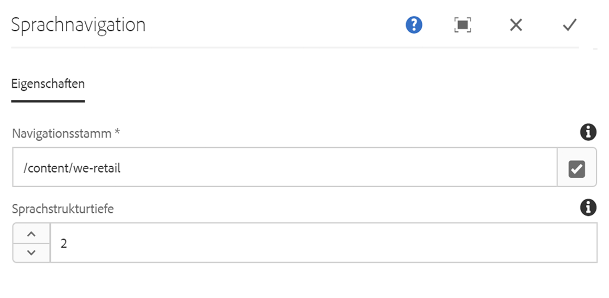

# Language Navigation Component{#language-navigation-component}

Die Sprachnavigationskomponente stellt eine Sprache/Ländernavigation für eine Site bereit, sodass Besucher zur gleichen Seite in einem anderen Gebietsschema navigieren können.

## Nutzung {#usage}

Oft werden Websites für verschiedene Regionen in mehreren Sprachen bereitgestellt. Mit der Komponente für die Sprachnavigation kann ein Besucher dieselbe Seite in verschiedenen Sprachen/Gebietsschemas anzeigen.

The [edit dialog](#edit-dialog) allows the definition of the global site navigation root as well as how deep into the structure the navigation should go. Using the [design dialog](#design-dialog), the template author can set the default values for the same options.

## Version and Compatibility {#version-and-compatibility}

Die aktuelle Version der Sprachnavigationskomponente ist v 1, die mit Version 2.0.0 der Kernkomponenten im Januar 2018 eingeführt wurde und in diesem Dokument beschrieben wird.

Die folgende Tabelle enthält alle unterstützten Versionen der Komponente, die AEM-Versionen, mit denen die Versionen der Komponente kompatibel sind, sowie Links zur Dokumentation für frühere Versionen.

| Komponentenversion | AEM 6.3 | AEM 6.4 | AEM 6.5 |
|--- |--- |--- |--- |
| v1 | Kompatibel | Kompatibel | Kompatibel |

For more information about Core Component versions and releases, see the document [Core Components Versions](versions.md).

## Sample Component Output {#sample-component-output}

To experience the Language Navigation Component as well as see examples of its configuration options as well as HTML and JSON output, visit the [Component Library](http://opensource.adobe.com/aem-core-wcm-components/library/languagenavigation.html).

## Technical Details {#technical-details}

The latest technical documentation about the Language Navigation Component [can be found on GitHub](https://github.com/adobe/aem-core-wcm-components/blob/master/content/src/content/jcr_root/apps/core/wcm/components/languagenavigation/v1/languagenavigation).

Further details about developing Core Components can be found in the [Core Components developer documentation](developing.md).

## Edit Dialog {#edit-dialog}

Das Dialogfeld Bearbeiten ermöglicht die Definition des globalen Site-Navigationsstamms sowie die Tiefe der Navigation in der Struktur.

* **Navigation Root**
Definiert die Stammseite der Navigationsstruktur.
   * Use the **Open Selection Dialog** button to easily navigate the content structure and select the root.
* **Sprachstrukturtiefe**
der globalen Sprachstruktur relativ zum Navigationsstamm.

## Design Dialog {#design-dialog}

Im Design-Dialogfeld kann der Vorlagenautor die Standardwerte für dieselben Optionen festlegen, die im Dialogfeld Bearbeiten verfügbar sind.

### Properties Tab {#properties-tab}

* **Navigationsstamm**-Standardwert
des Navigationsstammwertes, wenn ein Inhaltsautor die Sprachumschalter-Komponente auf einer Inhaltsseite platziert
* **Standardwert der** Sprachstruktur der Sprachstruktur, wenn ein Inhaltsautor die Sprachumschalter-Komponente auf einer Inhaltsseite platziert

### Styles Tab {#styles-tab}

The Language Navigation Component supports the AEM [Style System](authoring.md#component-styling).