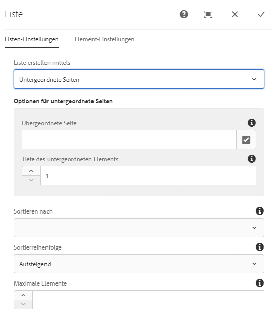
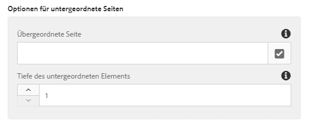
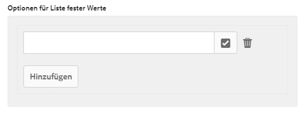
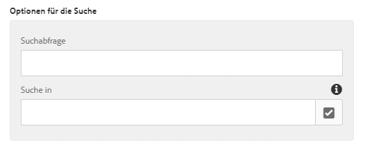
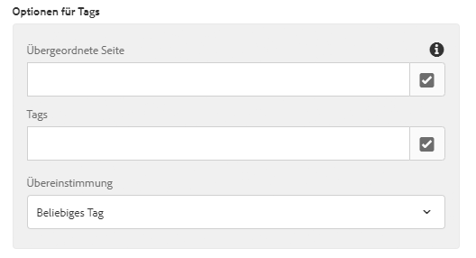
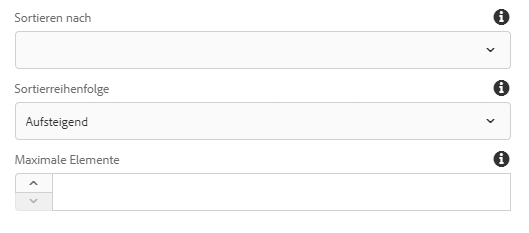
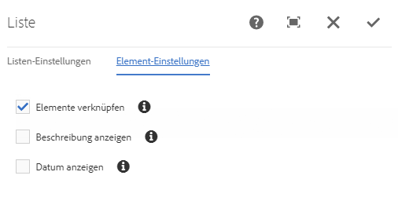
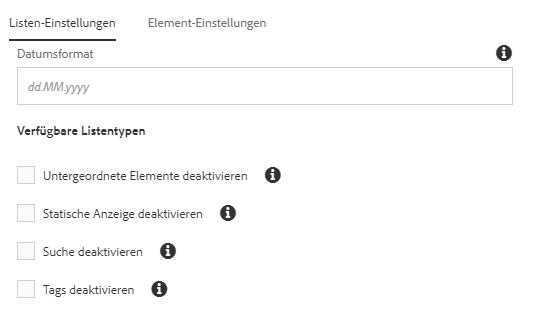
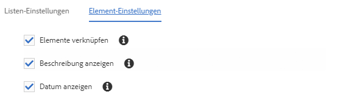

# Listenkomponente{#list-component}

Die Komponente Component Component List ermöglicht die einfache Erstellung dynamischer sowie statischer Listen.

## Nutzung {#usage}

Die Listenkomponente kann zum Erstellen einer dynamischen Liste von untergeordneten Seiten oder einer statischen Liste von willkürlich definierten Elementen verwendet werden. Der Typ der verfügbaren Listen und Formatierungsoptionen kann vom Vorlagenautor im [Designdialogfeld definiert](#design-dialog)werden. Der Content-Editor kann aus verfügbaren Listentypen und dem Formatieren der Listenelemente im [Bearbeitungsdialogfeld auswählen](#edit-dialog).

## Version und Kompatibilität {#version-and-compatibility}

Die aktuelle Version der List-Komponente ist v 2, die mit Version 2.0.0 der Kernkomponenten im Januar 2018 eingeführt wurde und in diesem Dokument beschrieben wird.

Die folgende Tabelle enthält alle unterstützten Versionen der Komponente, die AEM-Versionen, mit denen die Versionen der Komponente kompatibel sind, sowie Links zur Dokumentation für frühere Versionen.

| Komponentenversion | AEM 6.3 | AEM 6.4 | AEM 6.5 |
|--- |--- |--- |--- |
| v2 | Kompatibel | Kompatibel | Kompatibel |
| [v1](list-v1.md) | Kompatibel | Kompatibel | Kompatibel |

Weitere Informationen zu Core-Komponentenversionen und -versionen finden Sie in den Core [-Komponentenversionen](versions.md).

## Musterkomponentenausgabe {#sample-component-output}

Nachfolgend finden Sie ein Beispiel aus [We. Retail](https://helpx.adobe.com/experience-manager/6-5/sites/developing/using/we-retail.html).

### Screenshot {#screenshot}

### Komponentenbibliothek

Rufen Sie die [Komponentenbibliothek auf, um die Listenkomponente sowie Beispiele für die Konfigurationsoptionen sowie HTML- und JSON-Ausgaben zu erhalten](http://opensource.adobe.com/aem-core-wcm-components/library/list.html).

### Technische Details {#technical-details}

Die aktuelle technische Dokumentation zur Listenkomponente [finden Sie unter github](https://github.com/adobe/aem-core-wcm-components/blob/master/content/src/content/jcr_root/apps/core/wcm/components/list/v2/list).

Weitere Informationen zur Entwicklung Kernkomponenten finden Sie in der [Dokumentation zu Kernkomponenten für Komponenten](developing.md).

## Dialogfeld bearbeiten {#edit-dialog}

Im Dialogfeld &quot;Bearbeiten&quot; kann der Inhaltsautor die Liste und die Listenelemente konfigurieren.

### Registerkarte &quot;Listeneinstellungen « {#list-settings-tab}

Die Liste kann auf verschiedene Weise erstellt werden.

* [Untergeordnete Seiten](#child-pages)
* [Liste fester Werte](#fixed-list)
* [Suchen](#search-options)
* [Tags](#tags)

Unabhängig davon, wie die Liste erstellt wurde, gibt es [Sortieroptionen](#sort-options) , die immer konfiguriert werden können.

Je nachdem, wie der Inhaltsautor die Liste erstellt, werden die zusätzlichen Konfigurationsoptionen geändert.

#### Untergeordnete Seiten {#child-pages}

Die Liste kann aus den untergeordneten Seiten der aktuellen Seite oder einer anderen Seite bestehen.

* **Übergeordnete Seite**
   * Die Seite, deren untergeordnete Seiten die Liste bereitstellen sollten
   * Leer lassen, um die aktuelle Seite zu verwenden

* **Untergeordnete Tiefe**,
wie viele Ebenen in der Hierarchie abgelegt werden sollten

#### Feste Liste {#fixed-list}

Die Liste kann mit einer festen Liste von Elementen erstellt werden.

Tippen oder klicken Sie auf **die Schaltfläche &quot;Hinzufügen** &quot; , um ein neues Element auf die Liste einzufügen.

* Geben Sie Text für das Element in der Liste ein oder wählen Sie im **Auswahldialogfeld** ein Element aus AEM aus.
* Mit dem Ziehpunkt können Sie die Elemente in der Liste neu anordnen.
* Verwenden Sie das Papierkorbsymbol, um Elemente in der Liste zu löschen.

#### search (Suche){#search-options}

Die Liste kann mithilfe der Ergebnisse einer Suche aus AEM-Inhalten erstellt werden.

* **Suchabfrage**
Die Zeichenfolge, für die eine Volltextsuche ausgeführt wird, um die Listenelemente zu generieren
* **Suchen in**,
wo die Suche ausgeführt werden soll
   * Wählen Sie im **Dialogfeld &quot;Auswahl&quot;** den Speicherort in AEM aus.
   * Aktuelle Seite verwenden, wenn leer

#### Tags {#tags}

Die Liste kann mithilfe vonseiten erstellt werden, die bestimmten Tags unter einem bestimmten Ort entsprechen.

* **Übergeordnete Seite**, auf der
die Tag-Übereinstimmung beginnen sollte
   * Wählen Sie im **Dialogfeld &quot;Auswahl&quot;** den Speicherort in AEM aus.
   * Aktuelle Seite verwenden, wenn leer
* **Tags**,
mit denen Tags abgeglichen werden sollten
   * Verwenden Sie das **Dialogfeld &quot;Durchsuchen&quot;** , um die Tags auszuwählen.
* **Übereinstimmung**
Definieren, welche Art von Übereinstimmung eine Seite qualifizieren soll, damit sie in die Liste aufgenommen wird
   * **beliebiges Tag**
   * **alle Tags**

#### Sortieroptionen {#sort-options}

Unabhängig davon, wie Sie die Liste erstellen, gibt es bestimmte Sortieroptionen, die immer definiert werden können.

* **Reihenfolge der**
Anordnung der Elemente
   * **Titel**
   * **Datum der letzten Änderung**
* **Sortierreihenfolge**
Die Reihenfolge, in der die Elemente angeordnet werden sollen
   * **Aufsteigend**
   * **Absteigend**
* **Max. Anzahl**
der Elemente, die maximal in der Liste angezeigt werden.
   * Leer lassen, um alle Elemente zurückzugeben.

### Registerkarte &quot;Elementeinstellungen « {#item-settings-tab}

Auf der Registerkarte &quot;Elementeinstellungen&quot; kann die Formatierung der Listenelemente konfiguriert werden.

* **** Linkelemente verknüpfen Elemente mit der entsprechenden Seite
* **Beschreibung**
anzeigen Beschreibung des Link-Elements
* **Datum**des Änderungsdatums
des Links anzeigen

## Design-Dialogfeld {#design-dialog}

Über das Design-Dialogfeld können Sie festlegen, welche Listentypen den Autoren-Autoren sowie den verfügbaren Elementeinstellungen erlaubt werden sollen.

### Listen-Einstellungen {#list-settings}

Auf der Registerkarte **&quot;Listeneinstellungen** &quot; kann das Datumsformat sowie der Listentyp definiert werden, der in der Komponente den Autoren des Inhalts zur Verfügung stehen soll.

* **Datumsformat**-Format
für die Anzeige des Änderungsdatum der letzten Änderung
* **Deaktivieren Sie die untergeordneten** Listentypen in der Komponente deaktivieren
* **Statische**
Deaktivierung des statischen Listentyps in der Komponente deaktivieren
* **Deaktivieren Sie Search**
Deaktivieren des Suchlistentyps in der Komponente.
* **Deaktivieren Sie Tags**
Deaktivieren Tag-Listentyp in der Komponente.

### Element-Einstellungen {#item-settings}

Auf der **Registerkarte &quot;Elementeinstellungen** &quot; können die Formatierungsoptionen für die einzelnen Listenelemente definiert werden, die in der Komponente für die Autoren verfügbar sein sollten.

* **Option &quot;Elemente**
aktivieren&quot; Option&quot; Elemente aktivieren&quot; im [Dialogfeld &quot;Bearbeiten&quot; aktivieren](#edit-dialog)
* **Beschreibungen anzeigen**
aktivieren Option &quot;Beschreibungen anzeigen&quot; im Dialogfeld [&quot; Bearbeiten «](#edit-dialog)
* **Option Datum** anzeigen im Dialogfeld [Bearbeiten anzeigen](#edit-dialog)

### Stile Registerkarte {#styles-tab}

Die Image-Komponente unterstützt das AEM [-Stilsystem](authoring.md#component-styling).