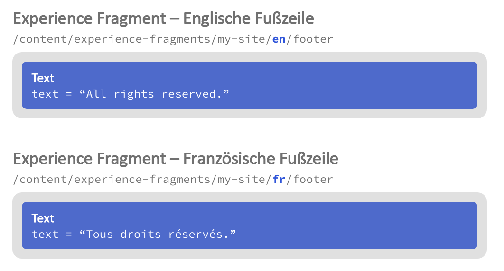
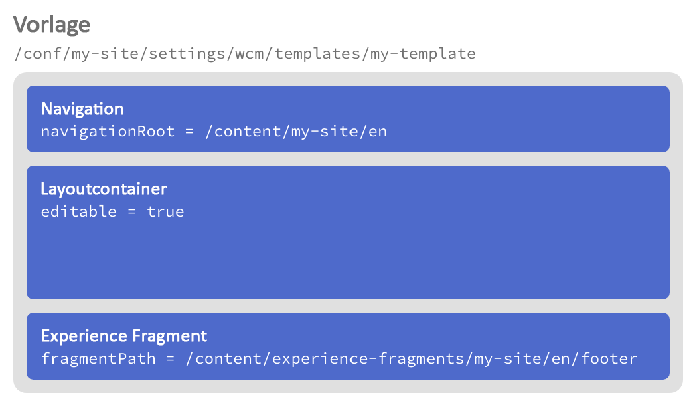
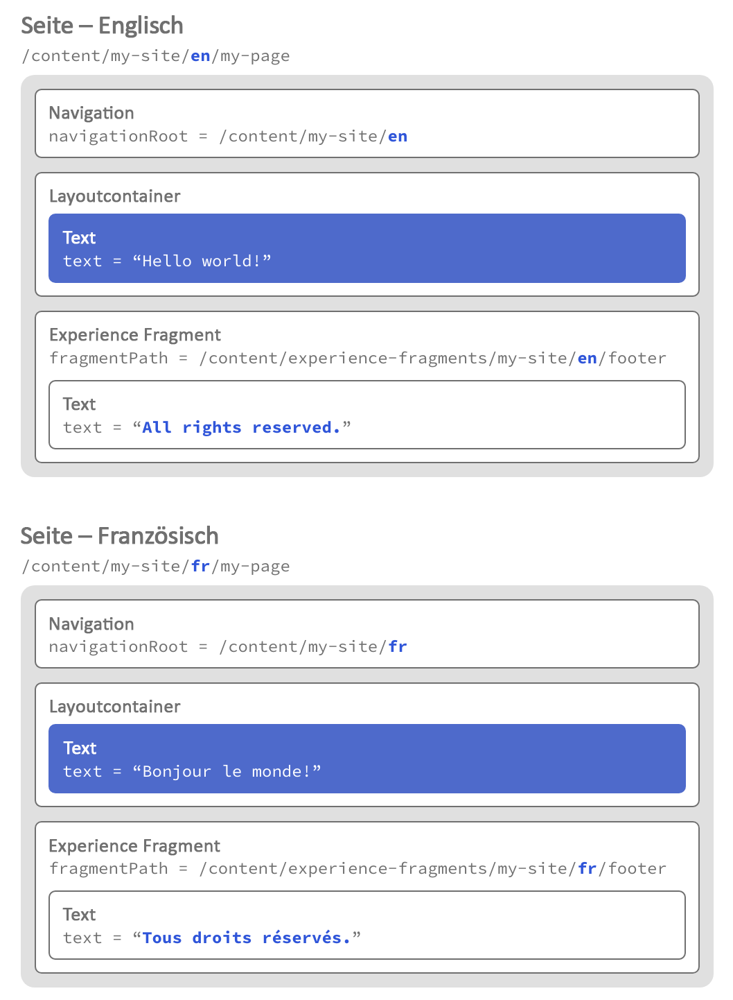
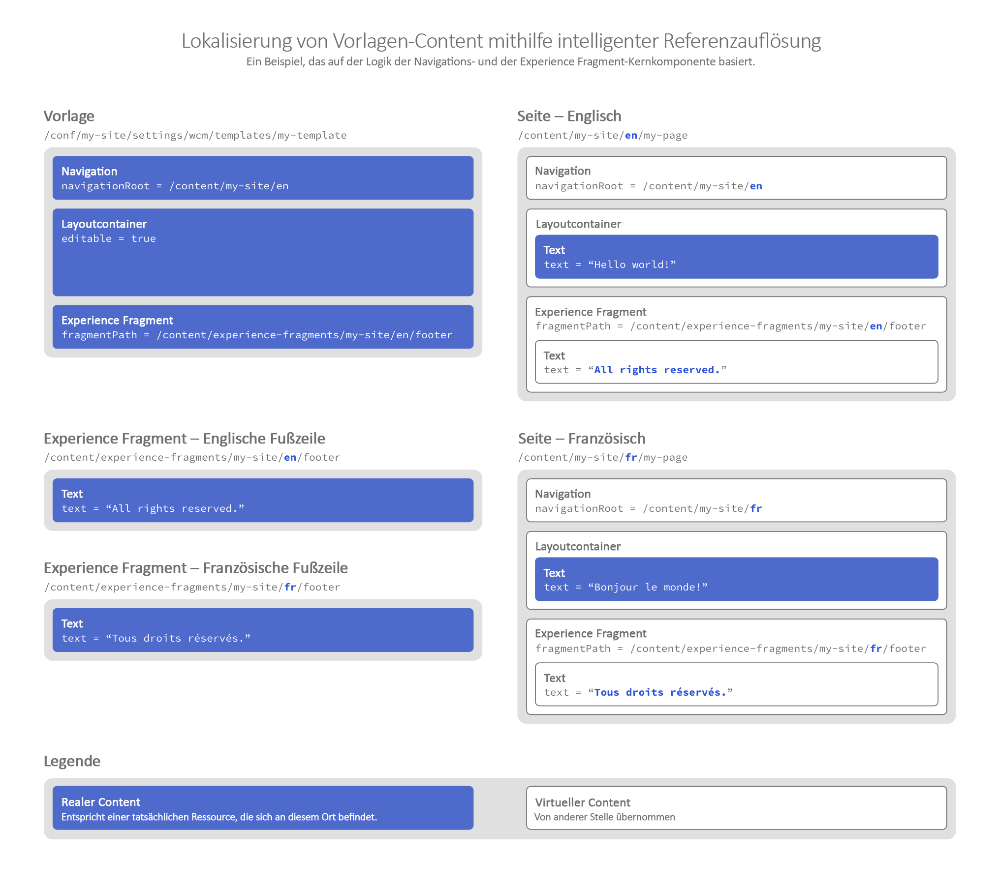

# Lokalisierungsfunktionen der Kernkomponenten {#localization-features-of-the-core-components}

Bei vielen Websites müssen Inhalte in einem lokalisierten Format für mehrere Sprachen und Regionen bereitgestellt werden. Die ausgewählten Kernkomponenten verfügen über eine intelligente Referenzauflösung für die einfache Erstellung einer einheitlichen Vorlage für alle Ihre lokalisierten Inhalte, die sich automatisch an Ihre lokalisierte Site-Struktur anpasst.

## Beispiel: Lokalisierte Seite mit Navigation und Fußzeilen {#example}

Bei den meisten Sites ist eine Fußzeile erforderlich, die auf allen Seiten vorhanden sein muss. Diese Fußzeilen sind in der Regel für alle Inhalte einer Seite gleich. Bei einer lokalisierten Inhaltsseite muss jedoch auch eine lokalisierte Version dieser Kopf- oder Fußzeilen angezeigt werden.

Auf ähnliche Weise muss auch eine Navigationskomponente auf allen Seiten angezeigt werden. Diese muss aber auch den Inhalt der lokalisierten Seiten widerspiegeln.

Mithilfe der Lokalisierungsfunktionen der [Navigations-Kernkomponente](navigation.md) und der [Experience Fragment-Kernkomponente](experience-fragment.md) sowie der [bearbeitbaren AEM-Vorlagen](https://docs.adobe.com/content/help/de/experience-manager-64/authoring/siteandpage/templates.html) ist dies ganz einfach. Das Beispiel könnte noch um die [Sprachnavigationskomponente](language-navigation.md) erweitert werden.

## Die Inhaltsstruktur {#content-structure}

Alle Lokalisierungsfunktionen von AEM und den dazugehörigen Kernkomponenten basieren auf einer klaren und logischen Inhaltsstruktur für Ihre lokalisierten Inhalte.

Nehmen wir an, Ihre Site heißt einfach `my-site` und befindet sich hier:

```
/content/my-site
```

Nehmen wir auch an, dass die ursprüngliche Sprache Ihrer Website Englisch ist, Sie diese aber auch auf Französisch anbieten. Wenn Sie also eine einfache Seite mit dem Namen `my-page` haben, würde diese in zwei Lokalisierungszweigen in der Inhaltsstruktur Ihrer Site gefunden werden:

```
/content
\-- my-site
   +-- en
       \-- my-page
   \-- fr
       \-- my-page
```

In diesen Lokalisierungszweigen können Sie weitere Seiten der Site anlegen.

Fußzeilen werden in der Regel mit Experience Fragments angelegt, sodass Sie eine englische und eine französische Version entsprechend Ihren Seiten benötigen. Experience Fragments sind jedoch keine Seiten, sondern nur Teile von Seiten, die über mehrere Seiten hinweg wiederverwendet werden können, sodass sie sich nicht wie die übrigen Seiten direkt unter `/content` befinden. Stattdessen haben sie ihren eigenen Ordner. Aber da auch sie lokalisiert werden müssen, muss ihre Struktur der Lokalisierungsstruktur Ihrer Site entsprechen.

```
/content
+-- experience-fragments
   +-- en
      \-- footer
   \-- fr
      \-- footer
\-- my-site
   +-- en
      \-- my-page
   \-- fr
      \-- my-page
```

Durch die entsprechend angepasste Lokalisierungsstruktur können die Kernkomponenten auf die erforderlichen lokalisierten Inhalte für eine entsprechende Seite zugreifen.

## Fußzeile – Experience Fragment {#xf-footer}

Die Experience Fragment-Komponente ist sehr flexibel und eignet sich sehr gut für Kopf- oder Fußzeilen.

Da unsere hypothetische Website auf Englisch und Französisch angeboten wird, müssen wir zwei Experience Fragments erstellen, die beide `footer` heißen und [an den zuvor beschriebenen Orten gespeichert](#content-structure) sind.



## Seitenvorlage {#template}

Da die Fußzeile auf jeder Seite angezeigt wird, müssen wir das Experience Fragment zu unserer Standardseitenvorlage hinzufügen.

Unsere Vorlage heißt einfach `my-template` und befindet sich bei unseren anderen Vorlagen:

```
/conf/my-site/settings/wcm/templates/my-template
```

Zu dieser Vorlage fügen wir die Standardkomponenten hinzu, auf denen unsere Seiten basieren sollen.

* [Navigationskomponente](navigation.md)
   * Die Navigationskomponente wird oben auf jeder Seite angezeigt.
   * In der Navigationskomponente legen wir den Navigationsstamm fest und teilen der Komponente mit, wo die Navigationsstruktur der Site beginnt.
   * Mithilfe des Navigationsstamms kann die Komponente den entsprechenden lokalisierten Inhalt automatisch finden.
* [Container-Komponente](container.md)
   * Jede Seite enthält eine bearbeitbare Container-Komponente, sodass der Autor weitere Inhalte auf der Seite platzieren kann.
* [Experience Fragment](experience-fragment.md)
   * Wir weisen die Experience Fragment-Komponente dem Fragmentpfad des in unserer Autorensprache verfassten Fragments zu, das die Fußzeile enthält.
   * Basierend auf diesem Fragmentpfad und der Struktur der Experience Fragments, die die lokalisierte Seitenstruktur widerspiegeln, kann die Komponente den entsprechenden lokalisierten Inhalt dann automatisch finden.
   

## Seiten {#pages}

Nachdem er diese Vorarbeit bereits bei der Einrichtung der Seitenstruktur und -vorlage geleistet hat, braucht der Autor lediglich Inhalte zu den Seiten hinzuzufügen. Dank der Vorlagen und der Lokalisierungslogik der Komponenten werden die Navigations- und die Fußzeilen automatisch der Seite hinzugefügt und lokalisiert.

Der Autor müsste beispielsweise nur Inhalte wie Textkomponenten zu den englischen und französischen Seiten hinzufügen (unten blau dargestellt).

Die Navigations- und Experience Fragment-Komponenten stammen aus der Seitenvorlage und können die richtigen Inhalte auf Grundlage der Lokalisierungsstruktur und der Position der Seite automatisch selbst anzeigen (unten in Weiß dargestellt).



## So passt alles zusammen {#fitting-it-all-together}

Im Folgenden sehen Sie eine umfassende Darstellung, wie diese einfachen, aber leistungsstarken Elemente zusammenarbeiten, um lokalisierte Seiten für Autoren bereitzustellen.


