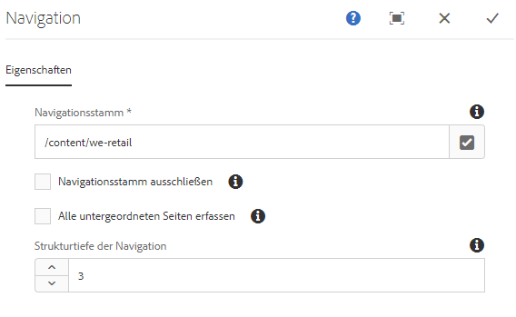

# Navigationskomponente{#navigation-component}

Mit der Navigationskomponente können Benutzer leicht durch eine globalisierten Site-Struktur navigieren.

## Nutzung {#usage}

Die Navigationskomponente ermöglicht eine Navigationshierarchie, die aus den Live-Kopien eines Blueprints, aus den Sprachkopien eines Sprachmasters oder aus einer einfachen Seitenstruktur erstellt werden kann. Dadurch können Benutzer der Seite leicht auf einer Seitenstruktur navigieren.

Das Dialogfeld [„Bearbeiten“](#edit-dialog) ermöglicht es dem Inhaltsautor, die Navigationsstammseite zusammen mit der Navigationstiefe zu definieren. Das [Dialogfeld „Design“](#design-dialog) ermöglicht es dem Vorlagenautor, Standardwerte für den Navigationsstamm und die Tiefe zu definieren.

## Version und Kompatibilität {#version-and-compatibility}

Die aktuelle Version der Navigationskomponente ist v1, die mit Version 2.0.0 der Kernkomponenten im Januar 2018 eingeführt wurde und in diesem Dokument beschrieben wird.

Die folgende Tabelle enthält alle unterstützten Versionen der Komponente, die AEM-Versionen, mit denen die Versionen der Komponente kompatibel sind, sowie Links zur Dokumentation für frühere Versionen.

| Komponentenversion | AEM 6.3 | AEM 6.4 | AEM 6.5 |
|--- |--- |--- |--- |
| v1 | Kompatibel | Kompatibel | Kompatibel |

Weitere Informationen zu Kernkomponentenversionen und -freigaben finden Sie in den [Kernkomponentenversionen](versions.md).

## Musterkomponentenausgabe {#sample-component-output}

Um die Navigationskomponente sowie Beispiele für die Konfigurationsoptionen sowie HTML- und JSON-Ausgaben zu erhalten, besuchen Sie die [Komponentenbibliothek](http://opensource.adobe.com/aem-core-wcm-components/library/navigation.html).

## Technische Details {#technical-details}

Die aktuelle technische Dokumentation zur Navigationskomponente [finden Sie auf GitHub](https://github.com/adobe/aem-core-wcm-components/blob/master/content/src/content/jcr_root/apps/core/wcm/components/navigation/v1/navigation).

Weitere Informationen zur Entwicklung von Kernkomponenten finden Sie in der [Dokumentation zu Kernkomponenten für Entwickler](developing.md).

>[!NOTE]
>
>Ab Version 2.1.0 der Kernkomponente unterstützt die Navigationskomponente [schema.org-Mikrodaten](https://schema.org).

## Dialogfeld „Bearbeiten“ {#edit-dialog}

Im Dialogfeld „Bearbeiten“ kann der Inhaltsautor die Stammseite für die Navigation und die Tiefe der Navigationsstruktur definieren.

* **Navigationsstamm**
Die Stammseite, die zum Generieren der Navigationsstruktur verwendet wird.
* **Navigationsstamm ausschließen**
Navigationsstamm in der Ausgabestruktur ausschließen, nur untergeordnete Elemente einschließen.
* **Sammlung aller untergeordneten Seiten**
Sammeln Sie alle untergeordneten Seiten, die sich auf dem Navigationsstamm befinden.
* **Navigationsstrukturtiefe**
Definiert, wie viele Ebenen die Komponente in der Navigationsstruktur im Verhältnis zum Navigationsstamm anzeigen soll (nur verfügbar, wenn **Sammlung aller untergeordneten Seiten** nicht ausgewählt sind).

## Dialogfeld „Design“ {#design-dialog}

Das Dialogfeld „Design“ ermöglicht es dem Vorlagenautor, die Standardwerte für die Navigationsstammseite und die Navigationstiefe festzulegen, die den Inhaltsautoren angezeigt werden.

### Registerkarte „Eigenschaften“{#properties-tab}

* **Navigationsstamm**
Der Standardwert der Stammseite der Navigationsstruktur, die zum Generieren der Navigationsstruktur verwendet und standardmäßig verwendet wird, wenn der Inhaltsautor die Komponente der Seite hinzufügt.
* **Navigationsstamm ausschließen**
Der Standardwert der Option, um den Navigationsstamm in der resultierenden Struktur auszuschließen.
* **Sammlung aller untergeordneten Seiten**
Der Standardwert der Option zur Sammlung aller Seiten, die sich auf dem Navigationsstamm befinden.
* **Navigationsstruktur der Tiefe**
Standardwert der Navigationsstruktur der Tiefe.

### Registerkarte „Stile“ {#styles-tab}

Die Navigationskomponente unterstützt das AEM-[Stilsystem](authoring.md#component-styling).