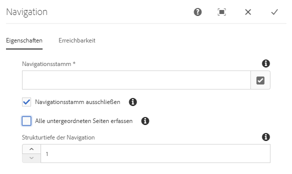
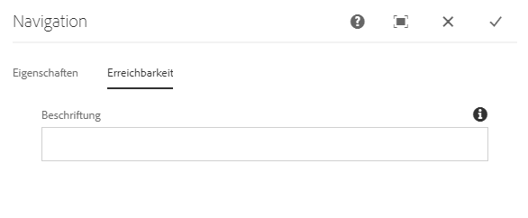
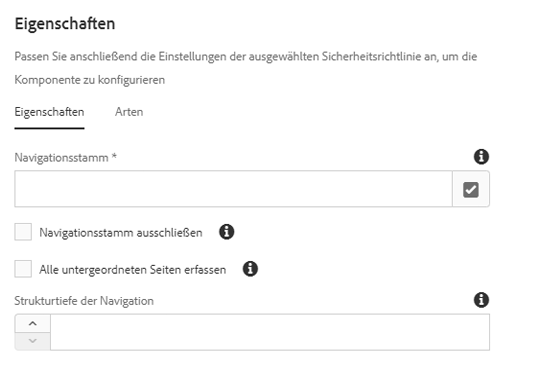

# Navigationskomponente{#navigation-component}

Mit der Navigationskomponente können Benutzer leicht durch eine globalisierten Site-Struktur navigieren.

## Nutzung {#usage}

In den Navigationskomponentenlisten wird eine Reihe vonseiten aufgelistet, sodass Benutzer einer Site einfach die Site-Struktur navigieren können.

Die Navigationskomponente kann die globale Site-Struktur Ihrer Site automatisch erkennen und [automatisch an eine lokalisierte Seite anpassen.](#localized-site-strucutre) Darüber hinaus kann eine beliebige Sitestruktur durch die Verwendung [von Schattenumleitungsseiten](#shadow-structure) zur Darstellung einer anderen Struktur als der Hauptinhaltsstruktur unterstützt werden.

Das Dialogfeld [„Bearbeiten“](#edit-dialog) ermöglicht es dem Inhaltsautor, die Navigationsstammseite zusammen mit der Navigationstiefe zu definieren. Das [Dialogfeld „Design“](#design-dialog) ermöglicht es dem Vorlagenautor, Standardwerte für den Navigationsstamm und die Tiefe zu definieren.

## Unterstützung lokalisierter Site-Struktur {#localized-site-structure}

Webseiten werden oft in verschiedenen Sprachen für verschiedene Regionen angeboten. In der Regel enthält jede lokalisierte Seite ein navagation-Element, das Teil der Seitenvorlage ist. Die Navigationskomponente ermöglicht es Ihnen, sie einmal auf einer Vorlage für alle Seiten Ihrer Site zu platzieren, und wird dann automatisch auf die einzelnen lokalisierten Seiten basierend auf Ihrer globalen Site-Struktur angepasst.

* Ein Beispiel zur Funktionsweise der Lokalisierungsfunktion der Navigationskomponente finden Sie [im folgenden Abschnitt](#example-localiatzion).
* Ein Beispiel dafür, wie die Lokalisierungsfunktionen der Kernkomponenten zusammen funktionieren, finden Sie in den [Lokalisierungsfunktionen der Seite Kernkomponenten](localization.md).

### Beispiel {#example-localization}

Nehmen wir an, dass Ihr Inhalt wie folgt aussieht:

```
/content
+-- we-retail
   +-- language-masters
      +-- de
         \-- experience
            \-- arctic-surfing-in-lofoten
      +-- en
         \-- experience
            \-- arctic-surfing-in-lofoten
      +-- es
      +-- fr
      \-- it
   +-- us
      +-- en
         \-- experience
            \-- arctic-surfing-in-lofoten
      \-- es
   \-- ch
      +-- de
         \-- experience
            \-- arctic-surfing-in-lofoten
      +-- fr
      \-- it
+-- wknd-events
\-- wknd-shop
```

Für die Site We. Retail möchten Sie wahrscheinlich die Navigationskomponente als Teil der Kopfzeile auf einer Seitenvorlage platzieren. Once part of the template, you can set the **Navigation Root** of the component to `/content/we-retail/language-masters/en` since that is where your master content for that site begins. Vielleicht möchten Sie auch die **Navigationsstruktur für** die Navigation festlegen, da Sie `2` wahrscheinlich nicht möchten, dass die gesamte Inhaltsstruktur durch die Komponente angezeigt wird, sondern die ersten beiden Ebenen, sodass sie als Übersicht dienen.

Mit dem **Navigationsstamm-** Wert weiß die Navigationskomponente, dass die `/content/we-retail/language-masters/en` Navigation beginnt, und sie kann Navigationsoptionen generieren, indem sie die Struktur der Site auf zwei Ebenen nach unten (laut Definition durch den Wert **der Navigationsstruktur)** wiederherstellen.

Unabhängig davon, welche lokalisierte Seite ein Benutzer ansieht, kann die Navigationskomponente die entsprechende lokalisierte Seite finden, indem sie den Ort der aktuellen Seite kennen, rückwärts bis zum Stamm arbeiten und dann zur entsprechenden Seite weiterleitet.

Wenn sich ein Besucher also ansieht `/content/ch/de/experience/arctic-surfing-in-lofoten`, weiß die Komponente, dass die Navigationsstruktur basiert `/content/we-retail/language-masters/de`. Gleichermaßen weiß die Komponente, ob der Besucher die `/content/us/en/experience/arctic-surfing-in-lofoten`Navigationsstruktur `/content/we-retail/language-masters/en`generiert.

## Unterstützung der Schatten-Site-Struktur {#shadow-structure}

Manchmal ist es erforderlich, ein Navigationsmenü für den Besucher zu erstellen, das sich von der tatsächlichen Site-Struktur unterscheidet. Vielleicht sollte eine Promotion bestimmte Inhalte im Menü hervorheben, indem Sie die Inhaltsauflistung neu anordnen. Mithilfe von Shadow-Seiten, die einfach zu anderen Inhaltsseiten umgeleitet werden, kann die Navigationskomponente beliebige erforderliche Navigationsstruktur generieren.

Hierfür müssen Sie:

1. Erstellen Sie Schatten-Seiten als emtpy-Seiten, die Ihre gewünschte Site-Struktur repräsentieren. Dies wird häufig als Shadow-Site-Struktur bezeichnet.
1. Legen Sie **die Umleitungswerte** in den Seitenprorperties auf diesen Seiten fest, um auf die tatsächlichen Inhaltsseiten zu verweisen.
1. Legen Sie **die Option "In der Navigationsleiste** ausblenden" in den Seiteneigenschaften der Schatten fest.
1. Legen Sie den **Navigationsstammwert** der Navigationskomponente fest, um auf den Stamm der neuen Shadow-Site-Struktur zu verweisen.

Die Navigationskomponente rendert das Menü dann basierend auf der Shadow-Site-Struktur. Die von der Komponente gerenderten Links beziehen sich auf die tatsächlichen Inhaltsseiten, auf die die Schatten umgeleitet werden, und nicht auf die Schatten-Seiten selbst. Darüber hinaus zeigt die Komponente die Namen der tatsächlichen Seiten an sowie die aktive Seite, auch wenn die Navigation auf Schatten-Seiten basiert. Die Navigationskomponente macht die Schattenseiten für den Besucher vollkommen transparent.

>[!NOTE]
>Durch Schattenseiten können Ihre Navigationsoptionen viel flexibler werden, denken Sie jedoch daran, dass die Aktivierung dieser Struktur vollständig manuell ist. Wenn Sie Ihren tatsächlichen Site-Inhalt neu anordnen oder Inhalte hinzufügen/entfernen, müssen Sie die Schattenstruktur nach Bedarf manuell aktualisieren.

>[!NOTE]
>Beim Rendern einer Shadow-Site-Struktur werden nur die Schatten-Seiten von der Navigationslogik wiederholt. Die Logik stellt die Struktur der Umleitungsziele nicht wieder her.

## Version und Kompatibilität {#version-and-compatibility}

Die aktuelle Version der Navigationskomponente ist v1, die mit Version 2.0.0 der Kernkomponenten im Januar 2018 eingeführt wurde und in diesem Dokument beschrieben wird.

Die folgende Tabelle enthält alle unterstützten Versionen der Komponente, die AEM-Versionen, mit denen die Versionen der Komponente kompatibel sind, sowie Links zur Dokumentation für frühere Versionen.

| Komponentenversion | AEM 6.3 | AEM 6.4 | AEM 6.5 |
|--- |--- |--- |--- |
| v1 | Kompatibel | Kompatibel | Kompatibel |

Weitere Informationen zu Kernkomponentenversionen und -freigaben finden Sie in den [Kernkomponentenversionen](versions.md).

## Musterkomponentenausgabe {#sample-component-output}

Um die Navigationskomponente sowie Beispiele für die Konfigurationsoptionen sowie HTML- und JSON-Ausgaben zu erhalten, besuchen Sie die [Komponentenbibliothek](http://opensource.adobe.com/aem-core-wcm-components/library/navigation.html).

## Technische Details {#technical-details}

Die aktuelle technische Dokumentation zur Navigationskomponente [finden Sie unter github](https://github.com/adobe/aem-core-wcm-components/blob/master/content/src/content/jcr_root/apps/core/wcm/components/navigation/v1/navigation).

Weitere Informationen zur Entwicklung von Kernkomponenten finden Sie in der [Dokumentation zu Kernkomponenten für Entwickler](developing.md).

>[!NOTE]
>
>Ab Version 2.1.0 der Kernkomponente unterstützt die Navigationskomponente [schema.org-Mikrodaten](https://schema.org).

## Dialogfeld „Bearbeiten“ {#edit-dialog}

Im Dialogfeld „Bearbeiten“ kann der Inhaltsautor die Stammseite für die Navigation und die Tiefe der Navigationsstruktur definieren.

### Registerkarte „Eigenschaften“{#properties-tab}



* **Navigationsstamm**
Die Stammseite, die zum Generieren der Navigationsstruktur verwendet wird.
* **Navigationsstamm ausschließen**
Navigationsstamm in der Ausgabestruktur ausschließen, nur untergeordnete Elemente einschließen.
* **Sammlung aller untergeordneten Seiten**
Sammeln Sie alle untergeordneten Seiten, die sich auf dem Navigationsstamm befinden.
* **Navigationsstrukturtiefe**
Definiert, wie viele Ebenen die Komponente in der Navigationsstruktur im Verhältnis zum Navigationsstamm anzeigen soll (nur verfügbar, wenn **Sammlung aller untergeordneten Seiten** nicht ausgewählt sind).

### Registerkarte "Ein-/Ausgabehilfe « {#accessibility-tab}



Auf der **Registerkarte Ein-/Ausgabehilfe** können Werte für [ARIA-Barrierefreiheitsbeschriftungen](https://www.w3.org/WAI/standards-guidelines/aria/) für die Komponente festgelegt werden.

* **Beschriftung** - Wert eines ARIA-Label-Attributs für die Komponente

## Dialogfeld „Design“ {#design-dialog}

Das Dialogfeld „Design“ ermöglicht es dem Vorlagenautor, die Standardwerte für die Navigationsstammseite und die Navigationstiefe festzulegen, die den Inhaltsautoren angezeigt werden.

### Registerkarte „Eigenschaften“{#properties-tab-design}



* **Navigationsstamm**
Der Standardwert der Stammseite der Navigationsstruktur, die zum Generieren der Navigationsstruktur verwendet und standardmäßig verwendet wird, wenn der Inhaltsautor die Komponente der Seite hinzufügt.
* **Navigationsstamm ausschließen**
Der Standardwert der Option, um den Navigationsstamm in der resultierenden Struktur auszuschließen.
* **Sammlung aller untergeordneten Seiten**
Der Standardwert der Option zur Sammlung aller Seiten, die sich auf dem Navigationsstamm befinden.
* **Navigationsstruktur der Tiefe**
Standardwert der Navigationsstruktur der Tiefe.

### Registerkarte „Stile“ {#styles-tab}

Die Navigationskomponente unterstützt das AEM-[Stilsystem](authoring.md#component-styling).
