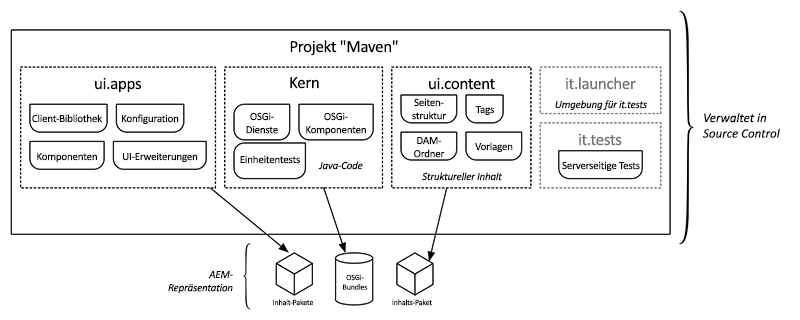

# AEM-Projektarchetyp {#aem-project-archetype}

Der AEM Project Archetype erstellt ein Adobe Experience Manager-Projekt mit minimalen Best Practices als Ausgangspunkt für Ihre eigenen AEM-Projekte. Die Eigenschaften, die bei Verwendung dieses Archetyps angegeben werden müssen, ermöglichen es Ihnen, die Namen für alle Teile dieses Projekts anzugeben und bestimmte optionale Funktionen zu steuern.

>[!NOTE]
>
>Der neueste AEM Project Archetype und alle technischen Details [finden Sie auf GitHub](https://github.com/adobe/aem-project-archetype).

>[!NOTE]
>
>In der AEM-Dokumentation finden Sie das Tutorial[ Erste ](https://docs.adobe.com/content/help/en/experience-manager-learn/getting-started-wknd-tutorial-develop/overview.html)Schritte mit AEM-Sites - WKND (Erste Schritte mit AEM-Sites), in dem Sie anhand eines praktischen Beispiels erfahren, wie Sie mit dem Archteype ein einfaches Projekt implementieren.

## Funktionen {#features}

Der Archetyp verfügt über eine Reihe von Funktionen, die einen bequemen Ausgangspunkt für neue AEM-Projekte bieten sollen:

* Englisch und Französisch Seiten mit Beispielinhalt
* Eine Inhaltsvorlage, die auf der Funktion einer bearbeitbaren Vorlage mit einer Beispielinhaltsrichtlinie basiert
* Seitenkomponente basierend auf der [AEM-Seitenkomponente](page.md)
* Beispiele für Inhaltskomponenten, die mit dem empfohlenen Proxymuster und einer Beispielkomponente "helloworld"implementiert wurden, basieren alle auf [AEM-Core-Komponenten](introduction.md).
* Beispiele für [Formularkomponenten](form-container.md)
* Konfigurationen für Geräteemulatoren, Drag &amp; Drop-Einrichtung und Internationalisierung
* Client-Bibliotheken nach BEM-Benennungskonventionen sowie komponentenspezifische Stile
* Beispielpakete mit Beispielmodellen, Servelets, Filtern und Schedulern
* Einheiten-, Integrations- und clientseitige Tests

## Warum Archetyp verwenden {#why-use-the-archetype}

Mithilfe des AEM-Projektarchetyps können Sie auf dem Weg zum Aufbau eines AEM-Projekts mit bewährten Verfahren und nur wenigen Tastenanschlägen beginnen. Durch Verwendung des Archetyps werden alle Teile bereits vorhanden sein, sodass das resultierende Projekt minimal ist, es jedoch bereits alle [Schlüsselfunktionen](#features) von AEM implementiert, sodass Sie nur auf dem Aufbau aufbauen und erweitern müssen.

Natürlich gibt es viele Elemente, die in ein erfolgreiches AEM-Projekt eingehen, aber die Verwendung des AEM Project Archetype ist eine solide Grundlage und wird dringend für jedes AEM-Projekt empfohlen.

## Was Sie mit dem Archetyp erhalten {#what-you-get}

Der AEM-Archetyp besteht aus Modulen:

* **[core](core.md)**: ist ein Java-Bundle, das alle Kernfunktionen wie OSGi-Dienste, Listener und Scheduler sowie komponentenbezogenen Java-Code wie Servlets und Anforderungsfilter enthält.
* **[ui.apps](uiapps.md)**: enthält die `/apps` und `/etc` Teile des Projekts, d.h. JS- und CSS-clientlibs, Komponenten, Vorlagen, runmode-spezifische Konfigurationen sowie Hobbes-Tests.
* **[ui.content](uicontent.md)**: enthält Beispielinhalt mit den Komponenten des Moduls ui.apps.
* **ui.tests**: ist ein Java-Bundle, das JUnit-Tests enthält, die serverseitig ausgeführt werden. Dieses Bundle soll nicht in der Produktion bereitgestellt werden.
* **ui.launcher**: enthält Klebercode, der das ui.tests-Bundle (und die abhängigen Bundles) auf dem Server bereitstellt und die Ausführung von JUnit auslöst.
* **[ui.frontend](front-end-build.md)**: [optional] enthält die Artefakte, die zur Verwendung des webpack-basierten Front-End-Buildmoduls erforderlich sind.



Die in Maven dargestellten Module von AEM Archetyp werden als Inhaltsseiten bereitgestellt, die die Anwendung, den Inhalt und die erforderlichen OSGi-Pakete darstellen.

## Voraussetzungen {#requirements}

Für die aktuelle Version des Archetyps gelten folgende Anforderungen:

* Adobe Experience Manager 6.3.3.0 oder höher
* Apache Maven (3.3.9 oder höher)
* Adobe Public Maven Repository in Ihren Maven-Einstellungen. Weitere Informationen finden Sie in diesem [Knowledge Base-Artikel](https://helpx.adobe.com/experience-manager/kb/SetUpTheAdobeMavenRepository.html).

Eine Liste der unterstützten AEM-Versionen früherer Archetypversionen finden Sie in den [historisch unterstützten AEM-Versionen](https://github.com/adobe/aem-project-archetype/blob/master/VERSIONS.md).

## Verwendung des Archetyps {#how-to-use-the-archetype}

Um den Archetyp zu verwenden, müssen Sie zunächst ein Projekt erstellen, das die Module in einer lokalen Dateistruktur wie [zuvor beschrieben](#what-you-get)generiert. Im Rahmen der Projekterstellung können mehrere Eigenschaften für Ihr Projekt definiert werden, z. B. Projektname, Version usw.

Beim Erstellen des Projekts mit Maven werden die Artefakte (Pakete und OSGi-Pakete) erstellt, die in AEM bereitgestellt werden können. Zusätzliche Maven-Befehle und -Profile können verwendet werden, um die Projektartefakte auf einer AEM-Instanz bereitzustellen.

### Erstellen eines Projekts {#create-project}

Für den Einstieg können Sie die [AEM Eclipse-Erweiterung](https://helpx.adobe.com/experience-manager/6-5/sites/developing/using/aem-eclipse.html) verwenden und dem Assistenten für neue Projekte folgen. Wählen Sie dann **AEM Sample Multi-Module Project** , um eine veröffentlichte Version des Archetyps zu verwenden.

Natürlich können Sie auch direkt Maven aufrufen.

```
mvn archetype:generate \
 -DarchetypeGroupId=com.adobe.granite.archetypes \
 -DarchetypeArtifactId=aem-project-archetype \
 -DarchetypeVersion=XX
```

Hierbei `XX` handelt es sich um die [Versionsnummer](https://github.com/adobe/aem-project-archetype/blob/master/VERSIONS.md) des neuesten AEM-Projektarchetyps.

>[!NOTE]
>
>Es empfiehlt sich, das `adobe-public` Profil Ihrer Maven- `settings.xml` Datei hinzuzufügen, um repo.adobe.com automatisch zum Maven-Build-Prozess hinzuzufügen.
>
>Ein Beispiel für POM [finden Sie hier](https://helpx.adobe.com/experience-manager/kb/SetUpTheAdobeMavenRepository.html).

### Eigenschaften {#properties}

Die folgenden Eigenschaften sind beim Erstellen eines Projekts mit dem Archetyp verfügbar.

| Name | Default | Beschreibung |
----------------------------|---------|--------------------
| `groupId` |  | Base Maven `groupId` |
| `artifactId` |  | Base Maven ArtefaktId |
| `version` |  | Version |
| `package` |  | Java-Quellpaket |
| `appsFolderName` |  | `/apps` Ordnername |
| `artifactName` |  | Maven-Projektname |
| `componentGroupName` |  | Name der AEM-Komponentengruppe |
| `contentFolderName` |  | `/content` Ordnername |
| `confFolderName` |  | `/conf` Ordnername |
| `cssId` |  | in generiertem CSS verwendetes Präfix |
| `packageGroup` |  | Name der Inhaltspaket-Gruppe |
| `siteName` |  | AEM-Site-Name |
| `optionAemVersion` | 6.5.0 | Target AEM-Version |
| `optionIncludeExamples` | y | Beispielsite [Komponentenbibliothek](http://opensource.adobe.com/aem-core-wcm-components/library.html) einschließen |
| `optionIncludeErrorHandler` | n | Eine benutzerdefinierte 404-Antwortseite einschließen |
| `optionIncludeFrontendModule` | n | [Ein dediziertes Front-End-Modul einschließen](front-end-build.md) |

>[!NOTE]
> Wenn der Archetyp zum ersten Mal im interaktiven Modus ausgeführt wird, können Eigenschaften mit Standardwerten nicht geändert werden (weitere Informationen finden Sie unter [ARCHETYPE-308](https://issues.apache.org/jira/browse/ARCHETYPE-308) ). Der Wert kann geändert werden, wenn die Eigenschaftsbestätigung am Ende verweigert und der Fragebogen wiederholt wird oder indem der Parameter in der Befehlszeile (z. `-DoptionIncludeExamples=n`).

### Profile {#profiles}

Das generierte Maven-Projekt unterstützt bei der Ausführung verschiedene Bereitstellungsprofile `mvn install`.

| Profil-ID | Beschreibung |
--------------------------|------------------------------
| `autoInstallBundle` | Installiert das Kernpaket mit dem maven-sling-Plug-in für OSGi |
| `autoInstallPackage` | Installiert das Inhaltspaket ui.content und ui.apps mit dem content-package-maven-plugin im Package Manager auf die Standard-Autoreninstanz auf localhost, Port 4502. Hostname und Anschluss können mit den benutzerdefinierten `aem.host` und `aem.port` benutzerdefinierten Eigenschaften geändert werden. |
| `autoInstallPackagePublish` | Installieren Sie das Inhaltspaket ui.content und ui.apps mit dem content-package-maven-plugin im Package Manager, um die standardmäßige Veröffentlichungsinstanz auf localhost, Port 4503, zu aktivieren. Hostname und Anschluss können mit den benutzerdefinierten `aem.host` und `aem.port` benutzerdefinierten Eigenschaften geändert werden. |
| `integrationTests` | Führt die bereitgestellten Integrationstests auf der AEM-Instanz aus (nur für die `verify` Phase) |

### Erstellen und Installieren {#building-and-installing}

Um alle im Projektstammordner ausgeführten Module zu erstellen, verwenden Sie den folgenden Maven-Befehl.

```
mvn clean install
```

Wenn Sie über eine ausgeführte AEM-Instanz verfügen, können Sie das gesamte Projekt erstellen und verpacken und mit dem folgenden Maven-Befehl in AEM bereitstellen.

```
mvn clean install -PautoInstallPackage
```

Führen Sie zum Bereitstellen auf einer Veröffentlichungsinstanz diesen Befehl aus.

```
mvn clean install -PautoInstallPackagePublish
```

Sie können diesen Befehl auch ausführen, um eine Bereitstellung in einer Veröffentlichungsinstanz durchzuführen.

```
mvn clean install -PautoInstallPackage -Daem.port=4503
```

Sie können auch nur das Bundle für den Autor bereitstellen, indem Sie diesen Befehl ausführen.

```
mvn clean install -PautoInstallBundle
```

## Übergeordnete POM {#parent-pom}

Die `pom.xml` am Stamm des Projekts (`<src-directory>/<project>/pom.xml`) wird als übergeordneter POM bezeichnet und treibt die Struktur des Projekts sowie Abhängigkeiten und bestimmte globale Eigenschaften des Projekts.

### Globale Projekteigenschaften {#global-properties}

Im `<properties>` Abschnitt des übergeordneten POM werden verschiedene globale Eigenschaften definiert, die für die Bereitstellung Ihres Projekts auf einer AEM-Instanz wichtig sind, z. B. Benutzername/Kennwort, Hostname/Anschluss usw.

Diese Eigenschaften sind für die Bereitstellung auf einer lokalen AEM-Instanz eingerichtet, da dies der häufigste Build ist, den Entwickler ausführen. Beachten Sie, dass Eigenschaften für eine Autoreninstanz sowie für eine Veröffentlichungsinstanz bereitgestellt werden müssen. An dieser Stelle werden die Anmeldeinformationen auch für die Authentifizierung mit der AEM-Instanz festgelegt. Es werden die standardmäßigen admin:admin-Anmeldeinformationen verwendet.

Diese Eigenschaften werden so eingerichtet, dass sie bei der Bereitstellung in Umgebungen mit höherer Ebene überschrieben werden können. Auf diese Weise müssen sich die POM-Dateien nicht ändern, aber Variablen wie `aem.host` `sling.password` und können über Befehlszeilenargumente überschrieben werden:

````
mvn -PautoInstallPackage clean install -Daem.host=production.hostname -Dsling.password=productionpasswd
````

### Modulstruktur {#module-structure}

Der `<modules>` Abschnitt des übergeordneten POM definiert die Module, die das Projekt erstellen wird. Standardmäßig erstellt das Projekt [die zuvor definierten](#what-you-get)Standardmodule: core, ui.apps, ui.content, ui.tests und it.launcher. Im Laufe der Entwicklung eines Projekts können immer mehr Module hinzugefügt werden.

### Abhängigkeiten {#dependencies}

Im `<dependencyManagement>` Abschnitt des übergeordneten POM werden alle Abhängigkeiten und Versionen der im Projekt verwendeten APIs definiert. Versionen sollten im übergeordneten POM verwaltet werden. Untermodule wie core und ui.apps sollten keine Versionsinformationen enthalten.

#### Uber-Jar {#uber-jar}

Eine der wichtigsten Abhängigkeiten ist die [AEM uber-jar](https://helpx.adobe.com/experience-manager/6-5/sites/developing/using/ht-projects-maven.html#ExperienceManagerAPIDependencies). Dies umfasst alle AEM-APIs mit nur einem einzigen Abhängigkeitseintrag für die Version von AEM.

>[!NOTE]
>
>Als Best Practice sollten Sie die Version uber-jar aktualisieren, um sie an die Zielversion von AEM anzupassen. Wenn Sie beispielsweise eine Bereitstellung auf AEM 6.4 planen, sollten Sie die Version der uber-jar auf 6.4.0 aktualisieren.

#### Kernkomponenten {#core-components}

Der AEM-Projektarchiv nutzt natürlich die Kernkomponenten.

Die Core-Komponenten werden in AEM automatisch im Standard-Ausführungsmodus installiert und von der Web.Retail-Beispielsite verwendet. In einem [Produktions-Runmode](https://helpx.adobe.com/experience-manager/6-5/sites/administering/using/production-ready.html) (`nosamplecontent`) sind die Core-Komponenten nicht verfügbar.

Um die Kernkomponenten in allen Implementierungen zu nutzen, empfiehlt es sich daher, sie in das Maven-Projekt einzubeziehen.

>[!NOTE]
>
>Nach jeder Version der Core-Komponenten wird im Allgemeinen eine Version des AEM Project Archtype veröffentlicht, sodass der neueste Archetyp die neueste Version der Kernkomponenten verwendet.
>
>Eine neue Version des Archetyps folgt möglicherweise nicht direkt einer neuen Version der Core-Komponenten, daher sollten Sie die Abhängigkeit von den Core-Komponenten auf die neueste Version aktualisieren.

>[!NOTE]
>
>Die Datei "core.wcm.components.example"enthält eine Reihe von Beispielseiten, die Beispiele für die Kernkomponenten illustrieren. Als Best Practice sollten Sie bei der Bereitstellung eines Projekts für die Produktion diese Abhängigkeit und die Einbeziehung von Unterpaketen entfernen.

## Testen {#testing}

Es gibt drei Testebenen im Projekt, und da es sich bei ihnen um unterschiedliche Testtypen handelt, werden sie auf unterschiedliche Weise oder an verschiedenen Orten durchgeführt.

* Komponententest im Kern: Hier werden klassische Komponententests des im Bundle enthaltenen Codes vorgestellt. Führen Sie zum Testen Folgendes aus:
   * `mvn clean test`
* Serverseitige Integrationstests: Diese führen geräteähnliche Tests in der AEM-Umgebung, d. h. auf dem AEM-Server, aus. Führen Sie zum Testen Folgendes aus:
   * `mvn clean verify -PintegrationTests`
* Clientseitige Hobbes.js-Tests: Hierbei handelt es sich um JavaScript-basierte Browser-basierte Tests, die das Verhalten auf der Browserseite überprüfen. So testen Sie:
   1. Laden Sie AEM genau wie eine Seite in Ihren Browser.
   1. Open the page in [Developer mode](https://helpx.adobe.com/experience-manager/6-5/sites/developing/using/developer-mode.html)
   1. Öffnen Sie das linke Bedienfeld und wechseln Sie zur Registerkarte **Tests** .
   1. Suchen Sie die generierten **MyName-Tests** und führen Sie sie aus.

## Nächste Schritte {#next-steps}

So haben Sie den AEM Project Archteype erstellt und installiert. Was jetzt? Der Archetyp ist klein, besteht aber aus vielen Beispielen leistungsfähiger AEM-Funktionen, die gemäß empfohlenen Best Practices konfiguriert wurden. Verwenden Sie diese, um anzuzeigen, wie Sie diese Funktionen in Ihrem Projekt nutzen können. Für jedes Projekt, das Sie wahrscheinlich benötigen:

* [Anpassen von Komponenten zur Erweiterung der vorhandenen Kernkomponenten](customizing.md)
* [Zusätzliche Vorlagen hinzufügen](https://helpx.adobe.com/content/help/en/experience-manager/6-5/sites/authoring/using/templates.html)
* [Anpassen der Lokalisierungsstruktur](https://helpx.adobe.com/experience-manager/6-5/sites/administering/using/tc-prep.html)
* [Informationen zum Front-End-Build-Modul](front-end-build.md)
