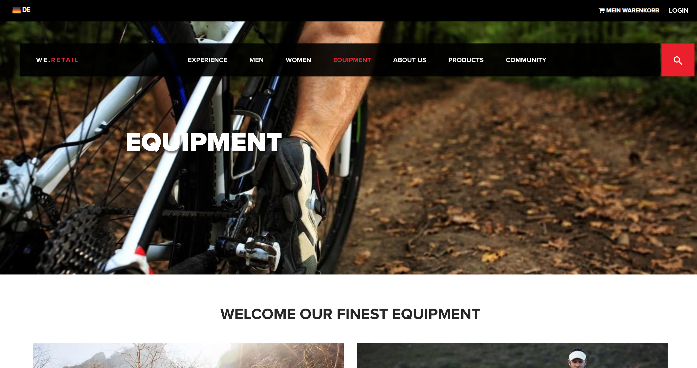
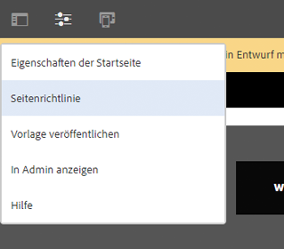
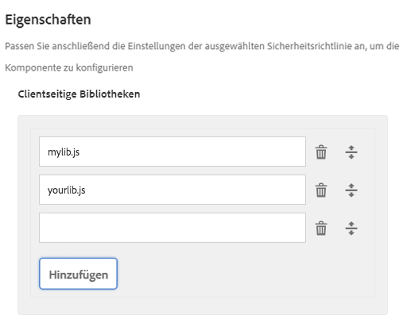

# Seitenkomponente (v 1){#page-component-v}

Die Seitenkomponente ist eine Komponente erweiterbarer Seiten, die zum Arbeiten mit dem [Vorlageneditor](https://helpx.adobe.com/experience-manager/6-4/sites/authoring/using/templates.html) entwickelt wurde und die Seitenkopf-/Fußzeile sowie Strukturkomponenten mit dem Vorlageneditor ermöglicht.

## Nutzung {#usage}

Die Seitenkomponente bildet die Grundlage aller Seiten, die mit Kernkomponenten und bearbeitbaren Vorlagen entworfen wurden. Mithilfe der Seitenkomponente, Kopfzeilen, Fußzeilen und der Struktur der Seite können Sie als Vorlage mit den anderen Kernkomponenten definiert werden.

Im [Design-Dialogfeld](page-v1.md#main-pars_title_1995166862)können benutzerdefinierte clientseitige Bibliotheken für die Seite definiert werden. Im Gegensatz zu anderen Komponenten, für die ein Bearbeitungsdialogfeld direkt von der Komponente aufgerufen wird, da die Komponente die Seite selbst ist, ist das [Dialogfeld &quot;Bearbeiten](page-v1.md#main-pars_title) &quot; der Seitenkomponente das Fenster&quot; Seiteneigenschaften&quot; .

## Version und Kompatibilität {#version-and-compatibility}

In diesem Dokument wird die Version 1 der Seitenkomponente beschrieben, die ursprünglich mit Version 1.0.0 der Kernkomponenten mit AEM 6.3 eingeführt wurde.

In der folgenden Tabelle ist die Kompatibilität von v 1 der Seitenkomponente aufgeführt.

| AEM-Version | Seitenkomponente v 1 |
|--- |--- |
| 6.3 | Kompatibel |
| 6.4 | Kompatibel |

>[!CAUTION]
>
>In diesem Dokument wird v 1 der Seitenkomponente beschrieben.
>
>Weitere Informationen zur aktuellen Version der Seitenkomponente finden Sie im [Dokument &quot;Seitenkomponente](page.md) &quot; .

>[!NOTE]
>
>v 1 der Seitenkomponente unterstützt keine Seitenumleitung. Bitte verwenden Sie die [aktuelle Version der Seitenkomponente](page.md) zur Unterstützung der Seitenumleitung.

## Musterkomponentenausgabe {#sample-component-output}

Nachfolgend finden Sie ein Beispiel aus [We. Retail](https://helpx.adobe.com/experience-manager/6-4/sites/developing/using/we-retail.html).

### Screenshot {#screenshot}



### HTML {#html}

```
<!DOCTYPE HTML>
<html lang="en">
    <head>
    <meta http-equiv="content-type" content="text/html; charset=UTF-8"/>
   
    <meta name="template" content="hero-page"/>
    
<link rel="stylesheet" href="/etc.clientlibs/weretail/clientlibs/clientlib-dependencies.css" type="text/css">
<script type="text/javascript" src="/etc.clientlibs/weretail/clientlibs/clientlib-dependencies.js"></script>
    
<link rel="stylesheet" href="/etc.clientlibs/clientlibs/granite/jquery-ui.css" type="text/css">
<link rel="stylesheet" href="/etc.clientlibs/weretail/clientlibs/clientlib-base.css" type="text/css">

<script src="https://use.typekit.net/dje4ayd.js"></script>
<script>try {
    Typekit.load({async: true});
} catch (e) {
}</script>

<script type="text/javascript">
            (function() {
                window.ContextHub = window.ContextHub || {};

                /* setting paths */
                ContextHub.Paths = ContextHub.Paths || {};
                ContextHub.Paths.CONTEXTHUB_PATH = "/etc/cloudsettings/default/contexthub";
                ContextHub.Paths.RESOURCE_PATH = "\/content\/we\u002Dretail\/us\/en\/equipment\/_jcr_content\/contexthub";
                ContextHub.Paths.SEGMENTATION_PATH = "\/etc\/segmentation\/contexthub";
                ContextHub.Paths.CQ_CONTEXT_PATH = "";

                /* setting initial constants */
                ContextHub.Constants = ContextHub.Constants || {};
                ContextHub.Constants.ANONYMOUS_HOME = "/home/users/l/l5mcNzhlwJ663w4ZSrI_";
                ContextHub.Constants.MODE = "no-ui";
            }());
        </script><script src="/etc/cloudsettings/default/contexthub.kernel.js" type="text/javascript"></script>
    
    <link href="/etc/designs/we-retail.css" rel="stylesheet" type="text/css"/>
    
        <!--[if IE]><link rel="shortcut icon" href="/etc/designs/we-retail/favicon.ico"/><![endif]-->
    
    <link rel="icon" type="image/png" href="/etc/designs/we-retail/favicon_32.png"/>

    <link rel="apple-touch-icon" sizes="60x60" href="/etc/designs/we-retail/touch-icon_60.png"/>

    <link rel="apple-touch-icon" sizes="76x76" href="/etc/designs/we-retail/touch-icon_76.png"/>

    <link rel="apple-touch-icon" sizes="120x120" href="/etc/designs/we-retail/touch-icon_120.png"/>

    <link rel="apple-touch-icon" sizes="152x152" href="/etc/designs/we-retail/touch-icon_152.png"/>

    <title>Equipment</title>
</head>
    <body>
    
<div class="container">
    <div class="root responsivegrid">
<div class="aem-Grid aem-Grid--12 aem-Grid--default--12  ">
    
    <div class="header aem-GridColumn aem-GridColumn--default--12">

    <div class="we-retail-header" data-we-header-content="/content/we-retail/us/en/equipment.header_include.html">
        <div class="we-SearchModal modal fade" id="navbar-search" role="dialog" data-color="primary">
            <div class="modal-dialog">
                <div class="modal-content">
                    <div class="modal-header">
                        <span><i class="we-Icon we-Icon--search"></i>Search anything</span>
                        <button type="button" class="close" data-dismiss="modal"><span>Close search</span><i class="we-Icon we-Icon--close-alt"></i></button>
                    </div>
                    <div class="modal-body">
                        <div class="row">
                            <div class="col-md-12">
                                <form id="form-search-input-inline" data-paths="[/content/we-retail/us/en]" class="scf-js-searchform navbar-form navbar-left" role="search">
                                    <div class="scf-quicksearch-form-group form-group">
                                        <input type="search" id="scf-js-quicksearch-input-inline" placeholder="Start typing..." data-dropdown="drop_search" aria-controls="drop_search" aria-expanded="false" name="input_value" class="we-SearchModal-input" value="" required="" autocomplete="off">
                                        <span role="status" aria-live="polite" class="ui-helper-hidden-accessible"></span>
                                        <input type="hidden" name="resultPage" class="scf-js-seach-resultPage" value="/content/we-retail/us/en/community/search"/>
                                        <input type="hidden" name="searchEndpoint" class="scf-js-search-endpoint" value="/content/we-retail/us/en/community/search/jcr:content/content/primary/searchresult"/>
                                    </div>
                                </form>
                            </div>
                        </div>
                    </div>
                </div>
            </div>
        </div>
        <!-- /.we-SearchModal -->

        <div class="we-LanguageModal modal fade" tabindex="-1" role="dialog" data-color="primary">
            <div class="modal-dialog modal-center modal-sm">
                <div class="modal-content">
                    <div class="modal-header">
                        <h3 class="modal-title text-center">CHOOSE YOUR COUNTRY</h3>
                    </div>
                    <div class="modal-body">
                        <ul class="we-LanguagesList">
                            <li>
                                <i class="we-lang-icon we-lang-icon-ca"></i><span><a href="/content/we-retail/ca/en.html">English</a> | <a href="/content/we-retail/ca/fr.html">French</a></span>
                            </li>
                        
                            <li>
                                <i class="we-lang-icon we-lang-icon-ch"></i><span><a href="/content/we-retail/ch/de.html">German</a> | <a href="/content/we-retail/ch/fr.html">French</a> | <a href="/content/we-retail/ch/it.html">Italian</a></span>
                            </li>
                        
                            <li>
                                <i class="we-lang-icon we-lang-icon-de"></i><span><a href="/content/we-retail/de/de.html">German</a></span>
                            </li>
                        
                            <li>
                                <i class="we-lang-icon we-lang-icon-es"></i><span><a href="/content/we-retail/es/es.html">Spanish</a></span>
                            </li>
                        
                            <li>
                                <i class="we-lang-icon we-lang-icon-fr"></i><span><a href="/content/we-retail/fr/fr.html">French</a></span>
                            </li>
                        
                            <li>
                                <i class="we-lang-icon we-lang-icon-it"></i><span><a href="/content/we-retail/it/it.html">Italian</a></span>
                            </li>
                        
                            <li>
                                <i class="we-lang-icon we-lang-icon-us"></i><span><a href="/content/we-retail/us/en.html" class="active">English</a> | <a href="/content/we-retail/us/es.html">Spanish</a></span>
                            </li>
                        </ul>
                    </div>
                </div>
                <div class="modal-after">
                    <a href="#" data-dismiss="modal"><i class="we-Icon we-Icon--close-alt"></i> Close</a>
                </div>
            </div>
        </div><!-- /.we-LanguageModal -->
    </div>
</div>
<div class="heroimage image aem-GridColumn aem-GridColumn--default--12">

    <div class="we-HeroImage width-full jumbotron" style="background-image: url(\2f content\2fwe-retail\2fus\2f en\2f equipment\2fjcr%3acontent\2froot\2fhero_image.img.jpeg);">
        <div class="container cq-dd-image">
            <div class="we-HeroImage-wrapper">
                <p class="h3"></p>
                <strong class="we-HeroImage-title h1">Equipment</strong>

            </div>
        </div>
    </div>
</div>
<div class="responsivegrid aem-GridColumn aem-GridColumn--default--12">
<div class="aem-Grid aem-Grid--12 aem-Grid--default--12  ">
    
    <div class="cmp cmp-title aem-GridColumn aem-GridColumn--default--12">
<h2>Welcome our finest equipment</h2>

</div>
<div class="categoryteaser aem-GridColumn aem-GridColumn--default--6">
<div class="we-CategoryTeaser cq-dd-image">
    <div class="crop crop-16_9">
        
    </div>

    <h2></h2>
    <h3></h3>
    
    <a href="/content/we-retail/us/en/products/equipment/hiking.html" class="btn btn-action btn-primary">Hiking</a>
</div>
</div>
<div class="categoryteaser aem-GridColumn aem-GridColumn--default--6">
<div class="we-CategoryTeaser cq-dd-image">
    <div class="crop crop-16_9">
        
    </div>

    <h2></h2>
    <h3></h3>
    
    <a href="/content/we-retail/us/en/products/equipment/running.html" class="btn btn-action btn-primary">Running</a>
</div>
</div>
<div class="categoryteaser aem-GridColumn aem-GridColumn--default--4">
<div class="we-CategoryTeaser cq-dd-image">
    <div class="crop crop-16_9">
        
    </div>

    <h2></h2>
    <h3></h3>
    
    <a href="/content/we-retail/us/en/products/equipment/biking.html" class="btn btn-action btn-primary">Biking</a>
</div>
</div>
<div class="categoryteaser aem-GridColumn aem-GridColumn--default--4">
<div class="we-CategoryTeaser cq-dd-image">
    <div class="crop crop-16_9">
        
    </div>

    <h2></h2>
    <h3></h3>
    
    <a href="/content/we-retail/us/en/products/equipment/surfing.html" class="btn btn-action btn-primary">Surfing</a>
</div>
</div>
<div class="categoryteaser aem-GridColumn aem-GridColumn--default--4">
<div class="we-CategoryTeaser cq-dd-image">
    <div class="crop crop-16_9">
        
    </div>

    <h2></h2>
    <h3></h3>
    
    <a href="/content/we-retail/us/en/products/equipment/snow-sports.html" class="btn btn-action btn-primary">Snow Sports</a>
</div>
</div>
<div class="cmp cmp-title aem-GridColumn aem-GridColumn--default--12">
<h2>Featured products</h2>

</div>
<div class="cmp cmp-list aem-GridColumn aem-GridColumn--default--12">
<div class="we-product-grid-container">
    <ul class="foundation-ordered-list-container">
        
<li class="foundation-list-item">
    <we-product-item price="$110.00" size="11,12,7,8,9,10" inline-template>
        <div class="we-ProductsGrid-item">
            <div class="we-ProductsGrid-item-image img-center">
                <div class="cmp cmp-image">

        <noscript data-cmp-image="{&#34;smartImages&#34;:[],&#34;smartSizes&#34;:[],&#34;lazyEnabled&#34;:true}">
            
        </noscript>

</div>

            </div>

            <h3 class="we-ProductsGrid-item-title h4">Marin Mountain Bike Shoes</h3>
            <span class="we-ProductsGrid-item-subtitle small text-muted">footwear</span>

            <strong class="we-ProductsGrid-item-price">
                <span>$110.00</span>
                <span class="we-ProductsGrid-item-price-new"></span>
                <s class="we-ProductsGrid-item-price-old"></s>
            </strong>

            <span class="we-ProductsGrid-item-discount hidden"><span></span>off</span>
            <a href="/content/we-retail/us/en/products/equipment/biking/marin-mountain-bike-shoes.html" class="we-ProductsGrid-item-link"></a>

        </div>
        <!-- /.we-ProductsGrid-item -->
    </we-product-item>
</li>

<li class="foundation-list-item">
    <we-product-item price="$65.00" size="11,13,9" inline-template>
        <div class="we-ProductsGrid-item">
            <div class="we-ProductsGrid-item-image img-center">
                <div class="cmp cmp-image">

        <noscript data-cmp-image="{&#34;smartImages&#34;:[],&#34;smartSizes&#34;:[],&#34;lazyEnabled&#34;:true}">
            
        </noscript>

</div>

            </div>

            <h3 class="we-ProductsGrid-item-title h4">Fleet Cross-Training Shoe</h3>
            <span class="we-ProductsGrid-item-subtitle small text-muted">footwear</span>

            <strong class="we-ProductsGrid-item-price">
                <span>$65.00</span>
                <span class="we-ProductsGrid-item-price-new"></span>
                <s class="we-ProductsGrid-item-price-old"></s>
            </strong>

            <span class="we-ProductsGrid-item-discount hidden"><span></span>off</span>
            <a href="/content/we-retail/us/en/products/equipment/running/fleet-cross-training-shoe.html" class="we-ProductsGrid-item-link"></a>

        </div>
        <!-- /.we-ProductsGrid-item -->
    </we-product-item>
</li>

<li class="foundation-list-item">
    <we-product-item price="$75.00" size="S,XL,L,M" inline-template>
        <div class="we-ProductsGrid-item">
            <div class="we-ProductsGrid-item-image img-center">
                <div class="cmp cmp-image">

        <noscript data-cmp-image="{&#34;smartImages&#34;:[],&#34;smartSizes&#34;:[],&#34;lazyEnabled&#34;:true}">
            
        </noscript>

</div>

            </div>

            <h3 class="we-ProductsGrid-item-title h4">Sequoia Bike Helmet</h3>
            <span class="we-ProductsGrid-item-subtitle small text-muted">helmet</span>

            <strong class="we-ProductsGrid-item-price">
                <span>$75.00</span>
                <span class="we-ProductsGrid-item-price-new"></span>
                <s class="we-ProductsGrid-item-price-old"></s>
            </strong>

            <span class="we-ProductsGrid-item-discount hidden"><span></span>off</span>
            <a href="/content/we-retail/us/en/products/equipment/biking/sequoia-bike-helmet.html" class="we-ProductsGrid-item-link"></a>

        </div>
        <!-- /.we-ProductsGrid-item -->
    </we-product-item>
</li>

<li class="foundation-list-item">
    <we-product-item price="$39.00" size="XXS,S,XL,L,M,XXL" inline-template>
        <div class="we-ProductsGrid-item">
            <div class="we-ProductsGrid-item-image img-center">
                <div class="cmp cmp-image">

        <noscript data-cmp-image="{&#34;smartImages&#34;:[],&#34;smartSizes&#34;:[],&#34;lazyEnabled&#34;:true}">
            
        </noscript>

</div>

            </div>

            <h3 class="we-ProductsGrid-item-title h4">Rios T Shirt</h3>
            <span class="we-ProductsGrid-item-subtitle small text-muted">shirt</span>

            <strong class="we-ProductsGrid-item-price">
                <span>$39.00</span>
                <span class="we-ProductsGrid-item-price-new"></span>
                <s class="we-ProductsGrid-item-price-old"></s>
            </strong>

            <span class="we-ProductsGrid-item-discount hidden"><span></span>off</span>
            <a href="/content/we-retail/us/en/products/equipment/hiking/rios-t-shirt.html" class="we-ProductsGrid-item-link"></a>

        </div>
        <!-- /.we-ProductsGrid-item -->
    </we-product-item>
</li>

<li class="foundation-list-item">
    <we-product-item price="$900.00" inline-template>
        <div class="we-ProductsGrid-item">
            <div class="we-ProductsGrid-item-image img-center">
                <div class="cmp cmp-image">

        <noscript data-cmp-image="{&#34;smartImages&#34;:[],&#34;smartSizes&#34;:[],&#34;lazyEnabled&#34;:true}">
            
        </noscript>

</div>

            </div>

            <h3 class="we-ProductsGrid-item-title h4">The Stretch Longboard</h3>
            <span class="we-ProductsGrid-item-subtitle small text-muted">equipment</span>

            <strong class="we-ProductsGrid-item-price">
                <span>$900.00</span>
                <span class="we-ProductsGrid-item-price-new"></span>
                <s class="we-ProductsGrid-item-price-old"></s>
            </strong>

            <span class="we-ProductsGrid-item-discount hidden"><span></span>off</span>
            <a href="/content/we-retail/us/en/products/equipment/surfing/the-stretch-longboard.html" class="we-ProductsGrid-item-link"></a>

        </div>
        <!-- /.we-ProductsGrid-item -->
    </we-product-item>
</li>

<li class="foundation-list-item">
    <we-product-item price="$39.99" inline-template>
        <div class="we-ProductsGrid-item">
            <div class="we-ProductsGrid-item-image img-center">
                <div class="cmp cmp-image">

        <noscript data-cmp-image="{&#34;smartImages&#34;:[],&#34;smartSizes&#34;:[],&#34;lazyEnabled&#34;:true}">
            
        </noscript>

</div>

            </div>

            <h3 class="we-ProductsGrid-item-title h4">Faba Running Pants</h3>
            <span class="we-ProductsGrid-item-subtitle small text-muted">pants</span>

            <strong class="we-ProductsGrid-item-price">
                <span>$39.99</span>
                <span class="we-ProductsGrid-item-price-new"></span>
                <s class="we-ProductsGrid-item-price-old"></s>
            </strong>

            <span class="we-ProductsGrid-item-discount hidden"><span></span>off</span>
            <a href="/content/we-retail/us/en/products/equipment/running/faba-running-pants.html" class="we-ProductsGrid-item-link"></a>

        </div>
        <!-- /.we-ProductsGrid-item -->
    </we-product-item>
</li>
    </ul>
</div>

</div>
<div class="button aem-GridColumn aem-GridColumn--default--12">
<a class="btn btn-primary btn-action cq-dd-linkTo " href="/content/we-retail/us/en/products/equipment.html" role="button">All equipment</a>
</div>
<div class="cmp cmp-title aem-GridColumn aem-GridColumn--default--12">
<h2>Winter is coming, get ready</h2>

</div>
<div class="categoryteaser aem-GridColumn aem-GridColumn--default--6">
<div class="we-CategoryTeaser cq-dd-image">
    <div class="crop crop-16_9">
        
    </div>

    <h2></h2>
    <h3></h3>
    
    <a href="/content/we-retail/us/en/products/equipment/snow-sports.html" class="btn btn-action btn-primary">Snow Sports</a>
</div>
</div>
<div class="categoryteaser aem-GridColumn aem-GridColumn--default--6">
<div class="we-CategoryTeaser cq-dd-image">
    <div class="crop crop-16_9">
        
    </div>

    <h2></h2>
    <h3></h3>
    
    <a href="/content/we-retail/us/en/products/equipment/snow-sports.html" class="btn btn-action btn-primary">Snowboarding</a>
</div>
</div>

    <div class="new newpar section aem-Grid-newComponent">

</div>

</div></div>
<div class="footer aem-GridColumn aem-GridColumn--default--12">

    <footer class="we-Footer width-full">
        <div class="container">

            <div class="row">

                <div class="col-md-4">
                    <div class="we-Logo we-Logo--big">
                        we.<strong>Retail</strong>
                    </div>
                </div>

                <div class="col-md-8 col-xs-12">
                    
                        <div class="col-lg-2 col-md-2 col-xs-3">
                            <div class="we-Footer-nav">
                                <h2 class="h4">
                                    <a href="/content/we-retail/us/en/experience.html">Experience</a>
                                </h2>
                            </div>
                        </div>
                    
                        <div class="col-lg-2 col-md-2 col-xs-3">
                            <div class="we-Footer-nav">
                                <h2 class="h4">
                                    <a href="/content/we-retail/us/en/men.html">Men</a>
                                </h2>
                            </div>
                        </div>
                    
                        <div class="col-lg-2 col-md-2 col-xs-3">
                            <div class="we-Footer-nav">
                                <h2 class="h4">
                                    <a href="/content/we-retail/us/en/women.html">Women</a>
                                </h2>
                            </div>
                        </div>
                    
                        <div class="col-lg-2 col-md-2 col-xs-3">
                            <div class="we-Footer-nav">
                                <h2 class="h4">
                                    <a href="/content/we-retail/us/en/equipment.html">Equipment</a>
                                </h2>
                            </div>
                        </div>
                    
                        <div class="col-lg-2 col-md-2 col-xs-3">
                            <div class="we-Footer-nav">
                                <h2 class="h4">
                                    <a href="/content/we-retail/us/en/about-us.html">About Us</a>
                                </h2>
                            </div>
                        </div>
                    
                        <div class="col-lg-2 col-md-2 col-xs-3">
                            <div class="we-Footer-nav">
                                <h2 class="h4">
                                    <a href="/content/we-retail/us/en/products.html">Products</a>
                                </h2>
                            </div>
                        </div>
                    
                        <div class="col-lg-2 col-md-2 col-xs-3">
                            <div class="we-Footer-nav">
                                <h2 class="h4">
                                    <a href="/content/we-retail/us/en/community.html">community</a>
                                </h2>
                            </div>
                        </div>
                    
                </div>

            </div>

            <div class="row we-Footer-section we-Footer-section--sub">
                <div class="we-Footer-section-item">
                    <span class="text-uppercase text-muted">&copy;  All rights reserved</span>
                </div>
                <div class="we-Footer-section-item">
                    <a href="#" class="text-uppercase text-muted">Terms of use & privacy policy</a>
                </div>
            </div>

            <div class="row">
                <div class="col-md-12">
                    <div class="text-center">
                        <a href="#top" class="btn btn-action btn-action-up btn-primary">Ride to the top</a>
                    </div>
                </div>
            </div>

        </div>
    </footer>

</div>

    <div class="new newpar section aem-Grid-newComponent">

</div>

</div></div>

</div>

<script type="text/javascript" src="/etc.clientlibs/clientlibs/granite/jquery-ui.js"></script>
<script type="text/javascript" src="/etc.clientlibs/weretail/clientlibs/clientlib-base.js"></script>

    </body>
</html>
```

### JSON {#json}

```
{
  "designPath": "/etc/designs/we-retail",
  "title": "Equipment",
  "lastModifiedDate": 1507623887022,
  "templateName": "hero-page",
  "cssClassNames": "page",
  "language": "en",
  ":type": "weretail/components/structure/page",
  ":items": {
    "root": {
      "columnCount": 12,
      "gridClassNames": "aem-Grid aem-Grid--12 aem-Grid--default--12",
      ":items": {
        "header": {
          "columnClassNames": "aem-GridColumn aem-GridColumn--default--12",
          ":type": "weretail/components/structure/header",
          "theme": "inverse"
        },
        "hero_image": {
          "columnClassNames": "aem-GridColumn aem-GridColumn--default--12",
          "smartSizes": [],
          "smartImages": [],
          "lazyEnabled": true,
          ":type": "weretail/components/content/heroimage"
        },
        "responsivegrid": {
          "columnClassNames": "aem-GridColumn aem-GridColumn--default--12",
          "columnCount": 12,
          "gridClassNames": "aem-Grid aem-Grid--12 aem-Grid--default--12",
          ":items": {
            "title": {
              "columnClassNames": "aem-GridColumn aem-GridColumn--default--12",
              ":type": "weretail/components/content/title",
              "jcr:title": "Welcome! Our finest equipment!",
              "type": "h2"
            }
          },
          ":itemsOrder": [
            "title"
          ],
          ":type": "wcm/foundation/components/responsivegrid"
        },
        "footer": {
          "columnClassNames": "aem-GridColumn aem-GridColumn--default--12",
          ":type": "weretail/components/structure/footer"
        }
      },
      ":itemsOrder": [
        "header",
        "hero_image",
        "responsivegrid",
        "footer"
      ],
      ":type": "wcm/foundation/components/responsivegrid"
    }
  },
  ":itemsOrder": [
    "root"
  ]
}
```

>[!NOTE]
>
>Für JSON-Exporte aus den Core-Komponenten ist Version 1.1.0 der Kernkomponenten erforderlich. Weitere Informationen finden Sie in den [Kompatibilitätsinformationen für Kernkomponenten v 1](versions.md#main-pars_title_236368006) .

## Dialogfeld bearbeiten {#edit-dialog}

Da die Komponente die gesamte Seite darstellt, befinden sich Einstellungen, die normalerweise in einem Bearbeitungsdialogfeld enthalten wären, im Fenster [&quot;Seiteneigenschaften](https://helpx.adobe.com/experience-manager/6-4/sites/authoring/using/editing-page-properties.html) &quot; .

## Design-Dialogfeld {#design-dialog}

Da die Komponente die gesamte Seite darstellt, wird über **Seiteninformationen -&gt; Seitenentwurf auf das Design-Dialogfeld zugegriffen**.



Mit dem Fenster &quot;Seitendesign&quot; können Sie clientseitige Bibliotheken definieren, die mit der Seite geladen werden sollen.

* Um ein neues Feld hinzuzufügen, klicken Sie auf die **Schaltfläche** &quot;Hinzufügen&quot; unter den Feldern.
* Um ein Feld zu entfernen, klicken oder tippen Sie neben dem Feld, das entfernt werden soll, auf das Papierkorbsymbol.
* Um die Ladereihenfolge neu anzuordnen, klicken oder ziehen Sie den Griff neben dem Feld, das verschoben werden soll, und ziehen Sie es.

Weitere Informationen zur Verwendung clientseitiger Bibliotheken finden Sie unter [Clientseitige Bibliotheken verwenden](https://helpx.adobe.com/experience-manager/6-3/sites/developing/using/clientlibs.html).



## Technische Details {#technical-details}

Die aktuelle technische Dokumentation zur Seitenkomponente [finden Sie unter github](https://github.com/adobe/aem-core-wcm-components/tree/master/content/src/content/jcr_root/apps/core/wcm/components/page/v1/page).

Das gesamte Kernkomponentenprojekt kann von github heruntergeladen werden.

Weitere Informationen zur Entwicklung Kernkomponenten finden Sie in der [Dokumentation zu Kernkomponenten für Komponenten](developing.md).
