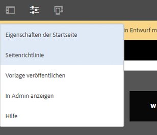
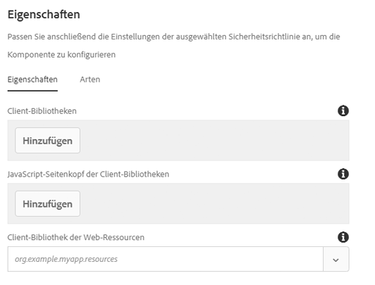

# Seitenkomponente{#page-component}

Die Seitenkomponente ist eine Komponente erweiterbarer Seiten, die für die Zusammenarbeit mit dem [Vorlageneditor](https://helpx.adobe.com/experience-manager/6-5/sites/authoring/using/templates.html) entwickelt wurde, und ermöglicht die Assemblierung von Kopf- und Fußzeilen und Strukturkomponenten mit dem Vorlageneditor.

## Nutzung {#usage}

Die Seitenkomponente bildet die Grundlage aller Seiten, die mit den Kernkomponenten entworfen wurden, sowie bearbeitbare Vorlagen. Mithilfe der Seitenkomponente, Kopfzeilen, Fußzeilen und der Struktur der Seite können Sie als Vorlage mit den anderen Kernkomponenten definiert werden.

Im [Design-Dialogfeld](#design-dialog)können benutzerdefinierte clientseitige Bibliotheken für die Seite definiert werden. Im Gegensatz zu anderen Komponenten, für die ein Bearbeitungsdialogfeld direkt von der Komponente aufgerufen wird, da die Komponente die Seite selbst ist, ist das [Dialogfeld &quot;Bearbeiten](#edit-dialog) &quot; der Seitenkomponente das Fenster&quot; Seiteneigenschaften&quot; .

## Version und Kompatibilität {#version-and-compatibility}

Die aktuelle Version der Seitenkomponente ist v 2, die mit Version 2.0.0 der Kernkomponenten im Januar 2018 eingeführt wurde und in diesem Dokument beschrieben wird.

Die folgende Tabelle enthält alle unterstützten Versionen der Komponente, die AEM-Versionen, mit denen die Versionen der Komponente kompatibel sind, sowie Links zur Dokumentation für frühere Versionen.

| Komponentenversion | AEM 6.3 | AEM 6.4 | AEM 6.5 |
|---|---|---|---|
| [v2](page-v1.md) | Kompatibel | Kompatibel | Kompatibel |
| v1 | Kompatibel | Kompatibel | Kompatibel |

Weitere Informationen zu Core-Komponentenversionen und -versionen finden Sie in den Core [-Komponentenversionen](versions.md).

>[!NOTE]
>
>Um die Umleitung auf Ebene `cq:Page` 2 der Seitenkomponente und AEM 6.3 zu aktivieren, ist [Service Pack 2](https://helpx.adobe.com/experience-manager/6-3/release-notes/sp2-release-notes.html) oder höher erforderlich. Diese Umleitung war in früheren Versionen nicht verfügbar.

## Musterkomponentenausgabe {#sample-component-output}

Nachfolgend finden Sie ein Beispiel aus [We. Retail](https://helpx.adobe.com/experience-manager/6-5/sites/developing/using/we-retail.html).

### Screenshot {#screenshot}

### Technische Details {#technical-details}

Die aktuelle technische Dokumentation zur Seitenkomponente [finden Sie unter github](https://github.com/adobe/aem-core-wcm-components/blob/master/content/src/content/jcr_root/apps/core/wcm/components/page/v2/page).

Weitere Informationen zur Entwicklung Kernkomponenten finden Sie in der [Dokumentation zu Kernkomponenten für Komponenten](developing.md).

## Dialogfeld bearbeiten {#edit-dialog}

Da die Komponente die gesamte Seite darstellt, befinden sich Einstellungen, die normalerweise in einem Bearbeitungsdialogfeld enthalten wären, im Fenster [&quot;Seiteneigenschaften](https://helpx.adobe.com/experience-manager/6-5/sites/authoring/using/editing-page-properties.html) &quot; .

## Design-Dialogfeld {#design-dialog}

Da die Komponente die gesamte Seite darstellt, wird das Design-Dialogfeld über **Seiteninformationen &gt; Seitenrichtlinien** aufgerufen, wenn Sie die Seitenvorlage bearbeiten.

>[!NOTE]
>
>In früheren Versionen von AEM hieß **die Seitenrichtlinie** **Seitendesign**.

### Registerkarte &quot;Eigenschaften « {#properties-tab}

Mithilfe des Fensters &quot;Seitendesign&quot; können Sie die zu ladenden Client-Bibliotheken sowie die Webressourcenbibliothek für die Seite definieren.

* **Client Libraries**
Dies definiert die Kategorien der Client-Bibliothek, die geladen werden sollen. Javascript wird am Textende hinzugefügt und die CSS wird dem Seitenkopf hinzugefügt.
* **Client Libraries javascript Page Head**
Dies definiert die javascript-Client-Bibliothekskategorien, die im Seitenkopf geladen werden.
   * Kategorien, die hier definiert sind und auch im Feld **Client Libraries** vorhanden sind, haben javascript, das anstelle des body-Endes in der Seitenkopfzeile geladen wird.
   * Es wird keine CSS geladen, es sei denn, die Kategorie ist ebenfalls im Feld **Client Libraries** enthalten.

* **Web Resources Client Library**
Die Client-Bibliothekskategorie, mit der Webressourcen wie z. B. favicons bereitgestellt werden.

Bibliotheken können wie folgt für die Felder **Client Libraries** und **Client Libraries javascript Page Head** konfiguriert werden:

* Um ein neues Feld hinzuzufügen, klicken Sie auf die **Schaltfläche** &quot;Hinzufügen&quot; unter den Feldern.
* Um ein Feld zu entfernen, klicken oder tippen Sie neben dem Feld, das entfernt werden soll, auf das Papierkorbsymbol.
* Um die Ladereihenfolge neu anzuordnen, klicken oder ziehen Sie den Griff neben dem Feld, das verschoben werden soll, und ziehen Sie es.

Weitere Informationen zur Verwendung clientseitiger Bibliotheken finden Sie unter [Clientseitige Bibliotheken verwenden](https://helpx.adobe.com/experience-manager/6-5/sites/developing/using/clientlibs.html).

>[!CAUTION]
>
>Die Möglichkeit, Client-Bibliotheken für den Seitenkopf separat zu definieren, wurde mit Version 2.2.0 der Kernkomponenten eingeführt.

### Stile Registerkarte {#styles-tab}

Die Seitenkomponente unterstützt das AEM [-Stilsystem](authoring.md#component-styling).