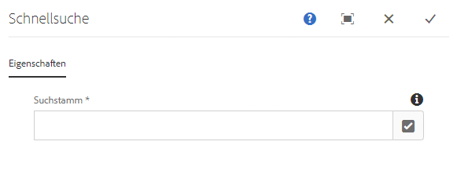
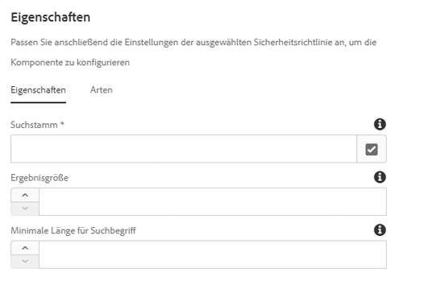

# Schnellsuchkomponente{#quick-search-component}

Die Komponente &quot;Schnellsuche&quot; bietet Suchfunktionen für eine Website und zeigt Suchergebnisse an, damit Besucher mühelos übereinstimmende Inhalte finden und Ergebnisse anzeigen können.

## Nutzung {#usage}

Die Komponente &quot;Schnellsuche&quot; bietet Site-Besuchern die Möglichkeit, nach Inhalten zu suchen, die Ergebnisse ersetzend anzuzeigen und leicht zu den passenden Seiten zu navigieren. Neue Ergebnisse werden dynamisch abgerufen, wenn der Benutzer die Suchergebnisse durchblättert.

Im [Dialogfeld &quot;Bearbeiten](#edit-dialog) &quot; kann der Verfasser des Inhalts festlegen, wo die Suche in der Inhaltsstruktur beginnen soll. Im [Design-Dialogfeld](#design-dialog)kann der Vorlagenautor den Standardwert festlegen, an dem die Suche in der Inhaltsstruktur beginnen soll, sowie eine maximale Ergebnissatzgröße und minimale Suchlänge.

## Version und Kompatibilität {#version-and-compatibility}

Die aktuelle Version der Schnellsuchkomponente ist v 1, die mit Version 2.0.0 der Kernkomponenten im Januar 2018 eingeführt wurde und in diesem Dokument beschrieben wird.

Die folgende Tabelle enthält alle unterstützten Versionen der Komponente, die AEM-Versionen, mit denen die Versionen der Komponente kompatibel sind, sowie Links zur Dokumentation für frühere Versionen.

| Komponentenversion | AEM 6.3 | AEM 6.4 | AEM 6.5 |
|--- |--- |--- |--- |
| v1 | Kompatibel | Kompatibel | Kompatibel |

Weitere Informationen zu Core-Komponentenversionen und -versionen finden Sie in den Core [-Komponentenversionen](versions.md).

## Musterkomponentenausgabe {#sample-component-output}

Nachfolgend finden Sie ein Beispiel aus [We. Retail](https://helpx.adobe.com/experience-manager/6-5/sites/developing/using/we-retail.html).

### Screenshot {#screenshot}


### HTML {#html}

```
<section class="cmp-search" role="search" data-cmp-is="search" data-cmp-min-length="3" data-cmp-results-size="10">
    <form class="cmp-search__form" data-cmp-hook-search="form" method="get" action="/content/we-retail/us/en/equipment.searchresults.json/_jcr_content/root/responsivegrid/search" autocomplete="off">
        <div class="cmp-search__field">
            <i class="cmp-search__icon" data-cmp-hook-search="icon"></i>
            <span class="cmp-search__loading-indicator" data-cmp-hook-search="loadingIndicator"></span>
            <input class="cmp-search__input" data-cmp-hook-search="input" type="text" name="fulltext" placeholder="Search" role="combobox" aria-autocomplete="list" aria-haspopup="true" aria-invalid="false">
            <button class="cmp-search__clear" data-cmp-hook-search="clear">
                <i class="cmp-search__clear-icon"></i>
            </button>
        </div>
    </form>
    <div class="cmp-search__results" data-cmp-hook-search="results" role="listbox" aria-multiselectable="false"></div>
    
<script data-cmp-hook-search="itemTemplate" type="x-template">
    <a class="cmp-search__item" data-cmp-hook-search="item">
        <span class="cmp-search__item-title" data-cmp-hook-search="itemTitle"></span>
    </a>
</script>
</section>
```

### JSON {#json}

```
"search":{  
                     "columnClassNames":"aem-GridColumn aem-GridColumn--default--12",
                     "relativePath":"/jcr:content/root/responsivegrid/search",
                     "resultsSize":10,
                     "searchTermMinimumLength":3,
                     ":type":"core/wcm/components/search/v1/search"
                  }
```

### Technische Details {#technical-details}

>[!NOTE]
>
>Der Schutz der Suchkomponente oder einer beliebigen AEM-basierten Anwendung gegen DOS-Angriffe sollte auf höherer Ebene implementiert werden, z. B. durch Verwendung `mod_security` des Dispatchers.

Die aktuelle technische Dokumentation zur Schnellsuchkomponente [finden Sie unter github](https://github.com/adobe/aem-core-wcm-components/blob/master/content/src/content/jcr_root/apps/core/wcm/components/search/v1/search).

Weitere Informationen zur Entwicklung Kernkomponenten finden Sie in der [Dokumentation zu Kernkomponenten für Komponenten](developing.md).

## Dialogfeld bearbeiten {#edit-dialog}

Im Dialogfeld &quot;Bearbeiten&quot; kann der Verfasser des Inhalts festlegen, wo die Suche in der Inhaltsstruktur beginnen soll.



**Suchstamm** - Die Stammseite, von der aus die Suche gestartet werden soll. Der Suchstamm kann ein Blueprint-Master, ein Master-Master oder eine normale Seite sein.

## Design-Dialogfeld {#design-dialog}

Im Design-Dialogfeld kann der Vorlagenautor den Standardwert festlegen, an dem die Suche in der Inhaltsstruktur beginnen soll, sowie eine maximale Ergebnissatzgröße und minimale Suchlänge. Das Vorlagendialogfeld ermöglicht dem Vorlagenautor, die für die Inhaltsautoren verfügbaren Textformatierungsoptionen zu definieren.

### Registerkarte &quot;Eigenschaften « {#properties-tab}



* **Suche Root**
Der Standardwert des Suchstamms, wenn ein Content-Autor die Schnellsuchkomponente auf einer Inhaltsseite platziert
* **Ergebnisgröße**
Die maximale Anzahl von Ergebnissen, die durch eine Suchanfrage abgerufen werden
* **Mindestlänge des Suchbegriffs** Mindestlänge des Suchbegriffs, um die Suche zu starten

>[!NOTE]
>
>**Die minimale** Länge und **die Mindestlänge** des Suchbegriffs können nur im Designmodus festgelegt werden und daher nur auf Vorlagenebene, d. h. Inhaltsautoren können diese Werte nicht ändern.

>[!CAUTION]
>
>**Die minimale** Länge **und die Mindestlänge** des Suchbegriffs können Auswirkungen auf die Leistung haben, wenn sie zu hoch oder zu niedrig eingestellt sind.

### Stile Registerkarte {#styles-tab}

Die Komponente &quot;Schnellsuche&quot; unterstützt das AEM [-Stilsystem](authoring.md#component-styling).