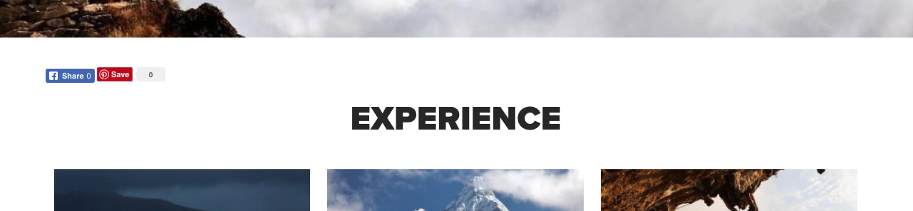

# Social Sharing-Komponente{#social-sharing-component}

Die Social Sharing-Komponente &quot;Core Component&quot; ist ein Facebook- und Pinterest-Freigabewidget.

## Nutzung {#usage}

Die Social Sharing-Komponente fügt Links für Facebook und Pinterest zur Seite hinzu. Es wird häufig in Seitenkopf- oder Fußzeilen einbezogen.

Im Gegensatz zu anderen Komponenten werden die Einstellungen für die Social Sharing-Komponente vom Vorlagenautor über [die Eigenschaften Initial Page und](https://helpx.adobe.com/experience-manager/6-5/sites/authoring/using/templates.html) vom Inhaltsautor über [Seiteneigenschaften vorgenommen](https://helpx.adobe.com/experience-manager/6-5/sites/authoring/using/editing-page-properties.html).

## Version und Kompatibilität {#version-and-compatibility}

Die aktuelle Version der Social Sharing-Komponente ist v 1, die mit Version 1.0.0 der Kernkomponenten mit AEM 6.3 eingeführt wurde und in diesem Dokument beschrieben wird.

Die folgende Tabelle enthält alle unterstützten Versionen der Komponente und die AEM-Versionen, mit denen die Versionen der Komponente kompatibel sind.

| Komponentenversion | AEM 6.3 | AEM 6.4 | AEM 6.5 |
|--- |--- |--- |--- |
| v1 | Kompatibel | Kompatibel | Kompatibel |

Weitere Informationen zu Core-Komponentenversionen und -versionen finden Sie in den Core [-Komponentenversionen](versions.md).

## Musterkomponentenausgabe {#sample-component-output}

Nachfolgend finden Sie ein Beispiel aus [We. Retail](https://helpx.adobe.com/experience-manager/6-5/sites/developing/using/we-retail.html).

### Screenshot {#screenshot}

### Komponentenbibliothek

Um die Social Sharing-Komponente sowie Beispiele für die Konfigurationsoptionen sowie HTML- und JSON-Ausgaben zu erhalten, besuchen Sie die [Komponentenbibliothek](http://opensource.adobe.com/aem-core-wcm-components/library/social-sharing.html).

### Technische Details {#technical-details}

Die aktuelle technische Dokumentation zur Freigabe-Komponente [finden Sie unter github](https://github.com/adobe/aem-core-wcm-components/blob/master/content/src/content/jcr_root/apps/core/wcm/components/sharing/v1/sharing).

Weitere Informationen zur Entwicklung Kernkomponenten finden Sie in der [Dokumentation zu Kernkomponenten für Komponenten](developing.md).

## Dialogfeld bearbeiten {#edit-dialog}

Da die Freigabe spezielle Seitenüberschriften erfordert, muss jede Freigabe auf Seitenebene aktiviert werden. Daher sind die Bearbeitungsoptionen für die Freigabekomponente für den Inhaltsautor über die Registerkarte &quot;Freigeben&quot; die [Seiteneigenschaften verfügbar](https://helpx.adobe.com/experience-manager/6-5/sites/authoring/using/editing-page-properties.html).

## Design-Dialogfeld {#design-dialog}

Da die Freigabe spezielle Seitenüberschriften erfordert, muss jede Freigabe auf Seitenebene aktiviert werden. Daher sind die Designoptionen für die Freigabe-Komponente für den Vorlagenautor über die [ersten Seiteneigenschaften verfügbar](https://helpx.adobe.com/experience-manager/6-5/sites/authoring/using/templates.html).