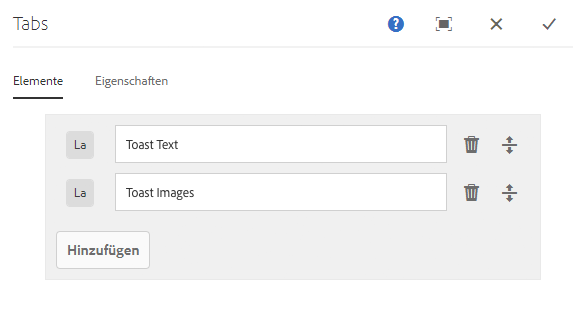
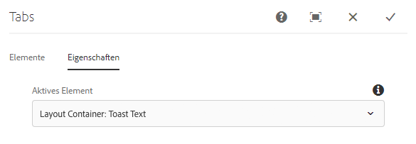

# Registerkarten-Komponente

Die Komponente Komponente Core-Komponente ermöglicht die Inhaltsorganisation auf mehreren Registerkarten.

## Nutzung {#usage}

Mit der Registerkartenkomponente kann der Inhaltsautor Seiteninhalte innerhalb mehrerer Registerkarten organisieren.

Im [Dialogfeld &quot;Bearbeiten](#edit-dialog) &quot; kann der Inhaltsautor mehrere Registerkarten definieren sowie die aktive Registerkarte festlegen. Im [Design-Dialogfeld](#design-dialog)kann der Vorlagenautor definieren, welche Komponenten zu Registerkarten hinzugefügt werden können, und die Stile anpassen.

>[!NOTE]
>
>Verschachtelte Registerkartenkomponenten (Registerkarten innerhalb Registerkarten) werden unterstützt.
>
>Einfache (nicht verschachtelte) Registerkartenkomponenten können über die [Inhaltsstruktur](https://helpx.adobe.com/experience-manager/6-5/sites/authoring/using/author-environment-tools.html)/ausgewählt werden, jedoch nicht verschachtelte Registerkarten.

## Version und Kompatibilität {#version-and-compatibility}

Die aktuelle Version der Tabs-Komponente ist v 1, die mit Version 2.2.0 der Kernkomponenten im Oktober 2018 eingeführt wurde und in diesem Dokument beschrieben wird.

Die folgende Tabelle enthält alle unterstützten Versionen der Komponente, die AEM-Versionen, mit denen die Versionen der Komponente kompatibel sind, sowie Links zur Dokumentation für frühere Versionen.

| Komponentenversion | AEM 6.3 | AEM 6.4 | AEM 6.5 |
|--- |--- |--- |--- |
| v1 | Kompatibel | Kompatibel | Kompatibel |

Weitere Informationen zu Core-Komponentenversionen und -versionen finden Sie in den Core [-Komponentenversionen](versions.md).

## Musterkomponentenausgabe {#sample-component-output}

Im Folgenden finden Sie ein Beispiel aus [We. Retail](https://helpx.adobe.com/experience-manager/6-5/sites/developing/using/we-retail.html).

### Screenshot {#screenshot}

### Komponentenbibliothek

Rufen Sie die [Komponentenbibliothek auf, um die Registerkarten-Komponente sowie Beispiele für die Konfigurationsoptionen sowie die HTML- und JSON-Ausgabe zu erhalten](http://opensource.adobe.com/aem-core-wcm-components/library/tabs.html).

### Technische Details {#technical-details}

Die aktuelle technische Dokumentation zur Tabulatorkomponente [finden Sie unter github](https://github.com/adobe/aem-core-wcm-components/blob/master/content/src/content/jcr_root/apps/core/wcm/components/tabs/v1/tabs).

Weitere Informationen zur Entwicklung Kernkomponenten finden Sie in der [Dokumentation zu Kernkomponenten für Komponenten](developing.md).

## Dialogfeld bearbeiten {#edit-dialog}

Im Dialogfeld &quot;Bearbeiten&quot; kann der Inhaltsautor Registerkarten erstellen, umbenennen und neu anordnen sowie die aktive Registerkarte definieren.

### Registerkarte &quot;Elemente « {#items-tab}

Verwenden Sie **die Schaltfläche Hinzufügen** , um die Komponentenauswahl zu öffnen, um auszuwählen, welche Komponente als Registerkarte hinzugefügt werden soll. Nach dem Hinzufügen wird der Liste ein Eintrag hinzugefügt, der die folgenden Spalten enthält:

* **Symbol** - Das Symbol des Komponententyps zur einfachen Identifizierung in der Liste. Bewegen Sie den Mauszeiger über den vollständigen Komponentennamen als quickinfo.
* **Beschreibung** : Die Beschreibung, die als Text der Registerkarte verwendet wird und standardmäßig den Namen der für die Registerkarte ausgewählten Komponente enthält.
* **Löschen** - Tippen oder klicken Sie auf, um die Registerkarte aus der Registerkartenkomponente zu löschen.
* **Neu anordnen** - Tippen oder klicken Sie auf, um die Reihenfolge der Registerkarten neu anzuordnen.

### Registerkarte &quot;Eigenschaften « {#properties-tab}

Auf der **Registerkarte &quot;Eigenschaften** &quot; kann der Inhaltsautor definieren, welche Registerkarte aktiv ist, wenn die Seite geladen wird. Mit der **Option &quot;Standard&quot;** wird die erste Registerkarte ausgewählt.

## Bereich auswählen {#select-panel}

Der Inhaltsautor kann in der **Komponentensymbolleiste die** Option &quot;Bedienfeld auswählen&quot; verwenden, um zu einem anderen Bereich zu wechseln und die Reihenfolge der Registerkarten einfach zu ändern.

Nach Auswahl der **Option Bedienfeld** auswählen in der Komponenten-Symbolleiste werden die konfigurierten Registerkarten als Dropdown-Liste angezeigt.

* Die Liste wird durch die zugewiesene Anordnung der Registerkarten angeordnet und wird in der Nummerierung angezeigt.
* Der Komponententyp der Registerkarte wird zuerst angezeigt, gefolgt von der Beschreibung der Registerkarte in hellere Schriftart.

* Durch Tippen oder Klicken auf einen Eintrag in der Dropdown-Liste wird die Ansicht im Editor auf diese Registerkarte verschoben.
* Die Registerkarten können mithilfe der Ziehpunkte neu angeordnet werden.

>[!NOTE]
>
>Registerkarten können vom Autor im **Bearbeitungsmodus** nicht ausgewählt werden. Verwenden [**Sie** den Vorschaumodus](https://helpx.adobe.com/experience-manager/6-5/sites/authoring/using/editing-content.html) **[oder die Option &quot;Als veröffentlicht](https://helpx.adobe.com/experience-manager/6-5/sites/authoring/using/editing-content.html)** anzeigen&quot; , um mit den Registerkarten als Leser des veröffentlichten Inhalts zu interagieren.

## Design-Dialogfeld {#design-dialog}

Im Design-Dialogfeld kann der Vorlagenautor definieren, welche Komponenten der Registerkartenkomponente als Elemente hinzugefügt werden können. Außerdem können Sie festlegen, welche benutzerdefinierten Stile dem Inhaltsautor zur Verfügung stehen.

### Registerkarte &quot;Zulässige Komponenten « {#allowed-components-tab}

Über die Registerkarte **&quot;Zulässige Komponenten** &quot; können Sie definieren, welche Komponenten der Registerkarten-Komponente vom Inhaltsautor als Elemente hinzugefügt werden können.

Die Registerkarte &quot;Zulässige Komponenten&quot; funktioniert auf die gleiche Weise wie die Registerkarte desselben Namens beim [Definieren der Richtlinie und Eigenschaften eines Layoutcontainers im Vorlageneditor.](https://helpx.adobe.com/experience-manager/6-5/sites/authoring/using/templates.html)

### Stile Registerkarte {#styles-tab}

Die Tabs-Komponente unterstützt das AEM [-Stilsystem](authoring.md#component-styling).