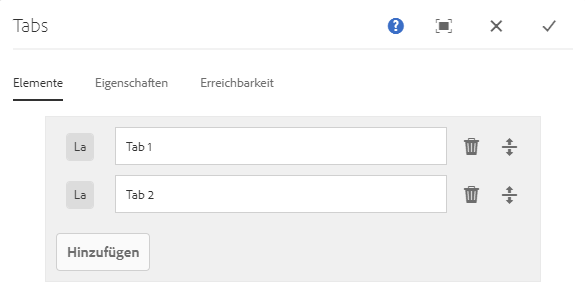
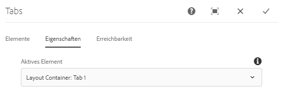
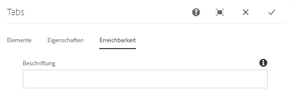
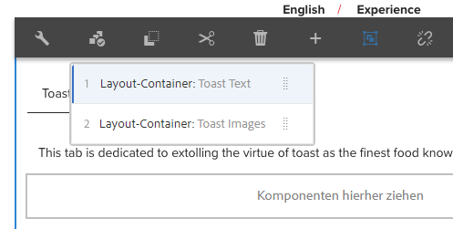

# Registerkarten-Komponente

Die Kernkomponente Registerkarten-Komponente ermöglicht die Organisation von Inhalten auf mehrere Registerkarten.

## Nutzung {#usage}

Mit der Registerkarten-Komponente kann der Inhaltsautor Seiteninhalte über mehrere Registerkarten organisieren.

Im [Dialogfeld „Bearbeiten“](#edit-dialog) kann der Inhaltsautor mehrere Registerkarten definieren sowie die aktive Registerkarte festlegen. Mithilfe des [Dialogfelds „Design“](#design-dialog) kann der Vorlagenautor definieren, welche Komponenten zu Registerkarten hinzugefügt werden können, und die Stile anpassen.

>[!NOTE]
>
>Verschachtelte Registerkarten-Komponenten (Registerkarten innerhalb Registerkarten) werden unterstützt.
>
>Einfache (nicht verschachtelte) Registerkarten-Komponenten können mithilfe des [Inhaltsbaums](https://helpx.adobe.com/de/experience-manager/6-5/sites/authoring/using/author-environment-tools.html) lokalisiert/ausgewählt werden, verschachtelte Registerkarten jedoch nicht.

## Version und Kompatibilität {#version-and-compatibility}

Die aktuelle Version der Registerkarten-Komponente ist v1, die mit Version 2.2.0 der Kernkomponenten im Oktober 2018 eingeführt wurde und in diesem Dokument beschrieben wird.

Die folgende Tabelle enthält alle unterstützten Versionen der Komponente, die AEM-Versionen, mit denen die Versionen der Komponente kompatibel sind, sowie Links zur Dokumentation für frühere Versionen.

| Komponentenversion | AEM 6.3 | AEM 6.4 | AEM 6.5 |
|--- |--- |--- |--- |
| v1 | Kompatibel | Kompatibel | Kompatibel |

Weitere Informationen zu Kernkomponentenversionen und -freigaben finden Sie in den [Kernkomponentenversionen](versions.md).

## Musterkomponentenausgabe {#sample-component-output}

Um die Registerkarten-Komponente auszuprobieren sowie Beispiele für ihre Konfigurationsoptionen sowie HTML- und JSON-Ausgaben zu erhalten, besuchen Sie die [Komponentenbibliothek](http://opensource.adobe.com/aem-core-wcm-components/library/tabs.html).

### Technische Details {#technical-details}

Die aktuelle technische Dokumentation zur Registerkarten-Komponente [finden Sie auf GitHub](https://github.com/adobe/aem-core-wcm-components/blob/master/content/src/content/jcr_root/apps/core/wcm/components/tabs/v1/tabs).

Weitere Informationen zur Entwicklung von Kernkomponenten finden Sie in der [Dokumentation zu Kernkomponenten für Entwickler](developing.md).

## Dialogfeld „Bearbeiten“ {#edit-dialog}

Im Dialogfeld „Bearbeiten“ kann der Inhaltsautor Registerkarten erstellen, umbenennen und neu anordnen sowie die aktive Registerkarte definieren.

### Registerkarte „Elemente“ {#items-tab}

Verwenden Sie die Schaltfläche **Hinzufügen**, um die Komponentenauswahl zu öffnen und dort auszuwählen, welche Komponente als Registerkarte hinzugefügt werden soll. Nach dem Hinzufügen wird der Liste ein Eintrag hinzugefügt, der die folgenden Spalten enthält:

* **Symbol** - Das Symbol des Komponententyps der Registerkarte zur einfachen Identifizierung in der Liste. Bewegen Sie den Mauszeiger darüber, um den vollständigen Komponentennamen als QuickInfo zu sehen.
* **Beschreibung** - Die Beschreibung, die als Text der Registerkarte verwendet wird und standardmäßig den Namen der für die Registerkarte ausgewählten Komponente enthält.
* **Entfernen** - Tippen oder klicken Sie darauf, um die Registerkarte aus der Registerkarten-Komponente zu löschen.
* **Neu anordnen** - Tippen oder klicken Sie darauf, um die Reihenfolge der Registerkarten neu anzuordnen.

>[!TIP]
>
>Wenn der Viewport der Seite so reduziert wird, dass das Bearbeitungsdialogfeld im Vollbildmodus angezeigt wird, ist die Schaltfläche **Hinzufügen** ausgeblendet. Sie können der Registerkarten-Komponente weiterhin Komponenten hinzufügen, indem Sie sie [per Drag-and-Drop aus dem Komponenten-Browser ziehen und im Seiteneditor auf der Registerkarten-Komponente ablegen](https://helpx.adobe.com/de/experience-manager/6-5/sites/authoring/using/editing-content.html#InsertingaComponent).

### Registerkarte „Eigenschaften“{#properties-tab}

Auf der Registerkarte **Eigenschaften** kann der Inhaltsautor definieren, welche Registerkarte aktiv ist, wenn die Seite geladen wird. Mit der Option **Standard** wird die erste Registerkarte ausgewählt.

### Registerkarte „Barrierefreiheit“ {#accessibility-tab}

Auf der Registerkarte **Barrierefreiheit** können Werte für die [ARIA-Barrierefreiheits-Bezeichungen](https://www.w3.org/WAI/standards-guidelines/aria/) für die Komponente festgelegt werden.

* **Bezeichnung** - Wert eines ARIA-Bezeichnungs-Attributs für die Komponente

## Bedienfeld auswählen {#select-panel}

Der Inhaltsautor kann in der Komponenten-Symbolleiste die Option **Bedienfeld auswählen** verwenden, um zu einem anderes Bedienfeld zu wechseln, um es zu bearbeiten, und auch um die Reihenfolge der Registerkarten einfach zu ändern.

Nach Auswahl der Option **Bedienfeld auswählen** in der Komponenten-Symbolleiste werden die konfigurierten Registerkarten als Dropdown-Liste angezeigt.

* Die Liste wird im Sinne der zugewiesenen Anordnung der Registerkarten geordnet, was sich auch in der Nummerierung zeigt.
* Der Komponententyp der Registerkarte wird zuerst angezeigt, gefolgt von der Beschreibung der Registerkarte in hellerer Schriftart.

* Durch Tippen oder Klicken auf einen Eintrag in der Dropdown-Liste wird die Ansicht im Editor auf diese Registerkarte verschoben.
* Die Registerkarten können direkt mithilfe der Ziehgriffe neu angeordnet werden.

>[!NOTE]
>
>Registerkarten können vom Autor im **Bearbeiten**-Modus nicht ausgewählt werden. Verwenden Sie den [**Vorschaumodus**](https://helpx.adobe.com/de/experience-manager/6-5/sites/authoring/using/editing-content.html) oder die Option **[Als veröffentlicht anzeigen](https://helpx.adobe.com/de/experience-manager/6-5/sites/authoring/using/editing-content.html)**, um so mit den Registerkarten zu interagieren, wie es ein Leser des veröffentlichten Inhalts tun würde.

## Dialogfeld „Design“ {#design-dialog}

Im Dialogfeld „Design“ kann der Vorlagenautor definieren, welche Komponenten zu der Registerkarten-Komponente als Elemente hinzugefügt werden können. Außerdem kann er festlegen, welche benutzerdefinierten Stile dem Inhaltsautor zur Verfügung stehen.

### Registerkarte „Zugelassene Komponenten“{#allowed-components-tab}

Über die Registerkarte **Zulässige Komponenten** können Sie definieren, welche Komponenten vom Inhaltsautor als Elemente zur Registerkarten-Komponente hinzugefügt werden können.

Die Registerkarte „Zugelassene Komponenten“ funktioniert auf die gleiche Weise wie die Registerkarte desselben Namens beim [Definieren der Richtlinie und Eigenschaften eines Layoutcontainers im Vorlageneditor.](https://helpx.adobe.com/de/experience-manager/6-5/sites/authoring/using/templates.html)

### Registerkarte „Stile“ {#styles-tab}

Die Registerkarten-Komponente unterstützt das AEM-[Stilsystem](authoring.md#component-styling).
