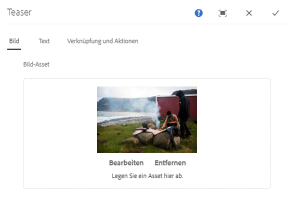
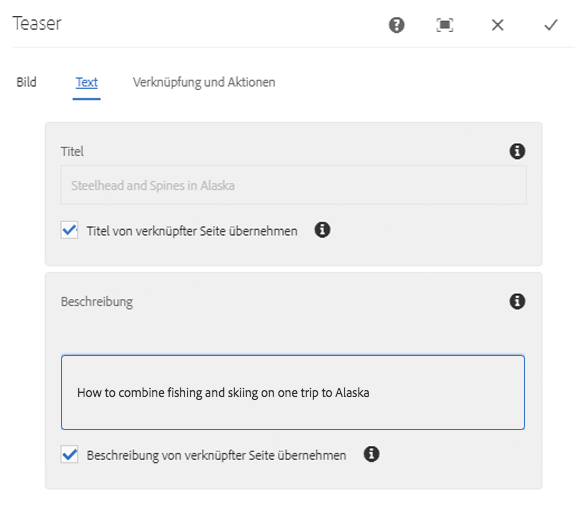
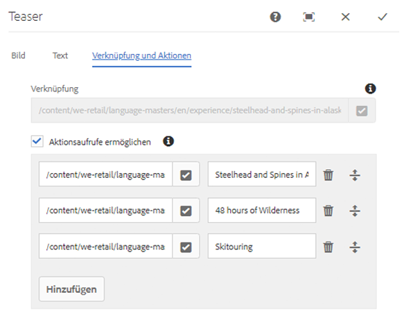
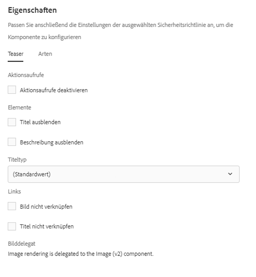

# Teaser-Komponente{#teaser-component}

Die Kernkomponente Teaser-Komponente kann ein Bild, einen Titel, Rich-Text und optional einen Link zu weiteren Inhalten anzeigen.

## Nutzung {#usage}

Mit der Teaser-Komponente kann der Inhaltsautor problemlos einen Teaser für weitere Inhalte erstellen, indem er ein Bild, einen Titel oder einen Rich Text verwendet und Links zu weiteren Inhalten oder anderen Aktionen erstellt.

Der Vorlagenautor kann das [Dialogfeld „Design“](#design-dialog) verwenden, um zu definieren, ob die Optionen zum Erstellen von Aktionsaufrufen und zum Hinzufügen von Links verfügbar sind sowie verschiedene Anzeigeoptionen deaktivieren. Der Inhaltsautor kann das [Dialogfeld „Konfigurieren“](#configure-dialog) verwenden, um ein Bild festzulegen, CTAs zu definieren, Titel und Beschreibungen festzulegen und Links zum jeweiligen Teaser zu konfigurieren. Es kann auf das [Dialogfeld „Bearbeiten“](image.md#edit-dialog) der [Bild-Komponente](image.md) zugegriffen werden, um das Bild des Teasers zu ändern.

## Version und Kompatibilität {#version-and-compatibility}

Die aktuelle Version der Teaser-Komponente ist v1, die mit Version 2.1.0 der Kernkomponenten im Juli 2018 eingeführt wurde und in diesem Dokument beschrieben wird.

Die folgende Tabelle enthält alle unterstützten Versionen der Komponente, die AEM-Versionen, mit denen die Versionen der Komponente kompatibel sind, sowie Links zur Dokumentation für frühere Versionen.

| Komponentenversion | AEM 6.3 | AEM 6.4 | AEM 6.5 |
|---|---|---|---|
| v1 | Kompatibel | Kompatibel | Kompatibel |

## Musterkomponentenausgabe {#sample-component-output}

To experience the Teaser Component as well as see examples of its configuration options as well as HTML and JSON output, visit the [Component Library](http://opensource.adobe.com/aem-core-wcm-components/library/teaser.html).

### Technische Details {#technical-details}

Die aktuelle technische Dokumentation zur Teaser-Komponente [finden Sie auf GitHub](https://github.com/adobe/aem-core-wcm-components/blob/master/content/src/content/jcr_root/apps/core/wcm/components/teaser/v1/teaser).

Weitere Informationen zur Entwicklung von Kernkomponenten finden Sie in der [Dokumentation zu Kernkomponenten für Entwickler](developing.md).

## Dialogfeld „Konfigurieren“ {#configure-dialog}

Der Inhaltsautor kann das Dialogfeld „Konfigurieren“ verwenden, um die Eigenschaften des einzelnen Teasers zu definieren. Es gibt auch ein [Dialogfeld „Bearbeiten“](#edit-dialog) zum Bearbeiten des Teaserbilds, wenn eines ausgewählt ist.

### Bild{#image}

* **Bild-Asset**
   * Drop an asset from the [asset browser](https://helpx.adobe.com/experience-manager/6-5/sites/authoring/using/author-environment-tools.html) or tap the **browse** option to upload from a local file system.
   * Tippen oder klicken Sie auf **Löschen**, um das aktuell ausgewählte Bild zu deaktivieren.
   * Tap or click **Edit** to [mange the renditions of the asset](https://helpx.adobe.com/experience-manager/6-5/assets/using/managing-assets-touch-ui.html) in the asset editor.

### Text {#text}

* **Titel**
Definiert einen Titel, der als Überschrift für den Teaser angezeigt wird.
* **Titel von verknüpfter Seite abrufen**
Wenn aktiviert, wird der Titel mit dem Titel der verknüpften Seite ausgefüllt.
* **Beschreibung**
Definiert eine Beschreibung, die als Untertitel des Teasers angezeigt wird.
* **Beschreibung von verknüpfter Seite erhalten**
Wenn aktiviert, wird die Beschreibung mit der Beschreibung der verknüpften Seite ausgefüllt.

### Links und Aktionen {#links-actions}

* **Link**
Link, der auf den Teaser angewendet wird. Verwenden Sie den Pfad-Browser, um das Link-Ziel auszuwählen.
* **Aktivieren von Aktionsaufrufen**
Wenn aktiviert, ermöglicht die Definition von Aktionsaufrufen. Der erste Link zu Aktionsaufrufen in der Liste wird als Link für andere Teaser-Elemente verwendet.

## Dialogfeld „Bearbeiten“ {#edit-dialog}

Die Teaser-Komponente delegiert das Rendern von Bildern an die [Bild-Komponente](image.md). Daher wird das [Dialogfeld „Bearbeiten“] dem Inhaltsautor zur Bearbeitung des Teaserbilds zur Verfügung gestellt.

## Dialogfeld „Design“ {#design-dialog}

Das Dialogfeld „Design“ ermöglicht es dem Vorlagenautor, die Teaser-Optionen zu definieren, die der Inhaltsautor bei Verwendung dieser Komponente hat.

### Registerkarte „Teaser“ {#teaser-tab}

* **Aktionsaufrufe**
   * **Deaktivieren von Aktionsaufrufen**
Blendet die Option**Aktionsaufrufe** für Inhaltsautoren aus.
* **Elemente**
   * **Titel ausblenden**
      * Blendet die Option **Titel** für Inhaltsautoren aus
      * Nach der Auswahl wird der **Titeltyp** ausgeblendet
   * **Beschreibung ausblenden**
Versteckt die Option **Beschreibung** für Inhaltsautoren
* **Titeltyp**
Definiert das H-Tag, das vom Titel des Teasers verwendet werden soll.
* **Links**
   * **Das Bild nicht verknüpfen**
Wenn ausgewählt, wird das Teaser-Bild nicht verknüpft.
   * **Den Titel nicht verknüpfen**
Wenn ausgewählt, wird der Teaser-Titel nicht verknüpft.

### Registerkarte „Stile“ {#styles-tab}

Die Teaser-Komponente unterstützt das AEM-[Stilsystem](authoring.md#component-styling).
