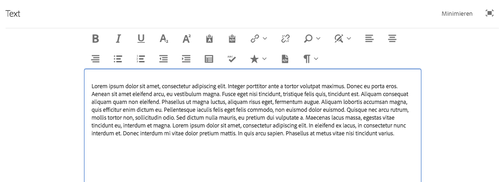
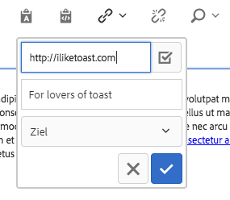
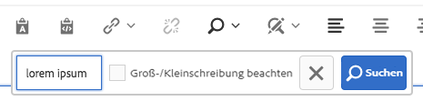
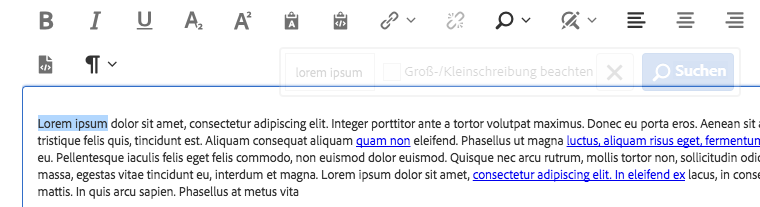
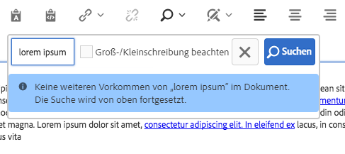
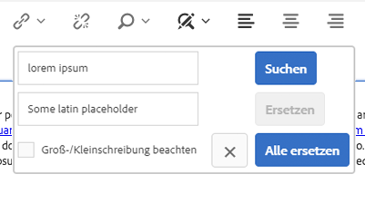
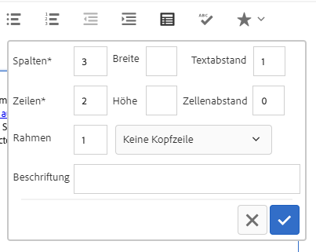
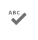
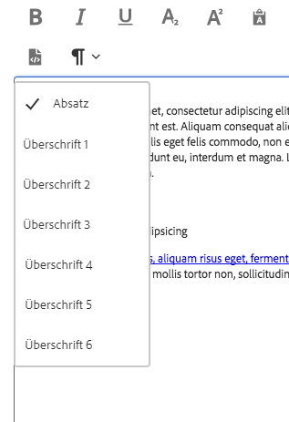

# Textkomponente (v1){#text-component-v}

Die Textkomponente ist eine Komponente zur Bearbeitung und Zusammensetzung von Rich-Texten, die eine direkte Bearbeitung ermöglicht.

## Nutzung {#usage}

Die Textkomponente bietet einen robusten Rich-Text-Editor, der eine einfache Textbearbeitung in einem vereinfachten Inline-Editor sowie ein Vollbildformat ermöglicht.

Das [Dialogfeld „Bearbeiten“](text-v1.md#main-pars_title) verfügt über eine Inline-Bearbeitung mit eingeschränkten Optionen, während im Vollbildbearbeitungsdialogfeld alle Funktionen verfügbar sind. Mithilfe des [Dialogfelds „Design“](text-v1.md#main-pars_title_1995166862) können Textformatierungsoptionen wie Überschriften, Sonderzeichen und Absatzstile für die Vorlage für den Inhaltsautor konfiguriert werden.

## Version und Kompatibilität {#version-and-compatibility}

In diesem Dokument wird die v1 der Textkomponente beschrieben, die ursprünglich mit Version 1.0.0 der Kernkomponenten mit AEM 6.3 eingeführt wurde.

In der folgenden Tabelle ist die Kompatibilität von v1 der Textkomponente aufgeführt.

| AEM-Version | Textkomponente v1 |
|--- |--- |
| 6.3 | Kompatibel |
| 6.4 | Kompatibel |

>[!CAUTION]
>
>In diesem Dokument wird v1 der Textkomponente beschrieben.
>
>Weitere Informationen zur aktuellen Version der Textkomponente finden Sie im Dokument [Textkomponente](text.md).

## Musterkomponentenausgabe {#sample-component-output}

Folgendes Beispiel wurde von [We.Retail](https://helpx.adobe.com/experience-manager/6-4/sites/developing/using/we-retail.html) übernommen.

### Screenshot {#screenshot}


### HTML {#html}

```
<div class="cmp cmp-text aem-GridColumn aem-GridColumn--default--12">
<p>Lorem ipsum dolor sit amet, consectetur adipiscing elit. Integer porttitor ante a tortor volutpat maximus. Donec eu porta eros. Aenean sit amet eleifend arcu, eu vestibulum magna. Fusce eget nisi tincidunt, tristique felis quis, tincidunt est. Aliquam consequat aliquam quam non eleifend. Phasellus ut magna luctus, aliquam risus eget, fermentum augue. Aliquam lobortis accumsan magna, quis efficitur enim dictum eu. Pellentesque iaculis felis eget felis commodo, non euismod dolor euismod. Quisque nec arcu rutrum, mollis tortor non, sollicitudin odio. Sed dictum nulla mauris, eu pretium dui vulputate a. Maecenas lacus massa, egestas vitae tincidunt eu, interdum et magna. Lorem ipsum dolor sit amet, consectetur adipiscing elit. In eleifend ex lacus, in consectetur nunc interdum et. Donec interdum mi vitae dolor pretium mattis. In quis arcu sapien. Phasellus at metus vitae nisi tincidunt varius.<br />
</p>
</div>
```

### JSON {#json}

```
"text": {
              "columnClassNames": "aem-GridColumn aem-GridColumn--default--12",
              "text": "<p>Lorem ipsum dolor sit amet, consectetur adipiscing elit. Integer porttitor ante a tortor volutpat maximus. Donec eu porta eros. Aenean sit amet eleifend arcu, eu vestibulum magna. Fusce eget nisi tincidunt, tristique felis quis, tincidunt est. Aliquam consequat aliquam quam non eleifend. Phasellus ut magna luctus, aliquam risus eget, fermentum augue. Aliquam lobortis accumsan magna, quis efficitur enim dictum eu. Pellentesque iaculis felis eget felis commodo, non euismod dolor euismod. Quisque nec arcu rutrum, mollis tortor non, sollicitudin odio. Sed dictum nulla mauris, eu pretium dui vulputate a. Maecenas lacus massa, egestas vitae tincidunt eu, interdum et magna. Lorem ipsum dolor sit amet, consectetur adipiscing elit. In eleifend ex lacus, in consectetur nunc interdum et. Donec interdum mi vitae dolor pretium mattis. In quis arcu sapien. Phasellus at metus vitae nisi tincidunt varius.</p>\n",
              "richText": true,
              ":type": "weretail/components/content/text"
            }
```

>[!NOTE]
>
>Für JSON-Exporte aus den Kernkomponenten ist Version 1.1.0 der Kernkomponenten erforderlich. Weitere Informationen finden Sie in den [Kompatibilitätsinformationen für Kernkomponenten v1](versions.md#main-pars_title_236368006).

## Dialogfeld „Bearbeiten“ {#edit-dialog}

Das Dialogfeld „Bearbeiten“ bietet die standardmäßigen Rich-Text-Formatierungswerkzeuge, die ein Benutzer wahrscheinlich erwarten würde, um Text zu verfassen.



* Fett

   

   Wird verwendet, um eine fette Formatierung auf den ausgewählten Text anzuwenden oder den nach dem Cursor eingegebenen Text fett zu formatieren.

   **Strg+B** kann als Tastaturbefehl verwendet werden.

* Kursiv

   

   Wird verwendet, um eine kursive Formatierung auf den ausgewählten Text anzuwenden oder nach dem Cursor eingegebenen Text kursiv zu formatieren.

   **Strg+I** kann als Tastaturbefehl verwendet werden.

* Unterstrichen

   

   Wird verwendet, um eine unterstrichene Formatierung auf den ausgewählten Text anzuwenden oder Text, der nach dem Cursor eingegeben wird, zu unterstreichen.

   **Strg+U** kann als Tastaturbefehl verwendet werden.

* Tiefgestellt

   

   Wird verwendet, um ausgewählten Text oder Text, der nach dem Cursor eingegeben wird, als tiefgestellt zu formatieren.

* Hochgestellt

   

   Wird verwendet, um ausgewählten Text oder Text, der nach dem Cursor eingegeben wird, als hochgestellt zu formatieren.

* Als Text einfügen

   

   Fügt einen kopierten Text als normalen Text ohne Formatierung ein.

   Wenn Sie diese Option wählen, wird ein Fenster geöffnet, in dem der Text als normaler Text ohne Formatierung eingefügt werden kann, bevor er in den Text eingefügt wird. Akzeptieren durch Tippen oder Klicken auf das Häkchen, abbrechen durch Tippen oder Klicken auf das x.

   

* Aus Word einfügen

   

   Wenn Sie diese Option wählen, wird ein Fenster geöffnet, in dem der formatierte Text als Vorschau eingefügt werden kann, bevor er in den Text eingefügt wird. Akzeptieren durch Tippen oder Klicken auf das Häkchen, abbrechen durch Tippen oder Klicken auf das x.

   

* Hyperlink

   

   Mit dieser Option können Sie den ausgewählten Text in einen Hyperlink konvertieren oder einen bereits definierten Link ändern. Diese Option ist nur aktiv, wenn bereits Text ausgewählt ist, und öffnet ein Fenster mit zusätzlichen Optionen zum Festlegen des Links.

   

   * Adresse eingeben

      * Wählen Sie im Dialogfeld „Auswahl öffnen“ einen Pfad in AEM aus.
      * Wenn sich der Link nicht in AEM befindet, geben Sie die absolute URL ein (nicht absolute Pfade werden als relativ zu AEM interpretiert)
   * Alternativen beschreibenden Text für den Link eingeben
   * Linkverhalten auswählen

      * Target
      * Selbe Registerkarte
      * Neue Registerkarte
      * Übergeordneter Frame
      * Top-Frame
   Tippen oder klicken Sie auf das Häkchen, um den Link anzuwenden, oder auf das x, um abzubrechen.

* Verknüpfung aufheben

   

   Mit dieser Option können Sie einen bereits auf den ausgewählten Text angewendeten Link entfernen. Diese Option ist nur aktiv, wenn bereits ein Link ausgewählt ist.

* Suchen

   

   Verwenden Sie diese Option, um den Text auf das Vorkommen einer angegebenen Textzeichenfolge zu durchsuchen. Wenn Sie diese Option auswählen, wird ein Fenster zum Festlegen der Suchoptionen geöffnet.

   

   Geben Sie den Text ein, nach dem Sie suchen möchten, und tippen oder klicken Sie auf **Suchen**, um die Suche zu starten. Tippen Sie auf das x, um abzubrechen.


   Wenn Sie eine genaue Übereinstimmung der Groß- und Kleinschreibung möchten, wählen Sie die Option **Groß-/Kleinschreibung berücksichtigen**, bevor Sie die Suche starten.

   Wenn eine Übereinstimmung gefunden wird, wird sie hervorgehoben und das Suchdialogfeld wird abgeblendet. Tippen oder klicken Sie im abgeblendeten Dialogfeld erneut auf die Schaltfläche **Suchen**, um nach dem nächsten Vorkommen zu suchen.

   

   Wenn keine weiteren Vorkommen gefunden werden, wird eine Meldung angezeigt und die Suche wird am Anfang des Texts neu gestartet.

   

* Ersetzen

   

   Verwenden Sie diese Option, um den Text nach dem Vorkommen einer angegebenen Textzeichenfolge zu durchsuchen und die Übereinstimmungen durch eine andere Zeichenfolge zu ersetzen. Wenn Sie diese Option auswählen, wird ein Fenster zum Festlegen der Optionen für Suchen und Ersetzen geöffnet.

   

   Geben Sie den Text ein, für den Sie eine Suche durchführen möchten, sowie den Text, durch den er ersetzt werden soll.

   Tippen oder klicken Sie auf **Suchen**, um mit der Suche zu beginnen. Klicken oder tippen Sie auf das x, um abzubrechen.

   Wenn Sie eine genaue Übereinstimmung der Groß- und Kleinschreibung möchten, wählen Sie die Option **Groß-/Kleinschreibung berücksichtigen**, bevor Sie die Suche starten.

   Wenn eine Übereinstimmung gefunden wird, wird sie hervorgehoben und das Suchdialogfeld wird abgeblendet. Klicken Sie erneut im abgeblendeten Dialogfeld auf die Schaltfläche **Suchen**, um nach dem nächsten Vorkommen zu suchen, oder klicken Sie auf **Ersetzen**, um den markierten, übereinstimmenden Text zu ersetzen. Beachten Sie, dass die Schaltfläche **Ersetzen** nur aktiv ist, nachdem der Suchtext gefunden wurde.

   Wählen Sie **Alle ersetzen** aus, um alle Vorkommen des Texts gleichzeitig zu ersetzen.

* Text links ausrichten

   

   Wird verwendet, um den Text am linken Rand auszurichten.

* Text zentrieren

   

   Wird zum Zentrieren des Texts verwendet.

* Text rechts ausrichten

   

   Wird verwendet, um den Text am rechten Rand auszurichten.

* Aufzählungszeichen

   

   Wird verwendet, um den ausgewählten Text als Liste mit Aufzählungszeichen zu formatieren oder eine Liste mit Aufzählungszeichen nach dem Cursor einzufügen.

   Um eine Liste mit Aufzählungszeichen zu beenden, tippen oder klicken Sie erneut auf die Schaltfläche **Aufzählung** oder geben Sie zwei Zeilenumbrüche hintereinander ein.

* Nummeriert

   

   Wird verwendet, um den ausgewählten Text als nummerierte Liste zu formatieren oder eine nummerierte Liste nach dem Cursor einzufügen.

   Um eine nummerierte Liste zu beenden, tippen oder klicken Sie erneut auf die Schaltfläche **Nummeriert** oder geben Sie zwei Zeilenumbrüche hintereinander ein.

* Ausrücken

   

   Wird verwendet, um den Einzug des ausgewählten Texts oder des nach dem Cursor eingegebenen Texts zu verringern.

   Nur aktiv, wenn der ausgewählte Text bzw. die ausgewählte Position bereits eingerückt ist.

* Einzug

   

   Wird verwendet, um den Einzug des ausgewählten Texts oder des nach dem Cursor eingegebenen Textes zu erhöhen.

* Tabelle

   

   Wird verwendet, um eine Tabelle in den Text einzufügen. Wenn Sie diese Option auswählen, wird ein Fenster zum Festlegen der Details der Tabelle geöffnet.

   

   * **Spalten** - Die Anzahl der Spalten der Tabelle (erforderlich)
   * **Zeilen** - Die Anzahl der Zeilen der Tabelle (erforderlich)
   * **Breite** - Die Gesamtbreite der Tabelle
   * **Höhe** - Die Gesamthöhe der Tabelle
   * **Zellauffüllung**- Der Abstand um den Zellinhalt
   * **Zellenabstand** - Der Abstand zwischen Zellen
   * **Rand** - Die Stärke der Randlinien der Tabelle
   * Für die Kopfzeile der Tabelle:

      * Die erste Zeile sollte verwendet werden
      * Die erste Spalte sollte verwendet werden
      * Die erste Zeile und erste Spalte sollten verwendet werden
      * Oder es sollte keine Kopfzeile verwendet werden.
   * **Beschriftung** - Beschriftung der Tabelle


* Rechtschreibprüfung

   

   Wird verwendet, um die Rechtschreibung des Textinhalts zu überprüfen. Mögliche Rechtschreibfehler sind durch gestrichelte rote Linien unterstrichen.

* Sonderzeichen

   

   Wird verwendet, um Sonderzeichen in den Text einzufügen. Wenn Sie diese Option auswählen, wird ein Fenster geöffnet, in dem die verfügbaren Zeichen angezeigt werden.

   

   Tippen oder klicken Sie auf das gewünschte Zeichen, um es nach dem Cursor in den Text einzufügen. Es können mehrere Zeichen eingefügt werden. Tippen oder klicken Sie auf das x, um das Auswahlfenster zu schließen.

* Quellenbearbeitung

   

   Wird verwendet, um die HTML-Quelle des Texts anzuzeigen und zu ändern.

   Tippen oder klicken Sie auf das Symbol **Quellbearbeitung**, um den Inhalt des Texts statt in der formatierten Ansicht als rohe HTML anzuzeigen. In diesem Modus sind alle anderen Formatierungsoptionen deaktiviert. Tippen oder klicken Sie erneut auf das Symbol **Quellbearbeitung**, um zur formatierten Ansicht zurückzukehren.

   >[!CAUTION]
   >
   >Wie immer bei Zugriff auf rohe HTML müssen Sie bei der Verwendung der Option **Quellbearbeitung** Vorsicht walten lassen!
   >
   >
   >HTML, die über die **Quellbearbeitung** eingegeben wurde, wird auf XSS-Risiken überprüft und alle Skripte, die eingefügt werden, werden entfernt und nicht auf der resultierenden Seite angezeigt. Fehlerhafte HTML-Einträge, die in der **Quellbearbeitung** eingegeben wurden, können die Vorlage für die Seite durchbrechen, was zu unerwarteten Formatierungen führen oder die resultierende Seite unbrauchbar machen kann.

* Absatzformat

   

   Wird verwendet, um Absatzformatierung auf den ausgewählten Text anzuwenden oder auf Text, der nach dem Cursor eingefügt wird. Durch Auswahl dieser Optionen wird eine Dropdown-Liste geöffnet, in der das Absatzformat ausgewählt ist.

   

Die Textkomponente kann auch inline bearbeitet werden, aufgrund von Platzbeschränkungen sind jedoch nicht alle Formatierungsoptionen inline verfügbar. Um alle Optionen anzuzeigen, wechseln Sie zum Vollbildmodus.


## Dialogfeld „Design“ {#design-dialog}

Im Dialogfeld „Design“ kann der Vorlagenautor festlegen, welche Textformatierungsoptionen den Inhaltsautoren zur Verfügung stehen.

### Funktionen {#features}


Die folgenden Funktionen können für die Komponente aktiviert oder deaktiviert werden.

* Unformatierten Text einfügen
* Aus Word einfügen
* Suchen und Ersetzen
* Rechtschreibprüfung
* Quellbearbeitung

### Formatierung {#formatting}


Die folgenden Formatierungsoptionen können für die Komponente aktiviert oder deaktiviert werden.

* Tabelle
* Listen
* Ausrichtung
* Fett, kursiv, unterstrichen
* Links
* Tiefgestellt/hochgestellt

### Absatzformate {#paragraph-styles}


Absatzstile können für die Komponente aktiviert oder deaktiviert werden. Bei Aktivierung können die zulässigen Formate definiert werden.

* Tippen oder klicken Sie auf die Schaltfläche **Hinzufügen**, um einen neuen Stil einzufügen.
* Geben Sie den Code des Stils und eine Beschreibung ein, die im Dialogfeld „Bearbeiten“ angezeigt wird.
* Um einen Stil zu entfernen, tippen Sie auf die Schaltfläche **Löschen**.
* Um die Reihenfolge der Formate zu ändern, tippen oder klicken Sie und ziehen Sie die Griffe.

### Sonderzeichen {#special-characters}


Die Option zum Einfügen von Sonderzeichen kann für die Komponente aktiviert oder deaktiviert werden. Bei Aktivierung können die zulässigen Zeichen definiert werden.

* Tippen oder klicken Sie auf die Schaltfläche **Hinzufügen**, um ein neues Zeichen einzufügen.
* Geben Sie den HTML-Code des Zeichens und eine Beschreibung ein, die im Dialogfeld „Bearbeiten“ angezeigt wird.
* Um ein Zeichen zu entfernen, tippen oder klicken Sie auf die Schaltfläche **Löschen**.
* Um die Reihenfolge der Zeichen zu ändern, tippen oder klicken Sie und ziehen Sie die Griffe.

## Technische Details {#technical-details}

Die aktuelle technische Dokumentation zur Textkomponente [finden Sie auf GitHub](https://github.com/adobe/aem-core-wcm-components/tree/master/content/src/content/jcr_root/apps/core/wcm/components/text/v1/text).

Das gesamte Kernkomponentenprojekt kann von GitHub heruntergeladen werden.

Weitere Informationen zur Entwicklung von Kernkomponenten finden Sie in der [Dokumentation zu Kernkomponenten für Entwickler](developing.md).
