# Textkomponente{#text-component}

Die Komponente Component Component Text ist eine Rich-Text-Bearbeitung und eine Komponente, die eine ersetzende Bearbeitung bietet.

## Nutzung {#usage}

Die Textkomponente bietet einen robusten Rich-Text-Editor, der eine einfache Textbearbeitung in einem vereinfachten Online-Editor sowie ein Vollbildformat ermöglicht.

Das Dialogfeld [&quot;Bearbeiten&quot;](#edit-dialog) verfügt über eine integrierte Bearbeitung mit eingeschränkten Optionen, die im Vollbildbearbeitungsdialogfeld verfügbar sind. Mithilfe des [Designdialogfelds](#design-dialog)können Textformatierungsoptionen wie Überschriften, Sonderzeichen und Absatzstile für die Vorlage für den Inhaltsautor konfiguriert werden.

## Version und Kompatibilität {#version-and-compatibility}

Die aktuelle Version der Textkomponente ist v 2, die mit Version 2.0.0 der Kernkomponenten im Januar 2018 eingeführt wurde und in diesem Dokument beschrieben wird.

Die folgende Tabelle enthält alle unterstützten Versionen der Komponente, die AEM-Versionen, mit denen die Versionen der Komponente kompatibel sind, sowie Links zur Dokumentation für frühere Versionen.

| Komponentenversion | AEM 6.3 | AEM 6.4 | AEM 6.5 |
|---|---|---|---|
| v2 | Kompatibel | Kompatibel | Kompatibel |
| [v1](text-v1.md) | Kompatibel | Kompatibel | Kompatibel |

Weitere Informationen zu Core-Komponentenversionen und -versionen finden Sie in den Core [-Komponentenversionen](versions.md).

## Musterkomponentenausgabe {#sample-component-output}

Im Folgenden finden Sie ein Beispiel aus [We. Retail](https://helpx.adobe.com/experience-manager/6-5/sites/developing/using/we-retail.html).

### Screenshot {#screenshot}

### Komponentenbibliothek

Rufen Sie die [Komponentenbibliothek auf, um die Textkomponente sowie Beispiele für die Konfigurationsoptionen sowie die HTML- und JSON-Ausgabe zu erhalten](http://opensource.adobe.com/aem-core-wcm-components/library/text.html).

### Technische Details {#technical-details}

Die aktuelle technische Dokumentation zur Textkomponente [finden Sie unter github](https://github.com/adobe/aem-core-wcm-components/blob/master/content/src/content/jcr_root/apps/core/wcm/components/text/v2/text).

Weitere Informationen zur Entwicklung Kernkomponenten finden Sie in der [Dokumentation zu Kernkomponenten für Komponenten](developing.md).

## Textkomponente und Rich-Text-Editor {#the-text-component-and-the-rich-text-editor}

Die Komponentenkomponente Core Components nutzt den AEM Rich Text Editor (RTE). Der RTE bietet Inhaltsautoren eine Vielzahl von Funktionen zur Bearbeitung ihres Textinhalts. Der RTE ist in seiner Konfiguration sehr flexibel und bietet eine Reihe von Optionen. Weitere Informationen dazu, wie der RTE konfiguriert werden kann, finden Sie in den [Artikeln &quot;Rich-Text-Editor konfigurieren](https://helpx.adobe.com/experience-manager/6-5/sites/administering/using/rich-text-editor.html) &quot; und&quot; Rich Text Editor [konfigurieren](https://helpx.adobe.com/experience-manager/6-5/sites/administering/using/configure-rich-text-editor-plug-ins.html)«.

Der Rest dieses Artikels zeigt die Standardkonfiguration der Core Components Text Component mit der vordefinierten RTE-Konfiguration.

>[!NOTE]
>
>In der Textkomponente sind nur Optionen verfügbar, die von [Benutzeroberflächenkonfigurationen des RTE](https://chl-author-preview.corp.adobe.com/content/help/en/experience-manager/6-5/sites/administering/using/rich-text-editor.html) aktiviert wurden.

## Dialogfeld bearbeiten {#edit-dialog}

Das Dialogfeld &quot;Bearbeiten&quot; bietet die standardmäßigen Rich-Text-Formatierungswerkzeuge, die ein Benutzer wahrscheinlich entwerfen würde.

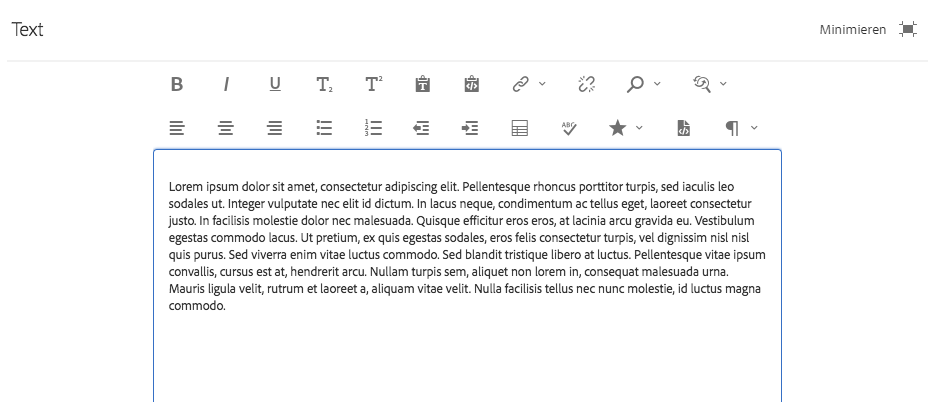

### Fett

Wird verwendet, um die fett formatierte Formatierung auf den ausgewählten Text anzuwenden oder den nach dem Cursor eingegebenen Text fett formatiert zu formatieren.

**Strg + B** kann als Tastaturbefehl verwendet werden.

### Kursiv

Wird verwendet, um kuratierte Formatierungen auf den ausgewählten Text anzuwenden oder nach dem Cursor eingegebene Text kursiv zu formatieren.

**Strg + I** kann als Tastaturbefehl verwendet werden.

### Unterstrichen

Wird verwendet, um unterstrichene Formatierungen auf den ausgewählten Text oder Unterstriche nach dem Cursor anzuwenden.

**Strg + U** kann als Tastaturbefehl verwendet werden.

### Tiefgestellt

Wird verwendet, um ausgewählten Text oder Text, der nach dem Cursor eingegeben wurde, als tiefgestellt zu formatieren.

### Hochgestellt

Wird verwendet, um ausgewählten Text oder Text nach dem Cursor als Hochgestellte zu formatieren.

### Als Text einfügen

Fügt einen kopierten Text ohne Formatierung als normaler Text ein.

Wenn Sie diese Option wählen, wird ein Fenster geöffnet, in dem der Text als normaler Text ohne Formatierung eingefügt werden kann, bevor er in den Text eingefügt wird. Akzeptieren Sie dies, indem Sie auf das Häkchen tippen oder auf das Häkchen klicken, durch Tippen oder Klicken auf das X abbrechen.

### Aus Word einfügen

Wenn Sie diese Option wählen, wird ein Fenster geöffnet, in dem der Text als Vorschau eingefügt werden kann, bevor er in den Text eingefügt wird. Akzeptieren Sie dies, indem Sie auf das Häkchen tippen oder auf das Häkchen klicken, durch Tippen oder Klicken auf das X abbrechen.

### Hyperlink

Mit dieser Option können Sie den ausgewählten Text in einen Hyperlink konvertieren oder einen bereits definierten Link ändern. Diese Option ist nur aktiv, wenn Text bereits ausgewählt ist und ein Fenster mit zusätzlichen Optionen zum Festlegen des Links geöffnet wird.

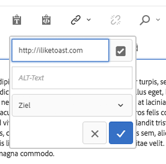

* Ort eingeben
   * Wählen Sie im Dialogfeld &quot;Auswahl öffnen&quot; einen Pfad in AEM aus.
   * Wenn sich der Link nicht in AEM befindet, geben Sie die absolute URL ein (nicht absolute Pfade werden als relativ zu AEM interpretiert)
* Alternativen beschreibenden Text für den Link eingeben
* Linkverhalten auswählen
   * Target
   * Selbe Registerkarte
   * Neue Registerkarte
   * Übergeordneter Frame
   * Top-Frame
   Tippen Sie auf das Häkchen oder klicken Sie auf das Häkchen, um den Link oder x abzubrechen.

### Verknüpfung aufheben

Mit dieser Option können Sie einen bereits auf den ausgewählten Text angewendeten Link entfernen. Diese Option ist nur aktiv, wenn bereits ein Link ausgewählt ist.

### Suchen Sie nach

Verwenden Sie diese Option, um den Text für das Vorkommen einer angegebenen Textzeichenfolge zu suchen. Wenn Sie diese Option auswählen, wird ein Fenster zum Festlegen der Suchoptionen geöffnet.

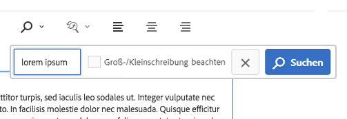

Geben Sie den Text ein, für den Sie suchen möchten, tippen Sie auf &quot;Suchen&quot; oder klicken **Sie auf&quot; Suchen** &quot; , um die Suche zu starten. Tippen Sie auf das X, um es abzubrechen.
Wenn Sie eine genaue Übereinstimmung mit dem Fall durchführen möchten, wählen Sie die Option **&quot;Groß-/Kleinschreibung berücksichtigen&quot; ,** bevor Sie die Suche starten.
Wenn eine Übereinstimmung gefunden wird, wird sie hervorgehoben und das Suchdialogfeld ist abgeblendet. Tippen Sie im abgeblendeten Dialogfeld erneut auf **die Schaltfläche &quot;Suchen** &quot; , um nach dem nächsten Vorkommen zu suchen.

Wenn keine weiteren Vorkommen gefunden werden, wird eine Meldung angezeigt und die Suche wird am Anfang des Textes neu gestartet.

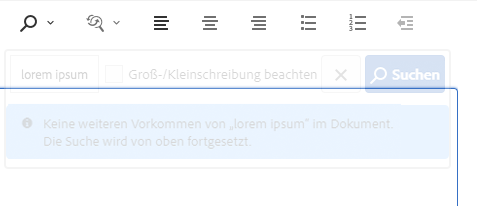

### Replace

Verwenden Sie diese Option, um den Text für Vorkommen einer angegebenen Textzeichenfolge zu suchen und die Übereinstimmungen durch eine andere Zeichenfolge zu ersetzen. Wenn Sie diese Option auswählen, wird ein Fenster zum Festlegen der Optionen für Suchen und Ersetzen geöffnet.

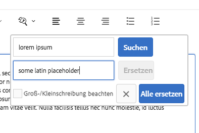

Geben Sie den Text ein, für den Sie eine Suche durchführen möchten, sowie den Text, mit dem sie ersetzt werden soll.

Tippen oder klicken **Sie auf Suchen** , um mit der Suche zu beginnen. Klicken oder tippen Sie auf das X, um es abzubrechen.

Wenn Sie eine genaue Übereinstimmung mit dem Fall durchführen möchten, wählen Sie die Option **&quot;Groß-/Kleinschreibung berücksichtigen&quot; ,** bevor Sie die Suche starten.

Wenn eine Übereinstimmung gefunden wird, wird sie hervorgehoben und das Suchdialogfeld ist abgeblendet. Klicken Sie erneut im abgeblendeten Dialogfeld auf **die Schaltfläche &quot;Suchen** «, um nach dem nächsten Vorkommen zu suchen, oder klicken Sie auf **&quot; Ersetzen** &quot; , um den markierten, übereinstimmenden Text zu ersetzen. Beachten Sie, **dass die Schaltfläche &quot;Ersetzen** &quot; nur aktiv ist, nachdem eine Übereinstimmung hergestellt wurde.

Wählen Sie Alle **ersetzen** aus, um alle Vorkommen des Textes gleichzeitig zu ersetzen.

### Text links ausrichten

Wird verwendet, um den Text am linken Rand auszurichten.

### Text zentrieren

Wird zum Zentrieren des Textes verwendet.

### Text rechts ausrichten

Wird verwendet, um den Text am rechten Rand auszurichten.

### Aufzählungszeichen

Wird verwendet, um den ausgewählten Text als Liste mit Aufzählungszeichen zu formatieren oder eine Liste mit Aufzählungszeichen nach dem Cursor einzufügen.

Um eine Liste mit Aufzählungszeichen zu beenden, tippen oder klicken Sie erneut auf **die Aufzählungstaste** oder geben Sie zwei Wagenrückgaben ein.

### Nummeriert

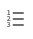

Wird verwendet, um den ausgewählten Text als nummerierte Liste zu formatieren oder eine nummerierte Liste nach dem Cursor einzufügen.

Um eine nummerierte Liste zu beenden, tippen oder klicken Sie erneut auf **die Nummerierungsschaltfläche** oder geben Sie zwei Wagenrückgaben ein.

### Ausrücken

Wird verwendet, um den Einzug des ausgewählten Textes oder der eingegebenen Text nach dem Cursor zu verringern.

Nur aktiv, wenn der ausgewählte Text bzw. die ausgewählte Position bereits eingerückt ist.

### Einzug

Wird verwendet, um den Einzug des ausgewählten Textes oder der eingegebenen Text nach dem Cursor zu erhöhen.

### Tabelle

Wird verwendet, um eine Tabelle in den Text einzufügen. Wenn Sie diese Option auswählen, wird ein Fenster zum Festlegen der Details der Tabelle geöffnet.

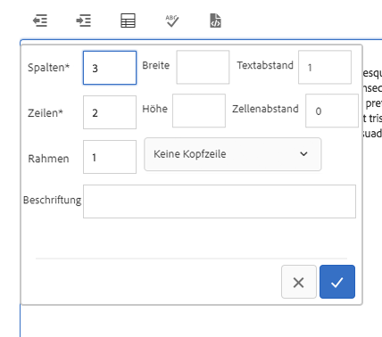

* **Spalten**
Die Anzahl Spalten der Tabelle (erforderlich)
* **Zeilen**
Die Anzahl der Tabellenzeilen (erforderlich)
* **Breite**
der Tabelle
* **Höhe**
der Tabelle
* **Zellumrandung**
Der Abstand um den Zelleninhalt
* **Zellenabstand**
Der Abstand zwischen Zellen
* **Rand**
der Rahmenlinien der Tabelle
* Für die Kopfzeile der Tabelle:
   * Die erste Zeile sollte verwendet werden
   * Die erste Spalte sollte verwendet werden
   * Die erste Zeile und erste Spalte sollten verwendet werden
   * Es sollte auch keine Kopfzeile verwendet werden.
* **Beschriftung** der Tabelle Beschriftung

### Rechtschreibprüfung

Wird verwendet, um die Rechtschreibung des Textinhalts zu prüfen. Mögliche Rechtschreibfehler sind durch beschädigte rote Linien unterstrichen.

Weitere Informationen zur Rechtschreibprüfung und zur Rechtschreibprüfung für Rechtschreibprüfung finden Sie im Dokument [unter Rich Text Editor-Plug-Ins](https://helpx.adobe.com/experience-manager/6-5/sites/administering/using/configure-rich-text-editor-plug-ins.html)konfigurieren.

### Sonderzeichen {#special-characters}

Wird verwendet, um Sonderzeichen in den Text einzufügen. Wenn Sie diese Option auswählen, wird ein Fenster geöffnet, in dem die verfügbaren Zeichen angezeigt werden.

Tippen oder klicken Sie auf das gewünschte Zeichen, um es nach dem Cursor in den Text einzufügen. Es können mehrere Zeichen eingefügt werden. Tippen oder klicken Sie auf das X, um das Auswahlfenster zu schließen.

### Quellenbearbeitung

Wird verwendet, um die HTML-Quelle des Texts anzuzeigen und zu ändern.

Tippen oder klicken Sie auf das **Quellbearbeitungssymbol** , um den Inhalt des Textes aus der formatierten Ansicht zu ändern, um den rohen HTML anzuzeigen. In diesem Modus sind alle anderen Formatierungsoptionen deaktiviert. Tippen Sie erneut auf das **Quellbearbeitungssymbol** , um zur formatierten Ansicht zurückzukehren.

>[!CAUTION]
>
>Wie immer bei Zugriff auf rohe HTML muss die Unterstützung bei Verwendung der Option **&quot;Quell-Bearbeitung** &quot; vorgenommen werden.
>
>HTML, die über **die Quell-Bearbeitung** eingegeben wurde, wird auf XSS-Risiken überprüft und alle Skripten, die eingefügt werden, werden entfernt und werden nicht auf der resultierenden Seite angezeigt. Fehlerhafte HTML-Einträge, die in **der Quell-Bearbeitung** eingegeben wurden, können die Vorlage für die Seite umbrechen, was zu unerwarteten Formatierungen führt oder die resultierende Seite unbrauchbar macht.

>[!NOTE]
>
>Da HTML, die über **die Quell-Bearbeitung** eingegeben wurde, auf XSS-Risiken und Skripten gescannt und automatisch entfernt werden, kann der eigentliche Inhalt je nach eingegebenen **Quellbearbeitung variieren**. Aus diesem Grund müssen Sie zum Speichern von Änderungen, die mit **der Quell-Bearbeitung** vorgenommen wurden, **die Quell-Bearbeitung** auswählen, um den Text im normalen Editor vor dem Speichern anzuzeigen.

### Absatzformat

Wird verwendet, um Absatzformatierung auf den ausgewählten Text oder auf Text anzuwenden, der nach dem Cursor eingefügt wurde. Durch Auswahl dieser Optionen wird eine Dropdown-Liste geöffnet, in der das Absatzformat ausgewählt ist.

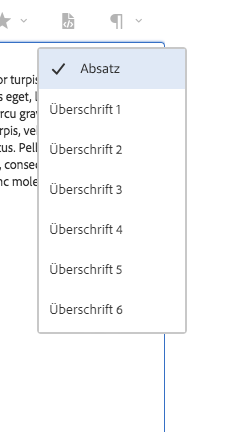

Die Textkomponente kann auch online bearbeitet werden, aufgrund von Leerzeichen sind jedoch nicht alle Formatierungsoptionen online verfügbar. Um alle Optionen anzuzeigen, wechseln Sie zum Vollbildmodus.

## Design-Dialogfeld {#design-dialog}

Im Entwurfsdialogfeld können Sie festlegen, welche Textformatierungsoptionen den Autoren zur Verfügung stehen.

### Registerkarte &quot;Plug-Ins « {#plugins-tab}

Über die Registerkarte &quot;Plug-Ins&quot; können verschiedene Textformatierungsoptionen aktiviert und deaktiviert werden.

### Funktionen {#features}

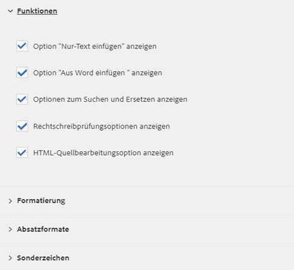

Die folgenden Funktionen können für die Komponente aktiviert oder deaktiviert werden.

* Nur Text einfügen
* Vergangenes Wort
* Suchen und ersetzen
* Rechtschreibprüfung
* Quellbearbeitung

### Formatierung {#formatting}

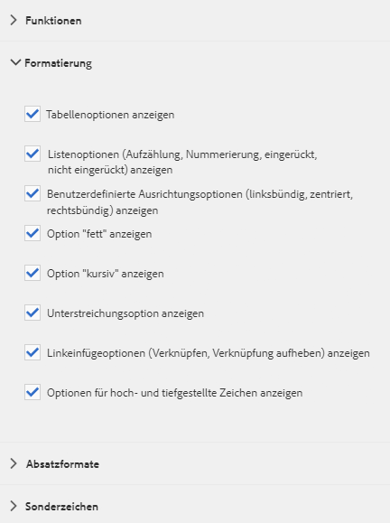

Die folgenden Formatierungsoptionen können für die Komponente aktiviert oder deaktiviert werden.

* Tabelle
* Listen
* Ausrichtung
* Fett, kursiv, unterstrichen
* Links
* Untergeordnetes/Hochgestellt

### Absatzformate {#paragraph-styles}

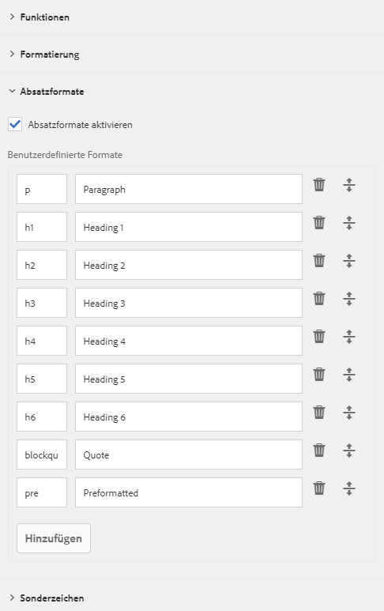

Absatzstile können für die Komponente aktiviert oder deaktiviert werden. Bei Aktivierung können die zulässigen Formate definiert werden.

* Tippen oder klicken Sie auf **die Schaltfläche &quot;Hinzufügen** &quot; , um einen neuen Stil einzufügen.
* Geben Sie den Code des Stils und eine Beschreibung ein, die im Dialogfeld &quot;Bearbeiten&quot; angezeigt wird.
* Um einen Stil zu entfernen, tippen Sie auf die **Schaltfläche &quot;Löschen** &quot; .
* Um die Reihenfolge der Formate zu ändern, tippen oder klicken Sie auf und ziehen Sie die Griffe.

### Konfigurieren von Sonderzeichen {#configuring-special-characters}

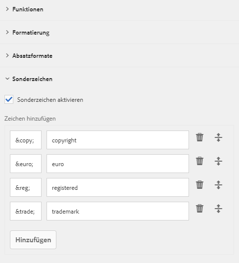

Die Option zum Einfügen von Sonderzeichen kann für die Komponente aktiviert oder deaktiviert werden. Bei Aktivierung können die zulässigen Zeichen definiert werden.

* Tippen oder klicken Sie auf **die Schaltfläche &quot;Hinzufügen** &quot; , um ein neues Zeichen einzufügen.
* Geben Sie den HTML-Code des Zeichens und eine Beschreibung ein, die im Dialogfeld &quot;Bearbeiten&quot; angezeigt wird.
* Um ein Zeichen zu entfernen, oder klicken Sie auf die **Schaltfläche &quot;Löschen** &quot; .
* Um die Reihenfolge der Zeichen zu ändern, tippen oder klicken Sie auf und ziehen Sie die Griffe.

## Stile Registerkarte {#styles-tab}

Die Text-Komponente unterstützt das AEM [-Stilsystem](authoring.md#component-styling).