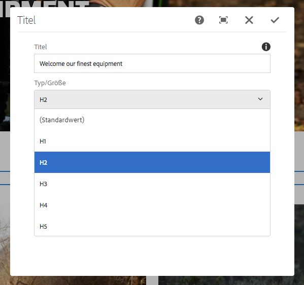
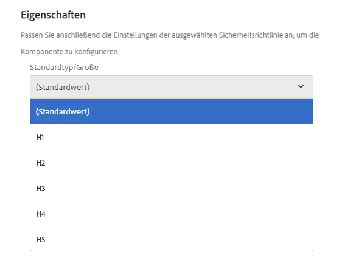

# Titelkomponente (v 1){#title-component-v}

Die Komponente Component Component Title ist eine Komponente der Abschnittsüberschrift, die Funktionen ersetzend bearbeitet.

## Nutzung {#usage}

Die Titel-Komponente soll als Titel oder Überschrift eines Inhaltsabschnitts verwendet werden.

Die verfügbaren Überschriftenebenen können vom Vorlagenautor im [Design-Dialogfeld definiert](title-v1.md#main-pars_title_1995166862)werden. Der Content-Editor kann aus den verfügbaren Überschriftenebenen im [Bearbeitungsdialogfeld auswählen](title-v1.md#main-pars_title). Zur einfachen Bearbeitung ist eine einfache Bearbeitung des Überschriften-Textes ebenfalls verfügbar.

## Version und Kompatibilität {#version-and-compatibility}

In diesem Dokument wird v 1 der Titel-Komponente beschrieben, die ursprünglich mit Version 1.0.0 der Kernkomponenten mit AEM 6.3 eingeführt wurde.

In der folgenden Tabelle ist die Kompatibilität von v 1 der Titelkomponente aufgeführt.

| AEM-Version | Titelkomponente v 1 |
|--- |--- |
| 6.3 | Kompatibel |
| 6.4 | Kompatibel |

>[!CAUTION]
>
>In diesem Dokument wird Version 1 der Titelkomponente beschrieben.
>
>Weitere Informationen zur aktuellen Version der Titelkomponente finden Sie im [Dokument Titelkomponente](title.md) .

## Musterkomponentenausgabe {#sample-component-output}

Nachfolgend finden Sie ein Beispiel aus [We. Retail](https://helpx.adobe.com/experience-manager/6-4/sites/developing/using/we-retail.html).

### Screenshot {#screenshot}


### HTML {#html}

```
<div class="cmp cmp-title aem-GridColumn aem-GridColumn--default--12">
     <h2>Welcome! This is our finest equipment!</h2>
</div>
```

### JSON {#json}

```
"title": {
              "columnClassNames": "aem-GridColumn aem-GridColumn--default--12",
              ":type": "weretail/components/content/title",
              "jcr:title": "Welcome! This is our finest equipment!",
              "type": "h2"
            }
```

>[!NOTE]
>
>Für JSON-Exporte aus den Core-Komponenten ist Version 1.1.0 der Kernkomponenten erforderlich. Weitere Informationen finden Sie in den [Kompatibilitätsinformationen für Kernkomponenten v 1](versions.md#main-pars_title_236368006) .

## Dialogfeld bearbeiten {#edit-dialog}

Im Dialogfeld &quot;Bearbeiten&quot; kann der Inhaltsautor den Titeltext definieren sowie die Überschriftenebene auswählen.

>[!NOTE]
>
>Bei einem leeren Wert für den Titel wird der Seitentitel angezeigt.



Der ersetzende Editor kann auch verwendet werden, um den Text der Titelkomponente zu bearbeiten.


## Design-Dialogfeld {#design-dialog}

Das Design-Dialogfeld ermöglicht es dem Vorlagenautor, die Standardmäßige Überschriftenebene zu definieren, die Titelkomponenten bei der Erstellung von Autoren-Autoren haben.



## Technische Details {#technical-details}

Die aktuelle technische Dokumentation zur Titelkomponente [finden Sie unter github](https://github.com/adobe/aem-core-wcm-components/tree/master/content/src/content/jcr_root/apps/core/wcm/components/title/v1/title).

Das gesamte Kernkomponentenprojekt kann von github heruntergeladen werden.

Weitere Informationen zur Entwicklung Kernkomponenten finden Sie in der [Dokumentation zu Kernkomponenten für Komponenten](developing.md).
