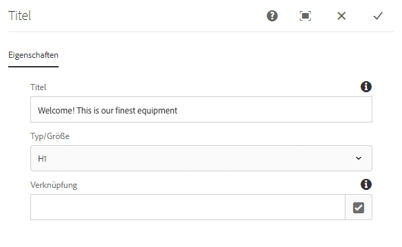
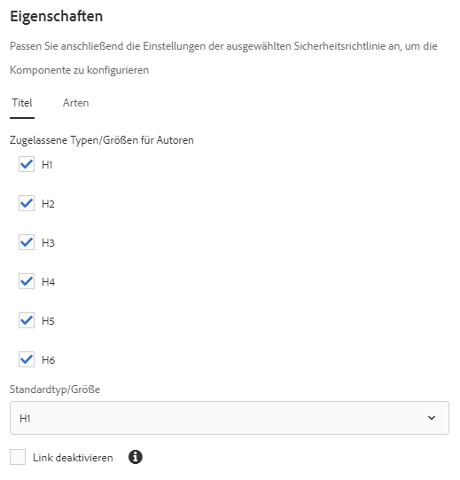

# Titelkomponente{#title-component}

Die Komponente Component Component Title ist eine Komponente der Abschnittsüberschrift, die Funktionen ersetzend bearbeitet.

## Nutzung {#usage}

Die Titel-Komponente soll als Titel oder Überschrift eines Inhaltsabschnitts verwendet werden. Die verfügbaren Überschriftenebenen können vom Vorlagenautor im [Design-Dialogfeld definiert](#design-dialog)werden. Der Content-Editor kann aus den verfügbaren Überschriftenebenen im [Bearbeitungsdialogfeld auswählen](#edit-dialog). Zur einfachen Bearbeitung ist eine einfache Bearbeitung des Überschriften-Textes ebenfalls verfügbar.

## Version und Kompatibilität {#version-and-compatibility}

Die aktuelle Version der Titelkomponente ist v 2, die mit Version 2.0.0 der Kernkomponenten im Januar 2018 eingeführt wurde und in diesem Dokument beschrieben wird.

Die folgende Tabelle enthält alle unterstützten Versionen der Komponente, die AEM-Versionen, mit denen die Versionen der Komponente kompatibel sind, sowie Links zur Dokumentation für frühere Versionen.

| Komponentenversion | AEM 6.3 | AEM 6.4 | AEM 6.5 |
|---|---|---|---|
| v2 | Kompatibel | Kompatibel | Kompatibel |
| [v1](title-v1.md) | Kompatibel | Kompatibel | Kompatibel |

Weitere Informationen zu Core-Komponentenversionen und -versionen finden Sie in den Core [-Komponentenversionen](versions.md).

## Musterkomponentenausgabe {#sample-component-output}

Nachfolgend finden Sie ein Beispiel aus [We. Retail](https://helpx.adobe.com/experience-manager/6-5/sites/developing/using/we-retail.html).

### Screenshot {#screenshot}

### Komponentenbibliothek

Rufen Sie die [Komponentenbibliothek auf, um die Titel-Komponente sowie Beispiele für die Konfigurationsoptionen sowie HTML- und JSON-Ausgaben zu erhalten](http://opensource.adobe.com/aem-core-wcm-components/library/title.html).

### Technische Details {#technical-details}

Die aktuelle technische Dokumentation zur Titelkomponente [finden Sie unter github](https://github.com/adobe/aem-core-wcm-components/blob/master/content/src/content/jcr_root/apps/core/wcm/components/title/v2/title).

Weitere Informationen zur Entwicklung Kernkomponenten finden Sie in der [Dokumentation zu Kernkomponenten für Komponenten](developing.md).

## Dialogfeld bearbeiten {#edit-dialog}

Im Dialogfeld &quot;Bearbeiten&quot; kann der Inhaltsautor den Titeltext definieren sowie die Überschriftenebene auswählen.

* **Titel** : Wenn leere Seitentitel verwendet werden
* **Typ/Größe** - Definiert die Überschriftenebene des Titels
* **Link** : Definiert den Inhalt, auf den der Titel verweist. Dies kann ein Pfad zu einer Inhaltsseite, eine externe URL oder ein Seitenanker sein.

>[!CAUTION]
>
>Die Möglichkeit, einen Link für den Titel zu definieren, wurde mit Version 2.2.0 der Kernkomponenten eingeführt.

Der ersetzende Editor kann auch verwendet werden, um den Text der Titelkomponente zu bearbeiten.

## Design-Dialogfeld {#design-dialog}

Das Design-Dialogfeld ermöglicht es dem Vorlagenautor, die Standardmäßige Überschriftenebene zu definieren, die Titelkomponenten bei der Erstellung von Autoren-Autoren haben.

### Größen-Registerkarte {#sizes-tab}

* **Zulässige Typen/Größen für Autoren** : Aktivieren oder deaktivieren Sie die Überschrifttypen, die für Autoren von Inhalten verfügbar sein werden, wenn sie die Titelkomponente verwenden.
* **Standardtyp/-größe**- Definieren Sie den Überschrifttyp, der automatisch zugewiesen wird, wenn ein Inhaltsautor die Titelkomponente einer Seite hinzufügt.
* **Deaktivieren Sie Link**-Deaktivieren für Links in der Titelkomponente, um Inhaltsautoren nicht von Titeln zu verknüpfen.

>[!CAUTION]
>
>Die Möglichkeit, einen Link für den Titel zu definieren, wurde mit Version 2.2.0 der Kernkomponenten eingeführt.

### Stile Registerkarte {#styles-tab}

Die Title-Komponente unterstützt das AEM [-Stilsystem](authoring.md#component-styling).