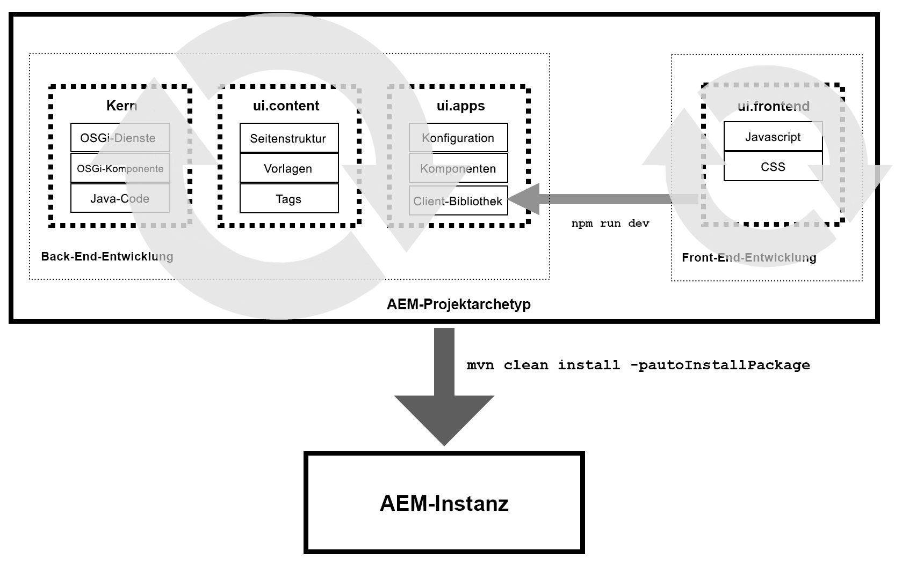

# ui.frontend Module of the AEM Project Archetype {#uifrontend-module}

Der AEM Project Archetype enthält einen optionalen, dedizierten Front-End-Build-Mechanismus, der auf Webpack basiert. Das Modul ui.frontend wird damit zum zentralen Speicherort für alle Front-End-Ressourcen des Projekts, einschließlich JavaScript- und CSS-Dateien. Um diese nützliche und flexible Funktion in vollem Umfang nutzen zu können, müssen Sie wissen, wie die Front-End-Entwicklung in ein AEM-Projekt passt.

## AEM-Projekte und Front-End-Entwicklung {#aem-and-front-end-development}

In stark vereinfachten Begriffen kann davon ausgegangen werden, dass AEM-Projekte aus zwei separaten, aber miteinander verbundenen Teilen bestehen:

* Back-End-Entwicklung, die die Logik von AEM unterstützt und Java-Bibliotheken, OSGi-Dienste usw. produziert.
* Front-End-Entwicklung, die die Präsentation und das Verhalten der resultierenden Website vorantreibt und JavaScript- und CSS-Bibliotheken erzeugt

Da sich diese beiden Entwicklungsprozesse auf verschiedene Teile des Projekts konzentrieren, kann die Back-End- und Front-End-Entwicklung parallel erfolgen.



Jedes sich daraus ergebende Projekt muss jedoch die Ergebnisse beider Entwicklungsanstrengungen nutzen, d. h. sowohl das Back-End als auch das Front-End.

Beim Ausführen `npm run dev` wird der Front-End-Build-Prozess gestartet, der die im Modul ui.frontend gespeicherten JavaScript- und CSS-Dateien erfasst und zwei minimierte Client-Bibliotheken oder clientlibs erzeugt, die aufgerufen werden `clientlib-site` und im Modul ui.apps abgelegt `clientlib-dependencies` werden. clientlibs sind für AEM bereitstellbar und ermöglichen es Ihnen, den clientseitigen Code im Repository zu speichern.

Wenn der gesamte AEM-Projektarchetyp unter Verwendung `mvn clean install -PautoInstallPackage` aller Projektartefakte einschließlich der clientlibs ausgeführt wird, werden diese an die AEM-Instanz gesendet.

>[!TIP]
>Erfahren Sie mehr über clientlibs in der [AEM-Entwicklungsdokumentation](https://helpx.adobe.com/experience-manager/6-5/sites/developing/using/clientlibs.html) und [wie das Modul ui.frontend diese verwendet](#clientlib-generation).

## Mögliche Front-End-Entwicklungs-Workflows {#possible-workflows}

Das Front-End-Build-Modul ist ein nützliches und sehr flexibles Werkzeug, gibt aber keine spezielle Meinung darüber, wie es verwendet werden sollte. Im Folgenden finden Sie zwei Beispiele für die *mögliche* Verwendung, aber Ihre individuellen Projektbedürfnisse können andere Anwendungsmodelle vorschreiben.

### Verwenden von WebPack Static Development Server {#using-webpack}

Mit WebPack können Sie auf Basis der statischen Ausgabe von AEM-Webseiten innerhalb des Moduls ui.frontend gestalten und entwickeln.

1. Vorschau der Seite in AEM mit dem Seitenvorschaumodus oder `wcmmode=disabled` der Weitergabe in der URL
1. Anzeigen der Seitenquelle und Speichern als statisches HTML im ui.frontend-Modul
1. [Starten Sie das Webpack](#webpack-dev-server) und beginnen Sie mit der Formatierung und Generierung des erforderlichen JavaScript- und CSS-Codes
1. Ausführen `npm run dev` zum Generieren der clientlibs

In diesem Ablauf kann ein AEM-Entwickler die Schritte 1 und 2 ausführen und den statischen HTML-Code an den Front-End-Entwickler weiterleiten, der sich basierend auf der AEM-HTML-Ausgabe entwickelt.

>[!TIP]
>
>Sie können auch die [Komponentenbibliothek](https://opensource.adobe.com/aem-core-wcm-components/library.html) nutzen, um Beispiele der Markup-Ausgabe jeder Komponente zu erfassen, um auf Komponentenebene und nicht auf Seitenebene zu funktionieren.

### Verwenden von Storybook {#using-storybook}

Mit [Storybook](https://storybook.js.org) können Sie mehr atomare Front-End-Entwicklung durchführen. Obwohl Storybook nicht im AEM Project Archetype enthalten ist, können Sie es installieren und Ihre Storybook-Artefakte im ui.frontend-Modul speichern. Sobald sie für Tests in AEM bereit sind, können sie als clientlibs bereitgestellt werden, indem sie ausgeführt werden `npm run dev`.

>[!NOTE]
>
>[Storybook](https://storybook.js.org) ist nicht im AEM-Projektarchiv enthalten. Wenn Sie ihn verwenden möchten, müssen Sie ihn separat installieren.

### Markup bestimmen {#determining-markup}

Unabhängig davon, welchen Front-End-Entwicklungsarbeitsablauf Sie für Ihr Projekt implementieren, müssen sich die Back-End-Entwickler und Frontend-Entwickler zunächst auf das Markup einigen. In der Regel definiert AEM das Markup, das von den Kernkomponenten bereitgestellt wird. [Dies kann jedoch bei Bedarf](https://docs.adobe.com/content/help/en/experience-manager-core-components/using/developing/customizing.html#customizing-the-markup)angepasst werden.

## Das ui.frontend-Modul {#ui-frontend-module}

Der AEM-Projektarchiv enthält einen optionalen, dedizierten Front-End-Build-Mechanismus, der auf Webpack basiert und die folgenden Funktionen enthält.

* Vollständige Unterstützung für TypeScript, ES6 und ES5 (mit entsprechenden Webpack-Wrappern)
* TypeScript- und JavaScript-Linting mit einem TSLint-Regelsatz
* ES5-Ausgabe für ältere Browserunterstützung
* Globbing
   * Importe müssen nirgendwo hinzugefügt werden
   * Alle JS- und CSS-Dateien können jetzt jeder Komponente hinzugefügt werden.
      * Best Practice ist unter `/clientlib/js`, `/clientlib/css`oder `/clientlib/scss`
   * No `.content.xml` or `js.txt`/`css.txt` files are needed as everything is run through Webpack.
   * Der Globber ruft alle JS-Dateien im `/component/` Ordner ab.
      * Mit WebPack können CSS/SCSS-Dateien über JS-Dateien verkettet werden.
      * Sie werden durch die beiden Einstiegspunkte eingezogen `sites.js` und `vendors.js`.
   * Die einzige Datei, die von AEM verwendet wird, sind die Ausgabedateien `site.js` und `site.css` in `/clientlib-site` sowie `dependencies.js` und `dependencies.css` in `/clientlib-dependencies`
* Blöcke
   * Main (site js/css)
   * Anbieter (Abhängigkeiten js/css)
* Vollständige Unterstützung von Sass/Scss (Sass wird über Webpack zu CSS kompiliert)
* Static Webpack-Entwicklungsserver mit integriertem Proxy zu einer lokalen Instanz von AEM

>[!NOTE]
>
>Weitere technische Informationen zum ui.frontend Modul finden Sie in der [Dokumentation zu GitHub](https://github.com/adobe/aem-project-archetype/blob/master/src/main/archetype/ui.frontend/README.md).

## Installation {#installation}

1. Installieren Sie [NodeJS](https://nodejs.org/en/download/) (ab Version 10) global. Dadurch wird auch npm installiert.
1. Navigieren Sie in Ihrem Projekt zu ui.frontend und führen Sie `npm install`.

>[!NOTE]
>
>Sie müssen den Archetype[ mit der Option ](overview.md)ausgeführt haben, den Ordner ui.frontend `-DoptionIncludeFrontendModule=y` zu füllen.

## Nutzung {#usage}

Die folgenden npm-Skripten verhelfen zum Frontend-Arbeitsablauf:

* `npm run dev` -Vollständige Erstellung mit deaktivierter JS-Optimierung (Baum-Shaking usw.) und aktivierten Quellkarten und deaktivierter CSS-Optimierung.
* `npm run prod` - Vollständige Erstellung mit aktivierter JS-Optimierung (Baum-Shaking usw.), deaktivierter Quellzuordnung und aktivierter CSS-Optimierung.
* `npm run start` - Startet einen statischen Webpack-Entwicklungsserver für die lokale Entwicklung mit minimalen Abhängigkeiten von AEM.

## Ausgabe {#output}

Das Modul ui.frontend kompiliert den Code unter dem `ui.frontend/src` Ordner und gibt die kompilierte CSS und JS sowie alle Ressourcen unter einem Ordner mit dem Namen `ui.frontend/dist`aus.

* **Site** - `site.js`und ein `site.css` Ordner für layoutabhängige Bilder und Schriftarten werden in einem `resources/``dist/` clientlib-Site-Ordner erstellt.
* **Abhängigkeiten** - `dependencies.js` und `dependencies.css` werden in einem `dist/clientlib-dependencies` Ordner erstellt.

### JavaScript {#javascript}

* Optimierung: Bei Produktions-Builds werden alle nicht verwendeten oder aufgerufenen JS entfernt.

### CSS {#css}

* Autoprefixierung - Alle CSS werden über einen Präfixer ausgeführt und alle Eigenschaften, für die Präfix erforderlich ist, werden automatisch in das CSS eingefügt.
* Optimierung: Beim Posten wird das gesamte CSS über einen Optimierer (cssnano) ausgeführt, der es gemäß den folgenden Standardregeln normalisiert:
   * Reduziert den CSS-Calc-Ausdruck, wo immer dies möglich ist, und stellt sowohl die Browserkompatibilität als auch die Komprimierung sicher
Konvertiert Werte für die äquivalente Länge, Zeit und Winkel. Beachten Sie, dass Längenwerte standardmäßig nicht konvertiert werden.
   * Entfernt Kommentare in und um Regeln, Selektoren und Deklarationen
   * Entfernt duplizierte Regeln, at-Regeln und Deklarationen
      * Beachten Sie, dass dies nur bei exakten Duplikaten funktioniert.
   * Entfernt leere Regeln, Medienabfragen und Regeln mit leeren Selektoren, da sie sich nicht auf die Ausgabe auswirken
   * Führt benachbarte Regeln durch Selektoren und überlappende Eigenschaften-/Wertpaare zusammen
   * Stellt sicher, dass in der CSS-Datei nur ein einziges @charset vorhanden ist, und verschiebt es an den Anfang des Dokuments
   * Ersetzt den ersten CSS-Suchbegriff durch den tatsächlichen Wert, wenn die resultierende Ausgabe kleiner ist
   * Komprimiert inline-SVG-Definitionen mit SVGO
* Bereinigen - Umfasst explizite Bereinigungsaufgabe zum Entfernen der generierten CSS-, JS- und Map-Dateien bei Bedarf.
* Quellzuordnung - nur Entwicklungs-Build

>[!NOTE]
>Die Option zum Erstellen des Front-End verwendet Konfigurationsdateien des nur dev- und prod-only webpack, die eine gemeinsame Konfigurationsdatei gemeinsam haben. Auf diese Weise können Entwicklungs- und Produktionseinstellungen unabhängig verändert werden.

### Client-Bibliotheksgenerierung {#clientlib-generation}

Der Prozess zum Erstellen des Moduls ui.frontend nutzt das [Plugin aem-clientlib-generator](https://www.npmjs.com/package/aem-clientlib-generator) , um die kompilierten CSS, JS und alle Ressourcen in das Modul ui.apps zu verschieben. Die Konfiguration von aem-clientlib-generator ist in `clientlib.config.js`definiert. Die folgenden Client-Bibliotheken werden generiert:

* **clientlib-site** - `ui.apps/src/main/content/jcr_root/apps/<app>/clientlibs/clientlib-site`
* **clientlib-Abhängigkeiten** - `ui.apps/src/main/content/jcr_root/apps/<app>/clientlibs/clientlib-dependencies`

### Einbeziehen von Client-Bibliotheken auf Seiten {#clientlib-inclusion}

`clientlib-site` und `clientlib-dependencies` Kategorien werden über die [Seitenrichtlinien-Konfiguration](https://helpx.adobe.com/experience-manager/6-5/sites/developing/using/page-templates-editable.html#TemplateDefinitions) als Teil der Standardvorlage auf Seiten eingeschlossen. Um die Richtlinie anzuzeigen, bearbeiten Sie die **Inhaltsseitenvorlage &gt; Seiteninformationen &gt; Seitenrichtlinie**.

Die endgültige Aufnahme von Client-Bibliotheken auf der Siteseite erfolgt wie folgt:

```
<HTML>
    <head>
        <link rel="stylesheet" href="clientlib-base.css" type="text/css">
        <script type="text/javascript" src="clientlib-dependencies.js"></script>
        <link rel="stylesheet" href="clientlib-dependencies.css" type="text/css">
        <link rel="stylesheet" href="clientlib-site.css" type="text/css">
    </head>
    <body>
        ....
        <script type="text/javascript" src="clientlib-site.js"></script>
        <script type="text/javascript" src="clientlib-base.js"></script>
    </body>
</HTML>
```

Die oben genannte Einbindung kann natürlich durch Aktualisierung der Seitenrichtlinie und/oder Änderung der Kategorien und Einbettungseigenschaften der jeweiligen Client-Bibliotheken geändert werden.

### Statischer Webpack-Entwicklungsserver {#webpack-dev-server}

Im Modul ui.frontend ist ein Webpack-dev-Server enthalten, der eine Live-Neuladung für eine schnelle Front-End-Entwicklung außerhalb von AEM ermöglicht. Das Setup nutzt das html-webpack-plugin, um aus dem ui.frontend Modul kompilierte CSS und JS automatisch in eine statische HTML-Vorlage zu injizieren.

#### Wichtige Dateien {#important-files}

* `ui.frontend/webpack.dev.js`
   * Dies enthält die Konfiguration für den webpack-dev-server und verweist auf die zu verwendende HTML-Vorlage.
   * Es enthält auch eine Proxykonfiguration für eine AEM-Instanz, die auf localhost:4502 ausgeführt wird.
* `ui.frontend/src/main/webpack/static/index.html`
   * Dies ist der statische HTML-Code, mit dem der Server ausgeführt wird.
   * Dadurch kann ein Entwickler CSS/JS-Änderungen vornehmen und sie sofort im Markup anzeigen.
   * Es wird davon ausgegangen, dass das in dieser Datei platzierte Markup das generierte Markup von AEM-Komponenten exakt widerspiegelt.
   * Markup in dieser Datei wird nicht automatisch mit AEM-Komponenten-Markup synchronisiert.
   * Diese Datei enthält auch Verweise auf in AEM gespeicherte Client-Bibliotheken wie CSS für die Core-Komponente und CSS für das Responsive-Raster.
   * Der Webpack-Entwicklungsserver ist so eingerichtet, dass er diese CSS/JS-Includes von einer lokalen AEM-Instanz basierend auf der Konfiguration in `ui.frontend/webpack.dev.js`.

#### Verwendung {#using-webpack-server}

1. Führen Sie im Stammverzeichnis des Projekts den Befehl aus, `mvn -PautoInstallSinglePackage clean install` um das gesamte Projekt in einer AEM-Instanz zu installieren, die unter `localhost:4502`ausgeführt wird.
1. Navigieren Sie im `ui.frontend` Ordner.
1. Führen Sie den folgenden Befehl aus, `npm run start` um den Webpack-Dev-Server zu starten. Nach dem Start sollte ein Browser (`localhost:8080` oder der nächste verfügbare Anschluss) geöffnet werden.

Sie können jetzt CSS-, JS-, SCSS- und TS-Dateien ändern und die Änderungen sofort im Webpack-Dev-Server anzeigen.
